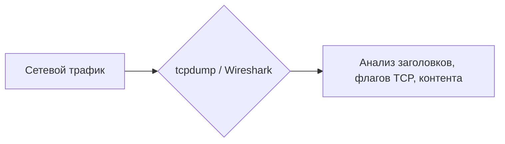
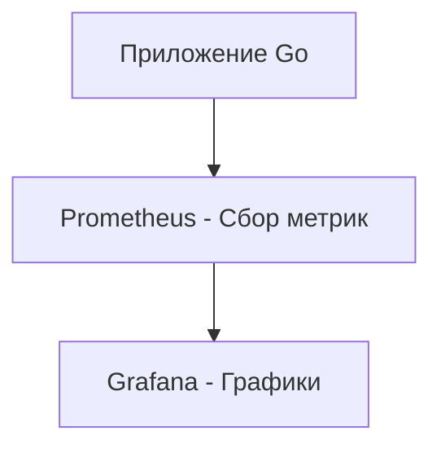

# 🔍 Мониторинг и отладка сетей

## 📑 Содержание

1. [Базовые инструменты (CLI)](#базовые-инструменты)
2. [Анализ пакетов (Wireshark/tcpdump)](#анализ-пакетов)
3. [Метрики и логирование](#логирование-и-метрики-для-бэкенд-приложений)
4. [Чек-лист отладки](#как-анализировать-сетевые-проблемы)

---

Когда "что-то тормозит" или "сайт не грузится", нужно уметь смотреть глубже кода приложения.

---

## 1. 🛠️ Базовые инструменты

### Ping (ICMP)

Проверяет: "Ты жив?".

```bash
ping 8.8.8.8
```

> [!NOTE]
> Если пинг идет, а сайт не грузится — значит проблема выше L3 уровня (например, в TLS или самом приложении).

### Traceroute

Показывает "прыжки" (hops) пакета от вас до цели. Позволяет понять, на чьей стороне лаг: у вас, у провайдера или у магистрали.

### Dig / Nslookup

Показывает, что DNS думает о вашем домене.

---

## 2. 🛡️ Тяжелая артиллерия: Анализ трафика


```mermaid
graph LR
    Traffic[Сетевой трафик] --> Sniffer{tcpdump / Wireshark}
    Sniffer --> Analysis[Анализ заголовков, флагов TCP, контента]
```

- **tcpdump**: Консольный, быстрый. Идеален для серверов.
  `tcpdump -i eth0 port 80 -X` (покажет пакеты в HEX/ASCII).
- **Wireshark**: Графический, мощный. Позволяет увидеть "рукопожатие" TCP в деталях.

---

## 3. 📈 Метрики (Observability)

Бэкенд-разработчик должен смотреть на три главных числа:

1. **Latency**: Как долго идет ответ?
2. **Error Rate**: Сколько запросов падает с 5xx?
3. **Throughput**: Сколько запросов в секунду (RPS) мы держим?


```mermaid
graph TD
    App[Приложение Go] --> Prom[Prometheus - Сбор метрик]
    Prom --> Grafana[Grafana - Графики]
```

---

## 4. 📝 Чек-лист: Почему оно не работает?

1. **DNS**: Резолвится ли имя? (`dig`)
2. **Connectivity**: Пингуется ли IP? (`ping`)
3. **Port**: Открыт ли порт на сервере? (`telnet` или `nc`)
4. **Firewall**: Не блокирует ли нас `iptables` или AWS Security Group?
5. **TLS**: Не протух ли сертификат?
6. **Application**: Что в логах самого приложения?

---

## 🎯 Ключевые выводы

- Начинайте от простого к сложному (**Ping -> Telnet -> tcpdump**).
- **Prometheus + Grafana** — стандарт индустрии для мониторинга.
- Не гадайте — смотрите в логи и трафик.
