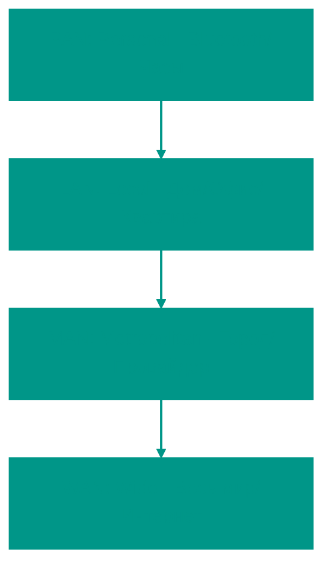

# 🌐 Основы компьютерных сетей

## 📑 Содержание
1. [Что такое сеть?](#что-такое-сеть-и-зачем-она-нужна)
2. [Классификация сетей (LAN, WAN, MAN)](#типы-сетей)
3. [Сетевые устройства](#устройства)
4. [Каналы связи](#каналы-связи)
5. [Протоколы](#понятие-протоколов-и-их-роль)

---

**Компьютерная сеть** — это не просто куча проводов, а сложная система "договоренностей" (протоколов), которая позволяет устройствам обмениваться данными. Если компьютер — это мозг, то сеть — это нервная система.

---

## 1. 📦 Анатомия передачи: Пакет как единица смысла

Данные не летают по проводам целиком (фильм в 10 ГБ не пролезет в один присест). Они рубятся на мелкие кусочки — **пакеты**.

Представьте, что вы отправляете другу разобранный шкаф в нескольких коробках:
- **Содержимое коробки**: Сама деталь (Данные/Payload).
- **Этикетка на коробке**: От кого, кому, номер коробки (Заголовок/Header).

> [!TIP]
> **Инкапсуляция** — это процесс, когда данные "заворачиваются" в слои заголовков (L7 -> L4 -> L3 -> L2). Это как письмо, которое кладут в конверт, конверт в коробку, а коробку в контейнер.

---

## 2. 📏 Типы сетей: От комнаты до планеты

- **LAN (Локалка)**: Ваша "песочница". Вы сами хозяин: ставите пароль на Wi-Fi, втыкаете кабели. Скорость огромная (1-10 Гбит/с), задержки почти нулевые.
- **WAN (Глобалка)**: Это Интернет. Вы не контролируете путь пакета. Пакет может пролететь через три океана, прежде чем попадет к серверу в соседнем городе.

---

## 3. 🚦 Как это работает в реальности?

Когда вы вводите `google.com`, происходит магия:

1. **Запрос (Request)**: Ваш браузер формирует пакет: "Эй, Google, дай мне главную страницу!".
2. **Путешествие**: Роутер смотрит на IP-адрес и говорит: "Так, Google в той стороне, лети к провайдеру". Пакет прыгает от одного роутера к другому (**Hops**).
3. **Обработка**: Сервер Google получает пакет, "разворачивает" его и понимает, что вы хотите.
4. **Ответ (Response)**: Сервер шлет вам пакеты с данными сайта.

---

## 🛠️ Сетевые "Железки"

| Устройство | Чем занимается | Аналогия |
|:---|:---|:---|
| **Switch (Коммутатор)** | Соединяет устройства внутри одной комнаты. | Удлинитель, который знает, КТО в какую розетку воткнут. |
| **Router (Маршрутизатор)** | Соединяет вашу квартиру с миром. | Почтовое отделение, которое решает, в какой город отправить письмо. |
| **Кабель (Витая пара)** | Физически передает сигналы. | Шоссе, по которому едут биты. |

---

## 📜 Протоколы — Правила игры

Без протоколов сеть превратилась бы в хаос.
- **IP (Internet Protocol)**: Находит адрес дома.
- **TCP (Transmission Control Protocol)**: Проверяет, что все коробки шкафа доехали и они не разбиты.
- **HTTP**: Договаривается, как именно отобразить текст и картинки на сайте.

---

## 🎯 Ключевые выводы

- Данные всегда делятся на **пакеты**.
- Сеть работает по принципу **Запрос-Ответ**.
- **Протокол** — это закон. Нарушил протокол — пакет улетел в никуда.

<!-- QUIZ_START 
[
    {
        "question": "Как называется тип сети, которая обычно охватывает дом или офис и характеризуется высокой скоростью и низкой задержкой?",
        "options": ["WAN", "LAN", "PAN", "MAN"],
        "correctIndex": 1
    },
    {
        "question": "Какое сетевое устройство отвечает за соединение разных сетей и поиск наилучшего пути для пакетов данных?",
        "options": ["Коммутатор (Switch)", "Точка доступа (AP)", "Роутер (Маршрутизатор)", "Концентратор (Hub)"],
        "correctIndex": 2
    },
    {
        "question": "Какой протокол в стеке TCP/IP отвечает за надежную доставку данных с подтверждением получения?",
        "options": ["IP", "HTTP", "UDP", "TCP"],
        "correctIndex": 3
    }
]
QUIZ_END -->
