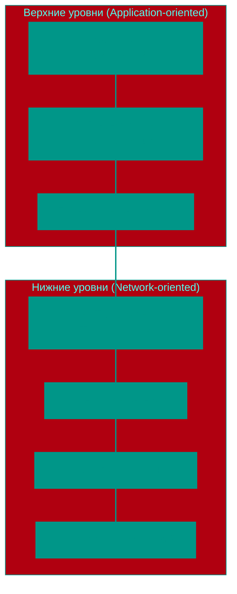

# 🏗️ Модель OSI (Open Systems Interconnection)

## 📑 Содержание
1. [Что такое OSI?](#обзор-7-уровней)
2. [Подробный разбор 7 уровней](#задачи-каждого-уровня-и-примеры-технологий)
3. [Как данные проходят через уровни](#инкапсуляция-и-декапсуляция)
4. [Анализ и диагностика на разных уровнях](#анализ-и-диагностика)

---

**Модель OSI** — это концептуальный эталон, определяющий стандарты взаимодействия вычислительных систем. Она разделяет процесс сетевой коммуникации на семь логических уровней, что позволяет унифицировать разработку сетевых протоколов и оборудования, обеспечивая их совместимость.

---

## 1. 🪜 Семь уровней OSI: Архитектура взаимодействия

---

## 2. 🔍 Подробный разбор и PDU (Protocol Data Units)

Каждому уровню соответствует определенная единица обмена данными — **PDU**.

| Уровень | PDU | Функциональная роль | Примеры технологий |
|:---|:---|:---|:---|
| **7. Application** | Data | Предоставление интерфейсов для прикладного ПО. | HTTP, DNS, FTP, SMTP |
| **6. Presentation** | Data | Кодирование, сжатие и шифрование данных. | JSON, XML, TLS, ASCII |
| **5. Session** | Data | Управление сессиями (установление, поддержание, разрыв). | RPC, NetBIOS, PAP |
| **4. Transport** | **Segment/Datagram** | Сквозная доставка данных и мультиплексирование (порты). | TCP, UDP |
| **3. Network** | **Packet** | Логическая адресация и выбор оптимального маршрута. | IP (IPv4/IPv6), ICMP, BGP |
| **2. Data Link** | **Frame** | Организация передачи данных в физической среде (MAC-адреса). | Ethernet, Wi-Fi (802.11) |
| **1. Physical** | **Bits** | Передача сигналов через физическую среду. | Коаксиал, Витая пара, Оптика |

---

## 📦 Инкапсуляция и декапсуляция

Процесс передачи данных по стеку OSI основан на иерархическом вложении:
1. **Инкапсуляция**: При отправке данные проходят путь от L7 до L1. Каждый уровень добавляет к PDU своего уровня заголовок (Header) с метаданными, необходимыми для обработки на стороне получателя.
2. **Декапсуляция**: На принимающей стороне данные проходят путь от L1 до L7. Каждый уровень анализирует заголовок своего уровня, выполняет соответствующие действия и передает данные вышестоящему уровню.

---

## 🛠️ Анализ и диагностика на разных уровнях

Понимание модели OSI критически важно для эффективной диагностики системных проблем:

- **Прикладной уровень (L7)**: Проверка корректности ответов приложений (например, через `curl` или логи ПО).
- **Транспортный уровень (L4)**: Проверка доступности портов и установления соединений (например, `telnet`, `nc`, `nmap`).
- **Сетевой уровень (L3)**: Диагностика маршрутизации и доступности узлов по IP (например, `ping`, `traceroute`, `mtr`).
- **Канальный уровень (L2)**: Проверка состояния интерфейсов и таблицы MAC-адресов.

---

## 🎯 Ключевые выводы

- Модель OSI разделяет сетевое взаимодействие на независимые уровни, что упрощает масштабирование и поддержку систем.
- **Нижние уровни (1-4)** обеспечивают транспортировку данных, тогда как **верхние уровни (5-7)** отвечают за логику приложения и представление данных.
- Эффективная отладка всегда начинается с проверки готовности нижележащих уровней перед анализом проблем на уровне приложения.

<!-- QUIZ_START 
[
    {
        "question": "На каком уровне модели OSI работают роутеры (маршрутизация и IP-адресация)?",
        "options": ["L2 (Канальный)", "L3 (Сетевой)", "L4 (Транспортный)", "L7 (Прикладной)"],
        "correctIndex": 1
    },
    {
        "question": "Как называется процесс, при котором каждый уровень модели OSI добавляет свой заголовок к данным при их отправке?",
        "options": ["Декапсуляция", "Сегментация", "Инкапсуляция", "Фрагментация"],
        "correctIndex": 2
    },
    {
        "question": "К какому уровню модели OSI относится протокол HTTP?",
        "options": ["Уровень представления", "Сеансовый уровень", "Транспортный уровень", "Прикладной уровень"],
        "correctIndex": 3
    }
]
QUIZ_END -->

