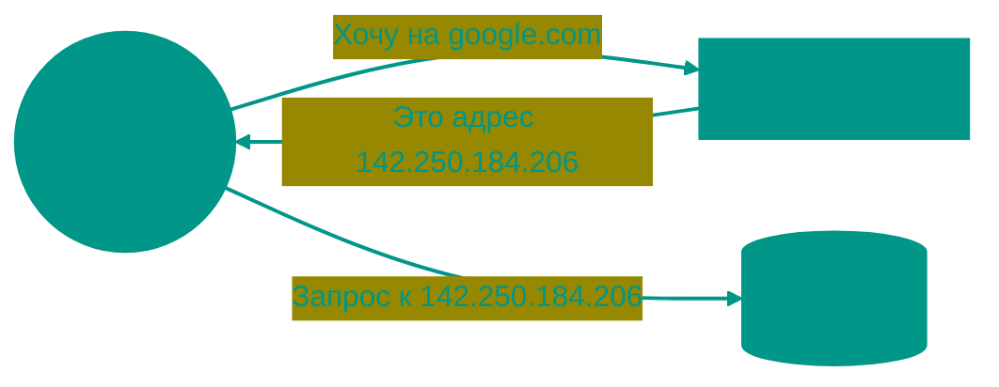
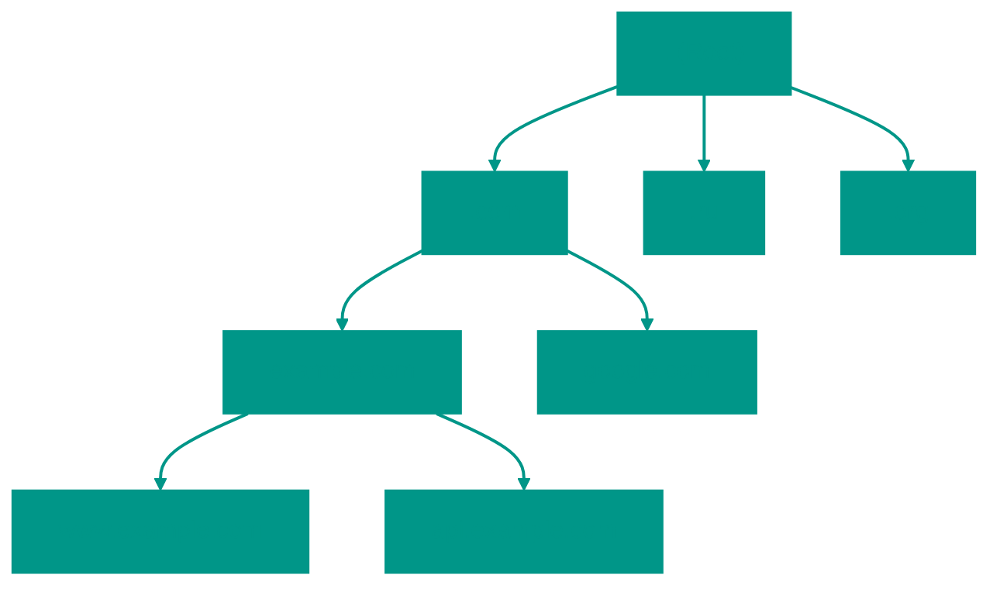
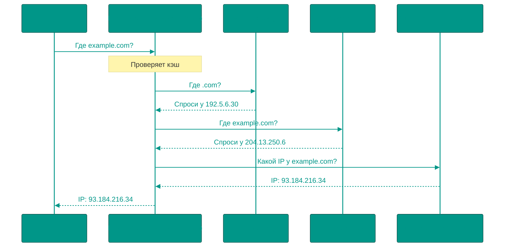

# 📞 Система доменных имён (DNS)

## 📑 Содержание
1. [Что такое DNS и зачем она нужна](#что-такое-dns-и-зачем-она-нужна)
2. [Иерархия DNS](#иерархия-dns)
3. [Процесс разрешения имён (Resolution)](#процесс-разрешения-имён)
4. [Типы записей и настройка](#настройка-dns)
5. [Безопасность (DNSSEC, DoH, DoT)](#безопасность-dnssec)

---

**DNS (Domain Name System)** — это "телефонная книга" интернета. Она превращает понятные человеку имена (например, `google.com`) в IP-адреса, которые понимают компьютеры.

---

## 1. ❓ Что такое DNS и зачем она нужна

- **Удобство**: Людям проще помнить слова, а не цифры.
- **Гибкость**: Вы можете сменить сервер (IP), сохранив имя сайта.
- **Распределенность**: Нет единого "главного" сервера, база данных размазана по всему миру.

> [!NOTE]
> DNS работает преимущественно по протоколу **UDP** на порту **53** для скорости. Если ответ слишком большой, используется **TCP 53**.

---

## 2. 🔍 Как на самом деле ищется адрес?

Разрешение имени (Resolution) — это не один запрос, а целое расследование.

### Рекурсия vs Итерация
- **Рекурсивный запрос (Recursive)**: Вы спрашиваете своего провайдера или Google (8.8.8.8): "Найди мне IP для `example.com` и не возвращайся без ответа!". Резолвер берет на себя всю работу.
- **Итеративный запрос (Iterative)**: Резолвер спрашивает Корневой сервер: "Где `example.com`?". Тот отвечает: "Я не знаю, но знаю, кто отвечает за `.com`. Спроси у него". И так далее, пока не будет найден финальный ответ.

### Корневые серверы (Root Servers)
Их всего 13 (логических адресов), обозначенных буквами от A до M. С помощью **Anycast** эти 13 адресов обслуживаются сотнями серверов по всему миру, чтобы запрос не летел через океан.

---

## 🌳 Иерархия DNS

DNS — это дерево, которое читается **справа налево**.

1. **Root (.)**: Корневые серверы. Знают, где искать TLD.
2. **TLD (Top-Level Domain)**: `.com`, `.ru`, `.net`.
3. **Second-Level Domain**: `example.com`.
4. **Subdomain**: `api.example.com`.

---

## 3. 🔍 Процесс разрешения имён

Когда вы вводите адрес, происходит целая цепочка запросов:

### Кэширование и TTL
- **TTL (Time To Live)**: Время в секундах, на которое резолвер может запомнить ответ.
- **Зачем?** Чтобы не нагружать сеть при каждом клике.

> [!TIP]
> Если вы меняете IP сервера, ставьте маленькое TTL (напр. 300 сек) за день до переезда, чтобы пользователи быстрее узнали о новом адресе.

---

## 4. ⚙️ Настройка DNS: Что можно положить в DNS?

Важно знать не только запись `A`:

| Запись | Описание | Пример |
|:---|:---|:---|
| **A** | Имя -> IPv4 | `example.com -> 1.2.3.4` |
| **AAAA** | Имя -> IPv6 | `example.com -> 2a00:1450...` |
| **CNAME** | Ссылка на другое имя. | `shop.com -> stores.shopify.com` |
| **ALIAS** | CNAME для корня домена. | `example.com -> lb.aws.com` |
| **MX** | Куда отправлять почту. | `mail.example.com` |
| **TXT** | Текстовые данные (SPF, DKIM). | `v=spf1 include:_spf...` |
| **PTR** | Обратный DNS: IP -> Имя. | `1.2.3.4 -> mail.example.com` |
| **NS** | Ответственный за эту зону. | `ns1.cloudflare.com` |

---

## 5. 🛡️ Безопасность

### DNSSEC
Добавляет цифровую подпись к ответам. Гарантирует, что IP-адрес не был подменен хакером по пути.

### Утечки и Приватность:
Обычный DNS-запрос идет открытым текстом. Кто угодно (провайдер, админ в кафе) видит, какие сайты вы посещаете.
1. **DoH (DNS over HTTPS)**: Запросы прячутся внутри стандартного HTTPS-трафика. Теперь провайдер не знает, на какие сайты вы ходите.
2. **DoT (DNS over TLS)**: Выделенный зашифрованный канал для DNS.

> [!IMPORTANT]
> DNS — это не только способ найти сайт, но и важный механизм взаимодействия между сервисами в современных системах.

---

## 🎯 Ключевые выводы

- DNS превращает имена в IP.
- Иерархия: `Root -> TLD -> SLD -> Subdomain`.
- Рекурсивный резолвер делает всю грязную работу за нас.
- **TTL** влияет на то, как быстро мир увидит изменения на вашем сайте.
- **DNSSEC** защищает от подделки ответов.

<!-- QUIZ_START 
[
    {
        "question": "По какому сетевому протоколу и на какой порт DNS-серверы обычно принимают стандартные запросы для обеспечения максимальной скорости?",
        "options": ["TCP 80", "UDP 53", "HTTPS 443", "TCP 53"],
        "correctIndex": 1
    },
    {
        "question": "Что определяет параметр TTL (Time To Live) в настройках DNS-записи?",
        "options": ["Время, через которое сайт перестанет работать", "Время, на которое резолвер может сохранить ответ в своем кэше", "Максимальное количество переходов для пакета", "Скорость загрузки страницы"],
        "correctIndex": 1
    },
    {
        "question": "Какая технология добавляет цифровую подпись к DNS-ответам для гарантии того, что они не были подменены хакером?",
        "options": ["HTTPS", "DoH", "DNSSEC", "TTL"],
        "correctIndex": 2
    }
]
QUIZ_END -->
