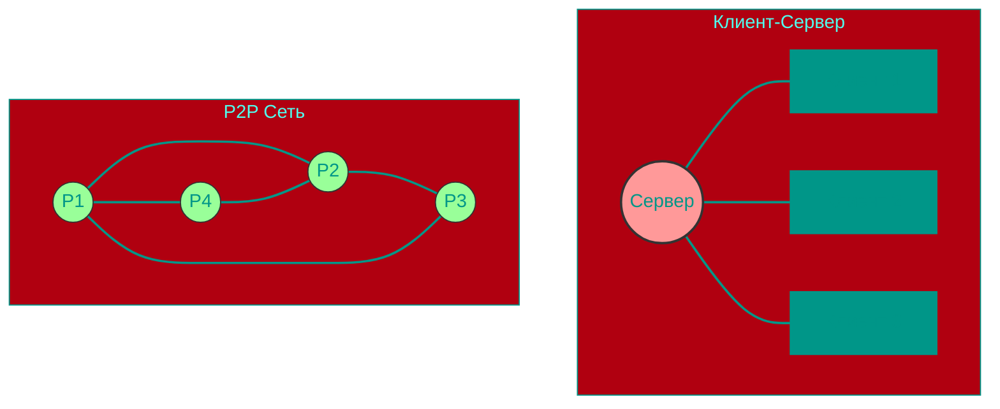
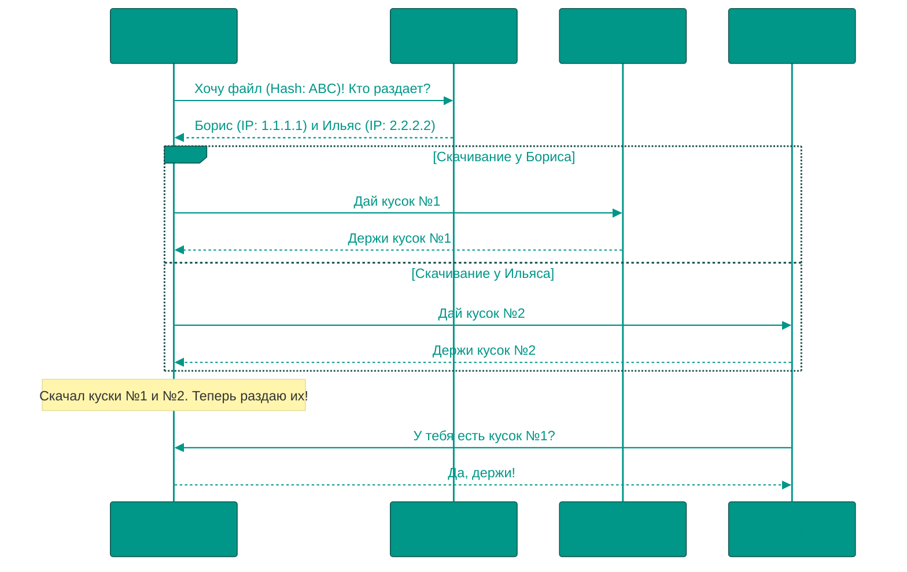

# 16. 🕸️ P2P и Торренты (BitTorrent)

## 📑 Содержание
1. [Архитектура: P2P vs Клиент-Сервер](#архитектура-p2p-vs-клиент-сервер)
2. [Протокол BitTorrent](#протокол-bittorrent)
3. [Кто есть кто? (Терминология)](#кто-есть-кто-терминология)
4. [Как это работает? (.torrent и Magnet)](#как-это-работает-torrent-и-magnet)
5. [Плюсы и минусы](#плюсы-и-минусы)

---

## 1. 🏗️ Архитектура: P2P vs Клиент-Сервер

Чтобы понять торренты, нужно сначала понять, как работает обычный интернет.

### 🏢 Классическая модель (Client-Server)
Когда вы скачиваете файл с сайта, вы (Клиент) обращаетесь к одному мощному компьютеру (Серверу) и просите файл.
*   **Аналогия:** Вы пришли в библиотеку (Сервер) и просите книгу. Если в библиотеке очередь или она закрыта — вы ничего не получите. Если 1000 человек придут за одной книгой, библиотекарь сойдет с ума.

### 🕸️ Пиринговая сеть (P2P - Peer-to-Peer)
В сети **"Равный к равному"** нет главного сервера. Каждый компьютер является и клиентом, и сервером одновременно.
*   **Аналогия:** Вы пришли в класс и крикнули: "У кого есть домашка?".
    *   Борис дал вам 1-ю страницу.
    *   Ильяс дал 2-ю.
    *   Ян дал 3-ю.
    *   А вы, пока списываете 1-ю страницу, уже даете сфотографировать её Коле.
    Все делятся со всеми. Чем больше людей, тем быстрее все получат домашку.

---

## 2. 🌀 Протокол BitTorrent
**BitTorrent** — это самый популярный протокол для обмена файлами в P2P сетях. 
Главная фишка: **Файл разбивается на тысячи мелких кусочков (chunks)**. 

Вы не скачиваете файл целиком от одного человека. Вы скачиваете кусочек №54 от Бориса, кусочек №102 от Ильяса, а кусочек №1 от Яна. Как только вы скачали кусочек №54, вы тут же начинаете раздавать его другим.

---

## 3. 🦜 Кто есть кто? (Терминология)

В мире торрентов свой сленг. Давайте разберем его на примере "раздачи слона".

### 🟢 Peer (Пир)
Любой участник сети, участвующий в раздаче. И тот кто качает, и тот кто раздает — все они пиры ("равные").

### 👑 Seeder (Сид / Сидер)
Человек, у которого есть **весь файл целиком (100%)**. 
*   **Задача:** Только раздавать.
*   **Аналогия:** Человек, который уже полностью переписал конспект и дает его другим.
*   *Чем больше сидов, тем выше скорость скачивания.*

### 🩸 Leecher (Лич / Личер)
Человек, который **качает файл** (у него пока < 100%). При этом он одновременно и раздает те куски, которые уже успел скачать.
*   **В негативном смысле:** Тот, кто скачал и сразу ушел (не остался на раздаче), т.е. "попил крови" и убежал.

### 🐝 Swarm (Рой)
Совокупность всех пиров (сидов + личей), участвующих в раздаче одного конкретного файла.

### 📡 Tracker (Трекер)
Специальный сервер, который **знакомит** пиров друг с другом.
*   Вы говорите трекеру: "Я хочу скачать *Linux.iso*".
*   Трекер отвечает: "У Бориса (IP: 1.2.3.4) и Ильяса (IP: 5.6.7.8) он есть. Иди к ним".
*   *Сам трекер не хранит файлы, он хранит только списки IP-адресов.*

---

## 4. 🧲 Как это работает? (.torrent и Magnet)

### 📄 Файл .torrent
Это "паспорт" раздачи. В нем нет самого контента (фильма или игры).
**Внутри:**
1.  URL Трекера (адрес сервера-сводника).
2.  Имя файла, размер.
3.  **Хэш-суммы** всех кусочков (чтобы проверить, что скачался не битый кусок и не вирус).

### 🧲 Magnet-ссылка (Магнит)
Это современная замена .torrent файлам. Она позволяет качать **без центрального трекера** (технология **DHT**).
Ссылка содержит только уникальный отпечаток (Hash) файла.
*   Ваш клиент кричит в сеть (DHT): "Кто знает, где искать файл с хешем `abc123xyz`?".
*   Соседи отвечают: "Я не знаю, но знаю парня, который знает". 
*   Так по цепочке находится нужный пир.

### 🔄 Процесс скачивания

---

## 5. ⚖️ Плюсы и минусы

### ✅ Плюсы
1.  **Неубиваемость:** Нельзя "выключить" файл, закрыв один сервер. Пока хоть у одного человека есть фаил — он доступен.
2.  **Скорость:** Чем популярнее файл, тем быстрее он качается (больше раздающих).
3.  **Разгрузка канала:** Автор контента не платит за огромный трафик, пользователи раздают его друг другу сами.

### ❌ Минусы
1.  **Зависимость от людей:** Если файл старый и никто его не раздает (нет сидов) — вы его не скачаете (Dead Torrent).
2.  **Безопасность:** Ваш IP-адрес виден всем участникам "роя".
3.  **Upload канал:** Торрент активно использует ваш исходящий интернет-канал, что может замедлять работу других приложений.

---

## 6. 🚀 Итог
BitTorrent — это гениальная технология распределения нагрузки. Вместо того чтобы стоять в очереди к одному крану с водой, каждый, кто набрал ведро, дает отпить соседу.

*   **P2P** — все равны.
*   **Seeder** — герой, который делится.
*   **Leecher** — тот, кто пока только берет (или жадина).
*   **Tracker/DHT** — записная книжка с адресами.

<!-- QUIZ_START 
[
    {
        "question": "Что такое 'Seeder' (Сид) в терминологии BitTorrent?",
        "options": [
            "Сервер, который управляет скоростью сети",
            "Пользователь, который имеет 100% файла и только раздает его",
            "Пользователь, который только скачивает файл",
            "Вредоносная программа внутри торрента"
        ],
        "correctIndex": 1
    },
    {
        "question": "В чем главное отличие P2P сети от модели Клиент-Сервер?",
        "options": [
            "P2P работает только через Bluetooth",
            "В P2P нет центрального сервера, все участники (пиры) равны и обмениваются данными напрямую",
            "Клиент-Сервер быстрее, так как серверов много",
            "P2P использует только платные протоколы"
        ],
        "correctIndex": 1
    },
    {
        "question": "Зачем нужен Tracker (Трекер)?",
        "options": [
            "Чтобы хранить все файлы",
            "Чтобы шпионить за пользователями",
            "Чтобы координировать пиров, сообщая им IP-адреса друг друга",
            "Чтобы склеивать кусочки файлов обратно"
        ],
        "correctIndex": 2
    }
]
QUIZ_END -->
