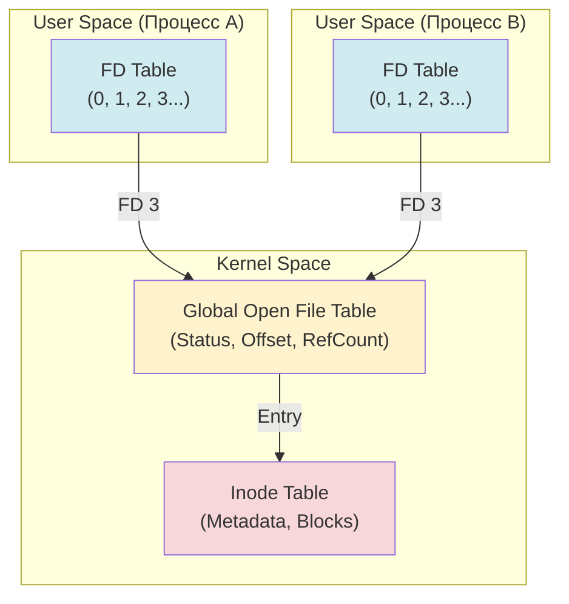

# 📂 File System & Descriptors (Файловая система и дескрипторы)

В Linux всё строится вокруг одной идеи: возможность работать с любым ресурсом как с последовательностью байтов.

---

## 1. 📄 Главная философия: Everything is a file

В Linux всё представлено в виде файлов:
- **Текстовые документы и бинарные файлы.**
- **Директории** (это файлы, содержащие список имен других файлов).
- **Устройства** (клавиатура, диски — `/dev/sda`).
- **Сокеты и пайпы** (средства связи между процессами).

---

## 2. 🏷 Inode (Индексный дескриптор)

**Inode** — это «паспорт» файла в файловой системе.
- Хранит: тип файла, права доступа, владельца, размер, время изменения и указатели на блоки данных на диске.
- **Не хранит**: Имя файла (оно хранится в файле-директории).
- Когда вы открываете файл `/home/user/test.txt`, система находит в директории `user` имя `test.txt` и узнает его номер Inode, по которому потом обращается к данным.

---

## 3. 🔍 Файловый дескриптор (FD) 🛠️

Если Inode — это описание файла на диске, то **File Descriptor** — это описание открытого файла в памяти процесса.

**FD** — это просто целое число (0, 1, 2, 3...), которое ядро выдает программе. Для процесса это «ручка» (handle), за которую он дергает, чтобы произвести системный вызов (`read`, `write`, `close`).

### 🚩 Стандартные дескрипторы (у каждого процесса):
| FD | Имя | Назначение | По умолчанию |
|:---:|:---|:---|:---|
| **0** | `stdin` | Стандартный ввод | Клавиатура |
| **1** | `stdout` | Стандартный вывод | Терминал (экран) |
| **2** | `stderr` | Стандартный вывод ошибок | Терминал (экран) |

---

## 4. 🏗 Архитектура: Три уровня абстракции 🔬

Linux использует трехуровневую схему, чтобы эффективно управлять открытыми файлами и позволять процессам их разделять.

### 1️⃣ Таблица дескрипторов процесса (FD Table)
У каждого процесса в структуре `task_struct` есть свой массив. Индекс в этом массиве — это и есть числовое значение FD. Запись в массиве указывает на элемент в следующей таблице.

### 2️⃣ Системная таблица открытых файлов (Open File Description)
Общая для всей ОС. Каждая запись хранит:
- **Текущее смещение (Offset)**: Позиция чтения/записи.
- **Статус-флаги**: Был ли файл открыт как `O_RDONLY`, `O_APPEND` и т.д.
- **Счетчик ссылок (Reference Count)**: Сколько дескрипторов во всех процессах ссылаются на эту запись.

### 3️⃣ Таблица Inode (Inode Table)
Хранит информацию о самом физическом объекте: права доступа, размер, где лежат данные на диске.

---

## 5. 🔄 Наследование и Дублирование (Fork & Dup)

Понимание этих уровней объясняет, как процессы «общаются» через файлы.

### 🧬 Fork: Разделение offset
Когда вы делаете `fork()`, дочерний процесс получает **копию** таблицы дескрипторов родителя. Но оба дескриптора (у отца и сына) указывают на **одну и ту же запись** в Global File Table.
- **Результат**: Если один процесс прочитал 10 байт, у второго смещение тоже сдвинется. Они делят «одну кассету» на двоих.

### 🖇 Dup: Два FD — один файл
Системный вызов `dup2(fd1, fd2)` заставляет запись `fd2` в таблице процесса указывать на ту же запись в Global File Table, что и `fd1`.
- Это база для **перенаправления потоков**: так bash подменяет `stdout` (FD 1) на файл.

---

## 6. 🚦 Лимиты и Мониторинг 🕹️

Количество открытых файлов ограничено ресурсами ядра.

### Просмотр лимитов:
- `ulimit -n` — «Мягкий» лимит (Soft Limit) для текущего сеанса. Пользователь может его повысить сам (до уровня Hard Limit).
- `ulimit -Hn` — «Жесткий» лимит (Hard Limit). Только root может его повысить.

### Исследование системы:
- `/proc/[PID]/fd/` — Папка, где лежат символические ссылки на все открытые файлы конкретного процесса.
- `lsof -p [PID]` — Список всех открытых файлов процессом (List Open Files).
- `cat /proc/sys/fs/file-max` — Максимальное количество файлов на всю систему.

---

## 📚 Резюме: Библиотека (Advanced)
1. **FD** — это ваш номерок в гардеробе конкретного процесса.
2. **Open File Table** — это информация о том, *как* вы читаете книгу (на какой странице открыли, хотите ли вы в нее дописывать).
3. **Inode** — это сама книга в хранилище.

> [!NOTE]
> С сокетами работает та же схема, но вместо Inode в конце цепочки стоит сетевой буфер. Подробнее в разделе [**Сети и сокеты**](5.networking.md).

---

## 📚 Аналогия: Библиотека
Представьте, что **Ядро** — это библиотека.
1.  Вы (Процесс) просите книгу (открыть файл).
2.  Библиотекарь выдает вам **номер жетона** (FD = 3).
3.  Вы говорите: «Прочитай мне 10 страниц из книги номер 3».
4.  Библиотекарь помнит, что вы остановились на 50-й странице (это **offset** в Global File Table).
5.  Если ваш друг откроет ту же книгу, он получит **свой** жетон, и его 50-я страница не будет мешать вашей.

---

## 🛠 Полезные команды 🕹️
- `ls -l /proc/self/fd` — посмотреть дескрипторы текущего процесса.
- `lsof` — (list open files) вывести все открытые файлы в системе.
- `ulimit -n` — узнать лимит на количество открытых дескрипторов (обычно 1024).
