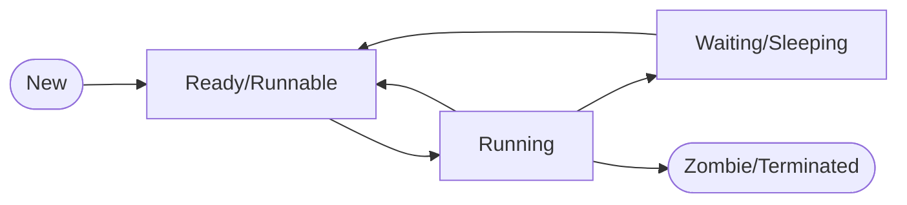

# ⚙️ Process Management (Управление процессами)

Процесс — это экземпляр выполняющейся программы. В Linux управление процессами является одной из ключевых задач ядра, обеспечивающей многозадачность и изоляцию ресурсов.

## 📑 Содержание
1. [Основные понятия](#1-основные-понятия)
2. [Состояния процессов](#2-состояния-процессов)
3. [Жизненный цикл: Fork & Exec](#3-жизненный-цикл-fork--exec)
4. [Зомби и Сироты (Zombies & Orphans)](#4-зомби-и-сироты-zombies--orphans)
5. [Сигналы (Signals)](#5-сигналы-signals)
6. [Планирование и Приоритеты](#6-планирование-и-приоритеты)
7. [Файловая система /proc](#7-файловая-система-proc)
8. [Expert: Изоляция (Namespaces & Cgroups)](#8-expert-изоляция-namespaces--cgroups)
9. [Инструменты диагностики](#9-инструменты-диагностики)

---

## 1. 🔍 Основные понятия

- **Программа vs Процесс**: Программа — это статический файл на диске. Процесс — это динамический объект в оперативной памяти с выделенными ресурсами.
- **PID (Process ID)**: Уникальный идентификатор процесса.
- **PPID (Parent PID)**: Идентификатор родительского процесса.
- **init / systemd (PID 1)**: Первый процесс в системе, предок всех остальных процессов.

---

## 2. 🚥 Состояния процессов

Процесс в течение жизни проходит через несколько состояний:

- **R (Running/Runnable)**: Процесс выполняется или готов к выполнению.
- **S (Interruptible Sleep)**: Ожидание события (например, ввода пользователя). Можно прервать сигналом.
- **D (Uninterruptible Sleep)**: Ожидание ввода/вывода (I/O). Не реагирует на сигналы, пока I/O не завершится.
- **T (Stopped)**: Приостановлен (например, по Ctrl+Z).
- **Z (Zombie)**: Процесс завершен, но родитель еще не прочитал его статус выхода.

> [!NOTE]
> Большое количество процессов в состоянии **D** обычно указывает на проблемы с дисковой подсистемой или сетевыми дисками.

---

## 3. 🍴 Жизненный цикл: Fork & Exec

В Linux создание процесса происходит в два этапа:

1.  **fork()**: Создает точную копию текущего процесса.
    - Использует механизм **Copy-on-Write (CoW)**: память копируется только тогда, когда один из процессов пытается ее изменить. Это делает `fork()` очень быстрым.
2.  **exec()**: Заменяет код и данные текущего процесса новой программой.

> [!TIP]
> **clone()** — системный вызов, на котором базируется `fork()`. Он позволяет более тонко настраивать, какие ресурсы (память, файловые дескрипторы) будут общими между родителем и ребенком, что используется для создания потоков (Threads).

---

## 4. 🧟 Зомби и Сироты (Zombies & Orphans)

- **Zombie (Зомби)**: Процесс, который завершился (`exit`), но занимает запись в таблице процессов, так как родитель не вызвал `wait()`.
    - *Как убрать:* Убить родительский процесс (тогда зомби перейдет к `init`) или исправить код родителя.
- **Orphan (Сирота)**: Процесс, чей родитель завершился раньше него.
    - *Что происходит:* Его "усыновляет" процесс `systemd` (PID 1), который корректно соберет его статус после завершения.

---

## 5. 🚥 Сигналы (Signals)

Сигналы — это программные прерывания для уведомления процесса о событиях.

| Сигнал | Код | Описание | Можно перехватить? |
| :--- | :--- | :--- | :--- |
| **SIGHUP** | 1 | Перезапуск (терминал закрыт) | Да |
| **SIGINT** | 2 | Прерывание (Ctrl+C) | Да |
| **SIGKILL** | 9 | Мгновенная смерть | **Нет** |
| **SIGTERM** | 15 | Вежливое завершение (по умолчанию) | Да |
| **SIGCONT** | 18 | Продолжить выполнение | Да |
| **SIGSTOP** | 19 | Приостановить | **Нет** |

---

## 6. ⚖️ Планирование и Приоритеты

Linux — многозадачная система. Планировщик решает, какой процесс получит доступ к CPU.

- **Nice value (-20 до 19)**: Уступчивость процесса. 
    - `-20`: Самый высокий приоритет.
    - `19`: Самый низкий приоритет.
- **Команды**: `nice` (запуск с приоритетом), `renice` (изменение приоритета работающего процесса).

---

## 7. 📂 Файловая система /proc

Директория `/proc` — это виртуальное окно в ядро. Для каждого процесса есть папка `/proc/[PID]`.

- `/proc/[PID]/status`: Основная информация о процессе.
- `/proc/[PID]/maps`: Карта памяти (загруженные библиотеки).
- `/proc/[PID]/fd/`: Список открытых файловых дескрипторов.
- `/proc/[PID]/environ`: Переменные окружения процесса.

---

## 8. 🛡️ Expert: Изоляция (Namespaces & Cgroups)

Это фундамент контейнеризации (Docker, Kubernetes).

### Namespaces (Пространства имен)
Изолируют то, что процесс может **видеть**:
- **PID**: Свой набор PID (процесс в контейнере может думать, что он PID 1).
- **NET**: Свои сетевые интерфейсы и порты.
- **MNT**: Свои точки монтирования (файловая система).
- **UTS**: Свое имя хоста.

### Cgroups (Control Groups)
Ограничивают то, что процесс может **потреблять**:
- Лимиты на CPU.
- Лимиты на RAM.
- Лимиты на Disk I/O.

---

## 9. 🛠️ Инструменты диагностики

- `ps aux`: Список всех процессов.
- `top` / `htop`: Интерактивный мониторинг.
- `strace -p [PID]`: Отслеживание системных вызовов процесса.
- `lsof -p [PID]`: Список открытых процессом файлов.
- `kill -9 [PID]`: Принудительное завершение.
- `pstree`: Дерево процессов.
