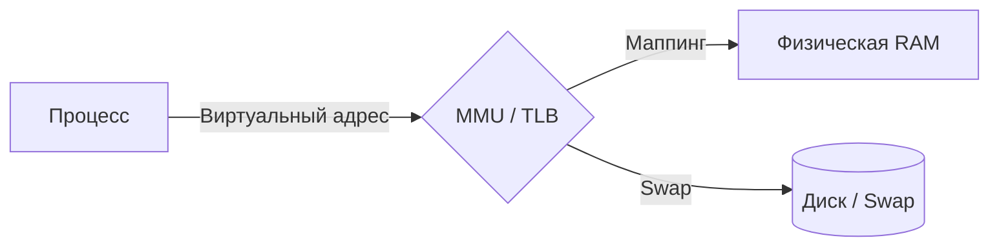

# 🧠 Memory Management (Управление памятью)

Управление памятью в Linux — это сложная система, которая обеспечивает изоляцию процессов, эффективное использование RAM и абстракцию физического железа.

## 📑 Содержание
1. [Виртуальная память и Страницы](#1-виртуальная-память-и-страницы)
2. [Анатомия памяти процесса (Layout)](#2-анатомия-памяти-процесса-layout)
3. [Механизмы выделения: brk vs mmap](#3-механизмы-выделения-brk-vs-mmap)
4. [Page Faults и Copy-on-Write](#4-page-faults-и-copy-on-write)
5. [OOM Killer и Swap](#5-oom-killer-и-swap)
6. [Expert: Аллокаторы ядра (Buddy & Slab)](#6-expert-аллокаторы-ядра-buddy--slab)
7. [Expert: Оптимизации (NUMA & Huge Pages)](#7-expert-оптимизации-numa--huge-pages)
8. [Инструменты диагностики](#8-инструменты-диагностики)

---

## 1. 👻 Виртуальная память и Страницы

Процессы не работают с физической RAM напрямую. Они используют **Виртуальные адреса**.

- **Страница (Page)**: Память делится на блоки (обычно по **4 КБ**).
- **MMU (Memory Management Unit)**: Железо, которое на лету переводит виртуальный адрес процесса в физический адрес в RAM.
- **TLB (Translation Lookaside Buffer)**: Кеш в процессоре для ускорения этого перевода.

---

## 2. 🏛️ Анатомия памяти процесса (Layout)

Память процесса состоит из нескольких сегментов:

- **Stack (Стек)**: Растет вниз. Хранит локальные переменные и аргументы функций. Очень быстрый.
- **Heap (Куча)**: Растет вверх. Для динамической памяти (`malloc` в C, `make/new` в Go).
- **BSS / Data**: Глобальные и статические переменные.
- **Text (Code)**: Сам исполняемый код программы (только для чтения).

---

## 3. 🛠️ Механизмы выделения: brk vs mmap

Когда программе нужно больше памяти в куче, она делает системный вызов:

1.  **brk / sbrk**: Просто двигает границу кучи вверх. Используется для маленьких выделений.
2.  **mmap**: Создает новую область в адресном пространстве. Используется для больших кусков памяти или для отображения файлов в память.

> [!NOTE]
> В Go и других современных языках разработчик редко вызывает их напрямую — это делает рантайм (аллокатор языка).

---

## 4. ⚙️ Page Faults и Copy-on-Write

### Page Fault (Страничный сбой)
Это ситуация, когда процесс обращается к странице, которой нет в RAM.
- **Minor**: Страница есть в памяти (например, у другого процесса), нужно просто обновить таблицу страниц.
- **Major**: Нужно читать данные с диска (очень медленно).

### Copy-on-Write (CoW)
Когда вы делаете `fork()`, память ребенка не копируется сразу. Оба процесса смотрят на одни и те же физические страницы. Копирование произойдет только тогда, когда кто-то захочет что-то **записать**. Это экономит гигабайты памяти.

---

## 5. 🔪 OOM Killer и Swap

### Swap (Подкачка)
Если RAM заканчивается, ядро сбрасывает редко используемые страницы на диск. Это спасает систему от краша, но сильно замедляет работу.

### OOM Killer (Out of Memory)
Если закончилась и RAM, и Swap, просыпается OOM Killer. Он анализирует процессы и убивает самый "плохой" (тот, кто ест много памяти и не является критически важным).
- Настройку важности процесса можно увидеть в `/proc/[pid]/oom_score`.

---

## 6. 🛠️ Expert: Аллокаторы ядра (Buddy & Slab)

Ядро управляет памятью на двух уровнях:

1.  **Buddy System**: Работает с целыми страницами (4КБ, 8КБ, 16КБ...). Следит за свободными блоками физической памяти.
2.  **Slab Allocator**: Работает *внутри* страниц. Кэширует часто используемые объекты ядра (структуры процессов, открытые файлы), чтобы не тратить время на их создание и удаление.
    - Реализации в Linux: **SLAB**, **SLUB** (по умолчанию), **SLOB**.

---

## 7. 🚀 Expert: Оптимизации (NUMA & Huge Pages)

- **Huge Pages**: Вместо страниц по 4КБ используются страницы по **2МБ** или **1ГБ**. Это уменьшает количество записей в TLB и ускоряет работу баз данных (PostgreSQL, Oracle).
- **NUMA (Non-Uniform Memory Access)**: В многопроцессорных серверах память "привязана" к конкретному CPU. Доступ к своей памяти быстрее, чем к памяти соседа. Ядро Linux старается размещать данные процесса поближе к CPU, на котором он работает.

---

## 8. 🛠️ Инструменты диагностики

- `free -h`: Сколько памяти свободно прямо сейчас.
- `vmstat 1`: Статистика использования страниц и Swap в реальном времени.
- `top` / `htop`: Потребление памяти по процессам (RES — реальная память, VIRT — виртуальная).
- `cat /proc/meminfo`: Подробнейшая статистика ядра по памяти.
- `smem`: Показывает **PSS** (Proportional Set Size) — честный объем памяти процесса с учетом разделяемых библиотек.
