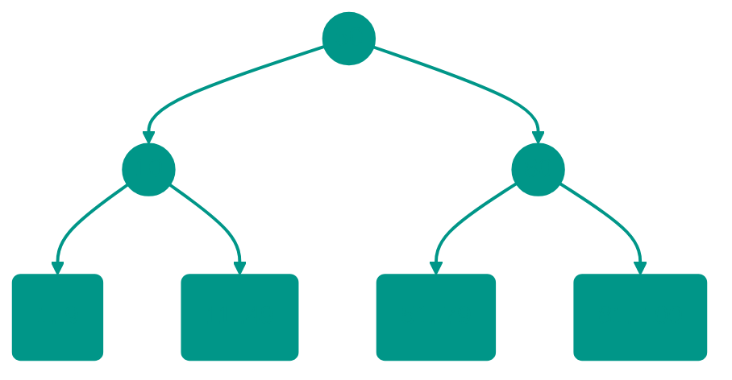
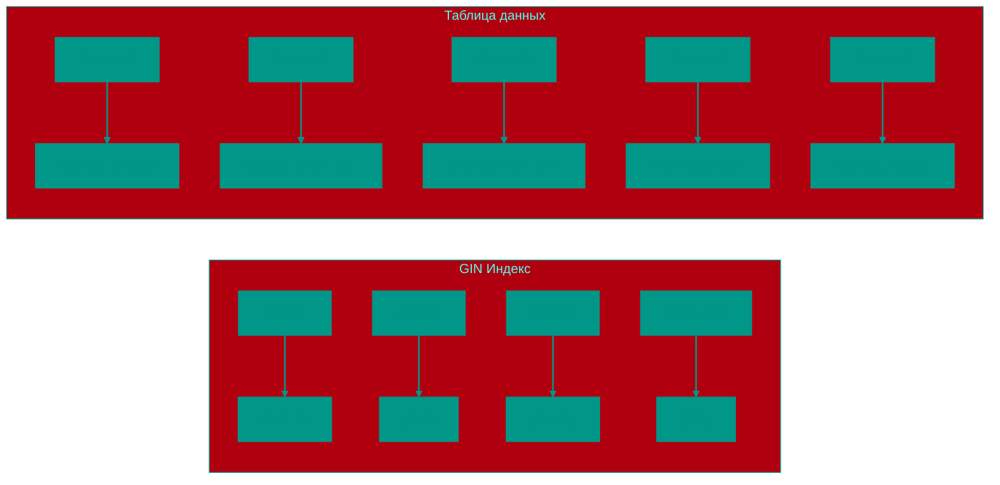
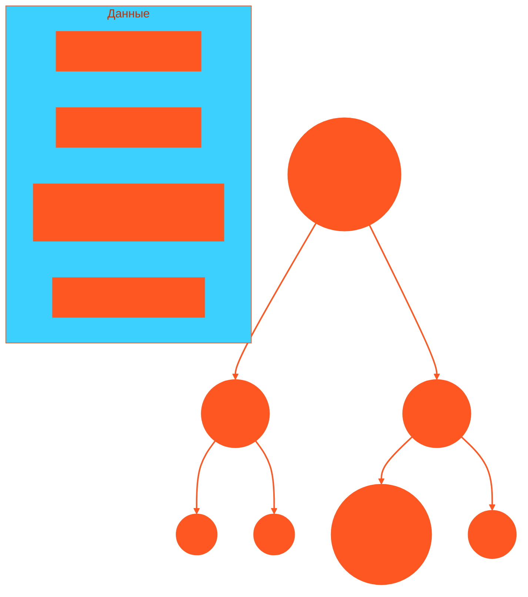

# 🔎 4. Индексы (Indexes)

## 📑 Содержание
1. [Что такое индекс?](#что-такое-индекс)
2. [Как это работает?](#как-это-работает)
3. [Типы индексов](#типы-индексов)
4. [Trade-off: Чтение vs Запись](#trade-off-чтение-vs-запись)
5. [Селективность (Selectivity)](#5-селективность-selectivity)
6. [Составные индексы](#6-составные-индексы)

---

## 1. 🤔 Что такое индекс?

**Индекс** — это специальная структура данных, которая помогает базе данных находить строки быстрее, чем просто перебирая всю таблицу подряд (Full Scan).

> [!NOTE]
> **Аналогия**: Картотека в библиотеке.
> *   Без индекса (Full Scan): Чтобы найти книгу *Толстого*, вам нужно пройти вдоль всех полок и смотреть каждую книгу.
> *   С индексом: Вы идете к ящику с буквой "Т", находите карточку "Толстой" и там написан точный номер полки.

---

## 2. ⚙️ Как это работает?

Представим таблицу `Users` с 1,000,000 строк.
Запрос: `SELECT * FROM Users WHERE email = 'boris@x.com'`

### Без индекса
СУБД читает 1-ю строку, смотрит email. Читает 2-ю... И так до 1,000,000-й.
Сложность: **O(N)**. Медленно!

### С индексом
СУБД идет в структуру индекса (обычно это дерево), делает пару прыжков и сразу получает адрес нужной строки на диске.
Сложность: **O(log N)**. Мгновенно!

---

## 3. 🌳 Типы индексов

### B-Tree (Сбалансированное дерево)
Самый популярный, дефолтный индекс (`CREATE INDEX`).
Подходит для:
*   Точного поиска (`=`)
*   Диапазонов (`>`, `<`, `BETWEEN`)
*   Сортировки (`ORDER BY`)

*Данные отсортированы, поэтому поиск очень быстрый.*

### Hash Index
Работает как Хэш-таблица.
Подходит **только** для точного совпадения (`=`).
*   Не умеет искать диапазоны (`> 50`).
*   В Postgres используется редко.

### GIN / GiST (Специфика PostgreSQL)
Используются для сложных данных:

#### GIN (Generalized Inverted Index)
*   **Назначение**: Для полнотекстового поиска (как в Google) и JSONB (поиск по ключам внутри JSON).
*   **Как работает**: GIN индекс создает "обратный индекс", где каждому элементу данных (слову, ключу JSON) соответствует список строк, содержащих этот элемент. Это позволяет эффективно находить строки, содержащие определенные слова или ключи JSON.

*   **Примеры использования**:
    *   Полнотекстовый поиск: `SELECT * FROM articles WHERE to_tsvector('english', content) @@ to_tsquery('english', 'database & performance');`
    *   Поиск по JSONB: `SELECT * FROM products WHERE properties @> '{"color": "red"}';`
*   **Преимущества**: Отличная производительность при поиске по содержимому документов или JSON-объектов.
*   **Недостатки**: Может быть медленнее при вставке/обновлении данных, так как требует обновления инвертированного индекса.

#### GiST (Generalized Search Tree)
*   **Назначение**: Для геометрии (найти все кафе в радиусе 1км), массивов, иерархических структур.
*   **Как работает**: GiST предоставляет обобщенную структуру дерева, которая может быть адаптирована для различных типов данных. Он использует концепцию "покрытия" (consistency predicate) для определения, какие узлы дерева нужно посетить при поиске.

*   **Примеры использования**:
    *   Геометрические запросы: `SELECT * FROM cafes WHERE ST_DWithin(location, ST_Point(37.6173, 55.7558), 1000);` (найти кафе в радиусе 1км от точки)
    *   Поиск по массивам: `SELECT * FROM posts WHERE tags && ARRAY['database', 'postgresql'];` (найти посты с хотя бы одним из тегов)
    *   Иерархические структуры: поиск в деревьях и графах
*   **Преимущества**: Гибкость - может использоваться для самых разных типов данных и отношений между ними.
*   **Недостатки**: Более сложная реализация и потенциально более медленные операции вставки по сравнению с B-tree.

> [!NOTE]
> **Аналогия для GIN**: Представьте себе указатель в конце книги, где перечислены все термины и страницы, на которых они встречаются. Это позволяет быстро находить все страницы, содержащие конкретное слово.
> 
> **Аналогия для GiST**: Представьте карту города, где районы сгруппированы по признакам (деловой район, жилой район и т.д.), и вы можете быстро находить объекты в определенной области.

---

---

## 4. ⚖️ Trade-off: Чтение vs Запись

Почему бы не создать индексы на *все* колонки?

1.  **Замедление записи (INSERT / UPDATE / DELETE)**:
    *   Когда вы добавляете новую строку в таблицу, СУБД должна добавить эту запись и во **ВСЕ** индексы. Если у вас 10 индексов — одна вставка превращается в 11 операций записи.
2.  **Место на диске**:
    *   Индексы занимают место. Иногда индекс весит больше самой таблицы.

> [!TIP]
> Создавайте индексы только на те поля, по которым вы часто делаете **поиск** (`WHERE`), **сортировку** (`ORDER BY`) или **соединение** (`JOIN`). Не индексируйте всё подряд.

---

## 5. 🎯 Селективность (Selectivity)

**Селективность** — это мера того, насколько хорошо индекс "отсеивает" лишние строки.
*   **Высокая селективность**: Уникальных значений много (Email, UUID, Паспорт). Индекс вернет 1-2 строки. **Это хорошо!**
*   **Низкая селективность**: Уникальных значений мало (Пол: М/Ж, Статус: Active/Inactive). Индекс вернет 50% таблицы. **Это плохо!**

> [!WARNING]
> Если индекс возвращает **более 10-20%** таблицы, планировщик (Planner) скорее всего **проигнорирует индекс** и сделает Full Scan. Потому что читать индекс + прыгать на диск за каждой строкой (Random I/O) дороже, чем просто прочитать всё подряд (Sequential I/O).
>
> **Пример**: Не делайте индекс на колонку `is_active` (boolean), если у вас 90% пользователей активны. Он не поможет.

---

## 6. 🎹 Составные индексы (Composite Indexes)

Индекс можно строить сразу по нескольким колонкам: `CREATE INDEX ON users (last_name, first_name, age);`

Здесь работают два жестких правила:

### 1. Правило "Левого префикса" (Leftmost Prefix Rule)
Индекс `(A, B, C)` работает как сортировка в телефонной книге: сначала по Фамилии, потом по Имени.

*   `WHERE A=1` — ✅ Индекс работает.
*   `WHERE A=1 AND B=2` — ✅ Индекс работает.
*   `WHERE B=2` — ❌ **Индекс НЕ работает!** (Вы не можете искать в телефонной книге всех "Иванов", не зная фамилии).

### 2. Правило остановки на диапазоне (Range Stop Rule)
Как только в условии появляется диапазон (`>`, `<`, `BETWEEN`), использование индекса для **следующих** колонок прекращается.

Для индекса `(age, balance)`:
*   `WHERE age = 25 AND balance = 100` — ✅ Ищет точно.
*   `WHERE age > 25 AND balance = 100` — ⚠️ Индекс используется только для `age > 25`. Внутри этого диапазона `balance` не отсортирован, поэтому базу придется перебирать все найденные строки.

> [!TIP]
> В составном индексе ставьте колонки, по которым ищете **точно** (`=`), в **начало**. А колонки с диапазонами (`>`) — в **конец**.

<!-- QUIZ_START 
[
    {
        "question": "Какова алгоритмическая сложность поиска по B-Tree индексу?",
        "options": ["O(N)", "O(1)", "O(log N)", "O(N log N)"],
        "correctIndex": 2
    },
    {
        "question": "Что такое 'Селективность' индекса?",
        "options": ["Скорость создания индекса", "Мера того, насколько хорошо индекс отсеивает строки (отношение уникальных значений к общему числу)", "Количество колонок в индексе", "Размер индекса на диске"],
        "correctIndex": 1
    },
    {
        "question": "Будет ли работать составной индекс (A, B, C), если в условии запроса только WHERE B = 5?",
        "options": ["Да, полностью", "Да, но частично", "Нет, из-за правила левого префикса", "Только если база данных — NoSQL"],
        "correctIndex": 2
    }
]
QUIZ_END -->
