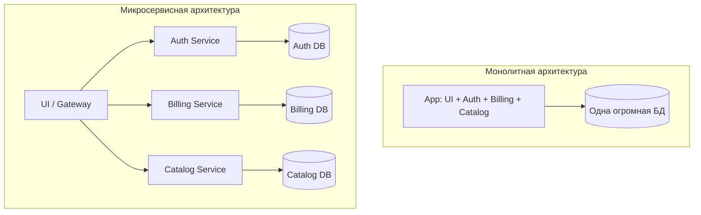

# 🐝 Микросервисная архитектура

## 📑 Содержание

1. [Монолит vs Микросервисы](#1-монолит-vs-микросервисы)
2. [Плюсы и Минусы](#2-плюсы-и-минусы)
3. [Главные проблемы](#3-главные-проблемы)

---

## 1. 🆚 Монолит vs Микросервисы

### 🏰 Монолит

Одно большое приложение, где все внутри: и работа с пользователями, и оплата, и отправка писем.

- **Все в одной бочке**: Если падает модуль оплаты — падает весь сайт.
- **Сложно обновлять**: Чтобы поменять цвет кнопки, нужно пересобирать и диплоить всего гиганта.

### 🐝 Микросервисы

Много маленьких приложений, которые общаются друг с другом по сети (HTTP/gRPC/Queue).

- **Изоляция**: Если упал сервис "Оплаты", пользователи все еще могут смотреть каталог товаров.
- **Независимость**: Команда "Поиска" может обновлять свой сервис хоть 10 раз в день, не мешая команде "Оплаты".

---

## 2. ⚖️ Плюсы и Минусы

| Характеристика       | 🏰 Монолит                            | 🐝 Микросервисы                           |
| :------------------- | :------------------------------------ | :---------------------------------------- |
| **Сложность старта** | ✅ Низкая (просто писать код)         | ❌ Высокая (нужна инфраструктура)         |
| **Деплой**           | ❌ Долго и страшно                    | ✅ Быстро и часто                         |
| **Надежность**       | ❌ Одна ошибка валит всё              | ✅ Частичный отказ (Graceful Degradation) |
| **Масштабирование**  | ❌ Масштабируется всё целиком         | ✅ Точечно (только нагруженный сервис)    |
| **Технологии**       | ❌ Один язык на всех (Java/Go/и т.д.) | ✅ Хоть 10 разных языков (Polyglot)       |

---

## 3. 💣 Главные проблемы

> [!CAUTION]
> **Распределенный монолит** — это худшее из двух миров.
> Это когда вы разбили код на сервисы, но они ТАК сильно зависят друг от друга, что падение одного все равно валит все остальные. А задержки сети при этом остались.

### 🌐 Сеть ненадежна

В монолите вызов функции `getUser()` — это наносекунды и 100% успех.
В микросервисах `http.Get("/user")` — это миллисекунды, и сеть может моргнуть, сервер может быть перегружен.

**Нужно думать о:**

- **Retries**: Повторные попытки.
- **Timeouts**: Не ждать вечно.
- **Circuit Breaker**: Если сервис умер, перестать его долбить.

### 📉 Согласованность данных (Consistency)

Как сделать транзакцию, если данные лежат в разных базах? (User в Postgres, Order в Mongo).

- Нельзя сделать `ROLLBACK` сразу везде.
- Нужны паттерны **Saga** или **Two-Phase Commit (2PC)**.

### 🕵️ Сложность отладки (Tracing)

Запрос прошел через 5 сервисов и где-то упал. Где?

- Нужен **Distributed Tracing** (Jaeger, Zipkin), чтобы видеть путь запроса целиком.

---

## 💡 Итог

Микросервисы — это мощный инструмент для **больших** команд и проектов. Для стартапа из 3 человек монолит почти всегда лучше.
