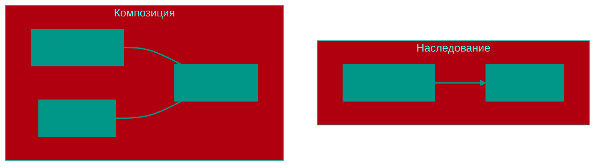

# 🧱 Основы ООП (Объектно-Ориентированное Программирование)


## 📑 Содержание
1. [Что такое ООП?](#что-такое-ооп)
2. [Основные принципы ("Большая четверка")](#основные-принципы-большая-четверка)
3. [Отношения между объектами](#отношения-между-объектами)

---


## 1. 🤔 Что такое ООП?

**Объектно-ориентированное программирование** — это подход к написанию кода, где программа строится из "объектов".

> [!TIP]
> **Объект** — это как предмет в реальном мире (например, Машина или Пользователь), который объединяет в себе:
> *   **Данные** (свойства): цвет, имя, возраст.
> *   **Поведение** (методы): ехать, сменить имя, поздороваться.

Класс — это "чертеж" или "шаблон", а объект — это конкретная вещь, сделанная по этому чертежу.

---


## 2. 🎡 Основные принципы ("Большая четверка")


### 🛡️ Инкапсуляция (Encapsulation)
Это упаковка данных и методов для работы с ними в одну "коробку" (класс) и ограничение прямого доступа к ним извне.

*   **Зачем**: Чтобы никто случайно не изменил важные данные "под капотом". Скрыть детали реализации.
*   **Аналогия**: У кофемашины есть кнопки снаружи (интерфейс), но вы не видите, как внутри мелется зерно и греется вода (скрытая реализация).


### 🔍 Абстракция (Abstraction)
Выделение только важных характеристик объекта, отбрасывая детали.

*   **Зачем**: Чтобы сосредоточиться на том, *что* делает объект, а не *как* он это делает.
*   **Пример**: Когда вы ведете машину, вам важно, что руль поворачивает колеса, а не то, как именно работает гидроусилитель.


### 🧬 Наследование (Inheritance)
Позволяет создать новый класс на основе уже существующего, перенимая его "умения".

*   **Зачем**: Чтобы не писать один и тот же код много раз.
*   **Пример**: Класс `Bird` (Птица) умеет летать. Класс `Eagle` (Орел) наследует это умение от `Bird`.


### 🎭 Полиморфизм (Polymorphism)
Способность программы работать с разными объектами через один и тот же интерфейс, не зная их конкретного типа.

*   **Зачем**: Позволяет писать универсальный код.
*   **Пример**: У вас есть список животных. Вы вызываете у каждого метод `MakeSound()`. Собака гавкнет, кошка мяукнет, а код один и тот же.

---


## 3. 🤝 Отношения между объектами

В ООП объекты могут дружить и взаимодействовать по-разному. Главный спор обычно идет между наследованием и композицией.


### 🏗️ Наследование vs Композиция




#### 📎 Агрегация (Связь "Целое-Часть", но свободная)
Объекты могут существовать друг без друга.
*   **Пример**: Ступица и Колесо. Если снять колеса с машины, колеса все еще существуют.


#### 💎 Композиция (Строгая связь "Целое-Часть")
Части не могут существовать без целого.
*   **Пример**: Комната в доме. Если разрушить дом, комната тоже перестанет существовать.


### 🔄 Делегирование (Delegation)
Это когда объект передает выполнение задачи другому объекту.

> [!IMPORTANT]
> **Принцип**: Не делай сам то, что может сделать эксперт.
> Вместо того чтобы класс `Printer` сам разбирался, как форматировать текст, он делегирует это классу `Formatter`.


### 🧩 Подробнее о композиции и наследовании

#### 🧱 Наследование (Inheritance)
Наследование — это механизм, при котором один класс (дочерний) наследует свойства и методы другого класса (родительского).

**Пример на Java:**

```java
// Родительский класс
class Animal {
    protected String name;
    
    public Animal(String name) {
        this.name = name;
    }
    
    public void eat() {
        System.out.println(name + " ест");
    }
}

// Дочерний класс, наследующий от Animal
class Dog extends Animal {
    public Dog(String name) {
        super(name); // вызываем конструктор родителя
    }
    
    public void bark() {
        System.out.println(name + " лает");
    }
}

// Использование
Dog dog = new Dog("Рекс");
dog.eat();  // наследованный метод
dog.bark(); // собственный метод
```

**Преимущества:**
- Повторное использование кода
- Установление иерархии классов
- Возможность переопределения методов

**Недостатки:**
- Жесткая связь между классами
- Трудности при изменении базового класса
- Проблемы с множественным наследованием (в Java нет, но в других языках есть)

#### 🔗 Композиция (Composition)
Композиция — это когда один класс содержит экземпляр другого класса как часть себя. Это отношение "HAS-A" (имеет).

**Пример на Go:**

```go
package main

import "fmt"

// Структура Engine
type Engine struct {
    Type string
}

func (e Engine) Start() {
    fmt.Println("Двигатель", e.Type, "запущен")
}

// Структура Car
type Car struct {
    engine Engine  // композиция - Car имеет Engine
}

func (c Car) StartCar() {
    fmt.Println("Машина готова к поездке")
    c.engine.Start()  // используем метод двигателя
}

// Использование
func main() {
    car := Car{
        engine: Engine{Type: "бензиновый"},
    }
    car.StartCar()
}
```

**Преимущества:**
- Гибкость: можно легко заменить компоненты
- Лучшая тестируемость: можно подставлять заглушки
- Избегание проблем с иерархией наследования
- Соответствует принципу "композиция лучше наследования"

**Недостатки:**
- Может потребоваться больше кода для простых случаев
- Нужно явно делегировать вызовы методов

### 🔄 Сравнение Java (наследование) и Go (композиция)

| Характеристика | Java (наследование) | Go (композиция) |
|----------------|---------------------|------------------|
| Отношение | IS-A (является) | HAS-A (имеет) |
| Реализация | `extends` | Встраивание структур |
| Множественность | Ограниченная (только один родитель, интерфейсы) | Полная свобода (множество структур) |
| Гибкость | Ниже (жесткая иерархия) | Выше (динамическое поведение) |
| Пример | `class Dog extends Animal` | `type Car struct { Engine }` |

**Когда использовать что:**
- **Наследование** лучше подходит, когда есть четкая иерархия "является" (IS-A), например, `Собака является Животным`.
- **Композиция** предпочтительна, когда нужно "иметь" (HAS-A) компонент, например, `Автомобиль имеет Двигатель`.

> [!NOTE]
> В современном программировании часто рекомендуют использовать композицию вместо наследования, так как она обеспечивает большую гибкость и легче поддается изменениям.


### 🌍 Аналогии из жизни

#### 🏗️ Наследование - как генетика в семье
Представьте, что вы получили от родителей определенные характеристики:
- Цвет глаз (унаследован от родителей)
- Особенности характера (передаются по наследству)
- Но вы можете развивать свои уникальные навыки (переопределение методов)

**Пример**: 
- `Человек` (родитель) → `Студент` (ребенок)
- Студент наследует общие черты (имя, возраст) от Человека, но добавляет специфичные (номер студенческого билета, средний балл)

#### 🔧 Композиция - как сборка автомобиля
Автомобиль состоит из различных компонентов:
- Двигатель (может быть заменен на другой тип)
- Колеса (можно поменять на другие)
- Коробка передач (может быть другого производителя)

**Пример**:
- `Автомобиль` НЕ ЯВЛЯЕТСЯ `Двигателем`, но `ИМЕЕТ` двигатель
- Можно легко заменить двигатель, не меняя всю машину
- Разные компоненты могут быть от разных производителей

#### 🎭 Еще одна аналогия: Кухня ресторана
**Наследование**:
- `Готовить` (базовый класс) → `ГотовитьПасту` (дочерний класс)
- Все дочерние классы обязаны следовать общей структуре родительского класса

**Композиция**:
- `Ресторан` ИМЕЕТ `Повара`, `Кассира`, `Официанта`
- Каждый компонент может быть заменен независимо
- Можно легко адаптировать ресторан под разные форматы (быстрое питание, фаст-фуд и т.д.)

#### 🧩 Когда что использовать?

| Ситуация | Лучше использовать | Почему |
|----------|-------------------|--------|
| Общий функционал у нескольких классов | Наследование | Повторное использование кода |
| Нужна гибкость и возможность замены компонентов | Композиция | Легко заменить части системы |
| Создание иерархии "является" | Наследование | Ясная связь между объектами |
| Создание сложной системы из модулей | Композиция | Лучше тестируется и поддерживается |

---


## 💡 Итог
ООП помогает нам моделировать сложный мир в виде понятных и независимых кусочков, которые легко менять и развивать.

<!-- QUIZ_START 
[
    {
        "question": "Какой принцип ООП отвечает за скрытие внутренних деталей реализации и защиту данных от прямого доступа?",
        "options": ["Наследование", "Инкапсуляция", "Полиморфизм", "Абстракция"],
        "correctIndex": 1
    },
    {
        "question": "В чем заключается суть Полиморфизма?",
        "options": ["В возможности класса иметь много полей", "В способности программы работать с разными объектами через один и тот же интерфейс", "В создании копий объектов", "В автоматическом удалении ненужных данных"],
        "correctIndex": 1
    },
    {
        "question": "Какое отношение (связь) лучше всего описывает принцип 'Композиция'?",
        "options": ["IS-A (является)", "HAS-A (содержит в себе часть, которая не живет без целого)", "TALKS-TO (разговаривает с)", "WANTS-TO (желает)"],
        "correctIndex": 1
    }
]
QUIZ_END -->