# 📚 Паттерны проектирования GoF (Gang of Four)

## 📋 Содержание
1. [Введение](#введение)
2. [Классификация паттернов](#классификация-паттернов)
3. [Порождающие паттерны](#порождающие-паттерны)
    - [Singleton (Одиночка)](#singleton-одиночка)
    - [Factory Method (Фабричный метод)](#factory-method-фабричный-метод)
    - [Abstract Factory (Абстрактная фабрика)](#abstract-factory-абстрактная-фабрика)
    - [Builder (Строитель)](#builder-строитель)
    - [Prototype (Прототип)](#prototype-прототип)
4. [Структурные паттерны](#структурные-паттерны)
    - [Adapter (Адаптер)](#adapter-адаптер)
    - [Bridge (Мост)](#bridge-мост)
    - [Composite (Компоновщик)](#composite-компоновщик)
    - [Decorator (Декоратор)](#decorator-декоратор)
    - [Facade (Фасад)](#facade-фасад)
    - [Flyweight (Приспособленец)](#flyweight-приспособленец)
    - [Proxy (Заместитель)](#proxy-заместитель)
5. [Поведенческие паттерны](#поведенческие-паттерны)
    - [Chain of Responsibility (Цепочка обязанностей)](#chain-of-responsibility-цепочка-обязанностей)
    - [Command (Команда)](#command-команда)
    - [Interpreter (Интерпретатор)](#interpreter-интерпретатор)
    - [Iterator (Итератор)](#iterator-итератор)
    - [Mediator (Посредник)](#mediator-посредник)
    - [Memento (Хранитель)](#memento-хранитель)
    - [Observer (Наблюдатель)](#observer-наблюдатель)
    - [State (Состояние)](#state-состояние)
    - [Strategy (Стратегия)](#strategy-стратегия)
    - [Template Method (Шаблонный метод)](#template-method-шаблонный-метод)
    - [Visitor (Посетитель)](#visitor-посетитель)
6. [Заключение](#заключение)

---

## Введение

**Gang of Four (GoF)** — это группа из четырех авторов (Эрих Гамма, Ричард Хелм, Ральф Джонсон и Джон Влиссидес), которые в 1994 году опубликовали книгу "Design Patterns: Elements of Reusable Object-Oriented Software". В этой книге они описали 23 фундаментальных паттерна проектирования, которые стали стандартом в объектно-ориентированном программировании.

> [!IMPORTANT]
> **Паттерн проектирования** — это проверенное временем решение типовой проблемы проектирования в программировании. Это не готовый код, а описание решения, которое можно использовать снова и снова в различных ситуациях.

### Зачем нужны паттерны?

- **Унификация кода**: Паттерны обеспечивают общий язык для разработчиков
- **Проверенные решения**: Решения, которые уже многократно использовались и показали свою эффективность
- **Улучшение архитектуры**: Помогают создавать гибкие, переиспользуемые и понятные системы
- **Облегчение коммуникации**: Разработчики могут говорить на одном языке, используя названия паттернов

---

## Классификация паттернов

Все 23 паттерна GoF разделены на три категории:

| Категория | Назначение | Количество паттернов |
|:---|:---|:---:|
| **Порождающие (Creational)** | Создание объектов | 5 |
| **Структурные (Structural)** | Композиция классов/объектов | 7 |
| **Поведенческие (Behavioral)** | Взаимодействие между объектами | 11 |

---

## Порождающие паттерны

Эти паттерны абстрагируют процесс инстанцирования (создания объектов). Они позволяют системе быть независимой от способа создания, композиции и представления объектов.

### 🔐 Singleton (Одиночка)

**Описание**:
Паттерн Singleton гарантирует, что у класса есть только один экземпляр, и предоставляет глобальную точку доступа к этому экземпляру.

- **Проблема**: Иногда требуется, чтобы в системе существовал только один экземпляр класса (например, для логгера, настроек приложения, пула соединений с базой данных).
- **Решение**: Скрыть конструктор класса и предоставить статический метод, который будет создавать экземпляр при первом вызове, а при последующих вызовах возвращать уже созданный экземпляр.
- **Аналогия**: Представьте, что у вас есть президент страны. В стране может быть только один президент, и все граждане обращаются к одному и тому же человеку, когда им нужен президент.

#### Преимущества и недостатки

✅ **Плюсы**:
1. **Гарантированный единственный экземпляр**: Контроль над количеством экземпляров класса
2. **Глобальная точка доступа**: Легкий доступ к экземпляру из любой части приложения
3. **Ленивая инициализация**: Экземпляр создается только при необходимости

❌ **Минусы**:
1. **Нарушение принципа единственной ответственности**: Класс отвечает как за свою бизнес-логику, так и за управление экземпляром
2. **Проблемы с тестированием**: Сложнее тестировать, так как создается глобальное состояние
3. **Скрытые зависимости**: Может затруднить понимание зависимостей в приложении

**Когда использовать**: Когда класс должен иметь только один экземпляр, и этот экземпляр должен быть доступен глобально.

---

**Визуализация**:

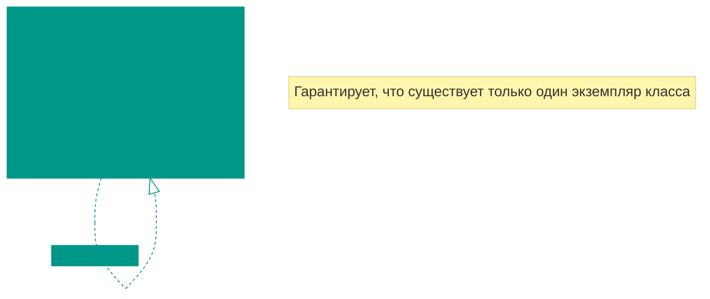
```mermaid
%%{init: { 'theme': 'base', 'themeVariables': { 'lineColor': '#009688', 'primaryColor': '#009688', 'primaryTextColor': '#009688', 'attributeBkg': '#009688', 'attributeTextColor': '#009688', 'signalColor': '#009688', 'actorLineColor': '#009688', 'nodeBorder': '#009688', 'clusterBorder': '#009688', 'textColor': '#009688', 'fontSize': '16px' } } }%%
classDiagram
    class Singleton {
        -instance: Singleton
        +getInstance() Singleton
        -Singleton()
        +someBusinessLogic() void
    }

    note "Гарантирует, что существует только один экземпляр класса"
    Singleton ..|> Singleton : self-reference
```

**Сложность**:

| Метрика | Сложность |
|:---|:---:|
| Временная (при получении экземпляра) | O(1) |
| Пространственная | O(1) |

---

## 💻 Реализация

```go
package singleton

import (
    "sync"
)

// Database представляет собой класс, для которого нужен Singleton
type Database struct {
    // какие-то поля для подключения к базе данных
    connection string
}

var (
    instance *Database
    once     sync.Once
)

// GetInstance возвращает единственный экземпляр Database
func GetInstance() *Database {
    once.Do(func() {
        instance = &Database{
            connection: "connection_string",
        }
        // Здесь может быть инициализация подключения к базе данных
    })
    return instance
}

// SomeMethod демонстрирует использование экземпляра
func (db *Database) SomeMethod() string {
    return "Выполняется метод из Singleton Database"
}
```

```javascript
/**
 * Класс Database, для которого реализуем Singleton
 */
class Database {
    constructor(connection) {
        if (Database.instance) {
            return Database.instance;
        }
        
        this.connection = connection || "default_connection";
        Database.instance = this;
        return this;
    }
    
    someMethod() {
        return "Выполняется метод из Singleton Database";
    }
}

/**
 * Альтернативная реализация с использованием модуля
 */
const DatabaseModule = (() => {
    let instance;
    
    function createInstance(connection) {
        return {
            connection: connection || "default_connection",
            someMethod: () => "Выполняется метод из Singleton Database"
        };
    }
    
    return {
        getInstance: (connection) => {
            if (!instance) {
                instance = createInstance(connection);
            }
            return instance;
        }
    };
})();

// Пример использования
const db1 = new Database();
const db2 = new Database();
console.log(db1 === db2); // true

const moduleDb1 = DatabaseModule.getInstance();
const moduleDb2 = DatabaseModule.getInstance();
console.log(moduleDb1 === moduleDb2); // true
```

---

### 🏭 Factory Method (Фабричный метод)

**Описание**:
Паттерн Factory Method определяет интерфейс для создания объекта, но позволяет подклассам решать, какой класс инстанцировать. Фабричный метод позволяет делегировать создание объектов подклассам.

- **Проблема**: Необходимость создавать объекты, тип которых определяется во время выполнения, или когда вы хотите дать подклассам возможность определять тип создаваемых объектов.
- **Решение**: Создать абстрактный метод (фабричный метод), который будет переопределен в подклассах для создания конкретных объектов.
- **Аналогия**: Представьте ресторан быстрого питания. Клиент делает заказ, но конкретный сотрудник (подкласс) решает, как именно приготовить блюдо (какой объект создать).

#### Преимущества и недостатки

✅ **Плюсы**:
1. **Изолирует код создания объектов**: Клиентский код не зависит от конкретных классов
2. **Упрощает добавление новых типов продуктов**: Можно легко добавить новые подклассы
3. **Поддержка принципа открытости/закрытости**: Открыт для расширения, закрыт для модификации

❌ **Минусы**:
1. **Увеличение числа классов**: Каждый новый тип продукта требует нового подкласса
2. **Сложность для простых случаев**: Может быть избыточным для простых сценариев

**Когда использовать**: Когда класс не может предугадать тип создаваемых объектов или когда класс хочет, чтобы подклассы указали, какие объекты создавать.

---

**Визуализация**:

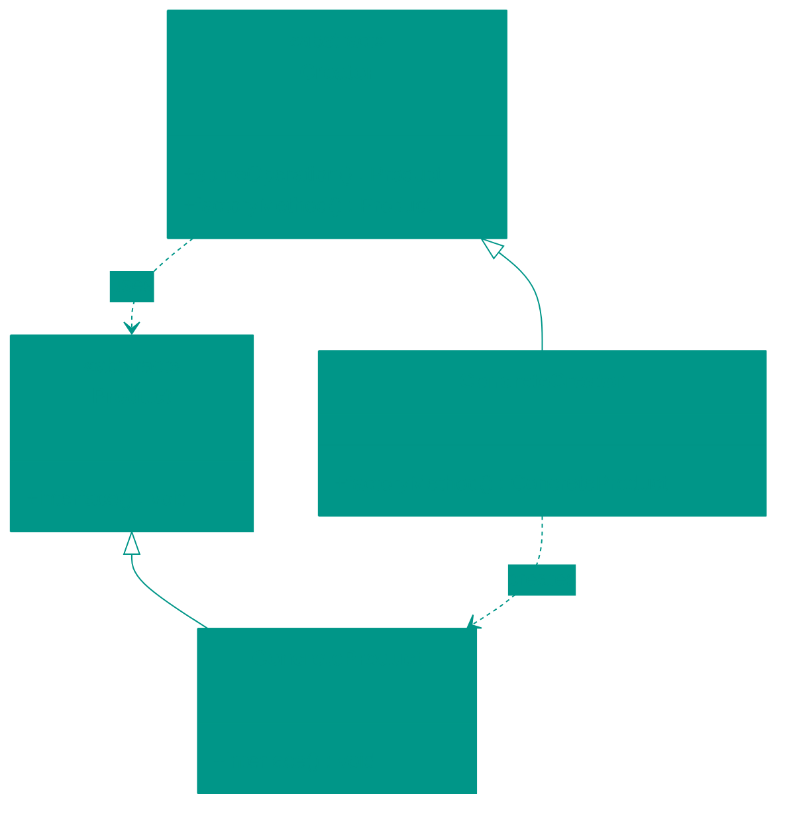
```mermaid
%%{init: { 'theme': 'base', 'themeVariables': { 'lineColor': '#009688', 'primaryColor': '#009688', 'primaryTextColor': '#009688', 'attributeBkg': '#009688', 'attributeTextColor': '#009688', 'signalColor': '#009688', 'actorLineColor': '#009688', 'nodeBorder': '#009688', 'clusterBorder': '#009688', 'textColor': '#009688', 'fontSize': '16px' } } }%%
classDiagram
    class Creator {
        <<abstract>>
        +someOperation() Product
        +factoryMethod() Product
    }
    class ConcreteCreator {
        +factoryMethod() ConcreteProduct
    }
    class Product {
        <<abstract>>
        +interface() void
    }
    class ConcreteProduct {
        +interface() void
    }

    Creator <|-- ConcreteCreator
    Product <|-- ConcreteProduct
    Creator ..> Product : uses
    ConcreteCreator ..> ConcreteProduct : creates
```

**Сложность**:

| Метрика | Сложность |
|:---|:---:|
| Временная (при создании объекта) | O(1) |
| Пространственная | Зависит от создаваемого объекта |

---

## 💻 Реализация

```go
package factorymethod

import "fmt"

// Product интерфейс, представляющий продукт
type Product interface {
    Use() string
}

// ConcreteProductA конкретная реализация продукта A
type ConcreteProductA struct{}

func (p *ConcreteProductA) Use() string {
    return "Использование продукта A"
}

// ConcreteProductB конкретная реализация продукта B
type ConcreteProductB struct{}

func (p *ConcreteProductB) Use() string {
    return "Использование продукта B"
}

// Creator абстрактный класс создателя
type Creator interface {
    FactoryMethod() Product
    SomeOperation() string
}

// ConcreteCreatorA конкретный создатель A
type ConcreteCreatorA struct{}

func (c *ConcreteCreatorA) FactoryMethod() Product {
    return &ConcreteProductA{}
}

func (c *ConcreteCreatorA) SomeOperation() string {
    product := c.FactoryMethod()
    return fmt.Sprintf("Creator A: %s", product.Use())
}

// ConcreteCreatorB конкретный создатель B
type ConcreteCreatorB struct{}

func (c *ConcreteCreatorB) FactoryMethod() Product {
    return &ConcreteProductB{}
}

func (c *ConcreteCreatorB) SomeOperation() string {
    product := c.FactoryMethod()
    return fmt.Sprintf("Creator B: %s", product.Use())
}
```

```javascript
/**
 * Интерфейс Product
 */
class Product {
    use() {
        throw new Error("Метод use() должен быть реализован");
    }
}

/**
 * Конкретные реализации Product
 */
class ConcreteProductA extends Product {
    use() {
        return "Использование продукта A";
    }
}

class ConcreteProductB extends Product {
    use() {
        return "Использование продукта B";
    }
}

/**
 * Абстрактный класс Creator
 */
class Creator {
    factoryMethod() {
        throw new Error("Метод factoryMethod() должен быть реализован");
    }
    
    someOperation() {
        const product = this.factoryMethod();
        return `Creator: ${product.use()}`;
    }
}

/**
 * Конкретные реализации Creator
 */
class ConcreteCreatorA extends Creator {
    factoryMethod() {
        return new ConcreteProductA();
    }
}

class ConcreteCreatorB extends Creator {
    factoryMethod() {
        return new ConcreteProductB();
    }
}

// Пример использования
const creatorA = new ConcreteCreatorA();
console.log(creatorA.someOperation()); // Creator: Использование продукта A

const creatorB = new ConcreteCreatorB();
console.log(creatorB.someOperation()); // Creator: Использование продукта B
```

---

### 🏗️ Abstract Factory (Абстрактная фабрика)

**Описание**:
Паттерн Abstract Factory предоставляет интерфейс для создания семейств взаимосвязанных или взаимозависимых объектов, не специфицируя их конкретных классов.

- **Проблема**: Необходимость создания семейств объектов, которые должны работать вместе, без жесткой зависимости от конкретных классов.
- **Решение**: Создать абстрактный интерфейс фабрики, который определяет методы для создания каждого из типов объектов, входящих в семейство.
- **Аналогия**: Представьте мебельный магазин. У вас есть коллекции мебели в разных стилях (например, современный, классический). Каждая коллекция включает стул, стол, диван и т.д. Абстрактная фабрика позволяет создавать согласованные наборы мебели в одном стиле.

#### Преимущества и недостатки

✅ **Плюсы**:
1. **Гарантия совместимости продуктов**: Объекты, созданные одной фабрикой, будут совместимы
2. **Изолирует конкретные классы**: Клиентский код не зависит от конкретных классов
3. **Легкость замены семейств продуктов**: Можно легко переключаться между различными семействами

❌ **Минусы**:
1. **Сложность добавления новых типов продуктов**: При добавлении нового типа продукта нужно изменять все фабрики
2. **Увеличение числа классов**: Требует создания множества классов

**Когда использовать**: Когда система должна быть независимой от способа создания, композиции и представления объектов, или когда нужно работать с семействами взаимосвязанных объектов.

---

**Визуализация**:

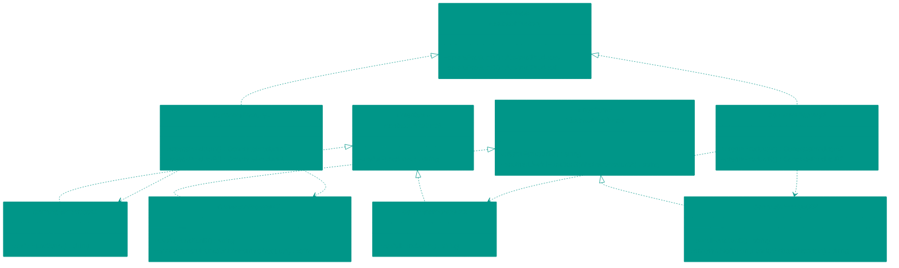
```mermaid
%%{init: { 'theme': 'base', 'themeVariables': { 'lineColor': '#009688', 'primaryColor': '#009688', 'primaryTextColor': '#009688', 'attributeBkg': '#009688', 'attributeTextColor': '#009688', 'signalColor': '#009688', 'actorLineColor': '#009688', 'nodeBorder': '#009688', 'clusterBorder': '#009688', 'textColor': '#009688', 'fontSize': '16px' } } }%%
classDiagram
    class AbstractFactory {
        <<interface>>
        +createProductA() AbstractProductA
        +createProductB() AbstractProductB
    }
    class ConcreteFactory1 {
        +createProductA() ConcreteProductA1
        +createProductB() ConcreteProductB1
    }
    class ConcreteFactory2 {
        +createProductA() ConcreteProductA2
        +createProductB() ConcreteProductB2
    }
    class AbstractProductA {
        <<interface>>
        +usefulFunctionA() string
    }
    class AbstractProductB {
        <<interface>>
        +usefulFunctionB() string
        +anotherUsefulFunctionB(AbstractProductA) string
    }
    class ConcreteProductA1 {
        +usefulFunctionA() string
    }
    class ConcreteProductA2 {
        +usefulFunctionA() string
    }
    class ConcreteProductB1 {
        +usefulFunctionB() string
        +anotherUsefulFunctionB(AbstractProductA) string
    }
    class ConcreteProductB2 {
        +usefulFunctionB() string
        +anotherUsefulFunctionB(AbstractProductA) string
    }

    AbstractFactory <|.. ConcreteFactory1
    AbstractFactory <|.. ConcreteFactory2
    AbstractProductA <|.. ConcreteProductA1
    AbstractProductA <|.. ConcreteProductA2
    AbstractProductB <|.. ConcreteProductB1
    AbstractProductB <|.. ConcreteProductB2
    ConcreteFactory1 ..> ConcreteProductA1
    ConcreteFactory1 ..> ConcreteProductB1
    ConcreteFactory2 ..> ConcreteProductA2
    ConcreteFactory2 ..> ConcreteProductB2
```

**Сложность**:

| Метрика | Сложность |
|:---|:---:|
| Временная (при создании объектов) | O(1) для каждого объекта |
| Пространственная | Зависит от создаваемых объектов |

---

## 💻 Реализация

```go
package abstractfactory

import "fmt"

// AbstractProductA интерфейс для продукта A
type AbstractProductA interface {
    UsefulFunctionA() string
}

// AbstractProductB интерфейс для продукта B
type AbstractProductB interface {
    UsefulFunctionB() string
    AnotherUsefulFunctionB(AbstractProductA) string
}

// ConcreteProductA1 конкретная реализация продукта A1
type ConcreteProductA1 struct{}

func (p *ConcreteProductA1) UsefulFunctionA() string {
    return "Результат: ConcreteProductA1"
}

// ConcreteProductA2 конкретная реализация продукта A2
type ConcreteProductA2 struct{}

func (p *ConcreteProductA2) UsefulFunctionA() string {
    return "Результат: ConcreteProductA2"
}

// ConcreteProductB1 конкретная реализация продукта B1
type ConcreteProductB1 struct{}

func (p *ConcreteProductB1) UsefulFunctionB() string {
    return "Результат: ConcreteProductB1"
}

func (p *ConcreteProductB1) AnotherUsefulFunctionB(collaborator AbstractProductA) string {
    result := collaborator.UsefulFunctionA()
    return fmt.Sprintf("Результат B1 collaborating with (%s)", result)
}

// ConcreteProductB2 конкретная реализация продукта B2
type ConcreteProductB2 struct{}

func (p *ConcreteProductB2) UsefulFunctionB() string {
    return "Результат: ConcreteProductB2"
}

func (p *ConcreteProductB2) AnotherUsefulFunctionB(collaborator AbstractProductA) string {
    result := collaborator.UsefulFunctionA()
    return fmt.Sprintf("Результат B2 collaborating with (%s)", result)
}

// AbstractFactory интерфейс для абстрактной фабрики
type AbstractFactory interface {
    CreateProductA() AbstractProductA
    CreateProductB() AbstractProductB
}

// ConcreteFactory1 конкретная фабрика 1
type ConcreteFactory1 struct{}

func (f *ConcreteFactory1) CreateProductA() AbstractProductA {
    return &ConcreteProductA1{}
}

func (f *ConcreteFactory1) CreateProductB() AbstractProductB {
    return &ConcreteProductB1{}
}

// ConcreteFactory2 конкретная фабрика 2
type ConcreteFactory2 struct{}

func (f *ConcreteFactory2) CreateProductA() AbstractProductA {
    return &ConcreteProductA2{}
}

func (f *ConcreteFactory2) CreateProductB() AbstractProductB {
    return &ConcreteProductB2{}
}
```

```javascript
/**
 * Интерфейсы для продуктов
 */
class AbstractProductA {
    usefulFunctionA() {
        throw new Error("Метод usefulFunctionA() должен быть реализован");
    }
}

class AbstractProductB {
    usefulFunctionB() {
        throw new Error("Метод usefulFunctionB() должен быть реализован");
    }
    
    anotherUsefulFunctionB(collaborator) {
        throw new Error("Метод anotherUsefulFunctionB() должен быть реализован");
    }
}

/**
 * Конкретные реализации продуктов
 */
class ConcreteProductA1 extends AbstractProductA {
    usefulFunctionA() {
        return "Результат: ConcreteProductA1";
    }
}

class ConcreteProductA2 extends AbstractProductA {
    usefulFunctionA() {
        return "Результат: ConcreteProductA2";
    }
}

class ConcreteProductB1 extends AbstractProductB {
    usefulFunctionB() {
        return "Результат: ConcreteProductB1";
    }
    
    anotherUsefulFunctionB(collaborator) {
        const result = collaborator.usefulFunctionA();
        return `Результат B1 collaborating with (${result})`;
    }
}

class ConcreteProductB2 extends AbstractProductB {
    usefulFunctionB() {
        return "Результат: ConcreteProductB2";
    }
    
    anotherUsefulFunctionB(collaborator) {
        const result = collaborator.usefulFunctionA();
        return `Результат B2 collaborating with (${result})`;
    }
}

/**
 * Интерфейс абстрактной фабрики
 */
class AbstractFactory {
    createProductA() {
        throw new Error("Метод createProductA() должен быть реализован");
    }
    
    createProductB() {
        throw new Error("Метод createProductB() должен быть реализован");
    }
}

/**
 * Конкретные фабрики
 */
class ConcreteFactory1 extends AbstractFactory {
    createProductA() {
        return new ConcreteProductA1();
    }
    
    createProductB() {
        return new ConcreteProductB1();
    }
}

class ConcreteFactory2 extends AbstractFactory {
    createProductA() {
        return new ConcreteProductA2();
    }
    
    createProductB() {
        return new ConcreteProductB2();
    }
}

// Пример использования
function clientCode(factory) {
    const productA = factory.createProductA();
    const productB = factory.createProductB();
    
    console.log(productB.usefulFunctionB());
    console.log(productB.anotherUsefulFunctionB(productA));
}

console.log("Клиент: Тестируем код клиента с первой фабрикой...");
clientCode(new ConcreteFactory1());

console.log("\nКлиент: Тестируем код клиента со второй фабрикой...");
clientCode(new ConcreteFactory2());
```

---

### 🛠️ Builder (Строитель)

**Описание**:
Паттерн Builder отделяет конструирование сложного объекта от его представления, так что в результате одного и того же процесса конструирования могут получаться разные представления.

- **Проблема**: Создание сложных объектов с множеством параметров, особенно когда многие из них необязательны (проблема "телескопического конструктора").
- **Решение**: Вынести процесс создания объекта в отдельный класс-строитель, который пошагово собирает объект.
- **Аналогия**: Представьте сборку автомобиля. Процесс включает в себя установку двигателя, колес, сидений и т.д. Вместо того чтобы передавать все компоненты в один конструктор, сборка происходит поэтапно.

#### Преимущества и недостатки

✅ **Плюсы**:
1. **Пошаговое создание объектов**: Возможность контролировать процесс создания
2. **Возможность создания разных представлений**: Один и тот же процесс создания может создавать разные объекты
3. **Изоляция кода создания от бизнес-логики**: Разделение ответственности

❌ **Минусы**:
1. **Усложнение кода**: Требует создания нескольких дополнительных классов
2. **Не всегда оправдан**: Может быть избыточным для простых объектов

**Когда использовать**: Когда нужно создавать сложные объекты пошагово, или когда один и тот же процесс создания должен создавать различные представления объекта.

---

**Визуализация**:

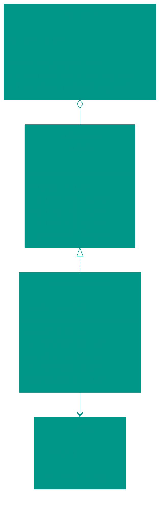
```mermaid
%%{init: { 'theme': 'base', 'themeVariables': { 'lineColor': '#009688', 'primaryColor': '#009688', 'primaryTextColor': '#009688', 'attributeBkg': '#009688', 'attributeTextColor': '#009688', 'signalColor': '#009688', 'actorLineColor': '#009688', 'nodeBorder': '#009688', 'clusterBorder': '#009688', 'textColor': '#009688', 'fontSize': '16px' } } }%%
classDiagram
    class Director {
        -builder: Builder
        +setBuilder(builder) void
        +buildMinimalViableProduct() void
        +buildFullFeaturedProduct() void
    }
    class Builder {
        <<interface>>
        +reset() Builder
        +buildPartA() Builder
        +buildPartB() Builder
        +buildPartC() Builder
        +getResult() Product
    }
    class ConcreteBuilder {
        -product: Product
        +reset() Builder
        +buildPartA() Builder
        +buildPartB() Builder
        +buildPartC() Builder
        +getResult() Product
    }
    class Product {
        +parts: list
        +listParts() string
    }

    Director o-- Builder
    Builder <|.. ConcreteBuilder
    ConcreteBuilder --> Product
```

**Сложность**:

| Метрика | Сложность |
|:---|:---:|
| Временная (при создании объекта) | O(n), где n - количество шагов |
| Пространственная | O(m), где m - размер конечного объекта |

---

## 💻 Реализация

```go
package builder

import (
    "fmt"
    "strings"
)

// Product сложный объект, который мы строим
type Product struct {
    parts []string
}

func (p *Product) ListParts() string {
    return fmt.Sprintf("Product parts: %s\n", strings.Join(p.parts, ", "))
}

func (p *Product) AddPart(part string) {
    p.parts = append(p.parts, part)
}

// Builder интерфейс для строителя
type Builder interface {
    Reset() Builder
    BuildPartA() Builder
    BuildPartB() Builder
    BuildPartC() Builder
    GetResult() *Product
}

// ConcreteBuilder конкретная реализация строителя
type ConcreteBuilder struct {
    product *Product
}

func NewConcreteBuilder() *ConcreteBuilder {
    return &ConcreteBuilder{product: &Product{}}
}

func (b *ConcreteBuilder) Reset() Builder {
    b.product = &Product{}
    return b
}

func (b *ConcreteBuilder) BuildPartA() Builder {
    b.product.AddPart("PartA1")
    return b
}

func (b *ConcreteBuilder) BuildPartB() Builder {
    b.product.AddPart("PartB1")
    return b
}

func (b *ConcreteBuilder) BuildPartC() Builder {
    b.product.AddPart("PartC1")
    return b
}

func (b *ConcreteBuilder) GetResult() *Product {
    result := b.product
    b.Reset() // сброс для следующего использования
    return result
}

// Director класс, который управляет процессом построения
type Director struct {
    builder Builder
}

func (d *Director) SetBuilder(b Builder) {
    d.builder = b
}

func (d *Director) BuildMinimalViableProduct() *Product {
    return d.builder.BuildPartA().GetResult()
}

func (d *Director) BuildFullFeaturedProduct() *Product {
    return d.builder.BuildPartA().BuildPartB().BuildPartC().GetResult()
}
```

```javascript
/**
 * Продукт, который мы строим
 */
class Product {
    constructor() {
        this.parts = [];
    }
    
    addPart(part) {
        this.parts.push(part);
    }
    
    listParts() {
        return `Product parts: ${this.parts.join(', ')}\n`;
    }
}

/**
 * Интерфейс Builder
 */
class Builder {
    reset() {
        throw new Error("Метод reset() должен быть реализован");
    }
    
    buildPartA() {
        throw new Error("Метод buildPartA() должен быть реализован");
    }
    
    buildPartB() {
        throw new Error("Метод buildPartB() должен быть реализован");
    }
    
    buildPartC() {
        throw new Error("Метод buildPartC() должен быть реализован");
    }
    
    getResult() {
        throw new Error("Метод getResult() должен быть реализован");
    }
}

/**
 * Конкретная реализация Builder
 */
class ConcreteBuilder extends Builder {
    constructor() {
        super();
        this.reset();
    }
    
    reset() {
        this.product = new Product();
        return this;
    }
    
    buildPartA() {
        this.product.addPart('PartA1');
        return this;
    }
    
    buildPartB() {
        this.product.addPart('PartB1');
        return this;
    }
    
    buildPartC() {
        this.product.addPart('PartC1');
        return this;
    }
    
    getResult() {
        const result = this.product;
        this.reset(); // сброс для следующего использования
        return result;
    }
}

/**
 * Директор, который управляет процессом построения
 */
class Director {
    setBuilder(builder) {
        this.builder = builder;
    }
    
    buildMinimalViableProduct() {
        return this.builder.buildPartA().getResult();
    }
    
    buildFullFeaturedProduct() {
        return this.builder.buildPartA().buildPartB().buildPartC().getResult();
    }
}

// Пример использования
const director = new Director();
const builder = new ConcreteBuilder();
director.setBuilder(builder);

console.log("Базовый продукт:");
console.log(director.buildMinimalViableProduct().listParts());

console.log("Полнофункциональный продукт:");
console.log(director.buildFullFeaturedProduct().listParts());

// Построение продукта вручную
console.log("Пользовательский продукт:");
const customProduct = builder.buildPartA().buildPartC().getResult();
console.log(customProduct.listParts());
```

---

### 🧬 Prototype (Прототип)

**Описание**:
Паттерн Prototype позволяет копировать объекты, не создавая зависимости от их классов. Он определяет интерфейс для клонирования объектов.

- **Проблема**: Создание объектов может быть дорогой операцией, особенно если они требуют сложной инициализации.
- **Решение**: Создать прототип объекта и клонировать его при необходимости, вместо создания нового экземпляра с нуля.
- **Аналогия**: Представьте, что вы создаете документ. Вместо того чтобы каждый раз создавать его с нуля, вы берете готовый шаблон (прототип) и вносите необходимые изменения.

#### Преимущества и недостатки

✅ **Плюсы**:
1. **Экономия ресурсов**: Избегает повторной инициализации
2. **Динамическое добавление продуктов**: Можно добавлять новые типы продуктов во время выполнения
3. **Клонирование сложных объектов**: Упрощает создание сложных объектов

❌ **Минусы**:
1. **Сложность клонирования**: Клонирование может быть сложным, особенно для объектов с циклическими ссылками
2. **Не всегда очевидно**: Не всегда ясно, когда использовать прототип вместо конструктора

**Когда использовать**: Когда стоимость создания экземпляра объекта высока, или когда система должна быть независимой от способа создания, композиции и представления объектов.

---

**Визуализация**:

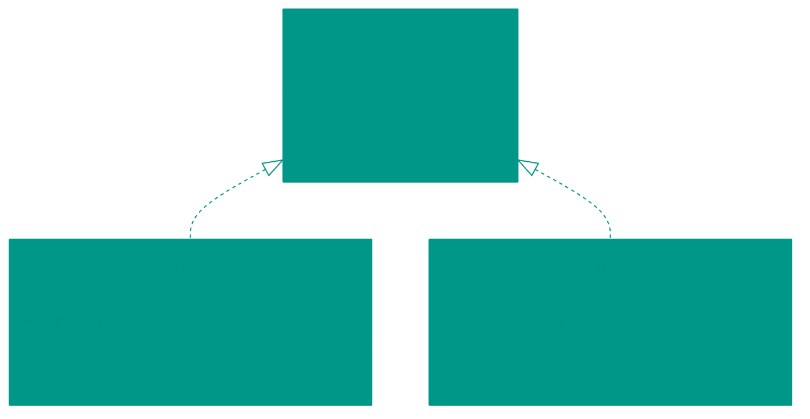
```mermaid
%%{init: { 'theme': 'base', 'themeVariables': { 'lineColor': '#009688', 'primaryColor': '#009688', 'primaryTextColor': '#009688', 'attributeBkg': '#009688', 'attributeTextColor': '#009688', 'signalColor': '#009688', 'actorLineColor': '#009688', 'nodeBorder': '#009688', 'clusterBorder': '#009688', 'textColor': '#009688', 'fontSize': '16px' } } }%%
classDiagram
    class Prototype {
        <<interface>>
        +clone() Prototype
    }
    class ConcretePrototype1 {
        +field1: string
        +clone() ConcretePrototype1
    }
    class ConcretePrototype2 {
        +field2: number
        +clone() ConcretePrototype2
    }

    Prototype <|.. ConcretePrototype1
    Prototype <|.. ConcretePrototype2
```

**Сложность**:

| Метрика | Сложность |
|:---|:---:|
| Временная (при клонировании) | O(n), где n - количество полей |
| Пространственная | O(n), где n - размер объекта |

---

## 💻 Реализация

```go
package prototype

import "fmt"

// Prototype интерфейс для клонирования
type Prototype interface {
    Clone() Prototype
    GetType() string
    PrintDetails()
}

// ConcretePrototype1 конкретная реализация прототипа 1
type ConcretePrototype1 struct {
    field1 string
}

func (p *ConcretePrototype1) Clone() Prototype {
    // Создаем копию объекта
    clone := *p
    return &clone
}

func (p *ConcretePrototype1) GetType() string {
    return "ConcretePrototype1"
}

func (p *ConcretePrototype1) PrintDetails() {
    fmt.Printf("ConcretePrototype1: field1 = %s\n", p.field1)
}

// ConcretePrototype2 конкретная реализация прототипа 2
type ConcretePrototype2 struct {
    field2 int
}

func (p *ConcretePrototype2) Clone() Prototype {
    // Создаем копию объекта
    clone := *p
    return &clone
}

func (p *ConcretePrototype2) GetType() string {
    return "ConcretePrototype2"
}

func (p *ConcretePrototype2) PrintDetails() {
    fmt.Printf("ConcretePrototype2: field2 = %d\n", p.field2)
}

// Factory функция для создания прототипов
func CreatePrototype(prototypeType string) Prototype {
    switch prototypeType {
    case "type1":
        return &ConcretePrototype1{field1: "initial value"}
    case "type2":
        return &ConcretePrototype2{field2: 42}
    default:
        return nil
    }
}
```

```javascript
/**
 * Интерфейс Prototype
 */
class Prototype {
    clone() {
        throw new Error("Метод clone() должен быть реализован");
    }
    
    getType() {
        throw new Error("Метод getType() должен быть реализован");
    }
    
    printDetails() {
        throw new Error("Метод printDetails() должен быть реализован");
    }
}

/**
 * Конкретные реализации прототипов
 */
class ConcretePrototype1 extends Prototype {
    constructor(field1 = "initial value") {
        super();
        this.field1 = field1;
    }
    
    clone() {
        // Глубокое клонирование объекта
        return new ConcretePrototype1(this.field1);
    }
    
    getType() {
        return "ConcretePrototype1";
    }
    
    printDetails() {
        console.log(`ConcretePrototype1: field1 = ${this.field1}`);
    }
}

class ConcretePrototype2 extends Prototype {
    constructor(field2 = 42) {
        super();
        this.field2 = field2;
    }
    
    clone() {
        // Глубокое клонирование объекта
        return new ConcretePrototype2(this.field2);
    }
    
    getType() {
        return "ConcretePrototype2";
    }
    
    printDetails() {
        console.log(`ConcretePrototype2: field2 = ${this.field2}`);
    }
}

/**
 * Функция для создания прототипов
 */
function createPrototype(prototypeType) {
    switch(prototypeType) {
        case "type1":
            return new ConcretePrototype1();
        case "type2":
            return new ConcretePrototype2();
        default:
            return null;
    }
}

// Пример использования
const prototype1 = new ConcretePrototype1("original value");
const clonedPrototype1 = prototype1.clone();

console.log("Оригинал:");
prototype1.printDetails();

console.log("Клон:");
clonedPrototype1.printDetails();

// Проверяем, что это разные объекты
console.log(`Оригинал и клон - это один и тот же объект? ${prototype1 === clonedPrototype1}`); // false
```

---

## Структурные паттерны

Эти паттерны связаны с составлением классов и объектов в более крупные структуры, при этом сохраняя гибкость и эффективность этих структур.

### 🔌 Adapter (Адаптер)

**Описание**:
Паттерн Adapter позволяет объектам с несовместимыми интерфейсами работать вместе. Он преобразует интерфейс одного класса в интерфейс, который ожидают клиенты.

- **Проблема**: Необходимость работы с классами, которые имеют несовместимые интерфейсы.
- **Решение**: Создать адаптер, который оборачивает один из объектов и предоставляет ему интерфейс, ожидаемый клиентом.
- **Аналогия**: Переходник для розеток - позволяет использовать устройства, предназначенные для одной страны, в другой стране с разными розетками.

#### Преимущества и недостатки

✅ **Плюсы**:
1. **Повторное использование классов**: Позволяет использовать существующие классы с несовместимыми интерфейсами
2. **Изолирует клиентов от реализации**: Клиенты работают с единым интерфейсом
3. **Гибкость**: Легко добавлять новые адаптеры

❌ **Минусы**:
1. **Усложнение кода**: Добавляет дополнительные классы
2. **Снижение производительности**: Дополнительный уровень абстракции может замедлить выполнение

**Когда использовать**: Когда нужно использовать существующий класс, но его интерфейс несовместим с остальной системой, или когда нужно создать повторно используемые классы, которые работают с другими несовместимыми классами.

---

**Визуализация**:

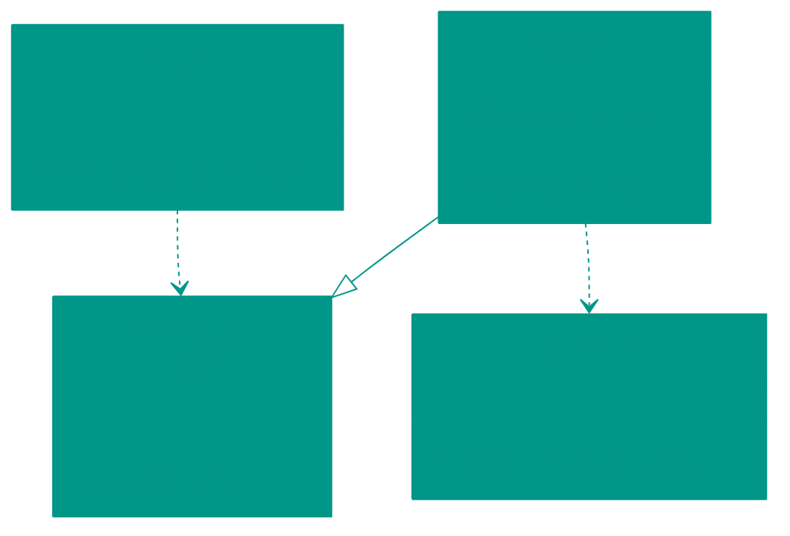
```mermaid
%%{init: { 'theme': 'base', 'themeVariables': { 'lineColor': '#009688', 'primaryColor': '#009688', 'primaryTextColor': '#009688', 'attributeBkg': '#009688', 'attributeTextColor': '#009688', 'signalColor': '#009688', 'actorLineColor': '#009688', 'nodeBorder': '#009688', 'clusterBorder': '#009688', 'textColor': '#009688', 'fontSize': '16px' } } }%%
classDiagram
    class Target {
        <<interface>>
        +request() string
    }
    class Adaptee {
        +specificRequest() string
    }
    class Adapter {
        -adaptee: Adaptee
        +request() string
    }
    class Client {
        +clientCode(target) void
    }

    Client ..> Target
    Adapter --|> Target
    Adapter ..> Adaptee
```

**Сложность**:

| Метрика | Сложность |
|:---|:---:|
| Временная (при вызове метода) | O(1) |
| Пространственная | O(1) |

---

## 💻 Реализация

```go
package adapter

import "fmt"

// Target интерфейс, который ожидает клиент
type Target interface {
    Request() string
}

// Adaptee класс, который имеет несовместимый интерфейс
type Adaptee struct{}

func (a *Adaptee) SpecificRequest() string {
    return "Specific request from Adaptee"
}

// Adapter адаптирует интерфейс Adaptee к интерфейсу Target
type Adapter struct {
    adaptee *Adaptee
}

func NewAdapter(adaptee *Adaptee) *Adapter {
    return &Adapter{adaptee: adaptee}
}

func (a *Adapter) Request() string {
    return fmt.Sprintf("Adapter: Converting '%s' to expected format", a.adaptee.SpecificRequest())
}

// ClientCode клиентский код, который работает с Target
func ClientCode(target Target) string {
    return target.Request()
}
```

```javascript
/**
 * Целевой интерфейс, который ожидает клиент
 */
class Target {
    request() {
        return "Target: Base target behavior";
    }
}

/**
 * Адаптируемый класс
 */
class Adaptee {
    specificRequest() {
        return "Specific request from Adaptee";
    }
}

/**
 * Адаптер
 */
class Adapter extends Target {
    constructor(adaptee) {
        super();
        this.adaptee = adaptee;
    }
    
    request() {
        const result = this.adaptee.specificRequest();
        return `Adapter: Converting '${result}' to expected format`;
    }
}

/**
 * Клиентский код
 */
function clientCode(target) {
    return target.request();
}

// Пример использования
const adaptee = new Adaptee();
const adapter = new Adapter(adaptee);

console.log(clientCode(adapter));
```

---

### 🌉 Bridge (Мост)

**Описание**:
Паттерн Bridge разделяет абстракцию и реализацию так, чтобы они могли изменяться независимо друг от друга. Он использует композицию вместо наследования.

- **Проблема**: Жесткая связь между абстракцией и реализацией, которая не позволяет изменять их независимо.
- **Решение**: Создать мост между абстракцией и реализацией, позволяя им изменяться независимо.
- **Аналогия**: Представьте пульт управления телевизором. Пульт (абстракция) может работать с разными моделями телевизоров (реализации) благодаря универсальному интерфейсу.

#### Преимущества и недостатки

✅ **Плюсы**:
1. **Независимое развитие абстракции и реализации**: Можно изменять каждую часть отдельно
2. **Устранение жесткой зависимости**: Уменьшает связность между компонентами
3. **Поддержка платформенной независимости**: Реализация может быть заменена без изменения абстракции

❌ **Минусы**:
1. **Усложнение кода**: Может усложнить архитектуру приложения
2. **Избыточность для простых случаев**: Может быть избыточным для простых задач

**Когда использовать**: Когда нужно избежать постоянной связи между абстракцией и ее реализацией, или когда изменения в реализации не должны влиять на клиентский код.

---

**Визуализация**:

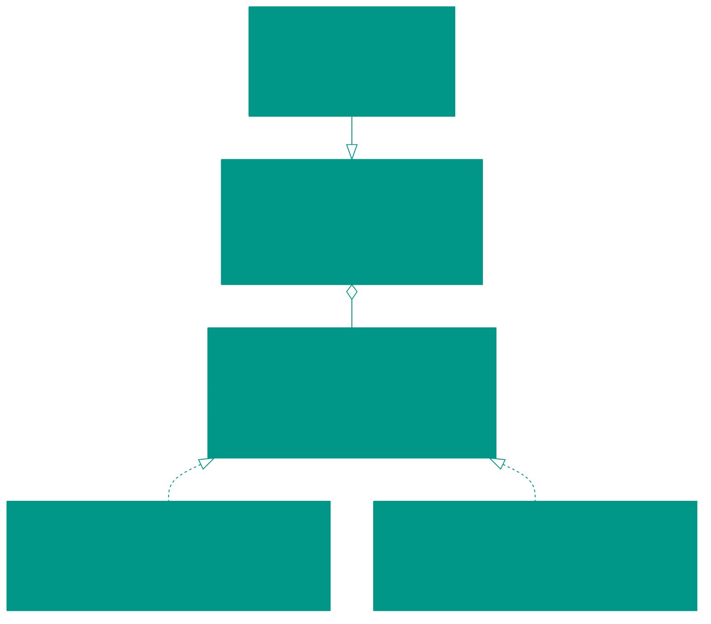
```mermaid
%%{init: { 'theme': 'base', 'themeVariables': { 'lineColor': '#009688', 'primaryColor': '#009688', 'primaryTextColor': '#009688', 'attributeBkg': '#009688', 'attributeTextColor': '#009688', 'signalColor': '#009688', 'actorLineColor': '#009688', 'nodeBorder': '#009688', 'clusterBorder': '#009688', 'textColor': '#009688', 'fontSize': '16px' } } }%%
classDiagram
    class Abstraction {
        -implementation: Implementation
        +operation() string
    }
    class RefinedAbstraction {
        +operation() string
    }
    class Implementation {
        <<interface>>
        +operationImplementation() string
    }
    class ConcreteImplementationA {
        +operationImplementation() string
    }
    class ConcreteImplementationB {
        +operationImplementation() string
    }

    Abstraction o-- Implementation
    RefinedAbstraction --|> Abstraction
    Implementation <|.. ConcreteImplementationA
    Implementation <|.. ConcreteImplementationB
```

**Сложность**:

| Метрика | Сложность |
|:---|:---:|
| Временная (при вызове метода) | O(1) |
| Пространственная | O(1) |

---

## 💻 Реализация

```go
package bridge

import "fmt"

// Implementation интерфейс для реализации
type Implementation interface {
    OperationImplementation() string
}

// ConcreteImplementationA конкретная реализация A
type ConcreteImplementationA struct{}

func (c *ConcreteImplementationA) OperationImplementation() string {
    return "ConcreteImplementationA: Here's the result on the platform A.\n"
}

// ConcreteImplementationB конкретная реализация B
type ConcreteImplementationB struct{}

func (c *ConcreteImplementationB) OperationImplementation() string {
    return "ConcreteImplementationB: Here's the result on the platform B.\n"
}

// Abstraction абстракция
type Abstraction struct {
    implementation Implementation
}

func NewAbstraction(implementation Implementation) *Abstraction {
    return &Abstraction{implementation: implementation}
}

func (a *Abstraction) Operation() string {
    return fmt.Sprintf("Abstraction: Base operation with:\n%s", a.implementation.OperationImplementation())
}

// RefinedAbstraction уточненная абстракция
type RefinedAbstraction struct {
    *Abstraction
}

func NewRefinedAbstraction(implementation Implementation) *RefinedAbstraction {
    return &RefinedAbstraction{Abstraction: NewAbstraction(implementation)}
}

func (ra *RefinedAbstraction) Operation() string {
    return fmt.Sprintf("RefinedAbstraction: Extended operation with:\n%s", ra.implementation.OperationImplementation())
}
```

```javascript
/**
 * Интерфейс реализации
 */
class Implementation {
    operationImplementation() {
        throw new Error("Метод operationImplementation() должен быть реализован");
    }
}

/**
 * Конкретные реализации
 */
class ConcreteImplementationA extends Implementation {
    operationImplementation() {
        return "ConcreteImplementationA: Here's the result on the platform A.\n";
    }
}

class ConcreteImplementationB extends Implementation {
    operationImplementation() {
        return "ConcreteImplementationB: Here's the result on the platform B.\n";
    }
}

/**
 * Абстракция
 */
class Abstraction {
    constructor(implementation) {
        this.implementation = implementation;
    }
    
    operation() {
        return `Abstraction: Base operation with:\n${this.implementation.operationImplementation()}`;
    }
}

/**
 * Уточненная абстракция
 */
class RefinedAbstraction extends Abstraction {
    operation() {
        return `RefinedAbstraction: Extended operation with:\n${this.implementation.operationImplementation()}`;
    }
}

// Пример использования
const implementationA = new ConcreteImplementationA();
const abstractionA = new Abstraction(implementationA);
console.log(abstractionA.operation());

const implementationB = new ConcreteImplementationB();
const refinedAbstractionB = new RefinedAbstraction(implementationB);
console.log(refinedAbstractionB.operation());
```

---

### 🧩 Composite (Компоновщик)

**Описание**:
Паттерн Composite позволяет клиентам обрабатывать отдельные объекты и композиции объектов одинаковым образом. Он создает древовидную структуру, где узлы могут быть как отдельными объектами, так и группами объектов.

- **Проблема**: Необходимость обработки иерархических структур, где отдельные элементы и группы элементов должны обрабатываться одинаково.
- **Решение**: Создать общий интерфейс для отдельных объектов и композитов, позволяя клиентскому коду работать с ними унифицированно.
- **Аналогия**: Файловая система - файлы и папки обрабатываются одинаково, папка может содержать как файлы, так и другие папки.

#### Преимущества и недостатки

✅ **Плюсы**:
1. **Унифицированный интерфейс**: Единый интерфейс для работы с отдельными объектами и композитами
2. **Простота добавления новых компонентов**: Легко добавлять новые типы компонентов
3. **Гибкость**: Можно легко строить сложные иерархические структуры

❌ **Минусы**:
1. **Ограничения типизации**: Может быть сложно ограничить типы компонентов, которые можно добавлять в композит
2. **Сложность определения типа**: Иногда трудно определить, является ли объект листом или композитом

**Когда использовать**: Когда нужно создать иерархическую структуру, где отдельные объекты и группы объектов обрабатываются одинаково.

---

**Визуализация**:

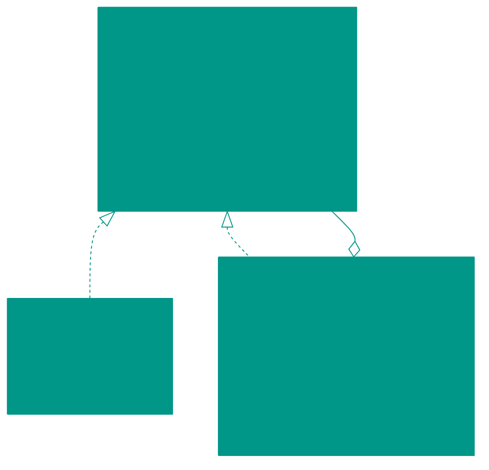
```mermaid
%%{init: { 'theme': 'base', 'themeVariables': { 'lineColor': '#009688', 'primaryColor': '#009688', 'primaryTextColor': '#009688', 'attributeBkg': '#009688', 'attributeTextColor': '#009688', 'signalColor': '#009688', 'actorLineColor': '#009688', 'nodeBorder': '#009688', 'clusterBorder': '#009688', 'textColor': '#009688', 'fontSize': '16px' } } }%%
classDiagram
    class Component {
        <<interface>>
        +operation() string
        +add(component) void
        +remove(component) void
        +getChild(index) Component
    }
    class Leaf {
        +operation() string
    }
    class Composite {
        -children: Component[]
        +operation() string
        +add(component) void
        +remove(component) void
        +getChild(index) Component
    }

    Component <|.. Leaf
    Component <|.. Composite
    Composite o-- Component
```

**Сложность**:

| Метрика | Сложность |
|:---|:---:|
| Временная (при добавлении/удалении) | O(1) для добавления, O(n) для удаления |
| Пространственная | O(n), где n - количество элементов |

---

## 💻 Реализация

```go
package composite

import (
    "fmt"
    "strings"
)

// Component интерфейс для компонентов
type Component interface {
    Operation() string
    Add(Component)
    Remove(Component)
    GetChild(int) Component
}

// Leaf листовой элемент
type Leaf struct {
    name string
}

func NewLeaf(name string) *Leaf {
    return &Leaf{name: name}
}

func (l *Leaf) Operation() string {
    return fmt.Sprintf("Leaf: %s", l.name)
}

func (l *Leaf) Add(c Component) {
    panic("Cannot add to a leaf")
}

func (l *Leaf) Remove(c Component) {
    panic("Cannot remove from a leaf")
}

func (l *Leaf) GetChild(index int) Component {
    panic("Cannot get child from a leaf")
}

// Composite композитный элемент
type Composite struct {
    name     string
    children []Component
}

func NewComposite(name string) *Composite {
    return &Composite{name: name, children: make([]Component, 0)}
}

func (c *Composite) Operation() string {
    result := []string{fmt.Sprintf("Composite: %s", c.name)}
    
    for _, child := range c.children {
        result = append(result, child.Operation())
    }
    
    return strings.Join(result, "\n")
}

func (c *Composite) Add(component Component) {
    c.children = append(c.children, component)
}

func (c *Composite) Remove(component Component) {
    for i, child := range c.children {
        if child == component {
            c.children = append(c.children[:i], c.children[i+1:]...)
            break
        }
    }
}

func (c *Composite) GetChild(index int) Component {
    if index >= 0 && index < len(c.children) {
        return c.children[index]
    }
    return nil
}
```

```javascript
/**
 * Интерфейс компонента
 */
class Component {
    operation() {
        throw new Error("Метод operation() должен быть реализован");
    }
    
    add(component) {
        throw new Error("Метод add() должен быть реализован");
    }
    
    remove(component) {
        throw new Error("Метод remove() должен быть реализован");
    }
    
    getChild(index) {
        throw new Error("Метод getChild() должен быть реализован");
    }
}

/**
 * Листовой элемент
 */
class Leaf extends Component {
    constructor(name) {
        super();
        this.name = name;
    }
    
    operation() {
        return `Leaf: ${this.name}`;
    }
    
    add() {
        throw new Error("Cannot add to a leaf");
    }
    
    remove() {
        throw new Error("Cannot remove from a leaf");
    }
    
    getChild() {
        throw new Error("Cannot get child from a leaf");
    }
}

/**
 * Композитный элемент
 */
class Composite extends Component {
    constructor(name) {
        super();
        this.name = name;
        this.children = [];
    }
    
    operation() {
        const result = [`Composite: ${this.name}`];
        
        for (const child of this.children) {
            result.push(child.operation());
        }
        
        return result.join('\n');
    }
    
    add(component) {
        this.children.push(component);
    }
    
    remove(component) {
        const index = this.children.indexOf(component);
        if (index !== -1) {
            this.children.splice(index, 1);
        }
    }
    
    getChild(index) {
        if (index >= 0 && index < this.children.length) {
            return this.children[index];
        }
        return null;
    }
}

// Пример использования
const tree = new Composite("root");

const branch1 = new Composite("branch1");
const branch2 = new Composite("branch2");

const leaf1 = new Leaf("leaf1");
const leaf2 = new Leaf("leaf2");
const leaf3 = new Leaf("leaf3");

branch1.add(leaf1);
branch1.add(leaf2);
branch2.add(leaf3);

tree.add(branch1);
tree.add(branch2);

console.log(tree.operation());
```

---

### ✨ Decorator (Декоратор)

**Описание**:
Паттерн Decorator позволяет динамически добавлять объектам новую функциональность, оборачивая их в полезные "обертки". Он предоставляет гибкую альтернативу наследованию для расширения функциональности.

- **Проблема**: Необходимость добавления функциональности к объектам без изменения их структуры или использования наследования.
- **Решение**: Создать декоратор, который оборачивает оригинальный объект и добавляет к нему новую функциональность.
- **Аналогия**: Представьте торт - вы можете добавлять к нему крем, фрукты, шоколад и т.д., каждый раз получая новую версию торта с дополнительными свойствами.

#### Преимущества и недостатки

✅ **Плюсы**:
1. **Гибкость**: Возможность динамически добавлять и удалять функциональность
2. **Соответствие принципу открытости/закрытости**: Открыт для расширения, закрыт для модификации
3. **Альтернатива наследованию**: Позволяет избежать сложной иерархии классов

❌ **Минусы**:
1. **Усложнение отладки**: Сложнее отлаживать код с множеством вложенных декораторов
2. **Увеличение количества маленьких классов**: Может привести к увеличению количества классов

**Когда использовать**: Когда нужно добавлять обязанности объектам динамически и прозрачно, или когда наследование не подходит для расширения функциональности.

---

**Визуализация**:

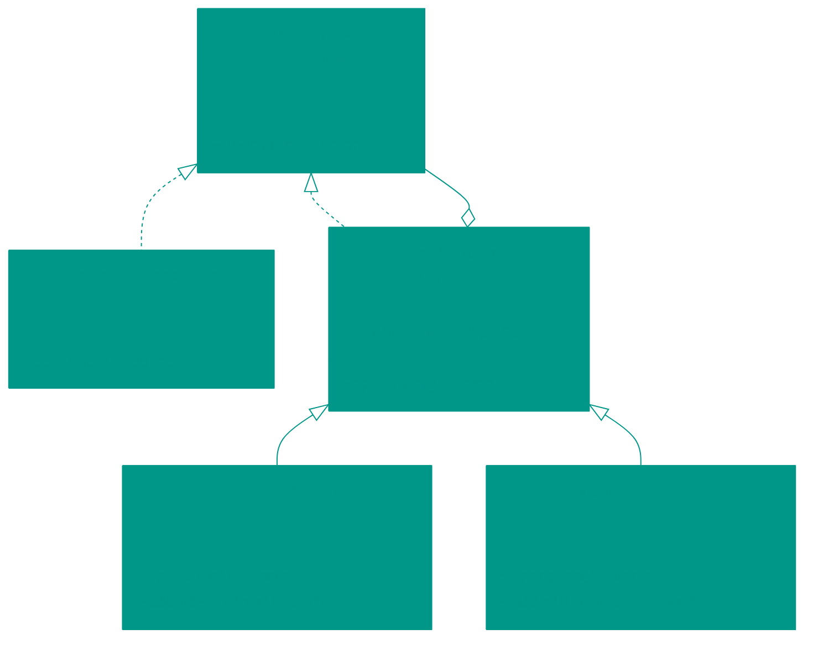
```mermaid
%%{init: { 'theme': 'base', 'themeVariables': { 'lineColor': '#009688', 'primaryColor': '#009688', 'primaryTextColor': '#009688', 'attributeBkg': '#009688', 'attributeTextColor': '#009688', 'signalColor': '#009688', 'actorLineColor': '#009688', 'nodeBorder': '#009688', 'clusterBorder': '#009688', 'textColor': '#009688', 'fontSize': '16px' } } }%%
classDiagram
    class Component {
        <<interface>>
        +operation() string
    }
    class ConcreteComponent {
        +operation() string
    }
    class Decorator {
        <<abstract>>
        -component: Component
        +operation() string
    }
    class ConcreteDecoratorA {
        +operation() string
        +addedBehavior() string
    }
    class ConcreteDecoratorB {
        +operation() string
        +addedBehavior() string
    }

    Component <|.. ConcreteComponent
    Component <|.. Decorator
    Decorator <|-- ConcreteDecoratorA
    Decorator <|-- ConcreteDecoratorB
    Decorator o-- Component
```

**Сложность**:

| Метрика | Сложность |
|:---|:---:|
| Временная (при вызове метода) | O(1) для каждого декоратора |
| Пространственная | O(n), где n - количество декораторов |

---

## 💻 Реализация

```go
package decorator

import "fmt"

// Component интерфейс для компонента
type Component interface {
    Operation() string
}

// ConcreteComponent конкретная реализация компонента
type ConcreteComponent struct{}

func (c *ConcreteComponent) Operation() string {
    return "ConcreteComponent"
}

// Decorator базовый декоратор
type Decorator struct {
    component Component
}

func NewDecorator(component Component) *Decorator {
    return &Decorator{component: component}
}

func (d *Decorator) Operation() string {
    return d.component.Operation()
}

// ConcreteDecoratorA конкретный декоратор A
type ConcreteDecoratorA struct {
    *Decorator
}

func NewConcreteDecoratorA(component Component) *ConcreteDecoratorA {
    return &ConcreteDecoratorA{Decorator: NewDecorator(component)}
}

func (d *ConcreteDecoratorA) Operation() string {
    return fmt.Sprintf("ConcreteDecoratorA(%s)", d.Decorator.Operation())
}

// ConcreteDecoratorB конкретный декоратор B
type ConcreteDecoratorB struct {
    *Decorator
}

func NewConcreteDecoratorB(component Component) *ConcreteDecoratorB {
    return &ConcreteDecoratorB{Decorator: NewDecorator(component)}
}

func (d *ConcreteDecoratorB) Operation() string {
    return fmt.Sprintf("ConcreteDecoratorB(%s)", d.Decorator.Operation())
}

// AddedBehavior дополнительное поведение для декоратора B
func (d *ConcreteDecoratorB) AddedBehavior() string {
    return "ConcreteDecoratorB: Added behavior"
}
```

```javascript
/**
 * Интерфейс компонента
 */
class Component {
    operation() {
        throw new Error("Метод operation() должен быть реализован");
    }
}

/**
 * Конкретная реализация компонента
 */
class ConcreteComponent extends Component {
    operation() {
        return "ConcreteComponent";
    }
}

/**
 * Базовый декоратор
 */
class Decorator extends Component {
    constructor(component) {
        super();
        this.component = component;
    }
    
    operation() {
        return this.component.operation();
    }
}

/**
 * Конкретные декораторы
 */
class ConcreteDecoratorA extends Decorator {
    operation() {
        return `ConcreteDecoratorA(${super.operation()})`;
    }
}

class ConcreteDecoratorB extends Decorator {
    operation() {
        return `ConcreteDecoratorB(${super.operation()})`;
    }
    
    addedBehavior() {
        return "ConcreteDecoratorB: Added behavior";
    }
}

// Пример использования
const simple = new ConcreteComponent();
console.log("Простой компонент:", simple.operation());

const decorator1 = new ConcreteDecoratorA(simple);
const decorator2 = new ConcreteDecoratorB(decorator1);
console.log("Декорированный компонент:", decorator2.operation());
console.log("Дополнительное поведение:", decorator2.addedBehavior());
```

---

### 🏢 Facade (Фасад)

**Описание**:
Паттерн Facade предоставляет унифицированный интерфейс к группе интерфейсов в подсистеме. Фасад определяет более высокоуровневый интерфейс, облегчающий использование подсистемы.

- **Проблема**: Сложная подсистема с множеством интерфейсов, которую трудно использовать из-за необходимости взаимодействия с множеством объектов.
- **Решение**: Создать фасад, который предоставляет упрощенный интерфейс к сложной подсистеме.
- **Аналогия**: Представьте ресторан - вы не готовите еду сами, а просто делаете заказ официанту, который координирует всю работу на кухне.

#### Преимущества и недостатки

✅ **Плюсы**:
1. **Упрощение интерфейса**: Скрывает сложность подсистемы
2. **Снижение связанности**: Уменьшает зависимость клиентского кода от внутренних компонентов
3. **Удобство использования**: Обеспечивает удобный интерфейс для сложных подсистем

❌ **Минусы**:
1. **Ограниченная гибкость**: Может ограничивать возможности, доступные через прямой доступ к подсистеме
2. **Центральная точка отказа**: Фасад может стать "узким местом" архитектуры

**Когда использовать**: Когда нужно предоставить простой интерфейс к сложной подсистеме, или когда нужно изолировать сложность подсистемы от клиентского кода.

---

**Визуализация**:

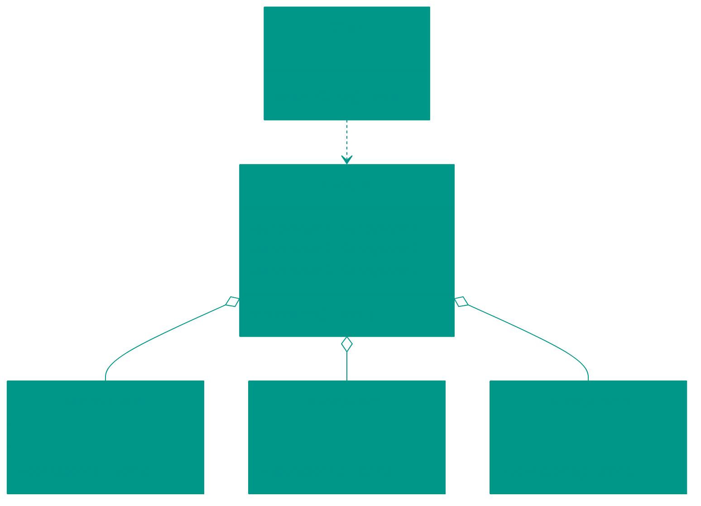
```mermaid
%%{init: { 'theme': 'base', 'themeVariables': { 'lineColor': '#009688', 'primaryColor': '#009688', 'primaryTextColor': '#009688', 'attributeBkg': '#009688', 'attributeTextColor': '#009688', 'signalColor': '#009688', 'actorLineColor': '#009688', 'nodeBorder': '#009688', 'clusterBorder': '#009688', 'textColor': '#009688', 'fontSize': '16px' } } }%%
classDiagram
    class Facade {
        -subsystem1: Subsystem1
        -subsystem2: Subsystem2
        -subsystem3: Subsystem3
        +operation() string
    }
    class Subsystem1 {
        +operation1() string
    }
    class Subsystem2 {
        +operation2() string
    }
    class Subsystem3 {
        +operation3() string
    }
    class Client {
        +clientCode() void
    }

    Client ..> Facade
    Facade o-- Subsystem1
    Facade o-- Subsystem2
    Facade o-- Subsystem3
```

**Сложность**:

| Метрика | Сложность |
|:---|:---:|
| Временная (при вызове метода) | O(n), где n - количество вызовов подсистем |
| Пространственная | O(1) |

---

## 💻 Реализация

```go
package facade

import "fmt"

// Subsystem1 подсистема 1
type Subsystem1 struct{}

func (s *Subsystem1) Operation1() string {
    return "Subsystem1: Ready!\n"
}

// Subsystem2 подсистема 2
type Subsystem2 struct{}

func (s *Subsystem2) Operation2() string {
    return "Subsystem2: Ready!\n"
}

// Subsystem3 подсистема 3
type Subsystem3 struct{}

func (s *Subsystem3) Operation3() string {
    return "Subsystem3: Ready!\n"
}

// Facade фасад для подсистем
type Facade struct {
    subsystem1 *Subsystem1
    subsystem2 *Subsystem2
    subsystem3 *Subsystem3
}

func NewFacade() *Facade {
    return &Facade{
        subsystem1: &Subsystem1{},
        subsystem2: &Subsystem2{},
        subsystem3: &Subsystem3{},
    }
}

func (f *Facade) Operation() string {
    result := "Facade initializes subsystems:\n"
    result += f.subsystem1.Operation1()
    result += f.subsystem2.Operation2()
    result += f.subsystem3.Operation3()
    result += "Facade orders subsystems to perform the action:\n"
    result += f.subsystem1.Operation1()
    result += f.subsystem2.Operation2()
    return result
}

// AlternativeOperations альтернативные операции через фасад
func (f *Facade) AlternativeOperation() string {
    result := "Facade orders subsystems to perform alternative action:\n"
    result += f.subsystem2.Operation2()
    result += f.subsystem3.Operation3()
    return result
}
```

```javascript
/**
 * Подсистемы
 */
class Subsystem1 {
    operation1() {
        return "Subsystem1: Ready!\n";
    }
}

class Subsystem2 {
    operation2() {
        return "Subsystem2: Ready!\n";
    }
}

class Subsystem3 {
    operation3() {
        return "Subsystem3: Ready!\n";
    }
}

/**
 * Фасад
 */
class Facade {
    constructor() {
        this.subsystem1 = new Subsystem1();
        this.subsystem2 = new Subsystem2();
        this.subsystem3 = new Subsystem3();
    }
    
    operation() {
        let result = "Facade initializes subsystems:\n";
        result += this.subsystem1.operation1();
        result += this.subsystem2.operation2();
        result += this.subsystem3.operation3();
        result += "Facade orders subsystems to perform the action:\n";
        result += this.subsystem1.operation1();
        result += this.subsystem2.operation2();
        return result;
    }
    
    alternativeOperation() {
        let result = "Facade orders subsystems to perform alternative action:\n";
        result += this.subsystem2.operation2();
        result += this.subsystem3.operation3();
        return result;
    }
}

// Пример использования
const facade = new Facade();
console.log(facade.operation());
console.log(facade.alternativeOperation());
```

---

### ⚖️ Flyweight (Приспособленец)

**Описание**:
Паттерн Flyweight позволяет эффективно использовать большое количество мелких объектов, разделяя их общее состояние между собой. Он используется для минимизации потребления памяти или вычислительной стоимости при работе с большим количеством похожих объектов.

- **Проблема**: Создание большого количества похожих объектов, что приводит к чрезмерному потреблению памяти.
- **Решение**: Разделить внутреннее (внутреннее состояние) и внешнее (внешнее состояние) состояние объектов, храня внутреннее состояние в общем месте.
- **Аналогия**: Представьте текстовый редактор - символы одного шрифта, размера и цвета могут использовать один и тот же объект форматирования, а различия (например, позиция) передаются как внешние параметры.

#### Преимущества и недостатки

✅ **Плюсы**:
1. **Экономия памяти**: Значительно снижает использование памяти при работе с большим количеством похожих объектов
2. **Улучшение производительности**: Уменьшает количество создаваемых объектов
3. **Централизованное управление**: Общее состояние хранится в одном месте

❌ **Минусы**:
1. **Усложнение кода**: Может усложнить логику, особенно при разделении внутреннего и внешнего состояния
2. **Снижение эффективности**: Передача внешнего состояния может замедлить выполнение

**Когда использовать**: Когда приложение использует большое количество похожих объектов, или когда потребление памяти слишком велико из-за количества объектов.

---

**Визуализация**:

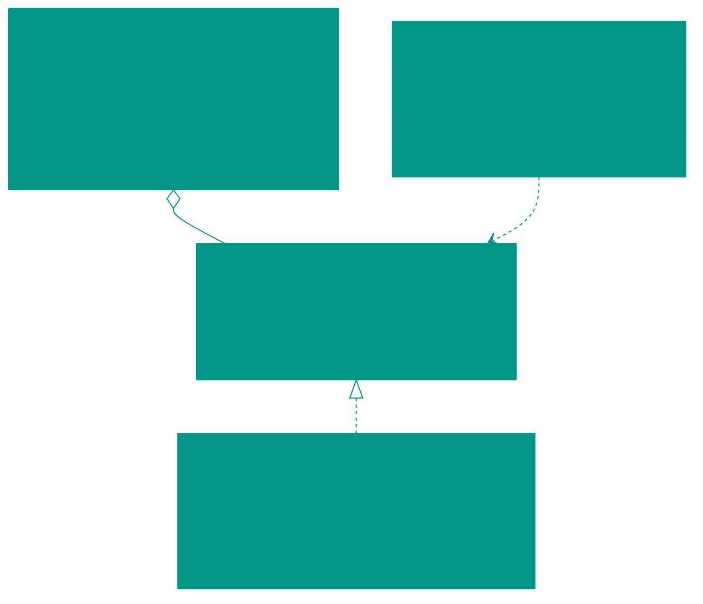
```mermaid
%%{init: { 'theme': 'base', 'themeVariables': { 'lineColor': '#009688', 'primaryColor': '#009688', 'primaryTextColor': '#009688', 'attributeBkg': '#009688', 'attributeTextColor': '#009688', 'signalColor': '#009688', 'actorLineColor': '#009688', 'nodeBorder': '#009688', 'clusterBorder': '#009688', 'textColor': '#009688', 'fontSize': '16px' } } }%%
classDiagram
    class FlyweightFactory {
        -flyweights: map
        +getFlyweight(key) Flyweight
        +listFlyweights() void
    }
    class Flyweight {
        +operation(extrinsicState) string
    }
    class ConcreteFlyweight {
        -intrinsicState: string
        +operation(extrinsicState) string
    }
    class Client {
        -flyweight: Flyweight
        +operation(extrinsicState) void
    }

    FlyweightFactory o-- Flyweight
    Flyweight <|.. ConcreteFlyweight
    Client ..> Flyweight
```

**Сложность**:

| Метрика | Сложность |
|:---|:---:|
| Временная (при получении flyweight) | O(1) |
| Пространственная | O(n), где n - количество уникальных flyweight объектов |

---

## 💻 Реализация

```go
package flyweight

import (
    "fmt"
    "sync"
)

// Flyweight интерфейс
type Flyweight interface {
    Operation(extrinsicState string) string
}

// ConcreteFlyweight конкретная реализация flyweight
type ConcreteFlyweight struct {
    intrinsicState string
}

func (f *ConcreteFlyweight) Operation(extrinsicState string) string {
    return fmt.Sprintf("ConcreteFlyweight: Intrinsic state = %s, Extrinsic state = %s\n", f.intrinsicState, extrinsicState)
}

// FlyweightFactory фабрика для flyweight объектов
type FlyweightFactory struct {
    flyweights map[string]Flyweight
    mu         sync.Mutex
}

func NewFlyweightFactory() *FlyweightFactory {
    return &FlyweightFactory{
        flyweights: make(map[string]Flyweight),
    }
}

func (f *FlyweightFactory) GetFlyweight(key string) Flyweight {
    f.mu.Lock()
    defer f.mu.Unlock()
    
    if flyweight, exists := f.flyweights[key]; exists {
        return flyweight
    }
    
    flyweight := &ConcreteFlyweight{intrinsicState: key}
    f.flyweights[key] = flyweight
    return flyweight
}

func (f *FlyweightFactory) ListFlyweights() {
    fmt.Printf("FlyweightFactory: I have %d flyweights:\n", len(f.flyweights))
    for key := range f.flyweights {
        fmt.Printf("\t%s\n", key)
    }
}

// Client код клиента
type Client struct {
    flyweight Flyweight
}

func NewClient(factory *FlyweightFactory, key string) *Client {
    return &Client{flyweight: factory.GetFlyweight(key)}
}

func (c *Client) Operation(extrinsicState string) string {
    return c.flyweight.Operation(extrinsicState)
}
```

```javascript
/**
 * Интерфейс Flyweight
 */
class Flyweight {
    operation(extrinsicState) {
        throw new Error("Метод operation() должен быть реализован");
    }
}

/**
 * Конкретная реализация Flyweight
 */
class ConcreteFlyweight extends Flyweight {
    constructor(intrinsicState) {
        super();
        this.intrinsicState = intrinsicState;
    }
    
    operation(extrinsicState) {
        return `ConcreteFlyweight: Intrinsic state = ${this.intrinsicState}, Extrinsic state = ${extrinsicState}\n`;
    }
}

/**
 * Фабрика для Flyweight объектов
 */
class FlyweightFactory {
    constructor() {
        this.flyweights = new Map();
    }
    
    getFlyweight(key) {
        if (!this.flyweights.has(key)) {
            this.flyweights.set(key, new ConcreteFlyweight(key));
        }
        return this.flyweights.get(key);
    }
    
    listFlyweights() {
        console.log(`FlyweightFactory: I have ${this.flyweights.size} flyweights:`);
        for (const key of this.flyweights.keys()) {
            console.log(`\t${key}`);
        }
    }
}

/**
 * Код клиента
 */
class Client {
    constructor(factory, key) {
        this.flyweight = factory.getFlyweight(key);
    }
    
    operation(extrinsicState) {
        return this.flyweight.operation(extrinsicState);
    }
}

// Пример использования
const factory = new FlyweightFactory();

const client1 = new Client(factory, "shared-state-A");
const client2 = new Client(factory, "shared-state-B");
const client3 = new Client(factory, "shared-state-A"); // тот же ключ, что и client1

console.log(client1.operation("unique-state-1"));
console.log(client2.operation("unique-state-2"));
console.log(client3.operation("unique-state-3"));

factory.listFlyweights();
```

---

### 🕵️ Proxy (Заместитель)

**Описание**:
Паттерн Proxy предоставляет объект, который контролирует доступ к другому объекту, перехватывая все вызовы к нему. Он позволяет выполнить что-то до или после вызова оригинального объекта.

- **Проблема**: Необходимость контроля доступа к объекту, добавления дополнительной логики при доступе или отложенной инициализации тяжелого объекта.
- **Решение**: Создать прокси-объект, который будет действовать как посредник между клиентом и оригинальным объектом.
- **Аналогия**: Представьте охранника в офисе - он контролирует, кто может войти в здание и при каких условиях.

#### Преимущества и недостатки

✅ **Плюсы**:
1. **Контроль доступа**: Можно контролировать, кто и когда может получить доступ к объекту
2. **Отложенная инициализация**: Позволяет отложить создание тяжелого объекта до момента его фактического использования
3. **Логирование и кеширование**: Можно добавить логирование вызовов или кеширование результатов

❌ **Минусы**:
1. **Увеличение времени отклика**: Добавление уровня абстракции может замедлить выполнение
2. **Усложнение кода**: Увеличивает сложность архитектуры

**Когда использовать**: Когда нужно контролировать доступ к объекту, добавить кеширование, отложенную инициализацию или логирование.

---

**Визуализация**:

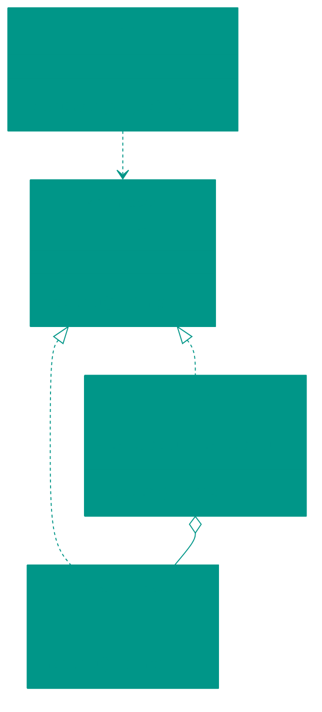
```mermaid
%%{init: { 'theme': 'base', 'themeVariables': { 'lineColor': '#009688', 'primaryColor': '#009688', 'primaryTextColor': '#009688', 'attributeBkg': '#009688', 'attributeTextColor': '#009688', 'signalColor': '#009688', 'actorLineColor': '#009688', 'nodeBorder': '#009688', 'clusterBorder': '#009688', 'textColor': '#009688', 'fontSize': '16px' } } }%%
classDiagram
    class Subject {
        <<interface>>
        +request() string
    }
    class RealSubject {
        +request() string
    }
    class Proxy {
        -realSubject: RealSubject
        +request() string
    }
    class Client {
        +clientCode(subject) void
    }

    Client ..> Subject
    Subject <|.. RealSubject
    Subject <|.. Proxy
    Proxy o-- RealSubject
```

**Сложность**:

| Метрика | Сложность |
|:---|:---:|
| Временная (при вызове метода) | O(1) для прокси, O(n) для оригинального объекта |
| Пространственная | O(1) |

---

## 💻 Реализация

```go
package proxy

import "fmt"

// Subject интерфейс для субъекта
type Subject interface {
    Request() string
}

// RealSubject реальный субъект
type RealSubject struct{}

func (r *RealSubject) Request() string {
    return "RealSubject: Handling request.\n"
}

// Proxy прокси
type Proxy struct {
    realSubject Subject
}

func NewProxy() *Proxy {
    return &Proxy{}
}

func (p *Proxy) Request() string {
    if p.realSubject == nil {
        p.realSubject = &RealSubject{}
    }
    
    fmt.Println("Proxy: Logging the request.")
    result := p.realSubject.Request()
    fmt.Println("Proxy: Logging the completion of the request.")
    return result
}

// ProtectedProxy защищенный прокси с проверкой доступа
type ProtectedProxy struct {
    realSubject Subject
    accessLevel int
}

func NewProtectedProxy(accessLevel int) *ProtectedProxy {
    return &ProtectedProxy{
        realSubject: &RealSubject{},
        accessLevel: accessLevel,
    }
}

func (p *ProtectedProxy) Request() string {
    if p.accessLevel < 5 {
        return "ProtectedProxy: Access denied.\n"
    }
    
    fmt.Println("ProtectedProxy: Access granted. Logging the request.")
    result := p.realSubject.Request()
    fmt.Println("ProtectedProxy: Logging the completion of the request.")
    return result
}
```

```javascript
/**
 * Интерфейс Subject
 */
class Subject {
    request() {
        throw new Error("Метод request() должен быть реализован");
    }
}

/**
 * Реальный субъект
 */
class RealSubject extends Subject {
    request() {
        return "RealSubject: Handling request.\n";
    }
}

/**
 * Прокси
 */
class Proxy extends Subject {
    constructor() {
        super();
        this.realSubject = null;
    }
    
    request() {
        if (!this.realSubject) {
            this.realSubject = new RealSubject();
        }
        
        console.log("Proxy: Logging the request.");
        const result = this.realSubject.request();
        console.log("Proxy: Logging the completion of the request.");
        return result;
    }
}

/**
 * Защищенный прокси с проверкой доступа
 */
class ProtectedProxy extends Subject {
    constructor(accessLevel) {
        super();
        this.realSubject = new RealSubject();
        this.accessLevel = accessLevel;
    }
    
    request() {
        if (this.accessLevel < 5) {
            return "ProtectedProxy: Access denied.\n";
        }
        
        console.log("ProtectedProxy: Access granted. Logging the request.");
        const result = this.realSubject.request();
        console.log("ProtectedProxy: Logging the completion of the request.");
        return result;
    }
}

// Пример использования
const proxy = new Proxy();
console.log(proxy.request());

const protectedProxy = new ProtectedProxy(3);
console.log(protectedProxy.request());

const protectedProxy2 = new ProtectedProxy(7);
console.log(protectedProxy2.request());
```

---

## Поведенческие паттерны

Эти паттерны связаны с алгоритмами и распределением обязанностей между объектами. Они определяют, как объекты взаимодействуют друг с другом, и помогают реализовать сложное поведение, распределяя его между несколькими объектами.

### 🔄 Chain of Responsibility (Цепочка обязанностей)

**Описание**:
Паттерн Chain of Responsibility позволяет передавать запросы последовательно по цепочке обработчиков. Получив запрос, каждый обработчик решает, обработать ли ему запрос или передать его следующему обработчику в цепочке.

- **Проблема**: Необходимость обработки запроса несколькими способами, но неизвестно заранее, какой обработчик должен его обработать.
- **Решение**: Создать цепочку обработчиков, где каждый может обработать запрос или передать его следующему.
- **Аналогия**: Служба поддержки - сначала отвечает робот, затем специалист, затем менеджер, и каждый может решить проблему или передать дальше.

#### Преимущества и недостатки

✅ **Плюсы**:
1. **Уменьшение связанности**: Объекты не зависят друг от друга
2. **Гибкость**: Можно изменять цепочку во время выполнения
3. **Распределение обязанностей**: Каждый обработчик отвечает за свою часть

❌ **Минусы**:
1. **Возможность необработки запроса**: Запрос может не быть обработан, если цепочка не завершена
2. **Сложность отладки**: Сложно отследить, где был обработан запрос

**Когда использовать**: Когда есть несколько потенциальных обработчиков запроса, или когда важно, чтобы обработчики были слабо связаны.

---

**Визуализация**:

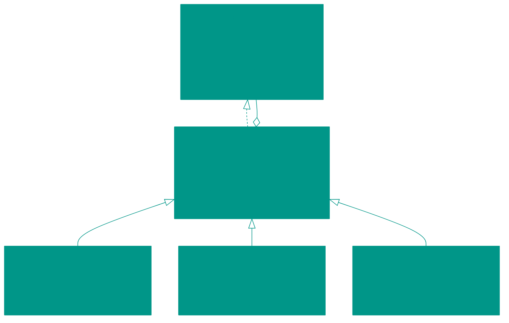
```mermaid
%%{init: { 'theme': 'base', 'themeVariables': { 'lineColor': '#009688', 'primaryColor': '#009688', 'primaryTextColor': '#009688', 'attributeBkg': '#009688', 'attributeTextColor': '#009688', 'signalColor': '#009688', 'actorLineColor': '#009688', 'nodeBorder': '#009688', 'clusterBorder': '#009688', 'textColor': '#009688', 'fontSize': '16px' } } }%%
classDiagram
    class Handler {
        <<interface>>
        +setNext(handler) Handler
        +handle(request) string
    }
    class AbstractHandler {
        -nextHandler: Handler
        +setNext(handler) Handler
        +handle(request) string
    }
    class ConcreteHandlerA {
        +handle(request) string
    }
    class ConcreteHandlerB {
        +handle(request) string
    }
    class ConcreteHandlerC {
        +handle(request) string
    }

    Handler <|.. AbstractHandler
    AbstractHandler <|-- ConcreteHandlerA
    AbstractHandler <|-- ConcreteHandlerB
    AbstractHandler <|-- ConcreteHandlerC
    AbstractHandler o-- Handler
```

**Сложность**:

| Метрика | Сложность |
|:---|:---:|
| Временная (при обработке запроса) | O(n), где n - количество обработчиков |
| Пространственная | O(n), где n - количество обработчиков |

---

## 💻 Реализация

```go
package chainofresponsibility

import "fmt"

// Handler интерфейс для обработчика
type Handler interface {
    SetNext(handler Handler) Handler
    Handle(request string) string
}

// AbstractHandler базовый обработчик
type AbstractHandler struct {
    nextHandler Handler
}

func (h *AbstractHandler) SetNext(handler Handler) Handler {
    h.nextHandler = handler
    return handler
}

func (h *AbstractHandler) Handle(request string) string {
    if h.nextHandler != nil {
        return h.nextHandler.Handle(request)
    }
    return ""
}

// ConcreteHandlerA конкретный обработчик A
type ConcreteHandlerA struct {
    *AbstractHandler
}

func NewConcreteHandlerA() *ConcreteHandlerA {
    return &ConcreteHandlerA{AbstractHandler: &AbstractHandler{}}
}

func (h *ConcreteHandlerA) Handle(request string) string {
    if request == "A" {
        return fmt.Sprintf("ConcreteHandlerA: I'll handle '%s'.\n", request)
    }
    return h.AbstractHandler.Handle(request)
}

// ConcreteHandlerB конкретный обработчик B
type ConcreteHandlerB struct {
    *AbstractHandler
}

func NewConcreteHandlerB() *ConcreteHandlerB {
    return &ConcreteHandlerB{AbstractHandler: &AbstractHandler{}}
}

func (h *ConcreteHandlerB) Handle(request string) string {
    if request == "B" {
        return fmt.Sprintf("ConcreteHandlerB: I'll handle '%s'.\n", request)
    }
    return h.AbstractHandler.Handle(request)
}

// ConcreteHandlerC конкретный обработчик C
type ConcreteHandlerC struct {
    *AbstractHandler
}

func NewConcreteHandlerC() *ConcreteHandlerC {
    return &ConcreteHandlerC{AbstractHandler: &AbstractHandler{}}
}

func (h *ConcreteHandlerC) Handle(request string) string {
    if request == "C" {
        return fmt.Sprintf("ConcreteHandlerC: I'll handle '%s'.\n", request)
    }
    return h.AbstractHandler.Handle(request)
}
```

```javascript
/**
 * Интерфейс Handler
 */
class Handler {
    setNext(handler) {
        throw new Error("Метод setNext() должен быть реализован");
    }
    
    handle(request) {
        throw new Error("Метод handle() должен быть реализован");
    }
}

/**
 * Базовый обработчик
 */
class AbstractHandler extends Handler {
    constructor() {
        super();
        this.nextHandler = null;
    }
    
    setNext(handler) {
        this.nextHandler = handler;
        return handler;
    }
    
    handle(request) {
        if (this.nextHandler) {
            return this.nextHandler.handle(request);
        }
        return null;
    }
}

/**
 * Конкретные обработчики
 */
class ConcreteHandlerA extends AbstractHandler {
    handle(request) {
        if (request === 'A') {
            return `ConcreteHandlerA: I'll handle '${request}'.\n`;
        }
        return super.handle(request);
    }
}

class ConcreteHandlerB extends AbstractHandler {
    handle(request) {
        if (request === 'B') {
            return `ConcreteHandlerB: I'll handle '${request}'.\n`;
        }
        return super.handle(request);
    }
}

class ConcreteHandlerC extends AbstractHandler {
    handle(request) {
        if (request === 'C') {
            return `ConcreteHandlerC: I'll handle '${request}'.\n`;
        }
        return super.handle(request);
    }
}

// Пример использования
const handlerA = new ConcreteHandlerA();
const handlerB = new ConcreteHandlerB();
const handlerC = new ConcreteHandlerC();

handlerA.setNext(handlerB).setNext(handlerC);

console.log(handlerA.handle('A'));
console.log(handlerA.handle('B'));
console.log(handlerA.handle('C'));
console.log(handlerA.handle('D')); // никто не обработает
```

---

### 📝 Command (Команда)

**Описание**:
Паттерн Command превращает запрос в самостоятельный объект, содержащий всю информацию о запросе. Это позволяет передавать запросы как аргументы методов, ставить их в очередь, логировать и отменять операции.

- **Проблема**: Необходимость параметризации объектов выполняемым действием, очередью команд или поддержкой отмены операций.
- **Решение**: Создать объект команды, который инкапсулирует всю информацию о выполнении операции.
- **Аналогия**: Официант в ресторане принимает заказ (команда) и передает его на кухню, где он будет выполнен.

#### Преимущества и недостатки

✅ **Плюсы**:
1. **Параметризация объектов**: Можно легко передавать команды как аргументы
2. **Очередь команд**: Можно ставить команды в очередь и выполнять их позже
3. **Поддержка отмены операций**: Легко реализовать функцию undo/redo

❌ **Минусы**:
1. **Увеличение количества классов**: Каждая команда требует отдельного класса
2. **Сложность для простых операций**: Может быть избыточным для простых случаев

**Когда использовать**: Когда нужно параметризовать объекты выполнением действий, ставить команды в очередь или поддерживать отмену операций.

---

**Визуализация**:

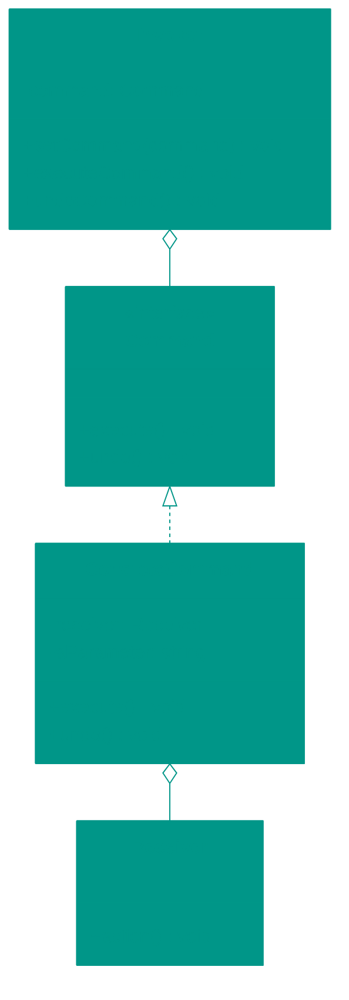
```mermaid
%%{init: { 'theme': 'base', 'themeVariables': { 'lineColor': '#009688', 'primaryColor': '#009688', 'primaryTextColor': '#009688', 'attributeBkg': '#009688', 'attributeTextColor': '#009688', 'signalColor': '#009688', 'actorLineColor': '#009688', 'nodeBorder': '#009688', 'clusterBorder': '#009688', 'textColor': '#009688', 'fontSize': '16px' } } }%%
classDiagram
    class Command {
        <<interface>>
        +execute() void
        +undo() void
    }
    class ConcreteCommand {
        -receiver: Receiver
        -aParameter: string
        +execute() void
        +undo() void
    }
    class Receiver {
        +action() void
    }
    class Invoker {
        -command: Command
        +setCommand(command) void
        +executeCommand() void
        +undoCommand() void
    }

    Command <|.. ConcreteCommand
    ConcreteCommand o-- Receiver
    Invoker o-- Command
```

**Сложность**:

| Метрика | Сложность |
|:---|:---:|
| Временная (при выполнении команды) | O(1) для вызова, O(n) для выполнения |
| Пространственная | O(1) для команды, O(n) для истории команд |

---

## 💻 Реализация

```go
package command

import "fmt"

// Command интерфейс для команды
type Command interface {
    Execute()
    Undo()
}

// Receiver получатель команды
type Receiver struct {
    state string
}

func (r *Receiver) On() {
    r.state = "on"
    fmt.Println("Receiver: Switch turned ON")
}

func (r *Receiver) Off() {
    r.state = "off"
    fmt.Println("Receiver: Switch turned OFF")
}

func (r *Receiver) GetState() string {
    return r.state
}

// ConcreteCommand конкретная команда включения
type TurnOnCommand struct {
    receiver *Receiver
}

func NewTurnOnCommand(receiver *Receiver) *TurnOnCommand {
    return &TurnOnCommand{receiver: receiver}
}

func (c *TurnOnCommand) Execute() {
    c.receiver.On()
}

func (c *TurnOnCommand) Undo() {
    c.receiver.Off()
}

// ConcreteCommand конкретная команда выключения
type TurnOffCommand struct {
    receiver *Receiver
}

func NewTurnOffCommand(receiver *Receiver) *TurnOffCommand {
    return &TurnOffCommand{receiver: receiver}
}

func (c *TurnOffCommand) Execute() {
    c.receiver.Off()
}

func (c *TurnOffCommand) Undo() {
    c.receiver.On()
}

// Invoker исполнитель команд
type Invoker struct {
    history []Command
}

func NewInvoker() *Invoker {
    return &Invoker{history: make([]Command, 0)}
}

func (i *Invoker) SetCommand(command Command) {
    i.history = append(i.history, command)
}

func (i *Invoker) ExecuteCommand() {
    if len(i.history) > 0 {
        command := i.history[len(i.history)-1]
        command.Execute()
    }
}

func (i *Invoker) UndoCommand() {
    if len(i.history) > 0 {
        command := i.history[len(i.history)-1]
        command.Undo()
        i.history = i.history[:len(i.history)-1] // удалить последнюю команду из истории
    }
}
```

```javascript
/**
 * Интерфейс Command
 */
class Command {
    execute() {
        throw new Error("Метод execute() должен быть реализован");
    }
    
    undo() {
        throw new Error("Метод undo() должен быть реализован");
    }
}

/**
 * Получатель команды
 */
class Receiver {
    constructor() {
        this.state = "";
    }
    
    on() {
        this.state = "on";
        console.log("Receiver: Switch turned ON");
    }
    
    off() {
        this.state = "off";
        console.log("Receiver: Switch turned OFF");
    }
    
    getState() {
        return this.state;
    }
}

/**
 * Конкретные команды
 */
class TurnOnCommand extends Command {
    constructor(receiver) {
        super();
        this.receiver = receiver;
    }
    
    execute() {
        this.receiver.on();
    }
    
    undo() {
        this.receiver.off();
    }
}

class TurnOffCommand extends Command {
    constructor(receiver) {
        super();
        this.receiver = receiver;
    }
    
    execute() {
        this.receiver.off();
    }
    
    undo() {
        this.receiver.on();
    }
}

/**
 * Исполнитель команд
 */
class Invoker {
    constructor() {
        this.history = [];
    }
    
    setCommand(command) {
        this.history.push(command);
    }
    
    executeCommand() {
        if (this.history.length > 0) {
            const command = this.history[this.history.length - 1];
            command.execute();
        }
    }
    
    undoCommand() {
        if (this.history.length > 0) {
            const command = this.history[this.history.length - 1];
            command.undo();
            this.history.pop(); // удалить последнюю команду из истории
        }
    }
}

// Пример использования
const receiver = new Receiver();
const turnOnCommand = new TurnOnCommand(receiver);
const turnOffCommand = new TurnOffCommand(receiver);

const invoker = new Invoker();
invoker.setCommand(turnOnCommand);
invoker.executeCommand(); // Receiver: Switch turned ON
invoker.undoCommand();    // Receiver: Switch turned OFF

invoker.setCommand(turnOffCommand);
invoker.executeCommand(); // Receiver: Switch turned OFF
invoker.undoCommand();    // Receiver: Switch turned ON
```

---

### 🧮 Interpreter (Интерпретатор)

**Описание**:
Паттерн Interpreter определяет представление языка и обеспечивает интерпретацию предложений этого языка. Он используется для определения грамматики языка и создания интерпретатора для предложений этого языка.

- **Проблема**: Необходимость интерпретации выражений на некотором языке или выполнения операций в соответствии с определенной грамматикой.
- **Решение**: Создать классы для каждого символа грамматики и использовать их для построения абстрактного синтаксического дерева.
- **Аналогия**: Представьте калькулятор - он интерпретирует математические выражения, такие как "2 + 3 * 4".

#### Преимущества и недостатки

✅ **Плюсы**:
1. **Гибкость**: Легко изменять и расширять грамматику
2. **Простота реализации**: Прямое соответствие между грамматикой и классами
3. **Понятность**: Код отражает структуру грамматики

❌ **Минусы**:
1. **Сложность для сложных грамматик**: Может быть неэффективным для сложных языков
2. **Увеличение количества классов**: Каждое правило грамматики требует отдельного класса

**Когда использовать**: Когда язык достаточно прост, или когда эффективность не является критическим фактором, или когда грамматика несложная.

---

**Визуализация**:

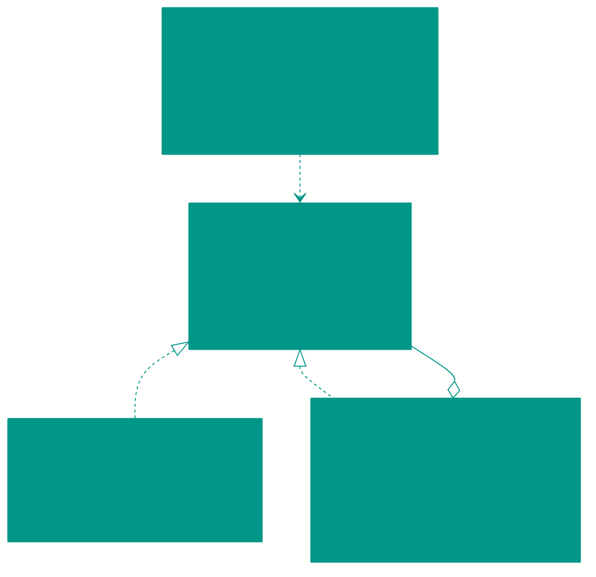
```mermaid
%%{init: { 'theme': 'base', 'themeVariables': { 'lineColor': '#009688', 'primaryColor': '#009688', 'primaryTextColor': '#009688', 'attributeBkg': '#009688', 'attributeTextColor': '#009688', 'signalColor': '#009688', 'actorLineColor': '#009688', 'nodeBorder': '#009688', 'clusterBorder': '#009688', 'textColor': '#009688', 'fontSize': '16px' } } }%%
classDiagram
    class Expression {
        <<interface>>
        +interpret(context) int
    }
    class TerminalExpression {
        +interpret(context) int
    }
    class NonTerminalExpression {
        -left: Expression
        -right: Expression
        +interpret(context) int
    }
    class Context {
        +getVariable(name) int
        +setVariable(name, value) void
    }

    Expression <|.. TerminalExpression
    Expression <|.. NonTerminalExpression
    NonTerminalExpression o-- Expression
    Context ..> Expression
```

**Сложность**:

| Метрика | Сложность |
|:---|:---:|
| Временная (при интерпретации) | O(n), где n - глубина дерева |
| Пространственная | O(n), где n - количество узлов в дереве |

---

## 💻 Реализация

```go
package interpreter

import (
    "strconv"
    "strings"
)

// Context контекст для переменных
type Context struct {
    variables map[string]int
}

func NewContext() *Context {
    return &Context{variables: make(map[string]int)}
}

func (c *Context) GetVariable(name string) int {
    return c.variables[name]
}

func (c *Context) SetVariable(name string, value int) {
    c.variables[name] = value
}

// Expression интерфейс для выражения
type Expression interface {
    Interpret(context *Context) int
}

// NumberExpression терминальное выражение для чисел
type NumberExpression struct {
    value int
}

func NewNumberExpression(value int) *NumberExpression {
    return &NumberExpression{value: value}
}

func (e *NumberExpression) Interpret(context *Context) int {
    return e.value
}

// VariableExpression терминальное выражение для переменных
type VariableExpression struct {
    name string
}

func NewVariableExpression(name string) *VariableExpression {
    return &VariableExpression{name: name}
}

func (e *VariableExpression) Interpret(context *Context) int {
    return context.GetVariable(e.name)
}

// AddExpression нетерминальное выражение для сложения
type AddExpression struct {
    left, right Expression
}

func NewAddExpression(left, right Expression) *AddExpression {
    return &AddExpression{left: left, right: right}
}

func (e *AddExpression) Interpret(context *Context) int {
    return e.left.Interpret(context) + e.right.Interpret(context)
}

// SubtractExpression нетерминальное выражение для вычитания
type SubtractExpression struct {
    left, right Expression
}

func NewSubtractExpression(left, right Expression) *SubtractExpression {
    return &SubtractExpression{left: left, right: right}
}

func (e *SubtractExpression) Interpret(context *Context) int {
    return e.left.Interpret(context) - e.right.Interpret(context)
}

// Parser простой парсер для арифметических выражений
func ParseExpression(expression string, context *Context) Expression {
    tokens := strings.Split(expression, " ")
    
    // Простой парсер для выражений вида "a + b" или "5 + 3"
    if len(tokens) == 3 {
        var left, right Expression
        
        // Парсим левую часть
        if val, err := strconv.Atoi(tokens[0]); err == nil {
            left = NewNumberExpression(val)
        } else {
            left = NewVariableExpression(tokens[0])
        }
        
        // Парсим правую часть
        if val, err := strconv.Atoi(tokens[2]); err == nil {
            right = NewNumberExpression(val)
        } else {
            right = NewVariableExpression(tokens[2])
        }
        
        // Определяем операцию
        switch tokens[1] {
        case "+":
            return NewAddExpression(left, right)
        case "-":
            return NewSubtractExpression(left, right)
        }
    }
    
    return nil
}
```

```javascript
/**
 * Контекст для переменных
 */
class Context {
    constructor() {
        this.variables = new Map();
    }
    
    getVariable(name) {
        return this.variables.get(name) || 0;
    }
    
    setVariable(name, value) {
        this.variables.set(name, value);
    }
}

/**
 * Интерфейс Expression
 */
class Expression {
    interpret(context) {
        throw new Error("Метод interpret() должен быть реализован");
    }
}

/**
 * Терминальные выражения
 */
class NumberExpression extends Expression {
    constructor(value) {
        super();
        this.value = value;
    }
    
    interpret(context) {
        return this.value;
    }
}

class VariableExpression extends Expression {
    constructor(name) {
        super();
        this.name = name;
    }
    
    interpret(context) {
        return context.getVariable(this.name);
    }
}

/**
 * Нетерминальные выражения
 */
class AddExpression extends Expression {
    constructor(left, right) {
        super();
        this.left = left;
        this.right = right;
    }
    
    interpret(context) {
        return this.left.interpret(context) + this.right.interpret(context);
    }
}

class SubtractExpression extends Expression {
    constructor(left, right) {
        super();
        this.left = left;
        this.right = right;
    }
    
    interpret(context) {
        return this.left.interpret(context) - this.right.interpret(context);
    }
}

/**
 * Простой парсер для арифметических выражений
 */
function parseExpression(expression, context) {
    const tokens = expression.split(' ');
    
    // Простой парсер для выражений вида "a + b" или "5 + 3"
    if (tokens.length === 3) {
        let left, right;
        
        // Парсим левую часть
        const leftVal = parseInt(tokens[0]);
        if (isNaN(leftVal)) {
            left = new VariableExpression(tokens[0]);
        } else {
            left = new NumberExpression(leftVal);
        }
        
        // Парсим правую часть
        const rightVal = parseInt(tokens[2]);
        if (isNaN(rightVal)) {
            right = new VariableExpression(tokens[2]);
        } else {
            right = new NumberExpression(rightVal);
        }
        
        // Определяем операцию
        switch (tokens[1]) {
            case '+':
                return new AddExpression(left, right);
            case '-':
                return new SubtractExpression(left, right);
        }
    }
    
    return null;
}

// Пример использования
const context = new Context();
context.setVariable('x', 10);
context.setVariable('y', 5);

// Создаем выражение: x + y
const expr1 = new AddExpression(
    new VariableExpression('x'),
    new VariableExpression('y')
);
console.log(expr1.interpret(context)); // 15

// Создаем выражение: 10 - 5
const expr2 = new SubtractExpression(
    new NumberExpression(10),
    new NumberExpression(5)
);
console.log(expr2.interpret(context)); // 5

// Используем парсер
const expr3 = parseExpression('x + 7', context);
console.log(expr3.interpret(context)); // 17
```

---

### ↪️ Iterator (Итератор)

**Описание**:
Паттерн Iterator предоставляет способ последовательного доступа к элементам составного объекта без раскрытия его внутреннего представления. Он позволяет обходить элементы коллекции без знания о внутренней структуре коллекции.

- **Проблема**: Необходимость последовательного доступа к элементам составного объекта без раскрытия его внутренней структуры.
- **Решение**: Создать интерфейс итератора, который предоставляет методы для обхода элементов коллекции.
- **Аналогия**: Представьте чтение книги - вы можете читать страницу за страницей, не зная, как именно хранятся данные в книге (бумага, электронный формат и т.д.).

#### Преимущества и недостатки

✅ **Плюсы**:
1. **Единый интерфейс**: Одинаковый способ обхода различных коллекций
2. **Сокрытие структуры**: Внутренняя структура коллекции скрыта от клиента
3. **Гибкость**: Можно реализовать различные стратегии обхода

❌ **Минусы**:
1. **Накладные расходы**: Может быть менее эффективным, чем прямой доступ к элементам
2. **Сложность для простых коллекций**: Может быть избыточным для простых структур данных

**Когда использовать**: Когда нужно предоставить стандартный способ обхода элементов коллекции или когда нужно скрыть внутреннюю структуру коллекции.

---

**Визуализация**:

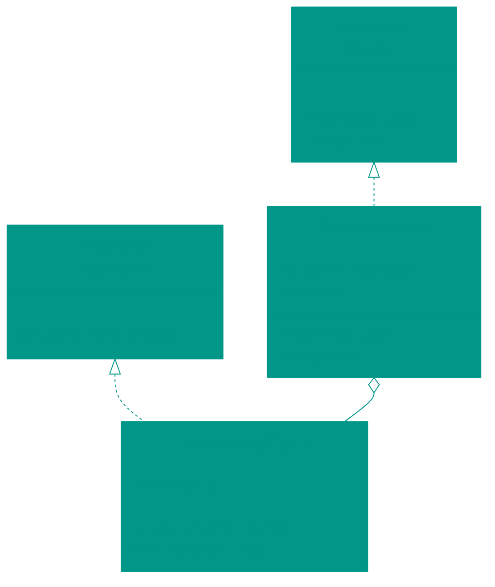
```mermaid
%%{init: { 'theme': 'base', 'themeVariables': { 'lineColor': '#009688', 'primaryColor': '#009688', 'primaryTextColor': '#009688', 'attributeBkg': '#009688', 'attributeTextColor': '#009688', 'signalColor': '#009688', 'actorLineColor': '#009688', 'nodeBorder': '#009688', 'clusterBorder': '#009688', 'textColor': '#009688', 'fontSize': '16px' } } }%%
classDiagram
    class Iterator {
        <<interface>>
        +hasNext() bool
        +next() Item
    }
    class ConcreteIterator {
        -collection: Aggregate
        -position: int
        +hasNext() bool
        +next() Item
    }
    class Aggregate {
        <<interface>>
        +createIterator() Iterator
    }
    class ConcreteAggregate {
        -items: Item[]
        +createIterator() Iterator
        +addItem(item) void
    }

    Iterator <|.. ConcreteIterator
    Aggregate <|.. ConcreteAggregate
    ConcreteIterator o-- ConcreteAggregate
```

**Сложность**:

| Метрика | Сложность |
|:---|:---:|
| Временная (при доступе к элементу) | O(1) |
| Пространственная | O(1) для итератора |

---

## 💻 Реализация

```go
package iterator

// Iterator интерфейс для итератора
type Iterator interface {
    HasNext() bool
    Next() interface{}
}

// Aggregate интерфейс для агрегата
type Aggregate interface {
    CreateIterator() Iterator
}

// ConcreteAggregate конкретная реализация агрегата
type ConcreteAggregate struct {
    items []interface{}
}

func NewConcreteAggregate() *ConcreteAggregate {
    return &ConcreteAggregate{items: make([]interface{}, 0)}
}

func (a *ConcreteAggregate) AddItem(item interface{}) {
    a.items = append(a.items, item)
}

func (a *ConcreteAggregate) CreateIterator() Iterator {
    return NewConcreteIterator(a)
}

// ConcreteIterator конкретная реализация итератора
type ConcreteIterator struct {
    aggregate  *ConcreteAggregate
    position   int
}

func NewConcreteIterator(aggregate *ConcreteAggregate) *ConcreteIterator {
    return &ConcreteIterator{aggregate: aggregate, position: 0}
}

func (i *ConcreteIterator) HasNext() bool {
    return i.position < len(i.aggregate.items)
}

func (i *ConcreteIterator) Next() interface{} {
    if i.HasNext() {
        item := i.aggregate.items[i.position]
        i.position++
        return item
    }
    return nil
}

// ReverseIterator итератор в обратном порядке
type ReverseIterator struct {
    aggregate *ConcreteAggregate
    position  int
}

func NewReverseIterator(aggregate *ConcreteAggregate) *ReverseIterator {
    return &ReverseIterator{
        aggregate: aggregate,
        position:  len(aggregate.items) - 1,
    }
}

func (i *ReverseIterator) HasNext() bool {
    return i.position >= 0
}

func (i *ReverseIterator) Next() interface{} {
    if i.HasNext() {
        item := i.aggregate.items[i.position]
        i.position--
        return item
    }
    return nil
}
```

```javascript
/**
 * Интерфейс Iterator
 */
class Iterator {
    hasNext() {
        throw new Error("Метод hasNext() должен быть реализован");
    }
    
    next() {
        throw new Error("Метод next() должен быть реализован");
    }
}

/**
 * Интерфейс Aggregate
 */
class Aggregate {
    createIterator() {
        throw new Error("Метод createIterator() должен быть реализован");
    }
}

/**
 * Конкретная реализация агрегата
 */
class ConcreteAggregate extends Aggregate {
    constructor() {
        super();
        this.items = [];
    }
    
    addItem(item) {
        this.items.push(item);
    }
    
    createIterator() {
        return new ConcreteIterator(this);
    }
    
    createReverseIterator() {
        return new ReverseIterator(this);
    }
}

/**
 * Конкретная реализация итератора
 */
class ConcreteIterator extends Iterator {
    constructor(aggregate) {
        super();
        this.aggregate = aggregate;
        this.position = 0;
    }
    
    hasNext() {
        return this.position < this.aggregate.items.length;
    }
    
    next() {
        if (this.hasNext()) {
            const item = this.aggregate.items[this.position];
            this.position++;
            return item;
        }
        return null;
    }
}

/**
 * Итератор в обратном порядке
 */
class ReverseIterator extends Iterator {
    constructor(aggregate) {
        super();
        this.aggregate = aggregate;
        this.position = aggregate.items.length - 1;
    }
    
    hasNext() {
        return this.position >= 0;
    }
    
    next() {
        if (this.hasNext()) {
            const item = this.aggregate.items[this.position];
            this.position--;
            return item;
        }
        return null;
    }
}

// Пример использования
const aggregate = new ConcreteAggregate();
aggregate.addItem("First");
aggregate.addItem("Second");
aggregate.addItem("Third");

const iterator = aggregate.createIterator();
while (iterator.hasNext()) {
    console.log(iterator.next());
}

console.log("Reverse iteration:");
const reverseIterator = aggregate.createReverseIterator();
while (reverseIterator.hasNext()) {
    console.log(reverseIterator.next());
}
```

---

### 🤝 Mediator (Посредник)

**Описание**:
Паттерн Mediator определяет объект, который инкапсулирует способ взаимодействия множества объектов. Посредник обеспечивает слабую связанность системы, избавляя объекты от необходимости явно ссылаться друг на друга, и позволяет изменять их взаимодействие независимо.

- **Проблема**: Сильная связанность между объектами, когда каждый объект знает о других и напрямую с ними взаимодействует.
- **Решение**: Создать посредника, который управляет взаимодействием между объектами.
- **Аналогия**: Диспетчер аэропорта координирует взлет и посадку самолетов, вместо того чтобы самолеты напрямую общались друг с другом.

#### Преимущества и недостатки

✅ **Плюсы**:
1. **Слабая связанность**: Объекты не зависят друг от друга напрямую
2. **Централизованное управление**: Взаимодействие сосредоточено в одном месте
3. **Легкость изменения взаимодействия**: Можно легко изменить логику взаимодействия

❌ **Минусы**:
1. **Централизация**: Посредник может стать "узким местом" системы
2. **Сложность**: Посредник может стать слишком сложным

**Когда использовать**: Когда сложно изменять взаимодействие между несколькими классами без изменения этих классов, или когда взаимодействие между объектами становится слишком сложным.

---

**Визуализация**:

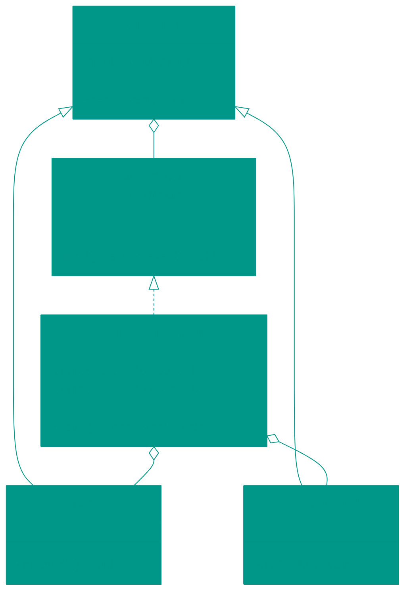
```mermaid
%%{init: { 'theme': 'base', 'themeVariables': { 'lineColor': '#009688', 'primaryColor': '#009688', 'primaryTextColor': '#009688', 'attributeBkg': '#009688', 'attributeTextColor': '#009688', 'signalColor': '#009688', 'actorLineColor': '#009688', 'nodeBorder': '#009688', 'clusterBorder': '#009688', 'textColor': '#009688', 'fontSize': '16px' } } }%%
classDiagram
    class Mediator {
        <<interface>>
        +notify(sender, event) void
    }
    class ConcreteMediator {
        -component1: Component1
        -component2: Component2
        +notify(sender, event) void
    }
    class Component {
        -mediator: Mediator
        +send(event) void
    }
    class Component1 {
        +method1() void
    }
    class Component2 {
        +method2() void
    }

    Mediator <|.. ConcreteMediator
    Component o-- Mediator
    Component <|-- Component1
    Component <|-- Component2
    ConcreteMediator o-- Component1
    ConcreteMediator o-- Component2
```

**Сложность**:

| Метрика | Сложность |
|:---|:---:|
| Временная (при уведомлении) | O(1) |
| Пространственная | O(n), где n - количество компонентов |

---

## 💻 Реализация

```go
package mediator

import "fmt"

// Mediator интерфейс для посредника
type Mediator interface {
    Notify(sender Component, event string)
}

// Component базовый компонент
type Component interface {
    SetMediator(mediator Mediator)
    Send(event string)
}

// BaseComponent базовая реализация компонента
type BaseComponent struct {
    mediator Mediator
}

func (c *BaseComponent) SetMediator(mediator Mediator) {
    c.mediator = mediator
}

func (c *BaseComponent) Send(event string) {
    if c.mediator != nil {
        c.mediator.Notify(c, event)
    }
}

// Component1 конкретный компонент 1
type Component1 struct {
    *BaseComponent
    state string
}

func NewComponent1() *Component1 {
    return &Component1{
        BaseComponent: &BaseComponent{},
        state:         "Component1 initial state",
    }
}

func (c *Component1) Method1() {
    c.state = "Component1 changed state"
    fmt.Printf("Component1: Changed state to '%s'\n", c.state)
    c.Send("event1")
}

// Component2 конкретный компонент 2
type Component2 struct {
    *BaseComponent
    state string
}

func NewComponent2() *Component2 {
    return &Component2{
        BaseComponent: &BaseComponent{},
        state:         "Component2 initial state",
    }
}

func (c *Component2) Method2() {
    c.state = "Component2 changed state"
    fmt.Printf("Component2: Changed state to '%s'\n", c.state)
    c.Send("event2")
}

// ConcreteMediator конкретный посредник
type ConcreteMediator struct {
    component1 *Component1
    component2 *Component2
}

func NewConcreteMediator(c1 *Component1, c2 *Component2) *ConcreteMediator {
    mediator := &ConcreteMediator{component1: c1, component2: c2}
    
    c1.SetMediator(mediator)
    c2.SetMediator(mediator)
    
    return mediator
}

func (m *ConcreteMediator) Notify(sender Component, event string) {
    switch event {
    case "event1":
        fmt.Println("Mediator reacts on event1 and triggers following operations:")
        m.component2.Method2()
    case "event2":
        fmt.Println("Mediator reacts on event2 and triggers following operations:")
        m.component1.Method1()
        m.component2.Method2()
    }
}
```

```javascript
/**
 * Интерфейс Mediator
 */
class Mediator {
    notify(sender, event) {
        throw new Error("Метод notify() должен быть реализован");
    }
}

/**
 * Базовый компонент
 */
class Component {
    constructor() {
        this.mediator = null;
    }
    
    setMediator(mediator) {
        this.mediator = mediator;
    }
    
    send(event) {
        if (this.mediator) {
            this.mediator.notify(this, event);
        }
    }
}

/**
 * Конкретные компоненты
 */
class Component1 extends Component {
    constructor() {
        super();
        this.state = "Component1 initial state";
    }
    
    method1() {
        this.state = "Component1 changed state";
        console.log(`Component1: Changed state to '${this.state}'`);
        this.send("event1");
    }
}

class Component2 extends Component {
    constructor() {
        super();
        this.state = "Component2 initial state";
    }
    
    method2() {
        this.state = "Component2 changed state";
        console.log(`Component2: Changed state to '${this.state}'`);
        this.send("event2");
    }
}

/**
 * Конкретный посредник
 */
class ConcreteMediator extends Mediator {
    constructor(c1, c2) {
        super();
        this.component1 = c1;
        this.component2 = c2;
        
        c1.setMediator(this);
        c2.setMediator(this);
    }
    
    notify(sender, event) {
        switch (event) {
            case "event1":
                console.log("Mediator reacts on event1 and triggers following operations:");
                this.component2.method2();
                break;
            case "event2":
                console.log("Mediator reacts on event2 and triggers following operations:");
                this.component1.method1();
                this.component2.method2();
                break;
        }
    }
}

// Пример использования
const component1 = new Component1();
const component2 = new Component2();
const mediator = new ConcreteMediator(component1, component2);

component1.method1();
console.log("---");
component2.method2();
```

---

### 🧠 Memento (Хранитель)

**Описание**:
Паттерн Memento позволяет сохранять и восстанавливать прошлые состояния объекта без раскрытия деталей его реализации. Он позволяет создавать снимки состояния объекта и восстанавливать его в случае необходимости.

- **Проблема**: Необходимость сохранения и восстановления состояния объекта, особенно для реализации функции отмены (undo).
- **Решение**: Создать объект-хранитель (memento), который хранит состояние оригинального объекта.
- **Аналогия**: Сохранение игры - вы можете сохранить текущее состояние и вернуться к нему позже, не зная внутренней структуры игры.

#### Преимущества и недостатки

✅ **Плюсы**:
1. **Сохранение состояния**: Возможность сохранять и восстанавливать состояние объекта
2. **Сокрытие реализации**: Внутреннее состояние объекта скрыто от других объектов
3. **Реализация undo/redo**: Легко реализовать функции отмены и повтора действий

❌ **Минусы**:
1. **Потребление памяти**: Сохранение большого количества снимков может потреблять много памяти
2. **Сложность управления**: Управление снимками может быть сложным

**Когда использовать**: Когда нужно сохранять снимки состояния объекта для возможного восстановления, или когда прямой доступ к состоянию нарушает инкапсуляцию.

---

**Визуализация**:

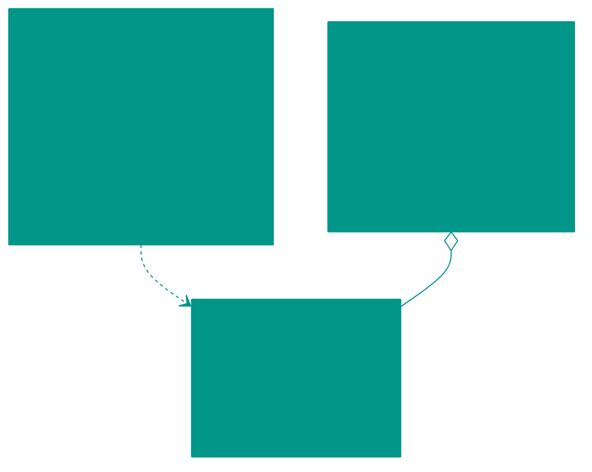
```mermaid
%%{init: { 'theme': 'base', 'themeVariables': { 'lineColor': '#009688', 'primaryColor': '#009688', 'primaryTextColor': '#009688', 'attributeBkg': '#009688', 'attributeTextColor': '#009688', 'signalColor': '#009688', 'actorLineColor': '#009688', 'nodeBorder': '#009688', 'clusterBorder': '#009688', 'textColor': '#009688', 'fontSize': '16px' } } }%%
classDiagram
    class Originator {
        -state: string
        +setState(state) void
        +getState() string
        +save() Memento
        +restore(memento) void
    }
    class Memento {
        -state: string
        +getState() string
    }
    class Caretaker {
        -mementos: Memento[]
        +backup() void
        +undo() void
        +showHistory() void
    }

    Originator ..> Memento
    Caretaker o-- Memento
```

**Сложность**:

| Метрика | Сложность |
|:---|:---:|
| Временная (при сохранении/восстановлении) | O(1) |
| Пространственная | O(n), где n - количество сохраненных состояний |

---

## 💻 Реализация

```go
package memento

import (
    "fmt"
    "time"
)

// Memento объект-хранитель
type Memento struct {
    state     string
    timestamp time.Time
}

func NewMemento(state string) *Memento {
    return &Memento{
        state:     state,
        timestamp: time.Now(),
    }
}

func (m *Memento) GetState() string {
    return m.state
}

func (m *Memento) GetTimestamp() time.Time {
    return m.timestamp
}

// Originator объект, состояние которого нужно сохранять
type Originator struct {
    state string
}

func NewOriginator(state string) *Originator {
    return &Originator{state: state}
}

func (o *Originator) SetState(state string) {
    fmt.Printf("Originator: Setting state to %s\n", state)
    o.state = state
}

func (o *Originator) GetState() string {
    return o.state
}

func (o *Originator) Save() *Memento {
    fmt.Printf("Originator: Saving to Memento: %s\n", o.state)
    return NewMemento(o.state)
}

func (o *Originator) Restore(memento *Memento) {
    o.state = memento.GetState()
    fmt.Printf("Originator: Restored state to: %s\n", o.state)
}

// Caretaker опекун, который управляет снимками
type Caretaker struct {
    mementos []*Memento
    originator *Originator
}

func NewCaretaker(originator *Originator) *Caretaker {
    return &Caretaker{
        mementos: make([]*Memento, 0),
        originator: originator,
    }
}

func (c *Caretaker) Backup() {
    fmt.Println("\nCaretaker: Saving Originator's state...")
    c.mementos = append(c.mementos, c.originator.Save())
}

func (c *Caretaker) Undo() {
    if len(c.mementos) == 0 {
        return
    }
    
    memento := c.mementos[len(c.mementos)-1]
    c.mementos = c.mementos[:len(c.mementos)-1]
    
    fmt.Println("Caretaker: Restoring state to:", memento.GetState())
    c.originator.Restore(memento)
}

func (c *Caretaker) ShowHistory() {
    fmt.Println("Caretaker: Here's the list of mementos:")
    for _, memento := range c.mementos {
        fmt.Printf("State: %s | Time: %s\n", memento.GetState(), memento.GetTimestamp().Format("15:04:05"))
    }
}
```

```javascript
/**
 * Объект-хранитель
 */
class Memento {
    constructor(state) {
        this.state = state;
        this.timestamp = new Date();
    }
    
    getState() {
        return this.state;
    }
    
    getTimestamp() {
        return this.timestamp;
    }
}

/**
 * Объект, состояние которого нужно сохранять
 */
class Originator {
    constructor(state) {
        this.state = state;
    }
    
    setState(state) {
        console.log(`Originator: Setting state to ${state}`);
        this.state = state;
    }
    
    getState() {
        return this.state;
    }
    
    save() {
        console.log(`Originator: Saving to Memento: ${this.state}`);
        return new Memento(this.state);
    }
    
    restore(memento) {
        this.state = memento.getState();
        console.log(`Originator: Restored state to: ${this.state}`);
    }
}

/**
 * Опекун, который управляет снимками
 */
class Caretaker {
    constructor(originator) {
        this.mementos = [];
        this.originator = originator;
    }
    
    backup() {
        console.log("\nCaretaker: Saving Originator's state...");
        this.mementos.push(this.originator.save());
    }
    
    undo() {
        if (this.mementos.length === 0) {
            return;
        }
        
        const memento = this.mementos.pop();
        console.log(`Caretaker: Restoring state to: ${memento.getState()}`);
        this.originator.restore(memento);
    }
    
    showHistory() {
        console.log("Caretaker: Here's the list of mementos:");
        for (const memento of this.mementos) {
            console.log(`State: ${memento.getState()} | Time: ${memento.getTimestamp().toLocaleTimeString()}`);
        }
    }
}

// Пример использования
const originator = new Originator("Initial state");
const caretaker = new Caretaker(originator);

caretaker.backup();
originator.setState("First state");

caretaker.backup();
originator.setState("Second state");

caretaker.backup();
originator.setState("Third state");

caretaker.showHistory();

console.log("\nRolling back to previous state...");
caretaker.undo();

console.log("\nRolling back to previous state...");
caretaker.undo();

console.log("\nRolling back to previous state...");
caretaker.undo();
```

---

### 👁️ Observer (Наблюдатель)

**Описание**:
Паттерн Observer определяет зависимость "один ко многим" между объектами, так что при изменении состояния одного объекта все зависящие от него объекты уведомляются и обновляются автоматически. Это позволяет объектам оставаться слабо связанными.

- **Проблема**: Необходимость уведомления нескольких объектов об изменениях в другом объекте без жесткой зависимости между ними.
- **Решение**: Создать механизм подписки, при котором объекты могут подписываться на события другого объекта.
- **Аналогия**: Подписка на YouTube - когда канал публикует новое видео, все подписчики получают уведомление.

#### Преимущества и недостатки

✅ **Плюсы**:
1. **Слабая связанность**: Подписчики не зависят от издателя и наоборот
2. **Динамическая подписка**: Можно подписываться и отписываться во время выполнения
3. **Реализация широковещательной передачи**: Один объект может уведомлять множество других

❌ **Минусы**:
1. **Сложность отслеживания**: Сложно отследить причинно-следственные связи
2. **Неэффективность**: Уведомление всех подписчиков может быть неэффективным
3. **Потенциальные утечки памяти**: Если не отписаться, могут возникнуть утечки памяти

**Когда использовать**: Когда изменение одного объекта требует изменения других, и при этом важно, чтобы объекты оставались слабо связанными.

---

**Визуализация**:

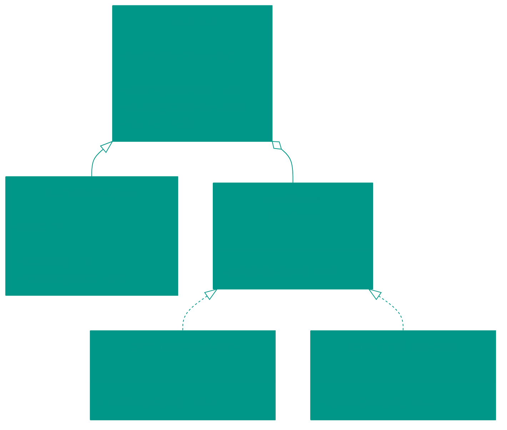
```mermaid
%%{init: { 'theme': 'base', 'themeVariables': { 'lineColor': '#009688', 'primaryColor': '#009688', 'primaryTextColor': '#009688', 'attributeBkg': '#009688', 'attributeTextColor': '#009688', 'signalColor': '#009688', 'actorLineColor': '#009688', 'nodeBorder': '#009688', 'clusterBorder': '#009688', 'textColor': '#009688', 'fontSize': '16px' } } }%%
classDiagram
    class Subject {
        -observers: Observer[]
        +attach(observer) void
        +detach(observer) void
        +notify() void
    }
    class ConcreteSubject {
        -state: int
        +getState() int
        +setState(state) void
    }
    class Observer {
        <<interface>>
        +update(subject) void
    }
    class ConcreteObserverA {
        +update(subject) void
    }
    class ConcreteObserverB {
        +update(subject) void
    }

    Subject <|-- ConcreteSubject
    Observer <|.. ConcreteObserverA
    Observer <|.. ConcreteObserverB
    Subject o-- Observer
```

**Сложность**:

| Метрика | Сложность |
|:---|:---:|
| Временная (при уведомлении) | O(n), где n - количество наблюдателей |
| Пространственная | O(n), где n - количество наблюдателей |

---

## 💻 Реализация

```go
package observer

import "fmt"

// Observer интерфейс для наблюдателя
type Observer interface {
    Update(subject Subject)
}

// Subject интерфейс для субъекта
type Subject interface {
    Attach(observer Observer)
    Detach(observer Observer)
    Notify()
}

// NewsAgency издатель новостей
type NewsAgency struct {
    observers []Observer
    news      string
}

func NewNewsAgency() *NewsAgency {
    return &NewsAgency{
        observers: make([]Observer, 0),
    }
}

func (na *NewsAgency) Attach(observer Observer) {
    na.observers = append(na.observers, observer)
}

func (na *NewsAgency) Detach(observer Observer) {
    for i, obs := range na.observers {
        if obs == observer {
            na.observers = append(na.observers[:i], na.observers[i+1:]...)
            break
        }
    }
}

func (na *NewsAgency) Notify() {
    for _, observer := range na.observers {
        observer.Update(na)
    }
}

func (na *NewsAgency) SetNews(news string) {
    na.news = news
    fmt.Printf("NewsAgency: Breaking news: %s\n", news)
    na.Notify()
}

func (na *NewsAgency) GetNews() string {
    return na.news
}

// NewsChannel канал новостей (наблюдатель)
type NewsChannel struct {
    name string
}

func NewNewsChannel(name string) *NewsChannel {
    return &NewsChannel{name: name}
}

func (nc *NewsChannel) Update(subject Subject) {
    if agency, ok := subject.(*NewsAgency); ok {
        fmt.Printf("NewsChannel %s: Received news - %s\n", nc.name, agency.GetNews())
    }
}

// SocialMedia социальная сеть (наблюдатель)
type SocialMedia struct {
    name string
}

func NewSocialMedia(name string) *SocialMedia {
    return &SocialMedia{name: name}
}

func (sm *SocialMedia) Update(subject Subject) {
    if agency, ok := subject.(*NewsAgency); ok {
        fmt.Printf("SocialMedia %s: Sharing news - %s\n", sm.name, agency.GetNews())
    }
}
```

```javascript
/**
 * Интерфейс Observer
 */
class Observer {
    update(subject) {
        throw new Error("Метод update() должен быть реализован");
    }
}

/**
 * Интерфейс Subject
 */
class Subject {
    constructor() {
        this.observers = [];
    }
    
    attach(observer) {
        this.observers.push(observer);
    }
    
    detach(observer) {
        const index = this.observers.indexOf(observer);
        if (index !== -1) {
            this.observers.splice(index, 1);
        }
    }
    
    notify() {
        for (const observer of this.observers) {
            observer.update(this);
        }
    }
}

/**
 * Издатель новостей
 */
class NewsAgency extends Subject {
    constructor() {
        super();
        this.news = "";
    }
    
    setNews(news) {
        this.news = news;
        console.log(`NewsAgency: Breaking news: ${news}`);
        this.notify();
    }
    
    getNews() {
        return this.news;
    }
}

/**
 * Канал новостей (наблюдатель)
 */
class NewsChannel extends Observer {
    constructor(name) {
        super();
        this.name = name;
    }
    
    update(subject) {
        if (subject instanceof NewsAgency) {
            console.log(`NewsChannel ${this.name}: Received news - ${subject.getNews()}`);
        }
    }
}

/**
 * Социальная сеть (наблюдатель)
 */
class SocialMedia extends Observer {
    constructor(name) {
        super();
        this.name = name;
    }
    
    update(subject) {
        if (subject instanceof NewsAgency) {
            console.log(`SocialMedia ${this.name}: Sharing news - ${subject.getNews()}`);
        }
    }
}

// Пример использования
const newsAgency = new NewsAgency();

const cnn = new NewsChannel("CNN");
const bbc = new NewsChannel("BBC");
const twitter = new SocialMedia("Twitter");

newsAgency.attach(cnn);
newsAgency.attach(bbc);
newsAgency.attach(twitter);

newsAgency.setNews("Global warming reached critical level!");

newsAgency.detach(bbc);
newsAgency.setNews("New technology breakthrough announced!");
```

---

### 🧭 State (Состояние)

**Описание**:
Паттерн State позволяет объекту изменять свое поведение при изменении внутреннего состояния. При этом объект будет казаться другим классом. Он позволяет объекту изменять свое поведение во время выполнения, когда изменяется его внутреннее состояние.

- **Проблема**: Большое количество условных операторов, зависящих от текущего состояния объекта, что делает код сложным и трудным для поддержки.
- **Решение**: Создать класс для каждого состояния и позволить объекту делегировать выполнение методов текущему состоянию.
- **Аналогия**: Автомат по продаже товаров - его поведение зависит от текущего состояния: ожидание монеты, выбор товара, выдача товара и т.д.

#### Преимущества и недостатки

✅ **Плюсы**:
1. **Изолированное поведение**: Каждое состояние инкапсулирует свое поведение
2. **Упрощение кода**: Убирает большие условные конструкции
3. **Легкость добавления состояний**: Простое добавление новых состояний

❌ **Минусы**:
1. **Увеличение количества классов**: Каждое состояние требует отдельного класса
2. **Сложность переходов**: Управление переходами между состояниями может быть сложным

**Когда использовать**: Когда поведение объекта должно радикально меняться в зависимости от его состояния, или когда в коде много условных операторов, зависящих от состояния.

---

**Визуализация**:

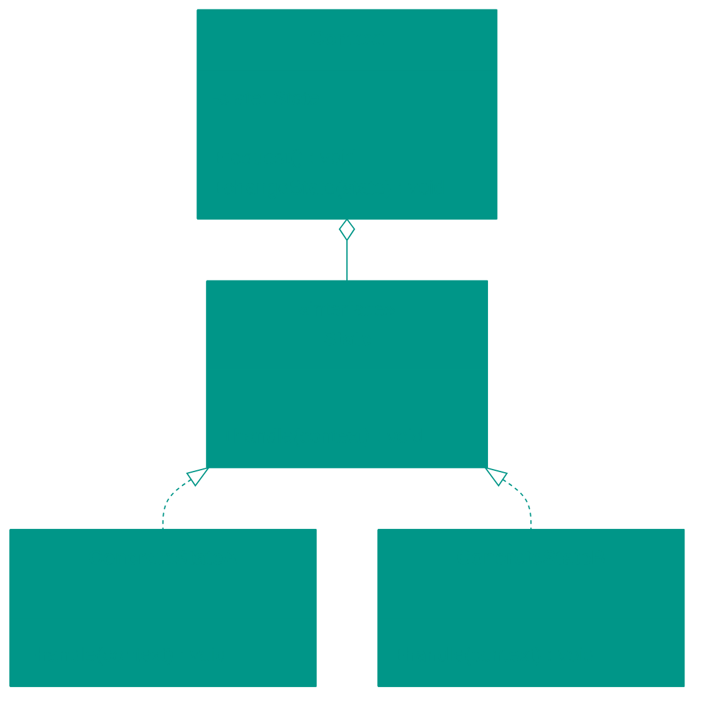
```mermaid
%%{init: { 'theme': 'base', 'themeVariables': { 'lineColor': '#009688', 'primaryColor': '#009688', 'primaryTextColor': '#009688', 'attributeBkg': '#009688', 'attributeTextColor': '#009688', 'signalColor': '#009688', 'actorLineColor': '#009688', 'nodeBorder': '#009688', 'clusterBorder': '#009688', 'textColor': '#009688', 'fontSize': '16px' } } }%%
classDiagram
    class State {
        <<interface>>
        +handle(context) void
    }
    class ConcreteStateA {
        +handle(context) void
    }
    class ConcreteStateB {
        +handle(context) void
    }
    class Context {
        -state: State
        +request() void
        +changeState(state) void
    }

    State <|.. ConcreteStateA
    State <|.. ConcreteStateB
    Context o-- State
```

**Сложность**:

| Метрика | Сложность |
|:---|:---:|
| Временная (при изменении состояния) | O(1) |
| Пространственная | O(n), где n - количество состояний |

---

## 💻 Реализация

```go
package state

import "fmt"

// State интерфейс для состояния
type State interface {
    Handle(context *Context)
    GetName() string
}

// Context контекст, который содержит текущее состояние
type Context struct {
    state State
    data  string
}

func NewContext() *Context {
    return &Context{}
}

func (c *Context) Request() {
    if c.state != nil {
        c.state.Handle(c)
    } else {
        fmt.Println("Context: No state set.")
    }
}

func (c *Context) ChangeState(state State) {
    c.state = state
    fmt.Printf("Context: Transition to %s.\n", state.GetName())
}

func (c *Context) GetData() string {
    return c.data
}

func (c *Context) SetData(data string) {
    c.data = data
}

// ConcreteStateA конкретное состояние A
type ConcreteStateA struct{}

func (s *ConcreteStateA) Handle(context *Context) {
    fmt.Println("ConcreteStateA: Handling request.")
    fmt.Printf("Current data: %s\n", context.GetData())
    // Переход к следующему состоянию
    context.ChangeState(&ConcreteStateB{})
}

func (s *ConcreteStateA) GetName() string {
    return "ConcreteStateA"
}

// ConcreteStateB конкретное состояние B
type ConcreteStateB struct{}

func (s *ConcreteStateB) Handle(context *Context) {
    fmt.Println("ConcreteStateB: Handling request.")
    fmt.Printf("Current data: %s\n", context.GetData())
    // Переход к следующему состоянию
    context.ChangeState(&ConcreteStateA{})
}

func (s *ConcreteStateB) GetName() string {
    return "ConcreteStateB"
}

// DocumentState состояние документа
type DocumentState interface {
    Read(context *DocumentContext)
    Write(context *DocumentContext, content string)
    Delete(context *DocumentContext)
    GetName() string
}

// DocumentContext контекст документа
type DocumentContext struct {
    state   DocumentState
    content string
    owner   string
}

func NewDocumentContext(owner string) *DocumentContext {
    return &DocumentContext{
        state: &DraftState{},
        owner: owner,
    }
}

func (dc *DocumentContext) SetState(state DocumentState) {
    dc.state = state
    fmt.Printf("DocumentContext: State changed to %s\n", state.GetName())
}

func (dc *DocumentContext) Read() {
    dc.state.Read(dc)
}

func (dc *DocumentContext) Write(content string) {
    dc.state.Write(dc, content)
}

func (dc *DocumentContext) Delete() {
    dc.state.Delete(dc)
}

func (dc *DocumentContext) GetContent() string {
    return dc.content
}

func (dc *DocumentContext) SetContent(content string) {
    dc.content = content
}

// DraftState состояние черновика
type DraftState struct{}

func (ds *DraftState) Read(context *DocumentContext) {
    fmt.Printf("Reading document owned by %s: %s\n", context.owner, context.content)
}

func (ds *DraftState) Write(context *DocumentContext, content string) {
    context.content = content
    fmt.Printf("Writing to document owned by %s: %s\n", context.owner, content)
    // После записи документ переходит в состояние модерации
    context.SetState(&ModerationState{})
}

func (ds *DraftState) Delete(context *DocumentContext) {
    context.content = ""
    fmt.Printf("Document owned by %s deleted\n", context.owner)
}

func (ds *DraftState) GetName() string {
    return "DraftState"
}

// ModerationState состояние модерации
type ModerationState struct{}

func (ms *ModerationState) Read(context *DocumentContext) {
    fmt.Printf("Reading document in moderation owned by %s: %s\n", context.owner, context.content)
}

func (ms *ModerationState) Write(context *DocumentContext, content string) {
    context.content = content
    fmt.Printf("Updating document in moderation owned by %s: %s\n", context.owner, content)
}

func (ms *ModerationState) Delete(context *DocumentContext) {
    context.SetState(&DraftState{}) // возвращаем к черновику
    context.content = ""
    fmt.Printf("Document in moderation owned by %s reverted to draft\n", context.owner)
}

func (ms *ModerationState) GetName() string {
    return "ModerationState"
}
```

```javascript
/**
 * Интерфейс State
 */
class State {
    handle(context) {
        throw new Error("Метод handle() должен быть реализован");
    }
    
    getName() {
        throw new Error("Метод getName() должен быть реализован");
    }
}

/**
 * Контекст, который содержит текущее состояние
 */
class Context {
    constructor() {
        this.state = null;
        this.data = "";
    }
    
    request() {
        if (this.state) {
            this.state.handle(this);
        } else {
            console.log("Context: No state set.");
        }
    }
    
    changeState(state) {
        this.state = state;
        console.log(`Context: Transition to ${state.getName()}.`);
    }
    
    getData() {
        return this.data;
    }
    
    setData(data) {
        this.data = data;
    }
}

/**
 * Конкретные состояния
 */
class ConcreteStateA extends State {
    handle(context) {
        console.log("ConcreteStateA: Handling request.");
        console.log(`Current data: ${context.getData()}`);
        // Переход к следующему состоянию
        context.changeState(new ConcreteStateB());
    }
    
    getName() {
        return "ConcreteStateA";
    }
}

class ConcreteStateB extends State {
    handle(context) {
        console.log("ConcreteStateB: Handling request.");
        console.log(`Current data: ${context.getData()}`);
        // Переход к следующему состоянию
        context.changeState(new ConcreteStateA());
    }
    
    getName() {
        return "ConcreteStateB";
    }
}

/**
 * Состояния документа
 */
class DocumentState {
    read(context) {
        throw new Error("Метод read() должен быть реализован");
    }
    
    write(context, content) {
        throw new Error("Метод write() должен быть реализован");
    }
    
    delete(context) {
        throw new Error("Метод delete() должен быть реализован");
    }
    
    getName() {
        throw new Error("Метод getName() должен быть реализован");
    }
}

/**
 * Контекст документа
 */
class DocumentContext {
    constructor(owner) {
        this.state = new DraftState();
        this.content = "";
        this.owner = owner;
    }
    
    setState(state) {
        this.state = state;
        console.log(`DocumentContext: State changed to ${state.getName()}`);
    }
    
    read() {
        this.state.read(this);
    }
    
    write(content) {
        this.state.write(this, content);
    }
    
    delete() {
        this.state.delete(this);
    }
    
    getContent() {
        return this.content;
    }
    
    setContent(content) {
        this.content = content;
    }
}

/**
 * Состояние черновика
 */
class DraftState extends DocumentState {
    read(context) {
        console.log(`Reading document owned by ${context.owner}: ${context.content}`);
    }
    
    write(context, content) {
        context.content = content;
        console.log(`Writing to document owned by ${context.owner}: ${content}`);
        // После записи документ переходит в состояние модерации
        context.setState(new ModerationState());
    }
    
    delete(context) {
        context.content = "";
        console.log(`Document owned by ${context.owner} deleted`);
    }
    
    getName() {
        return "DraftState";
    }
}

/**
 * Состояние модерации
 */
class ModerationState extends DocumentState {
    read(context) {
        console.log(`Reading document in moderation owned by ${context.owner}: ${context.content}`);
    }
    
    write(context, content) {
        context.content = content;
        console.log(`Updating document in moderation owned by ${context.owner}: ${content}`);
    }
    
    delete(context) {
        context.setState(new DraftState()); // возвращаем к черновику
        context.content = "";
        console.log(`Document in moderation owned by ${context.owner} reverted to draft`);
    }
    
    getName() {
        return "ModerationState";
    }
}

// Пример использования
const context = new Context();
context.changeState(new ConcreteStateA());
context.request();
context.request();

console.log("\nDocument example:");
const doc = new DocumentContext("John Doe");
doc.write("This is a draft document");
doc.read();
doc.write("Updated content after moderation");
doc.read();
```

---

### 🎯 Strategy (Стратегия)

**Описание**:
Паттерн Strategy определяет семейство алгоритмов, инкапсулирует каждый из них и делает их взаимозаменяемыми. Он позволяет изменять алгоритмы независимо от клиентов, которые ими пользуются.

- **Проблема**: Необходимость использования различных алгоритмов в зависимости от ситуации, при этом избегая жесткого кодирования выбора алгоритма.
- **Решение**: Создать иерархию стратегий, каждая из которых реализует определенный алгоритм, и позволить контексту использовать любую из них.
- **Аналогия**: Выбор маршрута в навигаторе - вы можете выбрать самый быстрый, самый короткий или самый безопасный маршрут.

#### Преимущества и недостатки

✅ **Плюсы**:
1. **Изолированные алгоритмы**: Каждый алгоритм инкапсулирован в отдельном классе
2. **Гибкость**: Можно легко переключаться между алгоритмами во время выполнения
3. **Соответствие принципу открытости/закрытости**: Открыт для расширения, закрыт для модификации

❌ **Минусы**:
1. **Увеличение количества классов**: Каждая стратегия требует отдельного класса
2. **Выбор стратегии**: Клиент должен знать, какую стратегию выбрать

**Когда использовать**: Когда нужно использовать различные варианты алгоритма внутри объекта, или когда нужно избежать условных операторов, выбирающих нужный алгоритм.

---

**Визуализация**:

```mermaid
%%{init: { 'theme': 'base', 'themeVariables': { 'lineColor': '#009688', 'primaryColor': '#009688', 'primaryTextColor': '#009688', 'attributeBkg': '#009688', 'attributeTextColor': '#009688', 'signalColor': '#009688', 'actorLineColor': '#009688', 'nodeBorder': '#009688', 'clusterBorder': '#009688', 'textColor': '#009688', 'fontSize': '16px' } } }%%
classDiagram
    class Strategy {
        <<interface>>
        +execute(data) string
    }
    class ConcreteStrategyA {
        +execute(data) string
    }
    class ConcreteStrategyB {
        +execute(data) string
    }
    class Context {
        -strategy: Strategy
        +setStrategy(strategy) void
        +executeStrategy(data) string
    }

    Strategy <|.. ConcreteStrategyA
    Strategy <|.. ConcreteStrategyB
    Context o-- Strategy
```

**Сложность**:

| Метрика | Сложность |
|:---|:---:|
| Временная (при выполнении стратегии) | Зависит от конкретной стратегии |
| Пространственная | O(1) для контекста |

---

## 💻 Реализация

```go
package strategy

import (
    "fmt"
    "sort"
    "strings"
)

// Strategy интерфейс для стратегии
type Strategy interface {
    Execute(data []string) []string
}

// ConcreteStrategySort сортировка стратегия
type ConcreteStrategySort struct{}

func (s *ConcreteStrategySort) Execute(data []string) []string {
    sorted := make([]string, len(data))
    copy(sorted, data)
    sort.Strings(sorted)
    return sorted
}

// ConcreteStrategyReverse реверс стратегия
type ConcreteStrategyReverse struct{}

func (s *ConcreteStrategyReverse) Execute(data []string) []string {
    reversed := make([]string, len(data))
    for i, j := 0, len(data)-1; i < len(data); i, j = i+1, j-1 {
        reversed[i] = data[j]
    }
    return reversed
}

// ConcreteStrategyLowerCase lowercase стратегия
type ConcreteStrategyLowerCase struct{}

func (s *ConcreteStrategyLowerCase) Execute(data []string) []string {
    lowercased := make([]string, len(data))
    for i, v := range data {
        lowercased[i] = strings.ToLower(v)
    }
    return lowercased
}

// Context контекст, который использует стратегию
type Context struct {
    strategy Strategy
}

func NewContext(strategy Strategy) *Context {
    return &Context{strategy: strategy}
}

func (c *Context) SetStrategy(strategy Strategy) {
    c.strategy = strategy
}

func (c *Context) ExecuteStrategy(data []string) []string {
    if c.strategy != nil {
        return c.strategy.Execute(data)
    }
    return data
}

// PaymentStrategy стратегия оплаты
type PaymentStrategy interface {
    Pay(amount float64) string
}

// CreditCardPayment кредитная карта стратегия
type CreditCardPayment struct {
    name    string
    cardNumber string
    cvv     string
}

func (cc *CreditCardPayment) Pay(amount float64) string {
    return fmt.Sprintf("Paid %.2f using Credit Card ending in %s", amount, cc.cardNumber[len(cc.cardNumber)-4:])
}

// PayPalPayment PayPal стратегия
type PayPalPayment struct {
    email string
}

func (pp *PayPalPayment) Pay(amount float64) string {
    return fmt.Sprintf("Paid %.2f using PayPal account %s", amount, pp.email)
}

// BitcoinPayment Bitcoin стратегия
type BitcoinPayment struct {
    walletId string
}

func (btc *BitcoinPayment) Pay(amount float64) string {
    return fmt.Sprintf("Paid %.2f using Bitcoin wallet %s", amount, btc.walletId)
}

// PaymentProcessor процессор оплаты
type PaymentProcessor struct {
    strategy PaymentStrategy
}

func NewPaymentProcessor(strategy PaymentStrategy) *PaymentProcessor {
    return &PaymentProcessor{strategy: strategy}
}

func (pp *PaymentProcessor) SetStrategy(strategy PaymentStrategy) {
    pp.strategy = strategy
}

func (pp *PaymentProcessor) ProcessPayment(amount float64) string {
    if pp.strategy != nil {
        return pp.strategy.Pay(amount)
    }
    return "No payment method selected"
}
```

```javascript
/**
 * Интерфейс Strategy
 */
class Strategy {
    execute(data) {
        throw new Error("Метод execute() должен быть реализован");
    }
}

/**
 * Конкретные стратегии
 */
class ConcreteStrategySort extends Strategy {
    execute(data) {
        return [...data].sort();
    }
}

class ConcreteStrategyReverse extends Strategy {
    execute(data) {
        return [...data].reverse();
    }
}

class ConcreteStrategyLowerCase extends Strategy {
    execute(data) {
        return data.map(item => item.toLowerCase());
    }
}

/**
 * Контекст, который использует стратегию
 */
class Context {
    constructor(strategy) {
        this.strategy = strategy;
    }
    
    setStrategy(strategy) {
        this.strategy = strategy;
    }
    
    executeStrategy(data) {
        if (this.strategy) {
            return this.strategy.execute(data);
        }
        return data;
    }
}

/**
 * Стратегии оплаты
 */
class PaymentStrategy {
    pay(amount) {
        throw new Error("Метод pay() должен быть реализован");
    }
}

class CreditCardPayment extends PaymentStrategy {
    constructor(name, cardNumber, cvv) {
        super();
        this.name = name;
        this.cardNumber = cardNumber;
        this.cvv = cvv;
    }
    
    pay(amount) {
        const lastFourDigits = this.cardNumber.slice(-4);
        return `Paid ${amount.toFixed(2)} using Credit Card ending in ${lastFourDigits}`;
    }
}

class PayPalPayment extends PaymentStrategy {
    constructor(email) {
        super();
        this.email = email;
    }
    
    pay(amount) {
        return `Paid ${amount.toFixed(2)} using PayPal account ${this.email}`;
    }
}

class BitcoinPayment extends PaymentStrategy {
    constructor(walletId) {
        super();
        this.walletId = walletId;
    }
    
    pay(amount) {
        return `Paid ${amount.toFixed(2)} using Bitcoin wallet ${this.walletId}`;
    }
}

/**
 * Процессор оплаты
 */
class PaymentProcessor {
    constructor(strategy) {
        this.strategy = strategy;
    }
    
    setStrategy(strategy) {
        this.strategy = strategy;
    }
    
    processPayment(amount) {
        if (this.strategy) {
            return this.strategy.pay(amount);
        }
        return "No payment method selected";
    }
}

// Пример использования
const data = ["banana", "apple", "cherry", "date"];

const context = new Context(new ConcreteStrategySort());
console.log("Sorted:", context.executeStrategy(data));

context.setStrategy(new ConcreteStrategyReverse());
console.log("Reversed:", context.executeStrategy(data));

context.setStrategy(new ConcreteStrategyLowerCase());
console.log("Lowercase:", context.executeStrategy(["HELLO", "WORLD"]));

// Пример оплаты
const creditCard = new CreditCardPayment("John Doe", "1234567890123456", "123");
const processor = new PaymentProcessor(creditCard);
console.log(processor.processPayment(100.50));

processor.setStrategy(new PayPalPayment("john@example.com"));
console.log(processor.processPayment(75.25));
```

---

### 📋 Template Method (Шаблонный метод)

**Описание**:
Паттерн Template Method определяет скелет алгоритма в методе с сохранением возможности переопределения некоторых шагов алгоритма в подклассах без изменения структуры алгоритма. Он позволяет подклассам переопределять части алгоритма, не изменяя его структуру.

- **Проблема**: Необходимость определения общего алгоритма с возможностью изменения некоторых шагов в подклассах.
- **Решение**: Определить основные шаги алгоритма в базовом классе, а специфические шаги оставить для переопределения в подклассах.
- **Аналогия**: Рецепт приготовления блюда - основные шаги остаются неизменными, но конкретные ингредиенты могут отличаться.

#### Преимущества и недостатки

✅ **Плюсы**:
1. **Повторное использование кода**: Общий код помещается в базовый класс
2. **Контроль над структурой**: Структура алгоритма остается неизменной
3. **Гибкость**: Подклассы могут переопределять только нужные части алгоритма

❌ **Минусы**:
1. **Нарушение принципа Лисков**: Подклассы могут не подходить для использования везде, где используется базовый класс
2. **Сложность для новых разработчиков**: Может быть сложно понять, какие методы нужно переопределить

**Когда использовать**: Когда нужно определить общие шаги алгоритма, оставив возможность изменения некоторых из них в подклассах, или когда нужно избежать дублирования кода в нескольких связанных классах.

---

**Визуализация**:

```mermaid
%%{init: { 'theme': 'base', 'themeVariables': { 'lineColor': '#009688', 'primaryColor': '#009688', 'primaryTextColor': '#009688', 'attributeBkg': '#009688', 'attributeTextColor': '#009688', 'signalColor': '#009688', 'actorLineColor': '#009688', 'nodeBorder': '#009688', 'clusterBorder': '#009688', 'textColor': '#009688', 'fontSize': '16px' } } }%%
classDiagram
    class AbstractClass {
        +templateMethod() string
        +step1() string
        +step2() string
        +step3() string
        +concreteStep() string
    }
    class ConcreteClassA {
        +step2() string
        +step3() string
    }
    class ConcreteClassB {
        +step1() string
        +step3() string
    }

    AbstractClass <|-- ConcreteClassA
    AbstractClass <|-- ConcreteClassB
```

**Сложность**:

| Метрика | Сложность |
|:---|:---:|
| Временная (при выполнении метода) | Зависит от реализации |
| Пространственная | O(1) |

---

## 💻 Реализация

```go
package template

import "fmt"

// AbstractClass абстрактный класс с шаблонным методом
type AbstractClass interface {
    Step1() string
    Step2() string
    Step3() string
    TemplateMethod() string
}

// BaseClass базовая реализация
type BaseClass struct{}

func (bc *BaseClass) ConcreteStep() string {
    return "BaseClass: Common operation\n"
}

func (bc *BaseClass) Hook1() bool {
    return true
}

func (bc *BaseClass) Hook2() string {
    return ""
}

// TemplateMethod шаблонный метод
func (bc *BaseClass) TemplateMethod() string {
    result := "BaseClass: I am made up of multiple steps:\n"
    result += bc.ConcreteStep()
    result += bc.Step1()
    result += bc.Step2()
    
    if bc.Hook1() {
        result += bc.Step3()
    }
    
    hookResult := bc.Hook2()
    if hookResult != "" {
        result += fmt.Sprintf("BaseClass: Hook operation result: %s\n", hookResult)
    }
    
    return result
}

// ConcreteClassA конкретная реализация A
type ConcreteClassA struct {
    BaseClass
}

func (cca *ConcreteClassA) Step1() string {
    return "ConcreteClassA: Implemented Step1\n"
}

func (cca *ConcreteClassA) Step2() string {
    return "ConcreteClassA: Implemented Step2\n"
}

func (cca *ConcreteClassA) Step3() string {
    return "ConcreteClassA: Implemented Step3\n"
}

// ConcreteClassB конкретная реализация B
type ConcreteClassB struct {
    BaseClass
}

func (ccb *ConcreteClassB) Step1() string {
    return "ConcreteClassB: Overridden Step1\n"
}

func (ccb *ConcreteClassB) Step2() string {
    return "ConcreteClassB: Overridden Step2\n"
}

func (ccb *ConcreteClassB) Step3() string {
    return "ConcreteClassB: Overridden Step3\n"
}

func (ccb *ConcreteClassB) Hook1() bool {
    return false // переопределяем хук
}

func (ccb *ConcreteClassB) Hook2() string {
    return "Result from ConcreteClassB Hook2"
}

// BeverageTemplate шаблон для приготовления напитков
type BeverageTemplate struct{}

func (bt *BeverageTemplate) BoilWater() string {
    return "Boiling water\n"
}

func (bt *BeverageTemplate) PourInCup() string {
    return "Pouring into cup\n"
}

func (bt *BeverageTemplate) Brew() string {
    return "Brewing beverage\n"
}

func (bt *BeverageTemplate) AddCondiments() string {
    return "Adding condiments\n"
}

func (bt *BeverageTemplate) CustomerWantsCondiments() bool {
    return true // по умолчанию добавляем приправы
}

// PrepareRecipe шаблонный метод для приготовления напитка
func (bt *BeverageTemplate) PrepareRecipe() string {
    result := bt.BoilWater()
    result += bt.Brew()
    result += bt.PourInCup()
    
    if bt.CustomerWantsCondiments() {
        result += bt.AddCondiments()
    }
    
    return result
}

// TeaTemplate конкретная реализация для чая
type TeaTemplate struct {
    BeverageTemplate
}

func (tt *TeaTemplate) Brew() string {
    return "Steeping the tea\n"
}

func (tt *TeaTemplate) AddCondiments() string {
    return "Adding lemon\n"
}

// CoffeeTemplate конкретная реализация для кофе
type CoffeeTemplate struct {
    BeverageTemplate
}

func (ct *CoffeeTemplate) Brew() string {
    return "Dripping coffee through filter\n"
}

func (ct *CoffeeTemplate) AddCondiments() string {
    return "Adding sugar and milk\n"
}

func (ct *CoffeeTemplate) CustomerWantsCondiments() bool {
    // Предположим, что пользователь может отказаться от добавок
    return false
}
```

```javascript
/**
 * Абстрактный класс с шаблонным методом
 */
class AbstractClass {
    /**
     * Шаблонный метод, определяющий скелет алгоритма
     */
    templateMethod() {
        let result = "AbstractClass: I am made up of multiple steps:\n";
        result += this.concreteStep();
        result += this.step1();
        result += this.step2();
        
        if (this.hook1()) {
            result += this.step3();
        }
        
        const hookResult = this.hook2();
        if (hookResult) {
            result += `AbstractClass: Hook operation result: ${hookResult}\n`;
        }
        
        return result;
    }
    
    concreteStep() {
        return "AbstractClass: Common operation\n";
    }
    
    hook1() {
        return true;
    }
    
    hook2() {
        return "";
    }
    
    step1() {
        throw new Error("Метод step1() должен быть реализован");
    }
    
    step2() {
        throw new Error("Метод step2() должен быть реализован");
    }
    
    step3() {
        throw new Error("Метод step3() должен быть реализован");
    }
}

/**
 * Конкретные реализации
 */
class ConcreteClassA extends AbstractClass {
    step1() {
        return "ConcreteClassA: Implemented Step1\n";
    }
    
    step2() {
        return "ConcreteClassA: Implemented Step2\n";
    }
    
    step3() {
        return "ConcreteClassA: Implemented Step3\n";
    }
}

class ConcreteClassB extends AbstractClass {
    step1() {
        return "ConcreteClassB: Overridden Step1\n";
    }
    
    step2() {
        return "ConcreteClassB: Overridden Step2\n";
    }
    
    step3() {
        return "ConcreteClassB: Overridden Step3\n";
    }
    
    hook1() {
        return false; // переопределяем хук
    }
    
    hook2() {
        return "Result from ConcreteClassB Hook2";
    }
}

/**
 * Шаблон для приготовления напитков
 */
class BeverageTemplate {
    boilWater() {
        return "Boiling water\n";
    }
    
    pourInCup() {
        return "Pouring into cup\n";
    }
    
    brew() {
        return "Brewing beverage\n";
    }
    
    addCondiments() {
        return "Adding condiments\n";
    }
    
    customerWantsCondiments() {
        return true; // по умолчанию добавляем приправы
    }
    
    /**
     * Шаблонный метод для приготовления напитка
     */
    prepareRecipe() {
        let result = this.boilWater();
        result += this.brew();
        result += this.pourInCup();
        
        if (this.customerWantsCondiments()) {
            result += this.addCondiments();
        }
        
        return result;
    }
}

/**
 * Конкретные реализации для чая и кофе
 */
class TeaTemplate extends BeverageTemplate {
    brew() {
        return "Steeping the tea\n";
    }
    
    addCondiments() {
        return "Adding lemon\n";
    }
}

class CoffeeTemplate extends BeverageTemplate {
    brew() {
        return "Dripping coffee through filter\n";
    }
    
    addCondiments() {
        return "Adding sugar and milk\n";
    }
    
    customerWantsCondiments() {
        // Предположим, что пользователь может отказаться от добавок
        return false;
    }
}

// Пример использования
const templateA = new ConcreteClassA();
console.log(templateA.templateMethod());

const templateB = new ConcreteClassB();
console.log(templateB.templateMethod());

console.log("\nPreparing tea:");
const tea = new TeaTemplate();
console.log(tea.prepareRecipe());

console.log("\nPreparing coffee:");
const coffee = new CoffeeTemplate();
console.log(coffee.prepareRecipe());
```

---

### 🚶 Visitor (Посетитель)

**Описание**:
Паттерн Visitor позволяет определять новую операцию без изменения классов объектов, над которыми эта операция выполняется. Он позволяет отделить алгоритм от структуры объекта, над которым он работает.

- **Проблема**: Необходимость выполнения операций над объектами различных типов, при этом не изменяя классы этих объектов.
- **Решение**: Создать интерфейс посетителя, который определяет методы для каждого типа объекта, и позволить объектам принимать посетителя.
- **Аналогия**: Ревизор, который посещает различные отделы компании и выполняет проверку, не изменяя структуру отделов.

#### Преимущества и недостатки

✅ **Плюсы**:
1. **Добавление операций без изменения классов**: Можно добавлять новые операции, не изменяя классы объектов
2. **Объединение родственных операций**: Связанные операции можно группировать в одном классе
3. **Упрощение операций над сложными структурами**: Упрощает выполнение операций над сложными структурами объектов

❌ **Минусы**:
1. **Нарушение инкапсуляции**: Посетитель может нарушить инкапсуляцию, получая доступ к внутренним данным объекта
2. **Сложность при добавлении классов**: При добавлении новых классов нужно изменять интерфейс посетителя
3. **Усложнение кода**: Может усложнить код, особенно для простых операций

**Когда использовать**: Когда нужно выполнить операцию над всеми элементами сложной структуры объектов, или когда нужно добавить операции к классам, которые нельзя изменить.

---

**Визуализация**:

```mermaid
%%{init: { 'theme': 'base', 'themeVariables': { 'lineColor': '#009688', 'primaryColor': '#009688', 'primaryTextColor': '#009688', 'attributeBkg': '#009688', 'attributeTextColor': '#009688', 'signalColor': '#009688', 'actorLineColor': '#009688', 'nodeBorder': '#009688', 'clusterBorder': '#009688', 'textColor': '#009688', 'fontSize': '16px' } } }%%
classDiagram
    class Visitor {
        <<interface>>
        +visitConcreteComponentA(element) void
        +visitConcreteComponentB(element) void
    }
    class ConcreteVisitor1 {
        +visitConcreteComponentA(element) void
        +visitConcreteComponentB(element) void
    }
    class ConcreteVisitor2 {
        +visitConcreteComponentA(element) void
        +visitConcreteComponentB(element) void
    }
    class Component {
        <<interface>>
        +accept(visitor) void
    }
    class ConcreteComponentA {
        +accept(visitor) void
        +exclusiveMethodOfConcreteComponentA() string
    }
    class ConcreteComponentB {
        +accept(visitor) void
        +specialMethodOfConcreteComponentB() string
    }
    class ObjectStructure {
        -components: Component[]
        +attach(component) void
        +detach(component) void
        +accept(visitor) void
    }

    Visitor <|.. ConcreteVisitor1
    Visitor <|.. ConcreteVisitor2
    Component <|.. ConcreteComponentA
    Component <|.. ConcreteComponentB
    ObjectStructure o-- Component
    Component ..> Visitor
```

**Сложность**:

| Метрика | Сложность |
|:---|:---:|
| Временная (при посещении) | O(n), где n - количество элементов |
| Пространственная | O(1) для посетителя |

---

## 💻 Реализация

```go
package visitor

import "fmt"

// Visitor интерфейс для посетителя
type Visitor interface {
    VisitConcreteComponentA(*ConcreteComponentA)
    VisitConcreteComponentB(*ConcreteComponentB)
}

// Component интерфейс для компонента
type Component interface {
    Accept(Visitor)
}

// ConcreteComponentA конкретный компонент A
type ConcreteComponentA struct{}

func (c *ConcreteComponentA) Accept(visitor Visitor) {
    visitor.VisitConcreteComponentA(c)
}

func (c *ConcreteComponentA) ExclusiveMethodOfConcreteComponentA() string {
    return "ConcreteComponentA: Here's the result of the operation A.\n"
}

// ConcreteComponentB конкретный компонент B
type ConcreteComponentB struct{}

func (c *ConcreteComponentB) Accept(visitor Visitor) {
    visitor.VisitConcreteComponentB(c)
}

func (c *ConcreteComponentB) SpecialMethodOfConcreteComponentB() string {
    return "ConcreteComponentB: Here's the result of the operation B.\n"
}

// ConcreteVisitor1 конкретный посетитель 1
type ConcreteVisitor1 struct{}

func (v *ConcreteVisitor1) VisitConcreteComponentA(c *ConcreteComponentA) {
    fmt.Print(c.ExclusiveMethodOfConcreteComponentA())
}

func (v *ConcreteVisitor1) VisitConcreteComponentB(c *ConcreteComponentB) {
    fmt.Print(c.SpecialMethodOfConcreteComponentB())
}

// ConcreteVisitor2 конкретный посетитель 2
type ConcreteVisitor2 struct{}

func (v *ConcreteVisitor2) VisitConcreteComponentA(c *ConcreteComponentA) {
    fmt.Printf("ConcreteVisitor2: %s", c.ExclusiveMethodOfConcreteComponentA())
}

func (v *ConcreteVisitor2) VisitConcreteComponentB(c *ConcreteComponentB) {
    fmt.Printf("ConcreteVisitor2: %s", c.SpecialMethodOfConcreteComponentB())
}

// ObjectStructure структура объектов, которую можно посетить
type ObjectStructure struct {
    elements []Component
}

func NewObjectStructure() *ObjectStructure {
    return &ObjectStructure{elements: make([]Component, 0)}
}

func (os *ObjectStructure) Attach(element Component) {
    os.elements = append(os.elements, element)
}

func (os *ObjectStructure) Detach(element Component) {
    for i, el := range os.elements {
        if el == element {
            os.elements = append(os.elements[:i], os.elements[i+1:]...)
            break
        }
    }
}

func (os *ObjectStructure) Accept(visitor Visitor) {
    for _, element := range os.elements {
        element.Accept(visitor)
    }
}

// DiscountVisitor посетитель для вычисления скидок
type DiscountVisitor struct {
    totalDiscount float64
}

func NewDiscountVisitor() *DiscountVisitor {
    return &DiscountVisitor{}
}

func (dv *DiscountVisitor) VisitConcreteComponentA(c *ConcreteComponentA) {
    // Предположим, что компонент A имеет фиксированную скидку 5%
    dv.totalDiscount += 0.05
    fmt.Printf("DiscountVisitor: Applied 5%% discount to ComponentA. Total discount: %.2f%%\n", dv.totalDiscount*100)
}

func (dv *DiscountVisitor) VisitConcreteComponentB(c *ConcreteComponentB) {
    // Предположим, что компонент B имеет фиксированную скидку 10%
    dv.totalDiscount += 0.10
    fmt.Printf("DiscountVisitor: Applied 10%% discount to ComponentB. Total discount: %.2f%%\n", dv.totalDiscount*100)
}

func (dv *DiscountVisitor) GetTotalDiscount() float64 {
    return dv.totalDiscount
}
```

```javascript
/**
 * Интерфейс Visitor
 */
class Visitor {
    visitConcreteComponentA(element) {
        throw new Error("Метод visitConcreteComponentA() должен быть реализован");
    }
    
    visitConcreteComponentB(element) {
        throw new Error("Метод visitConcreteComponentB() должен быть реализован");
    }
}

/**
 * Интерфейс Component
 */
class Component {
    accept(visitor) {
        throw new Error("Метод accept() должен быть реализован");
    }
}

/**
 * Конкретные компоненты
 */
class ConcreteComponentA extends Component {
    accept(visitor) {
        visitor.visitConcreteComponentA(this);
    }
    
    exclusiveMethodOfConcreteComponentA() {
        return "ConcreteComponentA: Here's the result of the operation A.\n";
    }
}

class ConcreteComponentB extends Component {
    accept(visitor) {
        visitor.visitConcreteComponentB(this);
    }
    
    specialMethodOfConcreteComponentB() {
        return "ConcreteComponentB: Here's the result of the operation B.\n";
    }
}

/**
 * Конкретные посетители
 */
class ConcreteVisitor1 extends Visitor {
    visitConcreteComponentA(c) {
        process.stdout.write(c.exclusiveMethodOfConcreteComponentA());
    }
    
    visitConcreteComponentB(c) {
        process.stdout.write(c.specialMethodOfConcreteComponentB());
    }
}

class ConcreteVisitor2 extends Visitor {
    visitConcreteComponentA(c) {
        process.stdout.write(`ConcreteVisitor2: ${c.exclusiveMethodOfConcreteComponentA()}`);
    }
    
    visitConcreteComponentB(c) {
        process.stdout.write(`ConcreteVisitor2: ${c.specialMethodOfConcreteComponentB()}`);
    }
}

/**
 * Структура объектов, которую можно посетить
 */
class ObjectStructure {
    constructor() {
        this.elements = [];
    }
    
    attach(element) {
        this.elements.push(element);
    }
    
    detach(element) {
        const index = this.elements.indexOf(element);
        if (index !== -1) {
            this.elements.splice(index, 1);
        }
    }
    
    accept(visitor) {
        for (const element of this.elements) {
            element.accept(visitor);
        }
    }
}

/**
 * Посетитель для вычисления скидок
 */
class DiscountVisitor extends Visitor {
    constructor() {
        super();
        this.totalDiscount = 0;
    }
    
    visitConcreteComponentA(c) {
        // Предположим, что компонент A имеет фиксированную скидку 5%
        this.totalDiscount += 0.05;
        console.log(`DiscountVisitor: Applied 5% discount to ComponentA. Total discount: ${(this.totalDiscount * 100).toFixed(2)}%`);
    }
    
    visitConcreteComponentB(c) {
        // Предположим, что компонент B имеет фиксированную скидку 10%
        this.totalDiscount += 0.10;
        console.log(`DiscountVisitor: Applied 10% discount to ComponentB. Total discount: ${(this.totalDiscount * 100).toFixed(2)}%`);
    }
    
    getTotalDiscount() {
        return this.totalDiscount;
    }
}

// Пример использования
const objectStructure = new ObjectStructure();
objectStructure.attach(new ConcreteComponentA());
objectStructure.attach(new ConcreteComponentB());

console.log("Client: Executing visitor ConcreteVisitor1:");
objectStructure.accept(new ConcreteVisitor1());

console.log("\nClient: Executing visitor ConcreteVisitor2:");
objectStructure.accept(new ConcreteVisitor2());

console.log("\nClient: Executing visitor DiscountVisitor:");
const discountVisitor = new DiscountVisitor();
objectStructure.accept(discountVisitor);
console.log(`Total discount applied: ${(discountVisitor.getTotalDiscount() * 100).toFixed(2)}%`);
```

---

## Заключение

Паттерны проектирования GoF являются фундаментальными концепциями в объектно-ориентированном программировании. Они представляют собой проверенные временем решения типовых проблем проектирования, которые разработчики сталкиваются снова и снова.

### Ключевые моменты:

1. **Порождающие паттерны** (5): Упрощают создание объектов, абстрагируя процесс инстанцирования.
2. **Структурные паттерны** (7): Облегчают проектирование, определяя, как образуются отношения между сущностями.
3. **Поведенческие паттерны** (11): Определяют способы взаимодействия между объектами, улучшая гибкость в выполнении этих взаимодействий.

### Когда использовать паттерны:

- **Не применяйте паттерны ради применения** - используйте их, когда действительно сталкиваетесь с проблемой, которую они решают
- **Паттерны - это не догма** - адаптируйте их под свои нужды
- **Паттерны помогают в коммуникации** - используйте названия паттернов для обсуждения архитектурных решений
- **Паттерны не решают все проблемы** - они лишь предоставляют проверенные решения для типовых ситуаций

Помните, что паттерны - это инструменты в руках опытного разработчика. Их правильное применение может значительно улучшить качество кода, его читаемость и поддерживаемость, но чрезмерное или неуместное использование может привести к обратному эффекту.

<!-- QUIZ_START
[
    {
        "question": "Какой паттерн позволяет объектам с несовместимыми интерфейсами работать вместе?",
        "options": [
            "Singleton",
            "Factory Method",
            "Adapter",
            "Observer"
        ],
        "correctIndex": 2
    },
    {
        "question": "Какой паттерн позволяет объекту изменять свое поведение при изменении внутреннего состояния?",
        "options": [
            "Strategy",
            "State",
            "Command",
            "Memento"
        ],
        "correctIndex": 1
    },
    {
        "question": "Какой паттерн определяет скелет алгоритма в методе с возможностью переопределения шагов в подклассах?",
        "options": [
            "Template Method",
            "Strategy",
            "Visitor",
            "Iterator"
        ],
        "correctIndex": 0
    }
]
QUIZ_END -->