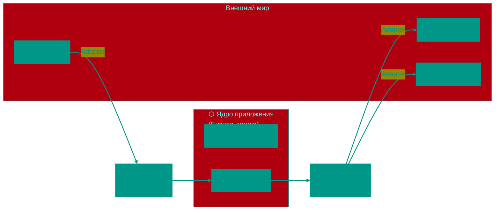

# 🏗️ Архитектурные паттерны


## 📑 Содержание

1. [Clean / Onion / Hexagonal Architecture](#1-clean--onion--hexagonal-architecture)
2. [CQRS (Command and Query Responsibility Segregation)](#2-cqrs)
3. [Event Driven Architecture](#3-event-driven-architecture)
4. [Saga Pattern](#4-saga-pattern)
5. [S.O.L.I.D. и Dependency Injection](#5-solid-и-dependency-injection)

---

## 📘 Основные понятия

Перед тем как погрузиться в архитектурные паттерны, давайте разберемся с базовыми понятиями, которые будут встречаться далее:

### 🧱 Entity (Сущность)
**Что это:** Объект, представляющий бизнес-объект с уникальным идентификатором и жизненным циклом.  
**Пример:** Пользователь, Заказ, Продукт.  
**Особенность:** Идентифицируется не по своим атрибутам, а по уникальному ID.

```go
type User struct {
    ID    string // Уникальный идентификатор
    Name  string
    Email string
}
```

### 📦 Value Object (Объект-значение)
**Что это:** Объект, значение которого определяется его атрибутами, а не идентичностью.  
**Пример:** Адрес, Деньги, Диапазон дат.  
**Особенность:** Не имеет уникального ID, равенство определяется по содержимому.

```go
type Money struct {
    Amount   float64
    Currency string
}

type Address struct {
    Street  string
    City    string
    Country string
}
```

### 🏛️ Repository (Репозиторий)
**Что это:** Паттерн, обеспечивающий абстракцию доступа к данным.  
**Цель:** Скрыть детали хранения и извлечения сущностей.  
**Пример:** Интерфейс для работы с пользователями в БД, не зная, что там под капотом PostgreSQL или MongoDB.

```go
type UserRepository interface {
    Save(user *User) error
    FindByID(id string) (*User, error)
    FindAll() ([]*User, error)
}
```

### 📄 Interface (Интерфейс)
**Что это:** Контракт, определяющий набор методов, которые должен реализовать тип.  
**Цель:** Обеспечить полиморфизм и слабую связанность.  
**Пример:** Интерфейс уведомлений, который может быть реализован по-разному (Email, SMS, Push).

```go
type Notifier interface {
    Send(message string) error
}

type EmailNotifier struct{}
func (e *EmailNotifier) Send(message string) error {
    // Отправка по Email
    return nil
}

type SMSNotifier struct{}
func (s *SMSNotifier) Send(message string) error {
    // Отправка по SMS
    return nil
}
```

### 🔌 Adapter (Адаптер)
**Что это:** Компонент, который позволяет объектам с несовместимыми интерфейсами работать вместе.  
**Цель:** Преобразовать интерфейс одного класса в интерфейс, ожидаемый клиентом.  
**Пример:** PostgreSQL-адаптер, реализующий интерфейс репозитория.

```go
type PostgresUserRepository struct {
    db *sql.DB
}

// Реализует интерфейс UserRepository
func (r *PostgresUserRepository) Save(user *User) error {
    // Сохранение в PostgreSQL
    return nil
}
```

### 🎯 Use Case (Сценарий использования)
**Что это:** Бизнес-операция, которая описывает, как система должна реагировать на запрос пользователя.  
**Цель:** Инкапсулировать бизнес-логику конкретной операции.  
**Пример:** Создание пользователя, оформление заказа.

```go
type CreateUserUseCase struct {
    userRepository UserRepository
    notifier       Notifier
}

func (uc *CreateUserUseCase) Execute(name, email string) error {
    user := &User{
        ID:    generateID(),
        Name:  name,
        Email: email,
    }
    
    err := uc.userRepository.Save(user)
    if err != nil {
        return err
    }
    
    uc.notifier.Send("User created: " + user.Name)
    return nil
}
```

### 🔄 Dependency Injection (DI) - Внедрение зависимостей
**Что это:** Паттерн, при котором объект получает свои зависимости извне, а не создает их сам.  
**Цель:** Уменьшить связанность между компонентами.  
**Пример:** Передача репозитория в конструктор сервиса.

```go
// Вместо создания внутри
type UserService struct {
    repo UserRepository // Зависимость передается снаружи
}

func NewUserService(repo UserRepository) *UserService {
    return &UserService{repo: repo}
}
```

### 🧭 Ports and Adapters (Порты и Адаптеры)
**Что это:** Архитектурный паттерн, разделяющий бизнес-логику и технические детали.  
**Цель:** Сделать приложение независимым от внешних факторов (БД, UI, фреймворков).  
**Принцип:** Ядро приложения зависит от "портов" (интерфейсов), а внешние компоненты от "адаптеров", реализующих эти порты.

### 📋 DTO (Data Transfer Object) - Объект передачи данных
**Что это:** Простой объект, используемый для передачи данных между слоями или системами.  
**Цель:** Упростить передачу данных, избежать передачи всей сущности.  
**Пример:** Объект для ответа API с ограниченным набором полей.

```go
type UserResponseDTO struct {
    ID    string `json:"id"`
    Name  string `json:"name"`
    Email string `json:"email"`
}
```

---


## 1. 🏗️ Domain-Centric Architectures: Эволюция и реализация

Для начала нужно понять главное: зачем вообще придумали все эти "луковицы" и "гексагоны"?


### 🚀 Эволюция: От N-Tier к Domain-Centric

Раньше (и часто сейчас) учили **3-слойной архитектуре (N-Tier)**:
`UI (Слой представления) -> Business Logics (Слой логики) -> Data Access (Слой данных/БД)`

**В чем была проблема?**
В этой схеме **бизнес-логика зависела от базы данных**. Если вы меняли схему БД или переходили с SQL на NoSQL, вам приходилось переписывать всё приложение. Бизнес-правила были "заложниками" технических деталей.

**Решение: Инверсия зависимостей (Dependency Inversion)**.
Мы ставим Бизнес-логику в центр, а Базу Данных и UI делаем "подключаемыми деталями".

---


### 🧅 1.1 Onion Architecture (Луковая архитектура)

_Автор: Джеффри Палермо (2008)_


Луковая архитектура делает акцент на том, что приложение — это набор концентрических кругов. Чем ближе к центру, тем чище и важнее код.


#### 🏗️ Слои (изнутри наружу):

1.  **Domain Model (Центральное ядро)**: Только сущности (`Order`, `User`) и базовые правила. Этот код не зависит ни от чего.
2.  **Domain Services**: Логика, которая связывает несколько сущностей, но всё еще остается в рамках бизнес-правил.
3.  **Application Services (Use Cases)**: Координатор. Он знает: "Сначала пойди в репозиторий, возьми юзера, потом вызови метод из Domain Model". Но он не знает, как работает репозиторий (через интерфейс).
4.  **Infrastructure / External World**: Всё остальное: БД, HTTP, Файлы, Консоль.

**💡 Главная фишка:** Инфраструктура зависит от Application Services, а те от Domain. Центр — это "божественная истина", которая ничего не знает о внешнем мире.

---


### ⬡ 1.2 Hexagonal Architecture (Ports and Adapters)

_Автор: Алистер Кокберн (2005)_


Если Луковая — это про слои, то Гексагональная — про **подключаемость**.


#### 🧩 Основные понятия:

- **The Inside (Application Core)**: Наше приложение. Оно не знает о HTTP, GRPC или PostgreSQL.
- **Ports (Порты)**: Интерфейсы (розетки). Приложение говорит: "Мне нужен кто-то, кто умеет сохранять Пользователя" (`UserRepository`).
- **Adapters (Адаптеры)**: Вилки. `PostgresAdapter` — это вилка, которая вставляется в розетку `UserRepository`.


#### 🔄 Типы портов:

1.  **Driving (Инпуты)**: Те, кто заставляет наше приложение что-то делать (REST API, CLI, Тесты).
2.  **Driven (Аутпуты)**: Те, кого наше приложение заставляет что-то делать (БД, Очередь сообщений, Внешее API).

**🎮 Аналогия:** Игровая приставка (Core) имеет порты (HDMI, USB). Вы можете подключить старый телик или новый (Adapter), но сама приставка и игра внутри неё не меняются.

---


### 🏛️ 1.3 Clean Architecture (Чистая архитектура)

_Автор: Роберт "Uncle Bob" Мартин (2012)_


Это "самая строгая" версия принципа. Она объединяет идеи Луковой и Гексагональной, фокусируясь на правиле зависимостей.


#### 🏗️ Четыре круга (The Dependency Rule):

1.  **Entities (Желтый круг)**: Максимально высокоуровневые правила бизнеса. Они меняются реже всего.
2.  **Use Cases (Красный круг)**: Сценарии ("Создать аккаунт", "Забрать товар"). Описывают поток данных между сущностями.
3.  **Interface Adapters (Зеленый круг)**: Контроллеры, Презентеры, Репозитории (превращают JSON в объекты и обратно).
4.  **Frameworks & Drivers (Голубой(Рустм) круг)**: Самый внешний слой. Ваша БД (Postgres), ваш фреймворк (Gin/Echo).

**⚠️ Ключевой момент — Crossing Boundaries:**
Когда Use Case хочет сохранить данные, он не зовет БД напрямую. Он зовет **Интерфейс**. Объект БД (Адаптер) приходит в Use Case через **Dependency Injection**.

---


### 📊 Сравнение и Реальный выбор

| Характеристика    | Onion                        | Hexagonal                  | Clean                        |
| :---------------- | :--------------------------- | :------------------------- | :--------------------------- |
| **В фокусе**      | Слои и инверсия зависимостей | Взаимозаменяемость (Порты) | Границы и правила разделения |
| **БД**            | Деталь инфраструктуры        | Driven Adapter             | Detail (внешний круг)        |
| **Бизнес-логика** | В самом центре               | Внутри гексагона           | В Entities и Use Cases       |


#### 🛠️ Как это выглядит в папках (Go-style):

```text
/internal
  /domain       <-- Core: Эн**тити** и интерфейсы (Ports)
  /usecase      <-- Application logic (Services)
  /infra        <-- Adapters: SQL, HTTP clients, Redis
  /delivery     <-- Driving Adapters: Rest API, CLI
/cmd            <-- Сборка (Main): тут происходит DI
```

> [!TIP]
> **Для опытных**: Не фанатейте по названиям. Важно одно — **изолируйте бизнес-правила**. Если вы можете протестировать свою логику, не запуская Docker с базой данных — вы на верном пути.

---


#### 3. 🟢 Interface Adapters (Адаптеры интерфейсов)

**Что тут:**

- **Controllers**: Принимают HTTP запросы, вызывают Use Cases
- **Presenters**: Форматируют данные для ответа (JSON, HTML)
- **Gateways/Repositories**: Реализуют интерфейсы для работы с БД

**Правило:** Превращают данные из формата внешнего мира в формат для Use Cases (и обратно).

**Пример на Go:**

```go
// infrastructure/http/user_controller.go
package http

import (
    "encoding/json"
    "net/http"
    "myapp/application"
)

type UserController struct {
    createUserUseCase *application.CreateUserUseCase
}

func (c *UserController) CreateUser(w http.ResponseWriter, r *http.Request) {
    // 1. Парсим запрос (адаптация из HTTP в структуру)
    var req struct {
        Email    string `json:"email"`
        Password string `json:"password"`
    }
    json.NewDecoder(r.Body).Decode(&req)

    // 2. Вызываем Use Case
    err := c.createUserUseCase.Execute(req.Email, req.Password)

    // 3. Форматируем ответ (адаптация из ошибки в HTTP)
    if err != nil {
        w.WriteHeader(http.StatusBadRequest)
        json.NewEncoder(w).Encode(map[string]string{"error": err.Error()})
        return
    }

    w.WriteHeader(http.StatusCreated)
    json.NewEncoder(w).Encode(map[string]string{"status": "created"})
}
```

```go
// infrastructure/postgres/user_repository.go
package postgres

import (
    "database/sql"
    "myapp/domain"
)

type PostgresUserRepository struct {
    db *sql.DB
}

// Реализуем интерфейс из Application Layer
func (r *PostgresUserRepository) Save(user *domain.User) error {
    query := "INSERT INTO users (id, email, password, balance) VALUES ($1, $2, $3, $4)"
    _, err := r.db.Exec(query, user.ID, user.Email, user.Password, user.Balance)
    return err
}

func (r *PostgresUserRepository) GetByEmail(email string) (*domain.User, error) {
    var user domain.User
    query := "SELECT id, email, password, balance FROM users WHERE email = $1"
    err := r.db.QueryRow(query, email).Scan(&user.ID, &user.Email, &user.Password, &user.Balance)
    if err != nil {
        return nil, err
    }
    return &user, nil
}
```

---


#### 4. 🔵 Frameworks & Drivers (Фреймворки и Драйверы)

**Что тут:**

- Базы данных (Postgres, MongoDB, Redis)
- Веб-фреймворки (Gin, Echo, Chi)
- Внешние API, файловая система

**Правило:** Только технические детали. Никакой бизнес-логики.

```go
// cmd/main.go
package main

import (
    "database/sql"
    "net/http"
    _ "github.com/lib/pq"

    "myapp/application"
    httpInfra "myapp/infrastructure/http"
    "myapp/infrastructure/postgres"
)

func main() {
    // 1. Инициализация БД (Frameworks Layer)
    db, _ := sql.Open("postgres", "connection_string")

    // 2. Создание репозитория (Interface Adapters)
    userRepo := &postgres.PostgresUserRepository{db: db}

    // 3. Создание Use Case (Application Layer)
    createUserUseCase := application.NewCreateUserUseCase(userRepo)

    // 4. Создание контроллера (Interface Adapters)
    userController := &httpInfra.UserController{
        createUserUseCase: createUserUseCase,
    }

    // 5. Запуск веб-сервера (Frameworks Layer)
    http.HandleFunc("/users", userController.CreateUser)
    http.ListenAndServe(":8080", nil)
}
```

---


### 🔷 Hexagonal Architecture (Порты и Адаптеры)

**Альтернативное название** Clean Architecture. Основная идея та же, но с другой терминологией:

- **Порт (Port)** — интерфейс (например, `UserRepository`)
- **Адаптер (Adapter)** — реализация интерфейса (например, `PostgresUserRepository`)



**Плюсы:**

- Легко заменить Postgres на MongoDB (просто другой адаптер)
- Легко тестировать (используем mock адаптеры)

---


### ✅ Преимущества такой архитектуры

1. **Независимость от фреймворков**: Можно поменять Gin на Echo
2. **Тестируемость**: Бизнес-логику можно тестировать без БД и HTTP
3. **Независимость от UI**: Можно добавить CLI, gRPC, WebSocket без изменения Use Cases
4. **Независимость от БД**: Можно поменять Postgres на Mongo

> [!TIP]
> **Когда использовать**: Для средних и больших проектов с долгой жизнью. Для маленьких проектов это может быть избыточно.

---


## 2. ⚡ CQRS

**Command and Query Responsibility Segregation** — разделение ответственности на Чтение и Запись.


### 🤔 Зачем?

Обычно мы читаем данные гораздо чаще, чем пишем. В классической архитектуре мы используем одну и ту же модель (и таблицу в БД) для `SELECT` и для `UPDATE`. Это создает проблемы с масштабированием и производительностью.

- **Command (Команда)**: Изменяет состояние ("Создать заказ", "Сменить адрес"). Содержит бизнес-логику и валидацию.
- **Query (Запрос)**: Читает данные. Максимально простая, часто вообще без логики, просто возвращает DTO (Data Transfer Object).


### 🏗️ Как это работает в реальности?

Чаще всего CQRS используют вместе с разделением баз данных:

1.  **Write DB**: Оптимизирована для записи (часто реляционная, нормализованная).
2.  **Read DB**: Оптимизирована для чтения (NoSQL или просто денормализованные таблицы, кеш).

> [!WARNING]
> **Eventual Consistency (Согласованность в конечном счете)**: Поскольку данные из Write DB попадают в Read DB не мгновенно, пользователь может увидеть старые данные на долю секунды после обновления. Это цена за скорость.

---


## 3. 📡 Event Driven Architecture (EDA)

Архитектура, где системы общаются через **события**.

- **Событие (Event)**: Факт, который уже случился ("OrderCreated", "PaymentReceived"). Его нельзя отменить.
- **Брокер сообщений**: Kafka, RabbitMQ, NATS.


### 🎞️ Event Sourcing (ES)

Мы не храним текущее состояние объекта (например, "Баланс: 100"). Вместо этого мы храним **цепочку всех событий**, которые привели к этому состоянию.

**Пример (Банковский счет):**

1. Счёт открыт (+0)
2. Пополнение (+100)
3. Покупка (-30)
   _Текущий баланс (70) высчитывается путем сложения всех событий._

- **Зачем?**: Аудит, возможность "отмотать" время назад, легкое исправление багов (исправили логику и пересчитали события).
- **Сложность**: Нужно делать **Snapshot'ы** (снимки состояния), чтобы не пересчитывать миллион событий каждый раз.

---


## 4. 📜 Saga Pattern

Используется для управления распределенными транзакциями в микросервисах. В облаках нельзя сделать `BEGIN TRANSACTION ... COMMIT` сразу на три базы данных.

Существует два способа реализации Саги:


### 🩰 4.1 Хореография (Choreography)

Микросервисы общаются друг с другом напрямую через события. Нет центрального контроллера.

- **Как работает**: Сервис А сделал дело -> кинул событие -> Сервис Б услышал -> сделал своё дело -> кинул событие.
- **Плюсы**: Нет единой точки отказа, просто добавить новый сервис.
- **Минусы**: Сложно понять, что происходит (запутанная цепочка), риск циклических зависимостей.


### 💂 4.2 Оркестрация (Orchestration)

Есть центральный "дирижер" (Orchestrator), который говорит всем, что делать.

- **Как работает**: Оркестратор шлет команду Сервису А -> получает ответ -> шлет команду Сервису Б.
- **Плюсы**: Вся логика процесса в одном месте, легко отлаживать.
- **Минусы**: Оркестратор становится сложным и важным компонентом (если он упал — процесс встал).

---


## 🎯 Итог: Что выбрать?

| Ситуация                                          | Рекомендуемый паттерн                 |
| :------------------------------------------------ | :------------------------------------ |
| Нужно изолировать бизнес-логику от БД и веба      | **Clean Architecture / Hexagonal**    |
| Очень много чтений и сложная запись               | **CQRS**                              |
| Нужно хранить историю изменений и аудит           | **Event Sourcing**                    |
| Сложная транзакция между микросервисами           | **Saga (Orchestration/Choreography)** |
| Высокая нагрузка и слабая связанность компонентов | **Event Driven Architecture**         |


## 5. 💉 IoC, DI и DIP: Укрощаем зависимости

Многие путают эти три понятия, хотя они находятся на разных уровнях: **IoC** — это общая идея, **DI** — это способ реализации, а **DIP** — это правило проектирования.

---


### 🔄 5.1 Inversion of Control (IoC) — Инверсия управления

Это концепция, при которой управление потоком выполнения программы передается от вашего кода к чему-то внешнему (фреймворку).

> [!NOTE]
> **Принцип Голливуда**: "Не звоните нам, мы сами вам позвоним".


#### 🧩 В чем разница?

- **Библиотека**: Вы вызываете библиотеку. Вы — босс качалки, вы решаете, когда и что делать.
- **Фреймворк**: Фреймворк вызывает ваш код. Вы просто предоставляете ему детали, а он сам решает, когда их запустить.

**🍳 Аналогия:**

- **Библиотека**: Вы на своей кухне. Вы сами берете нож, сами режете овощи. Вы управляете процессом.
- **Фреймворк**: Вы в ресторане. Вы даете повару (фреймворку) спецификацию (заказ), и повар сам решает, как и когда готовить. Вы не управляете ножом.

---


### 🔌 5.2 Dependency Injection (DI) — Внедрение зависимостей

Это конкретный паттерн, который реализует IoC. Его суть: объект не создает свои зависимости сам, а **получает их извне**.


#### ❌ Плохо: Жесткая сцепка (Hard Coupling)

Представьте, что вы купили лампу, а шнур впаян прямо в стену. Чтобы поменять лампу, нужно долбить стену.

```go
type Service struct {
    logger FileLogger // Мы привязаны к записи именно в ФАЙЛ
}

func NewService() *Service {
    return &Service{
        logger: NewFileLogger(), // Прямое создание — это клей! ❌
    }
}
```


#### ✅ Хорошо: Внедрение через конструктор

Лампа теперь имеет вилку. Вы можете воткнуть её в любую розетку (файл, консоль, база).

```go
type Service struct {
    logger Logger // Зависим от ИНТЕРФЕЙСА
}

// Зависимость передается снаружи. Service не знает, КТО именно пишет лог.
func NewService(l Logger) *Service {
    return &Service{logger: l}
}
```

---


### 📐 5.3 Dependency Inversion Principle (DIP) — Принцип инверсии зависимостей

Это буква **D** из SOLID. Она говорит о том, **КАК** должны располагаться стрелочки зависимостей.

1.  Модули верхнего уровня (Бизнес-логика) не должны зависеть от модулей нижнего уровня (БД, Сеть).
2.  Оба должны зависеть от **абстракций** (интерфейсов).


#### 🏗️ Почему это "Инверсия"?

В обычном коде стрелка идет от Логики к БД: `Logic -> DB`.
В DIP мы ставим между ними Интерфейс: `Logic -> [Interface] <- DB`. Теперь стрелка от БД развернулась (инвертировалась) в сторону Интерфейса.

---


### 💻 Эволюция кода: От новичка к профи


#### Этап 1: "Я сам" (Новичок)

Проблема: Если мы захотим поменять Email на SMS — придется менять весь класс `OrderService`.

```go
type OrderService struct {
    notifier EmailNotifier // Конкретика ❌
}

func (s *OrderService) Confirm() {
    s.notifier.Send("Order confirmed")
}
```


#### Этап 2: "Интерфейс — это сила" (PRO)

Теперь `OrderService` говорит: "Мне плевать, КАК вы уведомляете, просто дайте мне что-то, что умеет `Notify`".

```go
// 1. Создаем абстракцию
type Notifier interface {
    Send(msg string)
}

// 2. Класс больше не зависит от Email
type OrderService struct {
    notifier Notifier // Абстракция ✅
}

func NewOrderService(n Notifier) *OrderService {
    return &OrderService{notifier: n}
}
```


#### Этап 3: Сборка в Main (Архитектор)

В `main.go` мы как в конструкторе LEGO собираем наше приложение. Только тут мы решаем, что именно "подсунуть" в сервис.

```go
func main() {
    // Сегодня мы шлем Email
    emailDep := &infrastructure.EmailNotifier{}
    service := application.NewOrderService(emailDep)

    // Завтра просто меняем одну строчку на SMS

    service.Confirm()
}
```


### 🎯 Зачем всё это нужно? (Итог)

1.  **Тестируемость**: Вы можете легко подменить реальную БД на "фейковую" (Mock) в тестах.
2.  **Гибкость**: Смена технологий (например, MySQL на MongoDB) не трогает вашу бизнес-логику.
3.  **Чистота**: Код становится модульным. Вы можете менять одну деталь, не боясь развалить всё здание.

<!-- QUIZ_START 
[
    {
        "question": "Что является центром в Domain-Centric архитектурах (Onion, Clean, Hexagonal)?",
        "options": ["База данных", "Пользовательский интерфейс (UI)", "Бизнес-логика (Domain Model / Entities)", "Веб-фреймворк"],
        "correctIndex": 2
    },
    {
        "question": "В чем суть Гексагональной архитектуры (Ports and Adapters)?",
        "options": ["В использовании только 6 слоев кода", "В том, что ядро приложения не знает о внешнем мире и общается с ним через интерфейсы (порты), к которым подключаются адаптеры", "В использовании только базы данных PostgreSQL", "В отказе от тестирования"],
        "correctIndex": 1
    },
    {
        "question": "Как принцип инверсии зависимостей (DIP) меняет связь между логикой и БД?",
        "options": ["Логика начинает зависеть от БД напрямую", "БД начинает управлять логикой", "Между ними ставится интерфейс, от которого зависят и логика, и реализация БД", "Связь полностью разрывается"],
        "correctIndex": 2
    }
]
QUIZ_END -->

