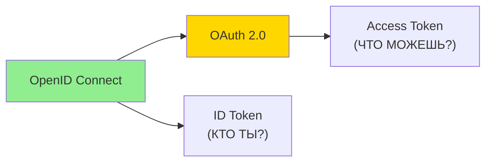
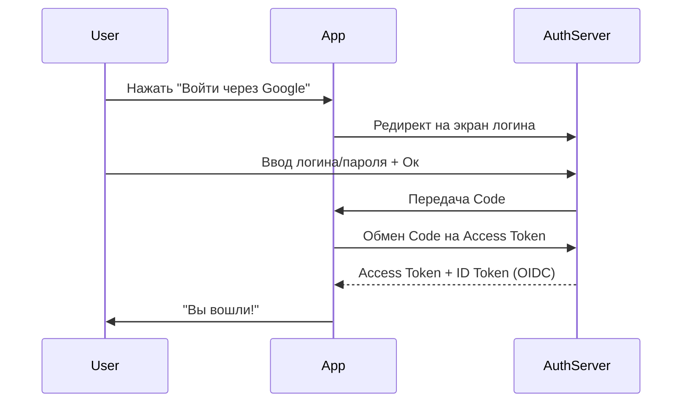
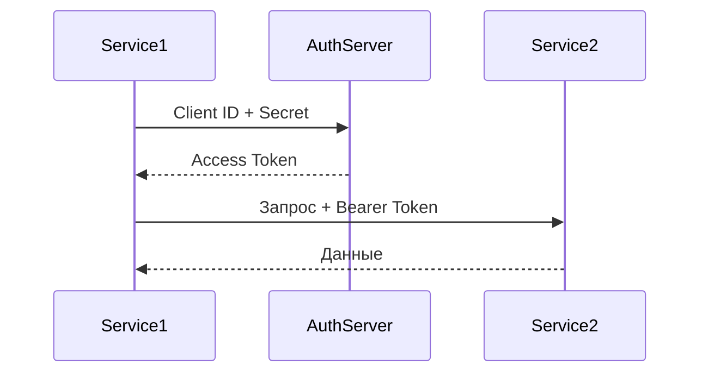
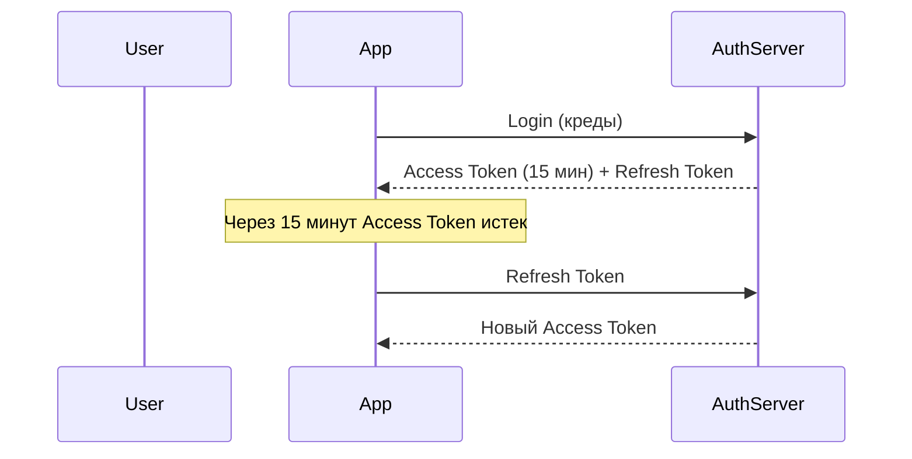

# 🔐 OAuth 2.0 и OpenID Connect: Как работает современная авторизация

## 📑 Содержание
1. [Аутентификация vs Авторизация](#аутентификация-vs-авторизация)
2. [Что такое OAuth 2.0?](#что-такое-oauth-20)
3. [Что такое OpenID Connect (OIDC)?](#что-такое-openid-connect)
4. [Основные роли и потоки (Flows)](#роли-и-потоки)
5. [Реализация на Go](#реализация-на-go)
6. [Refresh Token и безопасность](#refresh-token-и-безопасность)

---

## 🧐 Аутентификация vs Авторизация

Многие путают эти два понятия, но разница критическая:

- **Аутентификация (Authentication/AuthN)**: Ответ на вопрос "Кто вы?". Проверка личности (пароль, отпечаток, SMS-код).
- **Авторизация (Authorization/AuthZ)**: Ответ на вопрос "Что вам разрешено?". Проверка прав доступа к ресурсам.

> [!TIP]
> **Пример из жизни**: Паспорт — это аутентификация. Виза в паспорте — это авторизация (право на въезд).

---

## 🔑 Что такое OAuth 2.0?

**OAuth 2.0** — это протокол **авторизации**. Он позволяет одному приложению (например, Spotify) получить доступ к данным другого приложения (например, Facebook) без передачи пароля пользователя. 🤝

Вместо пароля используется **Access Token**.

### Зачем это нужно?

**Проблема**: Вы хотите, чтобы приложение LinkedIn могло прочитать вашу почту Gmail для поиска контактов.  
**Плохое решение**: Дать LinkedIn ваш пароль от Gmail. ❌ (Полный доступ ко всему!)  
**Хорошее решение**: OAuth 2.0 — LinkedIn получает токен с ограниченными правами только на чтение контактов. ✅

---

## 🆔 Что такое OpenID Connect (OIDC)?

**OpenID Connect** — это слой **аутентификации** поверх OAuth 2.0. 
OAuth дает "ключ от двери" (Access Token), а OIDC дает "бейдж сотрудника" (**ID Token**), в котором написано, кто вы такой.



**ID Token** — это JWT, который содержит информацию о пользователе: `sub` (ID), `email`, `name`, и т.д.

---

## 🔄 Роли и основные потоки (Flows)

### Роли:
1.  **Resource Owner**: Пользователь (Вы).
2.  **Client**: Приложение, которое хочет доступ (LinkedIn).
3.  **Authorization Server**: Сервер, который выдает токены (Google, GitHub).
4.  **Resource Server**: Сервер с данными (API почты, фото).

### 1. Authorization Code Flow (самый частый для веб-приложений)

1.  Клиент перенаправляет пользователя на сервер авторизации.
2.  Пользователь логинится и дает добро.
3.  Сервер возвращает **Code** (код).
4.  Клиент меняет **Code** на **Access Token** (в надежном бэкенд-канале).



---

### 2. Client Credentials Flow (для машина-машина)

Используется, когда **нет пользователя** (сервис общается с другим сервисом).

**Пример**: Ваш бэкенд хочет получить данные из другого микросервиса.



---

### 3. PKCE (Proof Key for Code Exchange)

Расширение для **мобильных и SPA** (Single Page Applications), где нельзя безопасно хранить секрет.

**Идея**: Генерируем случайный `code_verifier` на клиенте, отправляем его хеш (`code_challenge`) на сервер. Это предотвращает атаки перехвата кода.

---

## 💻 Реализация на Go

### Пример: OAuth2 клиент (Authorization Code Flow)

```go
package main

import (
    "context"
    "fmt"
    "golang.org/x/oauth2"
    "golang.org/x/oauth2/google"
    "log"
)

var (
    googleOauthConfig = &oauth2.Config{
        ClientID:     "YOUR_CLIENT_ID",
        ClientSecret: "YOUR_CLIENT_SECRET",
        RedirectURL:  "http://localhost:8080/callback",
        Scopes: []string{
            "https://www.googleapis.com/auth/userinfo.email",
            "https://www.googleapis.com/auth/userinfo.profile",
        },
        Endpoint: google.Endpoint,
    }
    
    // Генерируем случайное состояние для защиты от CSRF
    oauthStateString = "random-state-string"
)

func handleLogin(w http.ResponseWriter, r *http.Request) {
    // Шаг 1: Редирект на Google для логина
    url := googleOauthConfig.AuthCodeURL(oauthStateString)
    http.Redirect(w, r, url, http.StatusTemporaryRedirect)
}

func handleCallback(w http.ResponseWriter, r *http.Request) {
    // Шаг 2: Получаем код после редиректа
    state := r.FormValue("state")
    if state != oauthStateString {
        log.Println("Invalid oauth state")
        http.Redirect(w, r, "/", http.StatusTemporaryRedirect)
        return
    }
    
    code := r.FormValue("code")
    
    // Шаг 3: Обмениваем код на токен
    token, err := googleOauthConfig.Exchange(context.Background(), code)
    if err != nil {
        log.Printf("Code exchange failed: %s", err.Error())
        return
    }
    
    // Теперь у нас есть Access Token!
    fmt.Printf("Access Token: %s\n", token.AccessToken)
    
    // Можно использовать токен для запросов к API
    client := googleOauthConfig.Client(context.Background(), token)
    resp, _ := client.Get("https://www.googleapis.com/oauth2/v2/userinfo")
    // Получили информацию о пользователе
}
```

---

### Проверка JWT (ID Token) на Go

```go
import (
    "github.com/golang-jwt/jwt/v5"
)

func validateIDToken(tokenString string) (*jwt.Token, error) {
    // Парсим и проверяем подпись
    token, err := jwt.Parse(tokenString, func(token *jwt.Token) (interface{}, error) {
        // Проверяем алгоритм
        if _, ok := token.Method.(*jwt.SigningMethodRSA); !ok {
            return nil, fmt.Errorf("unexpected signing method")
        }
        
        // Возвращаем публичный ключ (обычно берется из JWKS endpoint)
        return getPublicKey(), nil
    })
    
    if err != nil {
        return nil, err
    }
    
    if claims, ok := token.Claims.(jwt.MapClaims); ok && token.Valid {
        // Проверяем claims
        if !claims.VerifyExpiresAt(time.Now().Unix(), true) {
            return nil, fmt.Errorf("token expired")
        }
        
        userID := claims["sub"].(string)
        email := claims["email"].(string)
        fmt.Printf("User ID: %s, Email: %s\n", userID, email)
    }
    
    return token, nil
}
```

---

## 🔄 Refresh Token и безопасность

### Зачем нужен Refresh Token?

**Access Token** — короткий (15 мин - 1 час). Если его украдут, урон ограничен.  
**Refresh Token** — долгий (недели/месяцы). Используется для получения нового Access Token без повторного логина.



### На Go:

```go
func refreshAccessToken(refreshToken string) (*oauth2.Token, error) {
    token := &oauth2.Token{
        RefreshToken: refreshToken,
    }
    
    // Библиотека автоматически обновляет токен
    tokenSource := googleOauthConfig.TokenSource(context.Background(), token)
    newToken, err := tokenSource.Token()
    if err != nil {
        return nil, err
    }
    
    return newToken, nil
}
```

---

## 🛡️ Безопасность

### Основные угрозы:

1. **Authorization Code Interception**: Код могут перехватить.  
   **Защита**: Используйте **PKCE** для мобильных/SPA.

2. **Token Leakage**: Токен может утечь через logs, URL, или XSS.  
   **Защита**: 
   - Храните токены в `HttpOnly` куки
   - Никогда не логируйте токены
   - Короткий срок жизни Access Token

3. **CSRF**: Подделка запросов.  
   **Защита**: Проверка `state` параметра (см. код выше).

---

## 💡 Итог

| Концепция | Назначение | Пример |
|:---|:---|:---|
| **OAuth 2.0** | Авторизация (ЧТО можешь?) | Доступ к API |
| **OpenID Connect** | Аутентификация (КТО ты?) | Логин через Google |
| **Access Token** | Доступ к ресурсам | Короткоживущий (15 мин) |
| **Refresh Token** | Обновление Access Token | Долгоживущий (месяцы) |
| **ID Token** | Информация о пользователе | JWT с email, name |

> [!IMPORTANT]
> Никогда не изобретайте свой протокол авторизации. Используйте проверенные библиотеки и провайдеров (Keycloak, Auth0, Google Identity), так как ошибки в безопасности стоят слишком дорого. 🛡️
