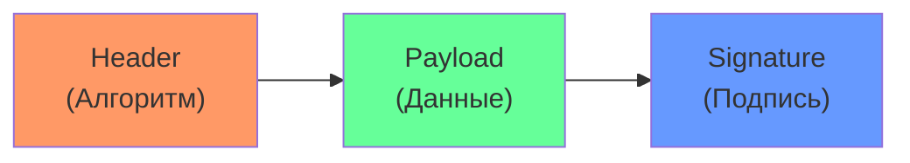
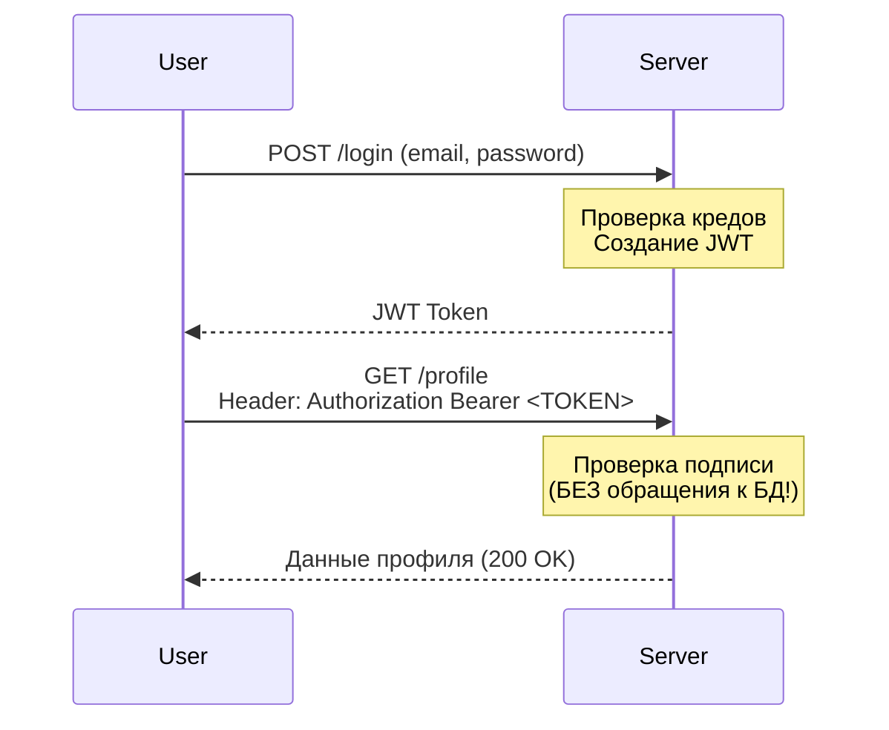

# 📄 JWT (JSON Web Tokens): Паспорт для вашего API

## 📑 Содержание
1. [Что такое JWT?](#что-такое-jwt)
2. [Анатомия токена (Header, Payload, Signature)](#анатомия-токена)
3. [Как это работает под капотом](#как-это-работает)
4. [Реализация на Go](#реализация-на-go)
5. [Безопасность и хранение](#безопасность-и-хранение)

---

## ❓ Что такое JWT?

**JWT (JSON Web Token)** — это открытый стандарт для передачи информации между сторонами в виде объекта JSON. Эта информация считается **достоверной**, так как она подписана цифровой подписью. 🛡️

Обычно используется для авторизации: после логина сервер выдает пользователю JWT, который тот прикрепляет к каждому следующему запросу.

### Зачем это нужно?

**Традиционный подход (Session):**
- Сервер хранит сессии в памяти/БД
- Клиент получает Session ID в куке
- При каждом запросе сервер ищет сессию в БД

**JWT подход (Stateless):**
- Сервер не хранит ничего
- Вся информация в самом токене
- Быстрее, легче масштабировать

---

## 🦴 Анатомия токена

JWT состоит из трех частей, разделенных точками: `header.payload.signature`

### Пример реального JWT:

```
eyJhbGciOiJIUzI1NiIsInR5cCI6IkpXVCJ9.
eyJzdWIiOiIxMjM0NTY3ODkwIiwibmFtZSI6IkpvaG4gRG9lIiwiaWF0IjoxNTE2MjM5MDIyfQ.
SflKxwRJSMeKKF2QT4fwpMeJf36POk6yJV_adQssw5c
```

### Три части:

1.  **Header (Заголовок)**: Тип токена (JWT) и алгоритм шифрования (например, HS256 или RS256).
   ```json
   {
     "alg": "HS256",
     "typ": "JWT"
   }
   ```

2.  **Payload (Полезная нагрузка)**: Сами данные (Claims). Например: `sub` (user ID), `role`, `exp` (время истечения).
   ```json
   {
     "sub": "1234567890",
     "name": "John Doe",
     "iat": 1516239022,
     "exp": 1516242622
   }
   ```

3.  **Signature (Подпись)**: Подтверждение, что токен не был изменен.
   ```
   HMACSHA256(
     base64UrlEncode(header) + "." + base64UrlEncode(payload),
     secret
   )
   ```



---

## ⚙️ Как это работает

В отличие от сессий, JWT — это **Stateless** (без сохранения состояния на сервере) механизм.



---

## 💻 Реализация на Go

### 1. Создание JWT токена

```go
package main

import (
    "fmt"
    "time"
    "github.com/golang-jwt/jwt/v5"
)

var secretKey = []byte("your-secret-key-here")

// Создаем структуру для claims
type Claims struct {
    UserID uint   `json:"user_id"`
    Email  string `json:"email"`
    Role   string `json:"role"`
    jwt.RegisteredClaims
}

func createToken(userID uint, email, role string) (string, error) {
    // Создаем claims
    claims := Claims{
        UserID: userID,
        Email:  email,
        Role:   role,
        RegisteredClaims: jwt.RegisteredClaims{
            ExpiresAt: jwt.NewNumericDate(time.Now().Add(15 * time.Minute)),
            IssuedAt:  jwt.NewNumericDate(time.Now()),
            Issuer:    "my-app",
        },
    }
    
    // Создаем токен
    token := jwt.NewWithClaims(jwt.SigningMethodHS256, claims)
    
    // Подписываем секретным ключом
    tokenString, err := token.SignedString(secretKey)
    if err != nil {
        return "", err
    }
    
    return tokenString, nil
}

func main() {
    token, _ := createToken(123, "user@example.com", "admin")
    fmt.Println("JWT Token:", token)
}
```

---

### 2. Проверка (Верификация) JWT токена

```go
func validateToken(tokenString string) (*Claims, error) {
    // Парсим токен
    token, err := jwt.ParseWithClaims(tokenString, &Claims{}, func(token *jwt.Token) (interface{}, error) {
        // Проверяем алгоритм
        if _, ok := token.Method.(*jwt.SigningMethodHMAC); !ok {
            return nil, fmt.Errorf("unexpected signing method: %v", token.Header["alg"])
        }
        return secretKey, nil
    })
    
    if err != nil {
        return nil, err
    }
    
    // Извлекаем claims
    if claims, ok := token.Claims.(*Claims); ok && token.Valid {
        return claims, nil
    }
    
    return nil, fmt.Errorf("invalid token")
}

func main() {
    tokenString := "eyJhbGciOiJIUzI1..."
    
    claims, err := validateToken(tokenString)
    if err != nil {
        fmt.Println("Token invalid:", err)
        return
    }
    
    fmt.Printf("User ID: %d, Email: %s, Role: %s\n", 
               claims.UserID, claims.Email, claims.Role)
}
```

---

### 3. Middleware для защиты эндпоинтов

```go
import (
    "net/http"
    "strings"
)

func authMiddleware(next http.Handler) http.Handler {
    return http.HandlerFunc(func(w http.ResponseWriter, r *http.Request) {
        // Получаем токен из заголовка Authorization
        authHeader := r.Header.Get("Authorization")
        if authHeader == "" {
            http.Error(w, "Missing authorization header", http.StatusUnauthorized)
            return
        }
        
        // Формат: "Bearer <token>"
        parts := strings.Split(authHeader, " ")
        if len(parts) != 2 || parts[0] != "Bearer" {
            http.Error(w, "Invalid authorization header", http.StatusUnauthorized)
            return
        }
        
        tokenString := parts[1]
        claims, err := validateToken(tokenString)
        if err != nil {
            http.Error(w, "Invalid token", http.StatusUnauthorized)
            return
        }
        
        // Сохраняем юзера в контекст (опционально)
        ctx := context.WithValue(r.Context(), "user_id", claims.UserID)
        ctx = context.WithValue(ctx, "role", claims.Role)
        
        // Передаем управление дальше
        next.ServeHTTP(w, r.WithContext(ctx))
    })
}

// Использование:
func protectedHandler(w http.ResponseWriter, r *http.Request) {
    userID := r.Context().Value("user_id").(uint)
    fmt.Fprintf(w, "Hello, user %d!", userID)
}

func main() {
    http.Handle("/protected", authMiddleware(http.HandlerFunc(protectedHandler)))
    http.ListenAndServe(":8080", nil)
}
```

---

### 4. Refresh Token Pattern

Access Token короткий (15 мин), Refresh Token долгий (недели).

```go
func createTokenPair(userID uint, email, role string) (accessToken, refreshToken string, err error) {
    // Access Token (короткий)
    accessToken, err = createToken(userID, email, role)
    if err != nil {
        return "", "", err
    }
    
    // Refresh Token (долгий, только для обновления)
    refreshClaims := Claims{
        UserID: userID,
        RegisteredClaims: jwt.RegisteredClaims{
            ExpiresAt: jwt.NewNumericDate(time.Now().Add(7 * 24 * time.Hour)), // 7 дней
            IssuedAt:  jwt.NewNumericDate(time.Now()),
        },
    }
    
    refreshTokenObj := jwt.NewWithClaims(jwt.SigningMethodHS256, refreshClaims)
    refreshToken, err = refreshTokenObj.SignedString(secretKey)
    if err != nil {
        return "", "", err
    }
    
    return accessToken, refreshToken, nil
}

func refreshAccessToken(refreshTokenString string) (newAccessToken string, err error) {
    // Проверяем refresh token
    claims, err := validateToken(refreshTokenString)
    if err != nil {
        return "", err
    }
    
    // Создаем новый access token
    newAccessToken, err = createToken(claims.UserID, claims.Email, claims.Role)
    return newAccessToken, err
}
```

---

## 🛡️ Безопасность и хранение

### 🚨 Основные угрозы:

#### 1. XSS (Cross-Site Scripting)

Если токен в `localStorage`, его может украсть вредоносный JS.

**Защита**: Храните в **HttpOnly Cookie** (JS не может прочитать).

```go
http.SetCookie(w, &http.Cookie{
    Name:     "jwt",
    Value:    tokenString,
    HttpOnly: true,      // JS не может прочитать
    Secure:   true,      // Только HTTPS
    SameSite: http.SameSiteStrictMode, // Защита от CSRF
    MaxAge:   3600,      // 1 час
})
```

#### 2. Утечка секретного ключа

Если `secretKey` утекает — злоумышленник может создавать любые токены.

**Защита**:
- Храните ключ в переменных окружения
- Используйте **RS256** (асимметричный) для микросервисов

```go
// RS256: приватный ключ для подписи, публичный для проверки
privateKey, _ := rsa.GenerateKey(rand.Reader, 2048)

token := jwt.NewWithClaims(jwt.SigningMethodRS256, claims)
tokenString, _ := token.SignedString(privateKey)

// Проверка на другом сервисе (только публичный ключ)
jwt.Parse(tokenString, func(token *jwt.Token) (interface{}, error) {
    return &privateKey.PublicKey, nil
})
```

#### 3. Токен не может быть отозван

Если токен украли — он валиден до истечения.

**Защита**:
- Короткий срок жизни (15 минут)
- Blacklist украденных токенов (храним в Redis)

```go
var tokenBlacklist = make(map[string]bool)

func revokeToken(tokenString string) {
    tokenBlacklist[tokenString] = true
}

func isTokenRevoked(tokenString string) bool {
    return tokenBlacklist[tokenString]
}
```

---

### Где хранить на фронтенде?

| Место | Безопасность | XSS | CSRF |
|:---|:---:|:---:|:---:|
| **LocalStorage** | 🔴 Опасно | Уязвимо | Защищено |
| **SessionStorage** | 🔴 Опасно | Уязвимо | Защищено |
| **HttpOnly Cookie** | 🟢 Безопасно | Защищено | Нужен CSRF токен |
| **Memory (JS переменная)** | 🟡 Средне | Уязвимо | Защищено |

### Важные советы:

- **Никогда** не храните пароли или секреты внутри Payload. Его может прочитать любой, просто декодировав Base64.
- **Срок жизни (exp)**: Делайте его коротким (например, 15 минут). Для долгого доступа используйте **Refresh Token**.
- **Алгоритмы**: 
  - `HS256` (симметричный) — для простых случаев
  - `RS256` (асимметричный) — для микросервисов

---

## 💡 Итог

| Концепция | Описание | Значение |
|:---|:---|:---|
| **Header** | Алгоритм подписи | `{"alg": "HS256", "typ": "JWT"}` |
| **Payload** | Данные пользователя | `{"sub": "123", "role": "admin"}` |
| **Signature** | Проверка целостности | `HMACSHA256(header + payload, secret)` |
| **Stateless** | Без сохранения на сервере | Легко масштабировать |
| **Срок жизни** | Access Token короткий | 15 минут (лучшая практика) |

> [!CAUTION]
> Если ваш секретный ключ для подписи (secret) утечет, злоумышленники смогут создавать любые токены и заходить под любым пользователем. Берегите ключ! 🗝️
