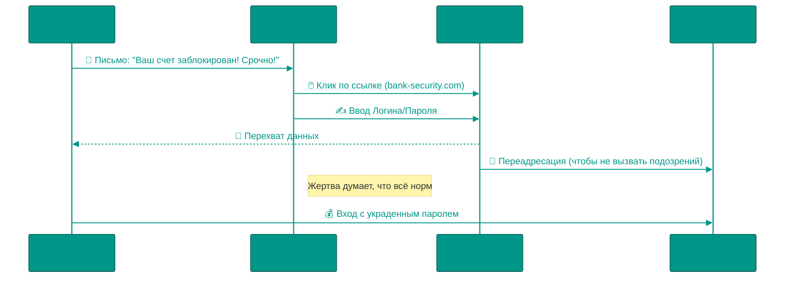

# 💀 Киберугрозы: Анатомия цифрового обмана

В кино хакеры — это гении, которые взламывают Пентагон за 5 секунд, стуча по клавишам. В реальности 95% взломов происходят не потому, что система слабая, а потому что **человек** доверчивый. Хакеры ломают людей, а не компьютеры.

---

## 🏗️ Схема фишинговой атаки (Phishing Workflow)

---

## 1. 🎣 Фишинг (Phishing)
Это искусство заставить вас добровольно отдать пароль.

### Психология атаки
Хакеры используют формулу: **Страх/Жадность + Срочность = Отключение мозга**.
*   *"На вас оформили кредит! Срочно отмените!"* (Страх)
*   *"Вы выиграли iPhone! Заберите приз сейчас!"* (Жадность)
Когда человек в панике, он не проверяет адрес отправителя.

### 👓 Технические детали: Punycode и Homograph Attack
Как подделать адрес `google.com`?
Браузеры понимают только латиницу (ASCII). Если вы зарегистрируете домен `gоogle.com` (с русской 'о'), браузер увидит его как `xn--gogle-6xd.com` (Punycode).
Но в адресной строке он может отобразить его как `google.com`. Это называется **Homograph Attack**.
*Защита*: Внимательно смотреть на сертификат (замочек) — он выдается на конкретную организацию.

---

## 2. 🎭 Социальная инженерия
Взлом без кода.

### "Привет, это ты на фото?"
Вам приходит сообщение от друга (взломанного) с файлом `photo_2024.apk` или ссылкой. Вы думаете: "Ого, где меня сняли?", и открываете.
*   **Реальность**: Это не фото, а вирус. Друг не виноват, его аккаунт используется как бот для рассылки.

### CEO Fraud (Fake Boss)
Бухгалтеру приходит письмо от "Гендиректора" (с похожего адреса): *"Я на встрече, срочно оплати этот счет, это важно для сделки"*.
Бухгалтер боится переспросить босса и переводит $100,000 на счет хакеров.

---

## 3. 🦠 Вредоносное ПО (Malware)

### 🤖 Трояны и Droppers (Android/APK)
Вы качаете "Взломанный Spotify" или "Игру бесплатно".
Приложение работает как надо. Но внутри сидит **Dropper** — маленький код, который ждет ночь. Ночью, когда телефон на зарядке, он скачивает основную боевую часть вируса.
*   **Права доступа**: Вирус просит "Специальные возможности" (Accessibility Services). Если вы дадите их, он сможет сам нажимать кнопки на экране, заходить в Сбербанк Онлайн и переводить деньги, пока вы спите.

### ⛏️ Майнеры (Cryptojacking)
Ваш компьютер начинает тормозить и шуметь вентиляторами, когда вы просто читаете новости.
Сайт (например, с пиратскими фильмами) запустил JS-скрипт, который использует ваш процессор для майнинга криптовалюты Monero. Вы платите за электричество, хакер получает монеты.

### 🔒 Шифровальщики (Ransomware)
Самый страшный сон корпораций. Вирус шифрует все документы на диске криптостойким алгоритмом (AES + RSA).
На экране появляется таймер: *"Платите 5 Биткоинов через 24 часа, или ключ удалится навсегда"*.
*   **Deep Dive**: Вирус часто генерирует уникальный ключ для каждой жертвы и отправляет его на C2 (Command & Control) сервер хакера. Без этого ключа расшифровка математически невозможна (на подбор уйдут миллионы лет).

---

## 4. 🎯 Типы фишинга: От массовых до таргетированных

### 🐟 Mass Phishing (Массовый)
Миллионы одинаковых писем. Расчет на то, что из 1,000,000 получателей хотя бы 100 клюнут.

### 🎯 Spear Phishing (Целевой)
Атака на конкретного человека. Хакер изучает жертву в соцсетях: узнает имя начальника, проекты, коллег. Письмо выглядит так: *"Привет, Борис! Ты не мог бы посмотреть договор по проекту X? Директор просил срочно"*.

### 🐋 Whaling (Охота на китов)
Spear Phishing, но жертва — CEO, CFO или другой топ-менеджер. Цель — доступ к финансам или конфиденциальной стратегии компании.

### 📞 Vishing (Voice Phishing)
Звонок от "сотрудника банка". Голос профессиональный, в фоне слышен шум колл-центра (запись). *"Мы заблокировали подозрительную операцию на 50,000₽. Назовите код из SMS для отмены"*. Код из SMS — это код подтверждения перевода ВАШИХ денег хакеру.

### 📱 Smishing (SMS Phishing)
СМС: *"Ваша посылка ожидает в пункте выдачи. Отследить: bit.ly/xyz123"*. Ссылка ведет на фейковый сайт "Почта России", который просит ввести данные карты "для оплаты хранения".

### 📋 Clone Phishing
Хакер перехватывает реальное письмо (например, счет от Amazon), меняет ссылку оплаты на фейковую и пересылает от имени Amazon. Текст идентичен оригиналу.

---

## 5. 🚨 Реальные кейсы (Case Studies)

### Target (2013): 40 млн карт украдено через HVAC подрядчика
Хакеры взломали небольшую фирму по обслуживанию кондиционеров, которая имела VPN-доступ к сети Target. Через этот доступ установили малварь на POS-терминалы (кассы) и записывали данные карт в реальном времени. Ущерб: $292 млн.

### SolarWinds (2020): Supply Chain Attack
Хакеры внедрили бэкдор в обновление ПО SolarWinds Orion (которым пользуются 18,000 компаний, включая Microsoft и госструктуры США). Обновление подписано цифровой подписью компании, поэтому антивирусы не среагировали. APT группа получила доступ к инфраструктуре на месяцы.

---

## 6. 🕵️ Advanced Persistent Threat (APT)
Это не вирус, это кампания. APT группы (часто государственные) годами сидят в сети жертвы, собирая данные.

### Жизненный цикл APT
1. **Initial Compromise**: Фишинг или Zero-Day exploit
2. **Establish Foothold**: Установка бэкдора и создание резервных точек входа
3. **Escalate Privileges**: Кража паролей администраторов (Mimikatz)
4. **Lateral Movement**: Перемещение по сети, заражение других машин
5. **Data Exfiltration**: Медленная утечка данных небольшими порциями (чтобы не вызвать подозрений по трафику)
6. **Maintain Presence**: Выживание после обновлений и проверок безопасности

---

## 7. 💸 Современные Scam-схемы

### Крипто-мошенничество
*   **Rug Pull**: Создатели крипто-проекта собирают деньги инвесторов, затем удаляют всю ликвидность из пула и исчезают. Пример: Squid Game Token (2021) — $3.38 млн украдено за секунды.
*   **Fake Airdrop**: "Получите бесплатные токены! Подключите кошелек MetaMask". Вы подписываете транзакцию, которая разрешает контракту списать ВСЕ ваши токены.

### Pig Butchering (забой свиней)
Долгосрочное мошенничество. Мошенник притворяется романтическим партнером (знакомство в Tinder/LinkedIn). Месяцами строит доверие. Затем предлагает "инвестировать вместе" в крипто-платформу. Вы видите, как ваш баланс растет (поддельный интерфейс). Когда пытаетесь вывести деньги — сайт исчезает.

---

## 8. 💥 DDoS-атаки (Distributed Denial of Service)
Цель — обрушить сервис, завалив его трафиком.

### Типы DDoS
*   **Volumetric (Пропускная способность)**: Забить канал гигантским объемом мусорного трафика. Используют DNS Amplification: отправляют запрос к DNS-серверу с подделанным IP жертвы. Сервер отвечает жертве пакетом в 50 раз больше.
*   **Protocol Attack (SYN Flood)**: Эксплуатация TCP handshake. Атакующий посылает тысячи SYN-пакетов, но не завершает соединение. Сервер держит все эти "полуоткрытые" соединения в памяти, пока она не закончится.
*   **Application Layer (HTTP Flood)**: Имитация легитимных пользователей. Ботнет делает тысячи запросов к тяжелым страницам (поиск, фильтры). Сервер тратит CPU на обработку, база данных умирает.

### Mirai Botnet (2016)
IoT-устройства (камеры видеонаблюдения, роутеры) с паролем `admin/admin` были заражены и образовали ботнет из 600,000 устройств. Атака на DNS-провайдера Dyn обрушила Twitter, Netflix, Reddit на несколько часов.

---

## 9. 🛡️ Практические инструменты защиты

### Проверка email
*   **Заголовки письма**: Смотреть поле `Return-Path` и `Received`. Даже если `From` говорит `support@paypal.com`, настоящий отправитель может быть `scam@xyz.ru`.
*   **DKIM/SPF проверка**: В Gmail нажмите "Показать оригинал" → ищите `SPF: PASS` и `DKIM: PASS`. Если `FAIL` — письмо подделано.

### Проверка сайтов
*   **VirusTotal** (virustotal.com): Вставьте URL — сервис проверит его 70+ антивирусами и покажет, не замечен ли домен в фишинге.
*   **WHOIS Lookup**: Узнайте, когда домен зарегистрирован. Если `paypal-security.com` создан 3 дня назад — это 100% фишинг.
*   **PhishTank** (phishtank.org): База известных фишинговых ссылок.

### Файлы
*   **Песочница (Sandbox)**: Запустите подозрительный файл в виртуальной машине или на [any.run](https://any.run) — увидите, что он делает (обращается к каким серверам, шифрует ли файлы).

### Защита от 0-day
*   **Zero Trust Architecture**: Не доверять даже внутреннему трафику. Каждый запрос проверяется.
*   **Патчи**: Подписаться на бюллетени безопасности (Microsoft Security Response Center, CVE). Устанавливать критические обновления в день релиза.

### 2FA с умом
*   **SMS — слабое звено**: SIM-swap атака (хакер переоформляет вашу SIM на себя в салоне связи по поддельному паспорту).
*   **Лучше**: Аппаратные ключи (YubiKey) или TOTP-приложения (Google Authenticator, Authy).

---

## 10. 🎓 Главное правило
**Никогда не принимайте решения в состоянии страха или эйфории.** Если письмо/звонок вызывает панику ("Ваш счет арестован!") или жадность ("Вы выиграли!") — остановитесь. Хакеры играют на эмоциях. Проверьте информацию через официальный канал (найдите номер банка сами, не перезванивайте на тот, который в SMS).

<!-- QUIZ_START 

[
    {
        "question": "Какую психологическую 'формулу' чаще всего используют хакеры в фишинговых атаках?",
        "options": [
            "Логика + Терпение = Успех",
            "Страх/Жадность + Срочность = Отключение критического мышления",
            "Сложный код + Быстрый интернет = Взлом",
            "Вежливость + Официальный стиль = Доверие"
        ],
        "correctIndex": 1
    },
    {
        "question": "Что такое Homograph Attack (атака через двойников)?",
        "options": [
            "Взлом через веб-камеру",
            "Использование похожих символов других алфавитов (например, русской 'о') для подделки адреса сайта",
            "Кража пароля из буфера обмена",
            "Атака на физическую базу данных"
        ],
        "correctIndex": 1
    },
    {
        "question": "В чем заключается главная опасность троянов-'дропперов' на смартфонах?",
        "options": [
            "Они сразу удаляют все фото",
            "Они разряжают батарею за 5 минут",
            "Они являются лишь 'оболочкой', которая в нужный момент скачивает основную часть вируса",
            "Они отключают экран"
        ],
        "correctIndex": 2
    }
]

QUIZ_END -->

