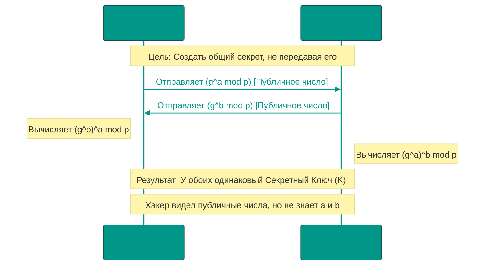
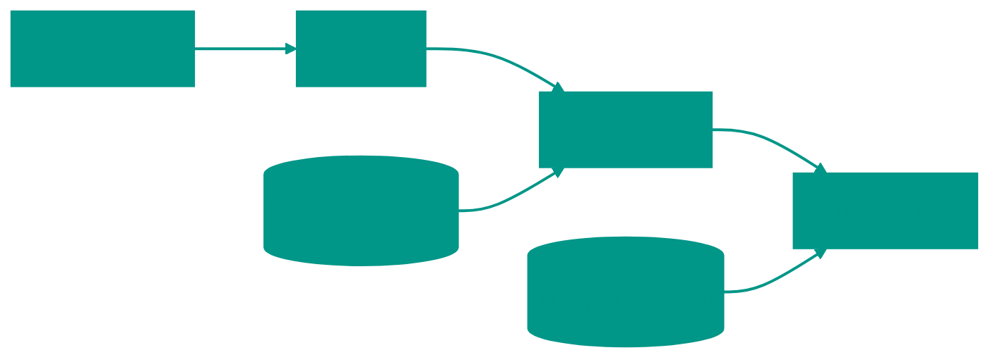

# 🔐 Криптография: Математическая основа безопасности

Криптография — это наука о методах защиты информации. Это не просто "шифрование", это комплекс протоколов, гарантирующих три столпа информационной безопасности (CIA): Конфиденциальность (никто не прочтет), Целостность (никто не изменит) и Доступность (информация доступна, когда нужна).

---


## 📜 История: От Цезаря до квантовых компьютеров

Криптография — это вечная борьба между теми, кто защищает секреты, и теми, кто их взламывает. Эта гонка вооружений длится тысячи лет.


### Античность: Шифр Цезаря (I век до н.э.)
Юлий Цезарь использовал простейший **шифр подстановки**: каждая буква сдвигается на фиксированное число позиций. Например, сдвиг на 3:

```
A -> D,  B -> E,  C -> F
ATTACK -> DWWDFN
```

**Криптоанализ**: Взлом тривиален. В русском языке 33 буквы → всего 33 варианта сдвига. Перебор займёт секунды.


### Средневековье: Частотный анализ (IX век)
Арабский учёный **Аль-Кинди** разработал частотный анализ. Идея: в любом языке некоторые буквы встречаются чаще других.

**Пример**: В русском «О» встречается в ~10% текста, «Я» — в ~2%. Если в шифре символ «X» встречается часто, вероятно, это зашифрованная «О».

**Результат**: Простые шифры подстановки стали бесполезны.


### Возрождение: Шифр Виженера (XVI век)
**Полиалфавитный шифр**: Используется ключевое слово. Каждая буква ключа определяет свой сдвиг.

```
Текст:  ATTACKATDAWN
Ключ:   LEMONLEMONLE
Шифр:   LXFOPVEFRNHR
```

**Криптоанализ**: Считался "невзламываемым" 300 лет. В 1863 Фридрих Касиски показал, что если найти длину ключа (анализ повторяющихся последовательностей), можно разбить шифр на несколько шифров Цезаря и применить частотный анализ.


### XX век: Enigma и Вторая мировая война
Немецкая машина **Enigma** использовала роторы для создания миллиардов комбинаций ключей.

**Количество комбинаций**: ~159 квинтиллионов (159 × 10¹⁸).

**Взлом**: Алан Тьюринг и команда в Блетчли-парке создали электромеханический компьютер **Bombe**, который эксплуатировал слабости протокола (немцы никогда не шифровали букву саму в себя: A ≠ A). Взлом Enigma сократил войну на ~2 года по оценкам историков.

**Урок**: Даже математически сильный шифр может быть взломан через ошибки реализации или человеческий фактор (немецкие операторы часто использовали предсказуемые ключи, например, три подряд буквы на клавиатуре "QWE").


### Революция 1970-х: Рождение современной криптографии
До этого момента все шифры были симметричными (один ключ для шифрования и расшифровки).

**Проблема распределения ключей**: Как Борис и Ильяс могут договориться о секретном ключе, если они никогда не встречались? Если отправить ключ по почте/интернету, его может перехватить шпион.

**1976: Протокол Диффи-Хеллмана**: Революция. Два человека могут создать общий секрет по открытому каналу, который видят все, но никто не может его вычислить.

**1977: RSA**: Асимметричное шифрование. Публичный ключ можно публиковать в газете, но расшифровать сможет только владелец приватного ключа.


### Современность: Квантовая угроза (2020-е)
**Проблема**: Квантовые компьютеры (когда станут достаточно мощными) смогут взломать RSA и ECC за минуты используя алгоритм Шора.

**Решение**: Пост-квантовая криптография. В 2022 NIST (Национальный институт стандартов США) выбрал новые алгоритмы, устойчивые к квантовым атакам:
*   **Kyber** (шифрование) — основан на сложности решения систем уравнений
*   **Dilithium** (подписи) — основан на решётках (lattices)

---


## ⚔️ Криптография vs Криптоанализ

Криптография — это меч, криптоанализ — щит (или наоборот, смотря с какой стороны смотреть).


### Атаки на шифры

**1. Brute Force (Грубая сила**)
Перебор всех возможных ключей.
*   AES-128: 2¹²⁸ вариантов (~3.4 × 10³⁸). Даже на всех суперкомпьютерах мира перебор займёт миллиарды лет.
*   Плохой пароль (6 символов, только буквы): 26⁶ = 308 миллионов вариантов. Взлом за секунды.

**Защита**: Длинные ключи + ограничение попыток ввода.

**2. Man-in-the-Middle (MITM***)
Хакер встаёт между Борисом и Ильясом, подменяя публичные ключи.

```
Борис думает, что общается с Ильясом,
но на самом деле общается с Хакером.
Хакер расшифровывает сообщения, читает их,
и заново шифрует для Ильяса.
```

**Защита**: Цифровые сертификаты (Certificate Authorities). Браузер проверяет, что публичный ключ сайта подписан доверенным центром (Let's Encrypt, DigiCert).

**Что такое Let's Encrypt?**: Let's Encrypt — это бесплатный, автоматизированный и открытый центр сертификации (Certificate Authority), запущенный в 2015 году. Он предоставляет SSL/TLS-сертификаты бесплатно для включения HTTPS на веб-сайтах, делая шифрование доступным для всех. Используя автоматизированные инструменты, он упрощает процесс получения и обновления сертификатов, значительно увеличивая внедрение HTTPS в интернете. В контексте криптографии Let's Encrypt играет важную роль в инфраструктуре открытых ключей (PKI), выдавая X.509 сертификаты, которые связывают доменные имена с публичными ключами, позволяя браузерам проверять идентичность веб-сайтов и устанавливать защищенные соединения.

**3. Side-Channel Attacks (Атаки по сторонним каналам)**
Взлом не математики, а физической реализации.

*   **Timing Attack**: Измерение времени выполнения операций. Если сравнение паролей прерывается на первом неправильном символе, хакер может узнать, какие символы правильные, по времени ответа.
*   **Power Analysis**: Измерение потребления электричества процессором. Разные операции потребляют разное количество энергии.
*   **Acoustic Cryptanalysis**: Можно восстановить ключ RSA, слушая звук работы компьютера (2013, исследование Tel Aviv University).

**Защита**: Constant-time алгоритмы, шумовая маскировка.

**4. Квантовые компьютеры (будущее)**
Алгоритм Шора может разложить большое число на простые множители за полиномиальное время.

*   **RSA-2048**: Классический компьютер взламывает ~300 лет. Квантовый (с 4096 кубитами) — за часы.

**Защита**: Переход на пост-квантовые алгоритмы (Kyber, Dilithium, SPHINCS+).

---


## 🏗️ Протокол Диффи-Хеллмана (Обмен ключами)



---


## 1. 🗝️ Симметричное шифрование (Symmetric Encryption)

Принцип: **"Один ключ для всего"**. Борис запирает сундук ключом, Ильяс открывает его копией того же ключа. Это самый быстрый вид шифрования, используемый для передачи больших объемов данных.


### AES (Advanced Encryption Standard)
Мировой стандарт. AES — это **блочный шифр**: он разбивает данные на блоки по 128 бит (16 байт) и применяет к ним сложные математические преобразования (раунды).

*   **AES-128**: 10 раундов. Считается достаточным для большинства задач.
*   **AES-256**: 14 раундов. Выбор для государственной тайны и защиты от будущего взлама квантовыми компьютерами (алгоритм Гровера).


### Режимы работы (Modes of Operation)
Просто шифровать блоки нельзя (проблема ECB — электронная кодовая книга). Если шифровать одинаковые блоки (например, пустые места в файле), в шифре будут видны паттерны.

| Режим | Описание | Плюсы/Минусы |
| :--- | :--- | :--- |
| **ECB** | Каждый блок шифруется отдельно | ❌ Небезопасно (видны паттерны картинки) |
| **CBC** | Каждый блок зависит от предыдущего | ✅ Безопасно, но медленно (нельзя распараллелить) |
| **GCM** | Шифрование + аутентификация (AEAD) | 🏆 **Золотой стандарт**. Быстро и гарантирует целостность. |

---


## 2. 🔑 Асимметричное шифрование (Public-Key Cryptography)

Решает проблему передачи ключа. У каждого участника есть пара: **Публичный ключ** (Public Key — можно раздавать всем) и **Приватный ключ** (Private Key — хранить в строгом секрете).


### Как это работает (Трюк с замком)
1.  Ильяс отправляет Борису **открытый замок** (от которого только у него есть ключ).
2.  Борис кладет письмо в ящик, защелкивает замок Ильяса и отправляет ящик ему.
3.  Ильяс открывает ящик своим ключом. Хакер видел ящик и замок, но не видел ключ.


### Сравнение RSA vs ECC
Сегодня RSA считается "тяжелым" стандартом, а ECC (эллиптические кривые) — современным и легким.

| Параметр | RSA | ECC |
| :--- | :--- | :--- |
| **Основа** | Факторизация простых чисел | Логарифм на кривой |
| **Размер ключа (256-бит защита)** | 3072 бит 🐘 | 256 бит 🏎️ |
| **Скорость** | Медленно | Очень быстро |
| **Применение** | Старые системы, SSH | Темы, WhatsApp, TLS 1.3 |

---


## 3. #️⃣ Хеширование и защита паролей

Хеш-функция — это "отпечаток пальца" данных. Это **односторонняя** функция: легко получить хеш из строки, но невозможно (математически крайне сложно) восстановить строку из хеша.


### Идеальный хеш (SHA-256)
Хороший алгоритм должен быть:
1.  **Детерминированным**: Одинаковый вход -> одинаковый выход.
2.  **Быстрым**: Вычисление должно быть мгновенным.
3.  **Стойким к коллизиям**: Невозможно найти два разных входа с одинаковым выходом.
4.  **Лавинообразным**: Если изменить 1 бит на входе, хеш должен измениться до неузнаваемости.


### Соль (Salt) и Pepper
Если хакер украдет базу данных паролей, он будет использовать **Радужные таблицы** (базы готовых хешей).
*   **Соль**: Случайная строка, добавляемая к паролю пользователя. Хранится в БД рядом с хешем. Защищает от массового взлома популярных паролей.
*   **Pepper (Перец)**: Секретная строка, добавляемая к паролю, которая хранится **вне** базы данных (например, в конфигах сервера или HSM). Если украдут БД, без перца взлом невозможен.


### Пример кода на Go (Хеширование с солью)
```go
import (
	"crypto/sha256"
	"encoding/hex"
)

func HashPassword(password, salt string) string {
	h := sha256.New()
	h.Write([]byte(password + salt))
	return hex.EncodeToString(h.Sum(nil))
}
```

---


## 4. 🛡️ Цифровые подписи (Digital Signatures)

Подпись гарантирует, что сообщение пришло именно от автора и не было изменено.



**Процесс**:
1.  Автор создает хеш документа.
2.  Автор шифрует хеш своим **Приватным** ключом. Это и есть подпись.
3.  Получатель расшифровывает подпись **Публичным** ключом автора и получает хеш.
4.  Получатель сам считает хеш документа и сравнивает с расшифрованным. Если они равны — документ подлинный.

---


## 5. 🚀 Современный WEB: TLS 1.3

Когда вы видите "замочек" в браузере, работает протокол **TLS (Transport Layer Security)**. Современная версия 1.3 убрала старые небезопасные шифры и ускорила соединение.


### Perfect Forward Secrecy (PFS)
Это концепция, при которой компрометация долгосрочного приватного ключа сервера (например, ключа сайта `google.com`) не позволяет расшифровать записи трафика, сделанные в прошлом.
**Как**: Для каждого сеанса создаются временные (эемерные) ключи Диффи-Хеллмана, которые уничтожаются сразу после закрытия вкладки.

---


## 🔄 Интеграционная сводка: Как работают вместе хеширование, ключи и криптография

После изучения различных аспектов криптографии важно понять, как все эти элементы работают **вместе** для обеспечения безопасности:

### 🔗 Взаимосвязь компонентов

**1. Хеширование и ключи:**
- **Хеши** используются для защиты **ключей** при хранении (например, хеширование паролей с солью)
- **Хеши** также помогают проверить **целостность** ключей и данных (любое изменение приведет к изменению хеша)

**2. Симметричные и асимметричные ключи:**
- **Асимметричное шифрование** (RSA/ECC) используется для **безопасной передачи симметричных ключей** (как в TLS)
- **Симметричное шифрование** (AES) используется для **быстрой передачи больших объемов данных** после установления безопасного канала

**3. Цифровые подписи как связующий элемент:**
- Используют **асимметричные ключи** для шифрования **хеша** документа
- Обеспечивают **аутентичность** (кто отправитель?) и **целостность** (не изменено ли?)

### 🔄 Комплексный пример: TLS-соединение (HTTPS)

Когда вы заходите на сайт по HTTPS, происходит следующее:

1. **Сервер** отправляет свой **публичный ключ** (в сертификате)
2. **Клиент** проверяет **подпись** сертификата (используя хеши и асимметричное шифрование)
3. **Клиент** генерирует **сессионный ключ** для AES
4. **Клиент** шифрует этот ключ **публичным ключом** сервера
5. **Сервер** расшифровывает и теперь оба участника используют **симметричное шифрование** (AES) для быстрой передачи данных
6. **Хеши** используются для проверки **целостности** передаваемых данных

### 🎯 Главные принципы взаимодействия

- **"Сильная сторона"** каждой технологии используется по назначению:
  - **Хеши** для проверки целостности и хранения паролей
  - **Асимметричные ключи** для безопасной передачи информации
  - **Симметричные ключи** для быстрого шифрования данных

- **Комбинирование** методов обеспечивает **многослойную защиту**:
  - Даже если один уровень будет взломан, другие остаются целы

- **Perfect Forward Secrecy**: каждый сеанс использует уникальные временные ключи (часто через Диффи-Хеллман), чтобы компрометация одного ключа не повлияла на другие сессии

Таким образом, криптография — это не просто отдельные техники, а **связанная система**, где хеши, симметричные и асимметричные ключи работают **вместе**, обеспечивая конфиденциальность, целостность и аутентичность информации.

## 🏁 Резюме: Как выбрать защиту?

1.  **Хотите скрыть данные?** -> AES (Симметричное).
2.  **Нужно передать ключ по сети?** -> RSA/ECC (Асимметричное) или Diffie-Hellman.
3.  **Нужно проверить целостность файла?** -> SHA-256 (Хеширование).
4.  **Нужно хранить пароли?** -> Argon2 или BCrypt (специальные "медленные" хеши) + Соль.
---


## 🚀 Что дальше?

Теперь, когда вы знаете основы криптографии, переходите к изучению того, как эти технологии применяются в реальном интернете:
*   [**TLS/SSL**](file:///Users/ilasgibadullin/Documents/develop/projects/brave_monkey_education/materials/rus/информатика(теория)/07_security/2.TLS_SSL.md) — Как браузер защищает ваши данные в пути.

<!-- QUIZ_START

[
    {
        "question": "В чем главное отличие асимметричного шифрования от симметричного?",
        "options": [
            "Оно работает быстрее",
            "Оно использует один ключ для всех",
            "Оно использует пару ключей: публичный для шифрования и приватный для расшифровки",
            "Оно не требует математических вычислений"
        ],
        "correctIndex": 2
    },
    {
        "question": "Для чего при хешировании паролей используется 'соль' (salt)?",
        "options": [
            "Для ускорения вычислений",
            "Для защиты от взлома по радужным таблицам (базам готовых хешей)",
            "Для шифрования пароля в обе стороны",
            "Для красоты кода"
        ],
        "correctIndex": 1
    },
    {
        "question": "Как работает цифровая подпись?",
        "options": [
            "Автор шифрует документ публичным ключом",
            "Автор заменяет буквы на картинки",
            "Автор шифрует хеш документа своим ПРИВАТНЫМ ключом, а получатель проверяет его ПУБЛИЧНЫМ ключом автора",
            "Автор просто пишет свое имя в конце файла"
        ],
        "correctIndex": 2
    }
]

QUIZ_END -->


