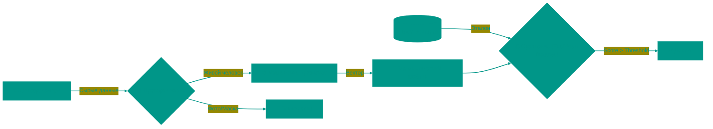

# 👁️ Биометрия: Технологии аутентификации

Биометрическая аутентификация заменила пароли, потому что пароль можно забыть или украсть, а лицо или палец всегда с вами. Но за кажущейся простотой "взгляда в камеру" скрываются сложные вероятностные алгоритмы и защита от подделок.

---

## 🏗️ Процесс распознавания

---

## 1. 👆 Отпечаток пальца (Fingerprint)
Узор на пальцах формируется еще в утробе матери и не меняется всю жизнь (кроме глубоких травм).

### Типы сканеров
1.  **Оптические**: Делают 2D-фотографию пальца. Устарели, так как легко обманываются качественным снимком или муляжом.
2.  **Емкостные (Capacitive)**: Используют массив микроконденсаторов. Кожа человека проводит ток. Рифленый узор пальца (гребни) касается сенсора, меняя емкость в точке контакта, а впадины — нет. Это создает точную электрическую карту. Не работают с мокрыми руками.
3.  **Ультразвуковые (Ultrasonic)**: Посылают звуковой импульс, который отражается от кожи. Строят 3D-карту, "видя" глубину пор. Работают через грязь, воду и стекло экрана.

---

## 2. 🤳 Распознавание лица (Facial Recognition)
Современные системы (FaceID) не просто фотографируют вас. Они строят трехмерную модель головы.

### Технология Structured Light
Проектор (Dot Projector) выстреливает в лицо 30 000 невидимых инфракрасных точек. ИК-камера считывает искажение этой сетки. Если точки сместились влево — значит, поверхность выпуклая (нос), если вправо — вогнутая. Так строится карта глубины.
Это позволяет отличать живое лицо от плоской фотографии.

### Нейросети и Векторы
Система не сравнивает картинки попиксельно (вы можете надеть очки или изменить прическу). Нейросеть превращает ваше лицо в набор чисел — **Вектор признаков** (Feature Vector). Она измеряет расстояние между глазами, форму скул, глубину глазниц.
Сравнение лиц — это вычисление математического расстояния между двумя векторами в многомерном пространстве.

---

## 3. 🎯 Вероятности ошибок (FAR/FRR)
Биометрия никогда не дает ответ "Да" или "Нет" со 100% уверенностью. Она выдает **Score** (процент совпадения).

*   **FAR (False Acceptance Rate)**: Вероятность ложного допуска. Система пустила чужого. Это критическая уязвимость безопасности. В FaceID вероятность ~1 на 1,000,000.
*   **FRR (False Rejection Rate)**: Вероятность ложного отказа. Система не узнала хозяина. Это проблема удобства (приходится вводить пин-код).
*   **Настройка порога**: Инженеры балансируют между этими параметрами. Для банковского приложения важнее низкий FAR (никого не пустить), для разблокировки телефона — низкий FRR (чтобы не бесить пользователя).

---

## 4. 🩸 Liveness Detection (Проверка живости)
Главная задача хакеров — подсунуть системе "фейк" (Deepfake, маску, фото).
Современные системы ищут признаки жизни:
*   Микродвижения глаз.
*   Изменение цвета кожи от пульса (пульсовая волна).
*   Отражение света от роговицы (блик).
*   Контекст (глубина сцены, отсутствие рамок экрана телефона на изображении).

---

## 5. 🔐 Безопасность (Secure Enclave)
Биометрические данные считаются **чувствительными**. Они не покидают устройство.
1.  Сканер читает палец/лицо.
2.  Данные отправляются сразу в **Secure Enclave** (изолированный сопроцессор).
3.  Там они превращаются в хеш и сверяются с эталоном.
4.  Основной процессор (CPU) получает только результат: `True` или `False`.
Даже если на телефоне есть вирус с правами root, он физически не может прочитать память Secure Enclave.

<!-- QUIZ_START 

[
    {
        "question": "Какой тип сканера отпечатков пальцев считается самым современным и надежным (работает через грязь и стекло)?",
        "options": [
            "Оптический",
            "Емкостный",
            "Ультразвуковой",
            "Механический"
        ],
        "correctIndex": 2
    },
    {
        "question": "Что такое FAR (False Acceptance Rate) в биометрии?",
        "options": [
            "Вероятность того, что система не узнает хозяина",
            "Вероятность ложного допуска (система пустила чужого)",
            "Скорость распознавания лица",
            "Количество точек в FaceID"
        ],
        "correctIndex": 1
    },
    {
        "question": "Почему современные системы FaceID сложно обмануть фотографией?",
        "options": [
            "Они сверяют цвет глаз",
            "Они используют проектор точек для построения 3D-карты глубины лица",
            "Они требуют моргнуть",
            "Они работают только при ярком свете"
        ],
        "correctIndex": 1
    }
]

QUIZ_END -->

