# 🧅 Dark Web и Tor: Анонимные сети

> [!CAUTION]
> **МАТЕРИАЛ ТОЛЬКО ДЛЯ ОЗНАКОМИТЕЛЬНЫХ ЦЕЛЕЙ. НЕ РЕКОМЕНДУЕТСЯ ИСПОЛЬЗОВАТЬ ДЛЯ ПОЛУЧЕНИЯ ДОСТУПА К DARK WEB ИЛИ ТОР.**

Интернет, который мы видим, — это вершина айсберга. Большинство данных (Deep Web) скрыто за паролями, а часть (Dark Web) — намеренно спрятана в оверлейных сетях, невидимых для обычных браузеров. Tor — самый известный инструмент для доступа к этой теневой части.

---

## 🏗️ Механизм луковой маршрутизации

```mermaid
%%{init: { 'theme': 'base', 'themeVariables': { 'lineColor': '#009688', 'primaryColor': '#009688', 'primaryTextColor': '#009688', 'attributeBkg': '#009688', 'attributeTextColor': '#009688', 'signalColor': '#009688', 'actorLineColor': '#009688', 'nodeBorder': '#009688', 'clusterBorder': '#009688', 'textColor': '#009688', 'fontSize': '16px' } } }%%
graph LR
    User["👤 Вы"] -->|Зашифровано ключом 1| Node1["🛡️ Входной (Guard)"]
    Node1 -->|Зашифровано ключом 2| Node2["🔄 Срединный"]
    Node2 -->|Зашифровано ключом 3| Node3["🏁 Выходной (Exit)"]
    Node3 -->|Чистый запрос| Site["🌐 Сервер (Google)"]
    
    style User fill:#f9f,stroke:#333
    style Node1 fill:#ccf,stroke:#333
    style Node2 fill:#ccf,stroke:#333
    style Node3 fill:#fcc,stroke:#333



linkStyle default stroke:#009688,stroke-width:2px;




```

---

## 1. 🧊 Уровни Интернета
*   **Surface Web (4%)**: Индексируемая часть. Google, Wikipedia, СМИ. Доступна всем.
*   **Deep Web (90%)**: Неиндексируемая часть. Базы данных корпораций, ваша личная переписка, админки сайтов, банковские транзакции. Сюда нельзя попасть по прямой ссылке без авторизации.
*   **Dark Web (6%)**: Скрытые сети (Darknets), работающие поверх обычного интернета, но требующие спец. ПО (Tor, I2P, Freenet). Здесь используются псевдо-домены `.onion`, которые не регистрируются в DNS.

---

## 2. 🧅 Архитектура Tor (The Onion Router)
Tor обеспечивает анонимность, заворачивая пакет данных в несколько слоев шифрования (как луковицу) и пропуская его через цепь из трех случайных узлов-волонтеров.

### Построение цепи (Circuit)
1.  **Entry Node (Guard)**: Входной узел. Он знает ваш реальный IP-адрес, но не знает, куда вы идете и что передаете (данные зашифрованы). В качестве Guard-узлов выбираются только проверенные серверы, работающие годами (чтобы избежать атак Сивиллы).

> [!TIP] 
> **Атака Сивиллы (Sybil Attack)** — тип атаки, при которой один пользователь создает множество фальшивых учетных записей или узлов в распределенной системе, чтобы получить несоразмерное влияние над сетью. В контексте Tor злоумышленник может создать большое количество узлов-ретрансляторов, чтобы увеличить вероятность того, что пользователь будет подключаться через контролируемые им узлы (входной и выходной), что позволяет нарушить анонимность. Именно поэтому в качестве Guard-узлов выбираются только проверенные серверы, работающие годами, чтобы минимизировать риск атаки Сивиллы.

2.  **Middle Node**: Срединный узел. Он знает только адрес предыдущего и следующего узла. Он не знает ни вас, ни конечный сайт.
3.  **Exit Node**: Выходной узел. Он снимает последний слой шифрования и отправляет запрос на сайт. Он видит **куда** и **что** вы отправляете (если нет HTTPS), но не знает **кто** вы.

### Скрытые сервисы (Hidden Services)
Сайты в зоне `.onion` работают иначе. Ни клиент, ни сервер не знают IP-адресов друг друга.
1.  Сервер выбирает несколько узлов в сети Tor как **Introduction Points**.
2.  Клиент выбирает узел **Rendezvous Point** (Точка встречи).
3.  Через зашифрованный туннель они "встречаются" в этой точке и обмениваются данными. Сквозного соединения нет. Это обеспечивает анонимность не только читателю, но и автору сайта.

---

## 3. 🛡️ Обход цензуры и Мосты (Bridges)
В странах с жесткой интернет-цензурой (Китай, Иран) публичные IP-адреса Tor-узлов заблокированы.
Для доступа используются **Мосты (Bridges)** — секретные узлы, адреса которых не публикуются в открытых списках.
Чтобы провайдер (DPI) не понял, что вы используете Tor, применяется **Pluggable Transports** (например, `obfs4`). Эти алгоритмы маскируют зашифрованный трафик под "шум" или обычный HTTPS-звонок, делая его неотличимым от случайных данных.

---

## 4. 🕵️ Атаки на анонимность
Tor не идеален. Самая опасная угроза — **Correlation Attack (Корреляция трафика)**.
Если спецслужба контролирует Входной и Выходной узлы (или магистральный кабель провайдера с обеих сторон), она может сопоставить тайминги пакетов.
*   "В 12:00:01 пользователь А отправил пакет размером 5 КБ".
*   "В 12:00:03 сайт Б получил пакет размером 5 КБ".
С высокой вероятностью А посещал Б. Массовая слежка такого уровня требует ресурсов государственного масштаба.

> [!TIP] 
> **Атака Сивиллы (Sybil Attack)** — тип атаки, при которой один пользователь создает множество фальшивых учетных записей или узлов в распределенной системе, чтобы получить несоразмерное влияние над сетью. В контексте Tor злоумышленник может создать большое количество узлов-ретрансляторов, чтобы увеличить вероятность того, что пользователь будет подключаться через контролируемые им узлы (входной и выходной), что позволяет нарушить анонимность. Именно поэтому в качестве Guard-узлов выбираются только проверенные серверы, работающие годами, чтобы минимизировать риск атаки Сивиллы.

<!-- QUIZ_START 

[
    {
        "question": "В чем главное отличие Deep Web от Dark Web?",
        "options": [
            "Deep Web — это только незаконные сайты",
            "Deep Web — это любая неиндексируемая часть (почта, базы данных), а Dark Web — скрытые сети, требующие спец. ПО",
            "Dark Web намного больше, чем Deep Web",
            "Это одно и то же"
        ],
        "correctIndex": 1
    },
    {
        "question": "Какую информацию знает Срединный узел (Middle Node) в цепочке Tor?",
        "options": [
            "Ваш реальный IP и конечный сайт",
            "Только IP предыдущего и следующего узла в цепи",
            "Все ваши пароли",
            "Ничего, он просто пересылает мусор"
        ],
        "correctIndex": 1
    },
    {
        "question": "За что отвечает Выходной узел (Exit Node) в сети Tor?",
        "options": [
            "За шифрование данных клиента",
            "За снятие последнего слоя шифрования и отправку запроса на конечный сайт",
            "За блокировку рекламы",
            "За хранение файлов сайта"
        ],
        "correctIndex": 1
    }
]

QUIZ_END -->

