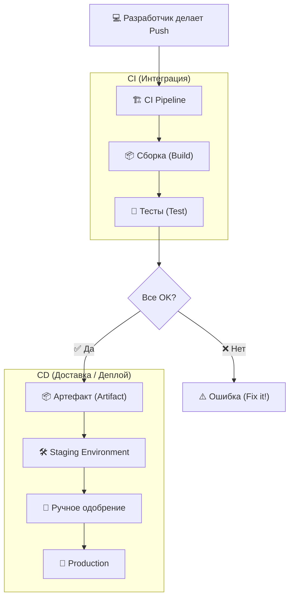

# 🚀 CI/CD: Непрерывная интеграция и доставка

## 📑 Содержание
1. [Что это такое?](#что-это-такое)
2. [Этапы Pipeline](#основные-этапы-конвейер--pipeline)
3. [Визуализация процесса](#визуализация-процесса)
4. [Зачем это нужно?](#почему-это-важно)
5. [Словарь терминов](#популярные-термины)

---

## ❓ Что это такое?

**CI/CD** — это комбинация практик, которые позволяют командам разработчиков выпускать код чаще, быстрее и надежнее. Это фундамент современной DevOps-культуры. 🛠️

Представьте это как конвейер (**Pipeline**) на заводе: сырой код поступает на вход, проходит через автоматические проверки, сборку, тестирование и на выходе превращается в готовый продукт, который разворачивается на серверах.

---

## ⚙️ Основные этапы (Pipeline)

### 1. 🏗️ CI (Continuous Integration) — Интеграция
Практика частого слияния рабочего кода в общую ветку (обычно `main`).
- **Сборка (Build)**: Проверка того, что код компилируется.
- **Тестирование (Test)**: Юнит-тесты, линтеры (стиль кода) и проверки безопасности.
- **🎯 Цель**: Обнаружить ошибки как можно раньше.

### 2. 🚛 CD (Continuous Delivery) — Доставка
Автоматическая подготовка кода к релизу.
- **Результат**: Создание артефакта (Docker-образ, `.exe`), готового к деплою.
- **Staging**: Код автоматически разворачивается в тестовой среде.
- **⚠️ Важно**: Выпуск в Production требует ручного одобрения.

### 3. 🚀 CD (Continuous Deployment) — Развертывание
Полная автоматизация: код, прошедший тесты, сразу попадает к пользователям.
- **Без рук**: От коммита до релиза — за считанные минуты.
- **⚡ Риски**: Требует идеальных тестов и мгновенного мониторинга.

---

## 📊 Визуализация процесса

---

## 🌟 Почему это важно?

> [!TIP]
> **Преимущества для всех:**
> - **Скорость**: Релизы каждый день, а не раз в год. ⚡
> - **Надежность**: Роботы проверяют код лучше и чаще людей. 🤖
> - **Спокойствие**: Маленькие изменения легче чинить, чем огромные. 🧘
> - **Фидбек**: Вы сразу узнаете, если что-то сломалось. 📢

---

## 📖 Популярные термины

- **Pipeline (Пайплайн)**: Путь кода от репозитория до сервера.
- **Artifact (Артефакт)**: Итоговый "файл", который запускается (например, Docker image).
- **Environment (Среда)**: Где работает код (Dev, Test, Prod).
- **Runner (Раннер)**: Сервер-исполнитель ваших команд.

---

> [!IMPORTANT]
> CI/CD нужен любому проекту, где важна стабильность. Даже в одиночку он спасет вас от "у меня на компе всё работало, а на сервере упало". 🛡️
