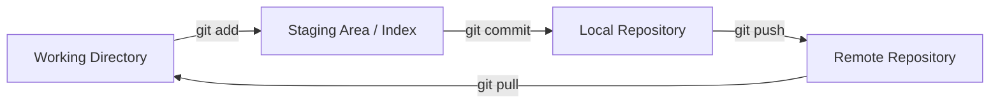

# 0. 🏁 Введение в Git

**Git** — это распределенная система контроля версий (DVCS), созданная Линусом Торвальдсом в 2005 году. В отличие от централизованных систем (например, SVN), Git дает каждому разработчику полноценную копию всей истории проекта.

## 1. 📂 Распределенность vs Централизация

- **Централизованные (SVN, Perforce)**: Если сервер падает, никто не может работать. История хранится только на сервере.
- **Распределенные (Git, Mercurial)**: Репозиторий на вашем компьютере идентичен серверному. Вы можете делать коммиты, смотреть историю и создавать ветки без интернета.

---

## 2. 🎡 Три области (стадии) Git

Понимание того, где физически находятся ваши приложения — фундамент работы с Git.

### 2.1. Working Directory (Рабочая директория)
Это ваши файлы, которые вы видите в IDE. Здесь вы пишете код. Файлы здесь могут быть в двух состояниях:
- **Untracked** (Неотслеживаемые): Новые файлы, о которых Git еще не знает.
- **Tracked** (Отслеживаемые): Файлы, которые уже были в предыдущем коммите.

### 2.2. Staging Area / Index (Область индексирования)
Это технический файл-бинарник в папке `.git/index`. Он играет роль "черновика" для следующего коммита. 
> [!TIP]
> Staging позволяет вам делать **атомарные коммиты**: вы можете изменить 10 файлов, но добавить в индекс только 3, относящихся к одной задаче.

### 2.3. Local Repository (Локальный репозиторий)
Место, где Git хранит сжатые снимки ваших данных и всю историю изменений. Это папка `.git` в корне проекта.

---

## 3. 🗺️ Навигация по курсу
1. [Устройство Git: Объекты и DAG](1.Устройство_Git.md)
2. [Команды: От базовых до Reflog](2.Команды.md)
3. [Ветки, Слияния и Конфликты](3.Ветки_и_Слияния.md)
4. [Best Practices и Конвенции](4.Best_Practices.md)
