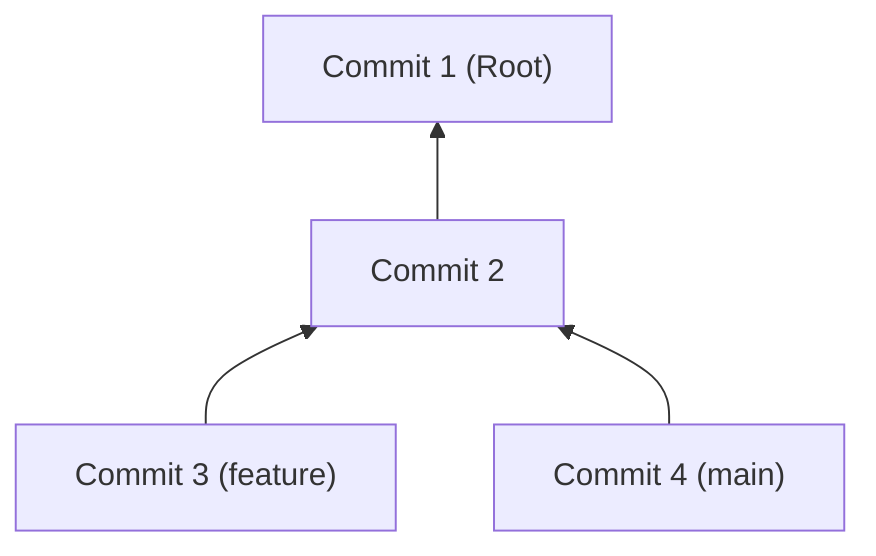

# 1. ⚙️ Устройство Git: Что под капотом?

Многие разработчики боятся Git, потому что воспринимают его как "черный ящик" с магическими командами. На самом деле устройство Git гениально просто: это **Content-Addressable Storage** (хранилище, адресуемое по содержимому) на базе графов.

---

## 1. 💎 Объектная модель Git

В папке `.git/objects` Git хранит всё своё состояние. Есть всего 4 типа объектов:

### 1.1. Blob (Binary Large Object)
Хранит только **содержимое** файла. 
- Git не хранит имя файла или права доступа в Blob. 
- Имя файла в базе Git — это SHA-1 хеш от контента. 
- Если у вас 100 копий одного и того же файла (например, картинки) под разными именами, Git сохранит только **один** Blob.

### 1.2. Tree (Дерево)
Это аналог папки в файловой системе. 
- Содержит список имен файлов и ссылки на их Blobs.
- Также может содержать ссылки на другие Trees (вложенные папки).
- Именно здесь хранятся имена файлов и права доступа (`chmod`).

### 1.3. Commit (Коммит)
Связующее звено истории. Содержит:
- Ссылку на **корневой Tree** (снимок всего проекта в этот момент).
- Ссылку на **родительский коммит** (parent) или двух родителей (при merge).
- Имя автора, коммитера, дату и сообщение.

### 1.4. Tag (Тег)
Простая ссылка на конкретный коммит, которая не меняется со временем.

---

## 2. 🕸️ Направленный ациклический граф (DAG)

Ваша история в Git — это не линейный список, а **граф**. Каждый коммит указывает на своего предка.

> [!IMPORTANT]
> Ветки в Git — это не папки. Ветка — это просто **файл-указатель**, который содержит хеш последнего коммита. Когда вы делаете коммит, указатель ветки просто передвигается на новый хеш.

---

## 3. 🔍 Анатомия папки .git

| Объект | Роль |
| :--- | :--- |
| `objects/` | База данных всех снимков и файлов. |
| `refs/heads/` | Список локальных веток. Внутри файлы с названиями веток, содержащие ID коммита. |
| `HEAD` | Файл, указывающий на текущую ветку. Если вы сделаете `checkout` на хеш, вы попадете в состояние `Detached HEAD`. |
| `index` | Тот самый Staging Area. Бинарный список файлов, готовых к коммиту. |
| `config` | Настройки репозитория (например, URL удаленного сервера). |

---

## 4. 🧱 Принцип иммутабельности
Объекты в Git **неизменяемы**. Если вы поменяете хотя бы один бит в файле, его хеш изменится, и Git создаст **новый** Blob. Поэтому "перезаписать" историю нельзя — её можно только создать заново (как делает `rebase`).

---
[Далее: Команды Git](2.Команды.md)
