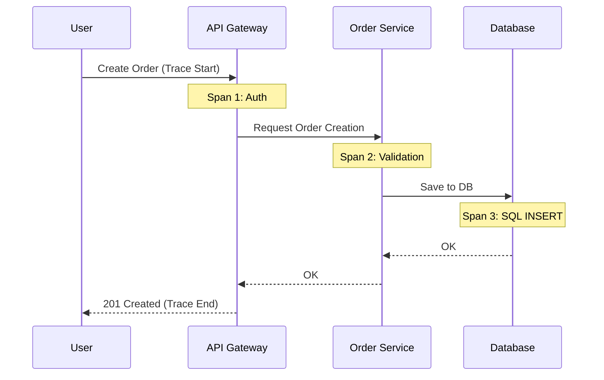

# 🧶 Распределенная трассировка и OpenTelemetry

## 📑 Содержание
1. [Что такое Трассировка?](#что-такое-трассировка)
2. [Span и Trace: Базовые понятия](#span-и-trace)
3. [Инструменты (Jaeger и Zipkin)](#инструменты)
4. [OpenTelemetry (OTel): Будущее](#opentelemetry-otel)
5. [Визуализация пути запроса](#визуализация)

---

## ❓ Что такое Трассировка?

В монолитном приложении легко понять, почему запрос тормозит. В микросервисах один запрос пользователя может пройти через 10 разных сервисов. 🏢

**Распределенная трассировка (Distributed Tracing)** позволяет отследить весь путь запроса от начала до конца и понять, на каком именно этапе произошла задержка или ошибка.

---

## 🧩 Span и Trace

- **Trace (Трасса)**: Весь путь запроса через систему. Это коллекция спанов.
- **Span (Спан)**: Одна единица работы внутри сервиса. Например, "вызов базы данных" или "вызов внешнего API". 📏

У каждого спана есть:
- Название операции.
- Время начала и конца.
- **Trace ID**: Общий для всей цепочки запроса.
- **Parent ID**: Ссылка на предыдущий этап.

---

## 🛠️ Инструменты

1.  **Jaeger**: Самый популярный инструмент для трассировки с отличным интерфейсом для поиска "тормозящих" участков. 🏎️
2.  **Zipkin**: Классика жанра, один из первых инструментов трассировки.

---

## 🌐 OpenTelemetry (OTel)

Это самый важный концепт на сегодня. Раньше для каждого инструмента (Prometheus, Jaeger, ELK) нужно было писать разный код интеграции.

**OpenTelemetry** — это единый стандарт и набор библиотек. Вы один раз добавляете OTel в свое приложение, а он сам собирает и метрики, и логи, и трассировки, и отправляет их в любой инструмент по вашему выбору. 🛠️✨

---

## 📊 Визуализация

---

## 🌟 Зачем это нужно?

> [!IMPORTANT]
> **Трассировка — это единственный способ:**
> - Найти "узкое место" (bottleneck) в цепочке из десятков сервисов. 🔍
> - Понять, как каскадно распространяются ошибки (один сервис упал -> упали все остальные).
> - Увидеть реальную архитектуру системы "глазами" запроса.

---

## 💡 Полезные советы

> [!TIP]
> 1. **Context Propagation**: Самое сложное в трассировке — передавать Trace ID между сервисами (обычно через HTTP заголовки). В Go для этого используется `context.Context`.
> 2. **Sampling (Сэмплинг)**: Трассировка — дорогая штука. Не обязательно сохранять путь *каждого* запроса. Можно настроить сохранение только 1% запросов, чтобы не перегружать базу данных. 📉
