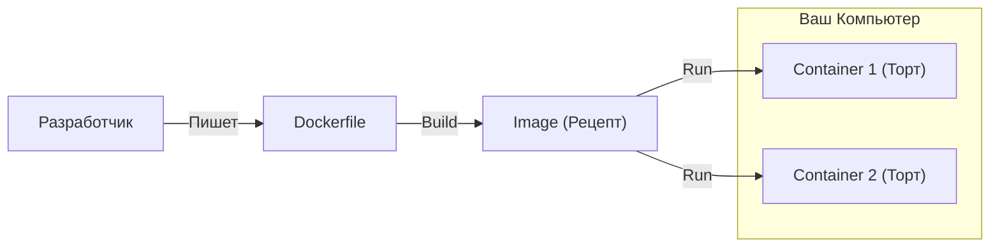

# 🐳 Docker

## 📑 Содержание
1. [Что такое Docker?](#что-такое-docker)
2. [Главные сущности (Cake Analogy)](#главные-сущности-cake-analogy)
3. [Как это работает?](#как-это-работает)
4. [Dockerfile и Команды](#dockerfile-и-команды)

---

## 1. 🤔 Что такое Docker?

**Docker** — это способ упаковать ваше приложение и всё, что ему нужно (библиотеки, конфиги), в одну "коробку" (контейнер).
Где бы вы ни открыли эту коробку (на вашем маке, на сервере Linux, в облаке) — приложение будет работать **одинаково**.

> [!NOTE]
> Это решает проблему "На моем компьютере всё работает, а на сервере нет".

---

## 2. 🎂 Главные сущности (Cake Analogy)

Чтобы понять Docker, представьте, что вы печете торт.

### 📜 Image (Образ) = Рецепт
*   Это просто файл (инструкция). Он лежит на диске и ничего не делает.
*   Он **Read-Only** (нельзя изменить рецепт, по которому уже печется торт).
*   **Пример**: `ubuntu:20.04`, `postgres:13`.

### 🧁 Container (Контейнер) = Торт
*   Это живое, работающее приложение, созданное по рецепту (Image).
*   Из одного Рецепта (Image) можно испечь 100 одинаковых Тортов (Container).
*   Вы можете его "съесть" (остановить/удалить), а рецепт останется.

### 🏭 Registry (Реестр) = Кулинарная книга
*   Место, где хранятся рецепты.
*   **Docker Hub** — самая большая публичная книга рецептов.

---

## 3. ⚙️ Как это работает?

В отличие от Виртуальных Машин (VM), Docker не тащит с собой целую Операционную Систему. Он использует ядро вашей системы (Linux), но изолирует процессы.

*   **VM**: Дом для каждого жильца (дорого, тяжело).
*   **Docker**: Коммуналка. Кухня (Ядро OS) общая, но комнаты (Контейнеры) изолированы.

---

## 4. 📝 Dockerfile и Команды

Dockerfile — это тот самый листок бумаги, где вы пишете рецепт.

### Основные команды
| Команда | Что делает | Пример |
| :--- | :--- | :--- |
| `FROM` | Базовый слой (Основа пиццы) | `FROM ubuntu:20.04` |
| `RUN` | Выполнить команду **при сборке** (нарезать колбасу) | `RUN apt-get install python3` |
| `COPY` | Скопировать файлы внутрь | `COPY app.py /src/app.py` |
| `CMD` | Что сделать **при запуске** (съесть пиццу) | `CMD ["python3", "app.py"]` |

> [!IMPORTANT]
> **RUN vs CMD**:
> *   `RUN` выполняется один раз, когда вы создаете *Image* (билдите).
> *   `CMD` выполняется каждый раз, когда вы запускаете *Container*.

### Docker Compose
Если у вас много сервисов (Backend + DB + Redis), запускать их по одному неудобно.
`docker-compose.yml` — это файл, где вы описываете весь свой "банкет" сразу. Одной командой `docker-compose up` поднимается всё окружение.