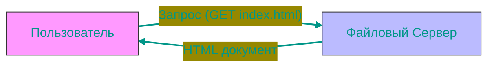
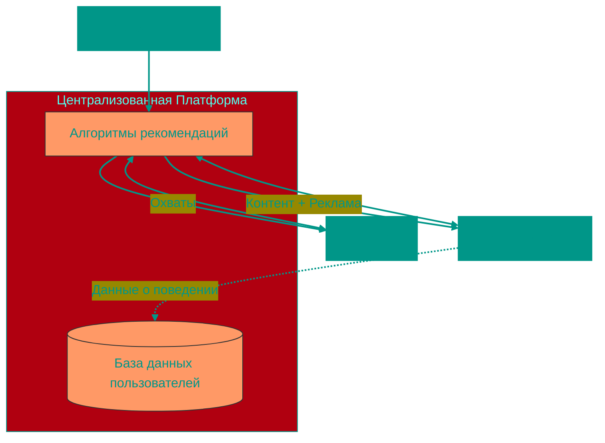
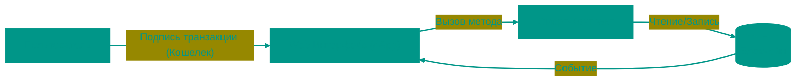

# 🌐 Эволюция Web: От 1.0 до 3.0

> "Веб — это не просто технология, это отражение человеческого общества".

Интернет прошел путь от набора статичных документов до глобальной децентрализованной экономики. Чтобы понять будущее (Web 3.0), нужно детально изучить прошлое.

## 📑 Содержание
1. [Web 1.0: Эпоха "Только чтение" (1990–2004)](#1-web-10-эпоха-только-чтение-19902004)
2. [Web 2.0: Эпоха "Чтение и Запись" (2004–Настоящее)](#2-web-20-эпоха-чтение-и-запись-2004настоящее)
3. [Web 2.5: Переходный период](#3-web-25-мост-в-будущее)
4. [Web 3.0: Эпоха "Чтение, Запись, Владение" (Будущее)](#4-web-30-эпоха-чтение-запись-владение-будущее)
5. [Сравнительная таблица](#-сводная-таблица-эволюции)

---

## 1. 📜 Web 1.0: Эпоха "Только чтение" (1990–2004)

**"Цифровая библиотека и Дикий Запад"**

В начале интернет напоминал огромную доску объявлений. Это была односторонняя связь: создатели контента публиковали информацию, а пользователи её потребляли.

### 🏛️ Исторический контекст
- **1989**: Тим Бернерс-Ли изобретает WWW в CERN.
> [!TIP]
> **WWW** расшифровывается как **World Wide Web** (Всемирная паутина) — система взаимосвязанных документов и ресурсов, доступ к которым осуществляется через интернет с использованием протокола HTTP.
- **1993**: Выход **Mosaic** — первого популярного графического браузера.
- **1995-2001**: **Война браузеров** (Netscape Navigator vs Internet Explorer). Microsoft победила, встроив IE в Windows.
- **2000**: **Пузырь доткомов (Dot-com bubble)**. Инвесторы вливали миллионы в любой стартап с ".com" в названии. Пузырь лопнул, уничтожив триллионы долларов, но инфраструктура осталась.

> [!TIP]
> **Доменные зоны (.com, .ru, .org и др.)** — это суффиксы в адресах веб-сайтов, которые первоначально обозначали принадлежность к определенному типу организаций или странам:
> - **.com** — commercial (коммерческие организации), доменная зона общего назначения, наиболее популярная в мире
> - **.org** — organizations (организации), обычно используется некоммерческими организациями
> - **.net** — network (сетевые организации), часто используется интернет-провайдерами
> - **.ru** — Россия, национальная доменная зона второго уровня
> - **.gov** — government (правительственные учреждения США)
> - **.edu** — educational institutions (учебные заведения США)
> 
> В эпоху доткомов домен .com стал символом интернет-бизнеса, именно поэтому инвесторы были особенно заинтересованы в проектах с этим доменом.

### 🛠️ Технологический стек
- **HTML**: Верстка на таблицах (`<table>`), фреймы (`<frameset>`). CSS еще почти не работал.
- **Протоколы**: HTTP/1.0. Никакого шифрования (HTTPS был редкостью).
- **Дизайн**: Яркие фоны, GIF-анимации "Under Construction", счетчики посещений.

> [!NOTE]
> **Пример сайта 90-х**: Статичная страница компании. Адрес, телефон, описание услуг. Чтобы изменить одну букву, веб-мастеру нужно было обновлять HTML-файл и заново загружать его на сервер через FTP.

---

## 2. 📱 Web 2.0: Эпоха "Чтение и Запись" (2004–Настоящее)

**"Платформы, Соцсети и API"**

Термин "Web 2.0" популяризировал Тим О'Райли в 2004 году. Главная идея: интернет как платформа. Пользователи становятся главными создателями контента (UGC — User Generated Content).

### 🚀 Технологическая революция
1.  **AJAX (Asynchronous JavaScript and XML)**: Позволил обновлять части страницы без перезагрузки. Google Maps (2005) показал, что веб-приложение может работать так же плавно, как программа на ПК.
2.  **API Economy**: Сервисы начали "общаться" друг с другом. Uber использует Google Maps API для карт и Twilio API для СМС.
3.  **Мобайл (2007)**: Выход iPhone сделал интернет круглосуточным спутником ("Always On").
4.  **Облака (AWS, 2006)**: Стартапам больше не нужно покупать свои сервера. Можно арендовать мощности у Amazon за копейки.

### 🏢 Экономика платформ
Появились гиганты (FAANG: Facebook, Apple, Amazon, Netflix, Google), которые предложили удобные сервисы бесплатно в обмен на **данные**.

- **Сетевой эффект**: Чем больше людей в Facebook, тем сложнее уйти конкуренту.
- **Алгоритмические ленты**: Вы видите не то, на что подписались, а то, что удержит ваше внимание дольше всего (для показа рекламы).

> [!WARNING]
> **Проблема Централизации**: "Walled Gardens" (Огороженные сады). Вы не владеете своим аккаунтом. Twitter может забанить вас навсегда. YouTube может удалить ваше видео. Ваши данные хранятся на чужих серверах.

---

## 3. 🌉 Web 2.5: Мост в будущее

Мы сейчас здесь. Это состояние, где технологии Web 3.0 уже работают, но вход в них осуществляется через привычные интерфейсы Web 2.0.

**Примеры:**
- **Coinbase / Binance**: Вы покупаете крипту, но ключи хранятся у биржи (как в банке).
- **OpenSea**: Торговля NFT, но сам сайт — это обычный Web 2.0 сервис, который может скрыть вашу коллекцию, если получит судебный иск.

---

## 4. 🌐 Web 3.0: Эпоха "Чтение, Запись, Владение" (Будущее)

**"Семантический и Децентрализованный Веб"**

Web 3.0 — это попытка починить проблемы Web 2.0 (приватность, монополии) с помощью криптографии и распределенных реестров.

### 💎 Основные столпы Web 3.0
1.  **Блокчейн и Смарт-контракты**: Код — это закон. Смарт-контракт на Ethereum выполнится гарантированно, никто (даже создатель) не может его остановить.
2.  **DAO (Decentralized Autonomous Organization)**: Компании без директоров. Решения принимаются голосованием держателей токенов. Пример: **Uniswap** управляется комьюнити.
3.  **DeFi (Decentralized Finance)**: Банковские услуги (кредиты, обмен) без банков.
4.  **Self-Sovereign Identity (SSI)**: Вы владеете своей личностью. Вход на сайты через кошелек (MetaMask, Phantom), а не через "Login with Google".

### 🛠️ Технологический стек
- **L1 (Layer 1)**: Bitcoin, Ethereum, Solana — базовые блокчейны.
- **Storage**: IPFS, Arweave — децентрализованное хранение файлов (чтобы не хранить картинки NFT на серверах AWS).
- **Oracles**: Chainlink — поставляет данные из реального мира (курсы валют, погоду) в блокчейн.

> [!TIP]
> **Смена парадигмы**:
> В Web 2.0: Приложение (Instagram) владеет базой данных.
> В Web 3.0: База данных (Блокчейн) общая, а приложения (Интерфейсы) — это просто "окна" в эту базу. Если интерфейс закроется, вы можете зайти через другой. Даные останутся на месте.

### 🚧 Проблемы Web 3.0 (почему мы еще не там)
- **Scalability (Масштабируемость)**: Блокчейны медленные и дорогие по сравнению с VISA.
- **UX (User Experience)**: Настроить кошелек, запомнить 12 слов, платить за газ — это слишком сложно для массового пользователя.
- **Scams (Мошенничество)**: Отсутствие регуляции привлекает мошенников.

---

## 📊 Сводная таблица эволюции

| Характеристика | Web 1.0 | Web 2.0 | Web 3.0 |
| :--- | :--- | :--- | :--- |
| **Главная функция** | Чтение информации | Взаимодействие и создание | Владение и передача ценности |
| **Единица контента** | Домашняя страница | Пост / Твит / Видео | Токен / NFT |
| **Монетизация** | Пока мало (баннеры) | Таргетированная реклама (данные) | Токеномика, DeFi, прямые продажи |
| **Организация** | Компании (.com) | Платформы (Aggregators) | DAO (Сообщества) |
| **Инфраструктура** | Собственные сервера | Облака (AWS, Google Cloud) | Блокчейн узлы, IPFS |
| **Ваша роль** | Потребитель | Продукт (ваши данные = товар) | Владелец (акционер сети) |

---

---

> **Итог**: Мы движемся к интернету, где пользователи снова контролируют свои данные, деньги и контент, но с удобством современных приложений.

<!-- QUIZ_START 

[
    {
        "question": "Какая технология Web 2.0 позволила обновлять части страницы без её полной перезагрузки?",
        "options": [
            "HTML5",
            "AJAX (Asynchronous JavaScript and XML)",
            "WebSockets",
            "REST API"
        ],
        "correctIndex": 1
    },
    {
        "question": "В чем главная проблема Web 2.0 с точки зрения владения данными?",
        "options": [
            "Отсутствие шифрования",
            "Платформы (Facebook, Twitter) владеют вашими данными и могут заблокировать аккаунт без предупреждения",
            "Медленный интернет",
            "Нет мобильных приложений"
        ],
        "correctIndex": 1
    },
    {
        "question": "Что такое DAO (Decentralized Autonomous Organization) в контексте Web 3.0?",
        "options": [
            "Новый язык программирования",
            "Организация без директоров, где решения принимаются голосованием держателей токенов",
            "Алгоритм шифрования",
            "Протокол для передачи файлов"
        ],
        "correctIndex": 1
    }
]

QUIZ_END -->

