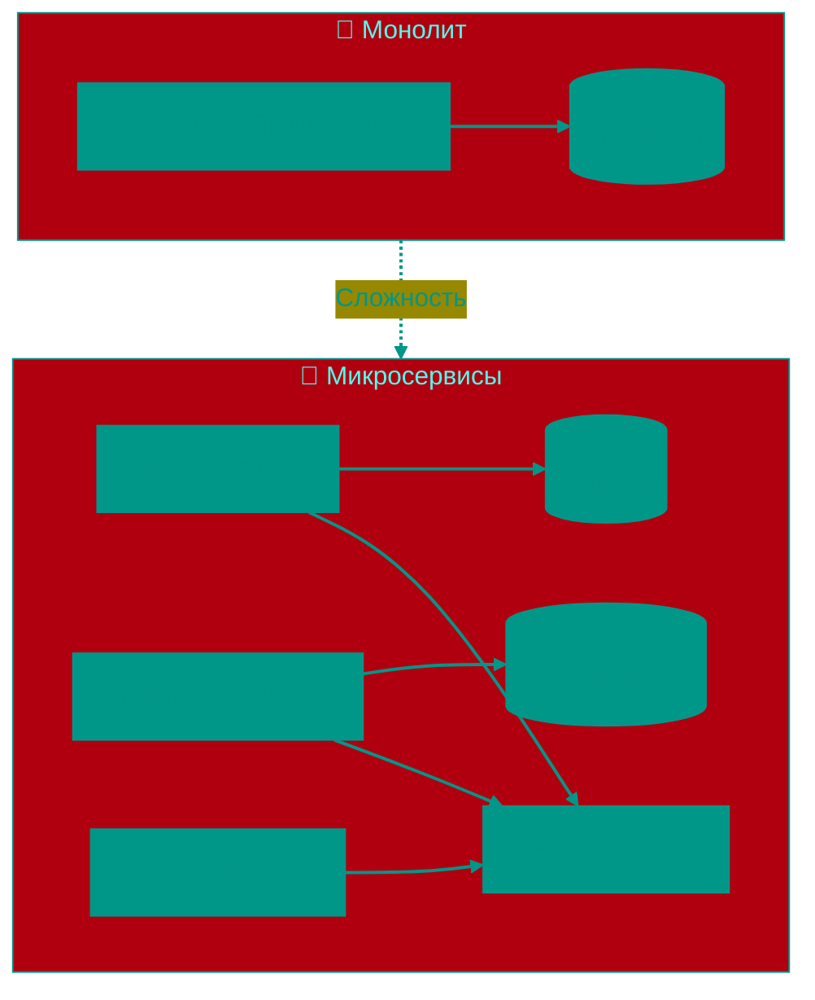

# ☁️ Cloud-native и Serverless: Эволюция архитектуры

Термин Cloud-native означает не просто "хостинг в облаке". Это философия разработки, при которой приложения изначально проектируются для жизни в динамичной, распределенной среде публичных, частных или гибридных облаков. Главная цель — скорость доставки кода и масштабируемость.

> [!NOTE]
> «Сегодня не облачно, а значит ничего не будет работать» — шутка! 😄 
> На самом деле, когда говорят «облака» — это просто куча компьютеров (серверов), которые управляются централизованно, а не то, что они летают где-то в небе. С позиции разработчика, облако — это возможность арендовать вычислительные мощности по запросу, не покупая свое железо.

---


## 🏗️ Эволюция: От Монолита к Хаосу



---


## 1. 🏰 Монолит и его ограничения
Классический подход (Monolithic Architecture) — это когда всё приложение (веб-сервер, бизнес-логика, работа с базой данных, генерация отчетов) живет в одном процессе и деплоится как единый файл (например, `.jar` или `.exe`).

**Проблема**: Любое изменение требует пересборки и перезапуска всего "монстра". Если модуль "Отчеты" съедает всю память, падает даже модуль "Авторизация". Масштабировать можно только целиком (вертикально), покупая более мощные сервера, что очень дорого.

---


## 2. 🧩 Микросервисы (Microservices)
Это подход, при котором приложение разбивается на десятки или сотни маленьких, независимых сервисов. Каждый из них отвечает за одну бизнес-функцию (например, "Расчет скидки") и может быть написан на своем языке программирования.


### Принципы 12-Factor App
Для успешной работы в облаке сервисы часто следуют методологии **The Twelve-Factor App**:
1.  **Codebase**: Одна кодовая база под контролем версий.
2.  **Dependencies**: Явное объявление зависимостей (никаких "оно работает на моей машине").
3.  **Config**: Конфигурация хранится в переменых окружения (`ENV`), а не в коде.
4.  **Backing Services**: Базы данных и очереди считаются подключаемыми ресурсами.
5.  **Disposability**: Быстрый запуск и корректное завершение (Graceful Shutdown).


### Проблемы распределенных систем
Микросервисы решают проблему масштабируемости, но приносят сложность в коммуникации. Сервисам нужно надежно общаться по сети (gRPC/REST), находить друг друга (Service Discovery) и не умирать при сбоях соседей (Circuit Breaker).
Для решения этих задач часто используют **Service Mesh** (например, Istio) — инфраструктурный слой, который прозрачно управляет трафиком между сервисами, добавляя шифрование (mTLS) и телеметрию.

---


## 3. 🐳 Контейнеризация (Docker)
Чтобы микросервисы работали одинаково у разработчика на ноутбуке и на сервере, их упаковывают в **контейнеры**.

Контейнер — это "легкая" виртуализация. В отличие от виртуальной машины (VM), которая тянет за собой целую ОС, контейнер использует ядро хостовой системы, но изолирует процессы и файловую систему.
**Docker Image** — это чертеж, содержащий код, библиотеки (`libs`), рантайм (`python/go`) и системные утилиты. Это гарантирует неизменяемость: то, что протестировано, то и пойдет в продакшн.

---


## 4. ☸️ Оркестрация (Kubernetes)
Когда у вас 5 контейнеров, вы можете запустить их вручную. Когда их 5000, нужен **Kubernetes (K8s)**.

Это операционная система для кластера. Вы не говорите "запусти контейнер X на сервере Y". Вы говорите: "Мне нужно 3 копии сервиса X". Kubernetes сам найдет свободное место на серверах, запустит контейнеры, и если один из них упадет — поднимет новый. Он занимается самолечением (Self-healing) и балансировкой нагрузки (Load Balancing).

---


## 5. 👻 Serverless (Function-as-a-Service)
Это следующий шаг абстракции. Разработчику вообще не нужно думать о серверах, контейнерах или кластерах.

Вы пишете одну функцию (например, `resizeImage(event)`) и загружаете код облачному провайдеру (AWS Lambda, Google Cloud Functions).
*   **Событийность**: Функция спит, пока не наступит событие (HTTP-запрос, загрузка файла, таймер).
*   **Оплата за выполнение**: Вы платите только за время, пока процессор обрабатывал вашу функцию (с точностью до миллисекунд). Если вызовов нет — вы платите **$0**.
*   **Cold Starts (Холодный старт)**: Главный минус. Если функцию давно не вызывали, облаку нужно время (0.5 - 1 сек), чтобы поднять микро-контейнер для неё. Для высоконагруженных систем это может быть критично.

---


## 6. 🐳 Docker на практике


### Пример Dockerfile (Multi-stage Build)
Правильный образ должен быть компактным. Multi-stage builds позволяют собрать приложение в одном контейнере, а запускать в другом (меньшем).

```dockerfile
# Стадия 1: Сборка
FROM golang:1.21-alpine AS builder
WORKDIR /app
COPY go.mod go.sum ./
RUN go mod download
COPY . .
RUN CGO_ENABLED=0 GOOS=linux go build -o server .

# Стадия 2: Production
FROM alpine:latest
RUN apk --no-cache add ca-certificates
WORKDIR /root/
COPY --from=builder /app/server .
EXPOSE 8080
CMD ["./server"]
```

**Результат**: Вместо 1 ГБ (с компилятором Go) получаем образ 15 МБ.


### Layer Optimization
Docker образ — это слои (layers). Каждая команда `RUN`, `COPY` создает новый слой. Если изменения часты (код), их нужно копировать последними. Если редки (зависимости) — первыми.

---


## 7. ☸️ Kubernetes: глубже


### Deployment (Декларативное управление)
Вместо запуска pod вручную, вы описываете **желаемое состояние** системы.

```yaml
apiVersion: apps/v1
kind: Deployment
metadata:
  name: my-app
spec:
  replicas: 3  # Хочу 3 копии
  selector:
    matchLabels:
      app: my-app
  template:
    metadata:
      labels:
        app: my-app
    spec:
      containers:
      - name: server
        image: myapp:1.2.3
        resources:
          limits:
            memory: "128Mi"
            cpu: "500m"
```

Kubernetes видит `replicas: 3`, смотрит, что сейчас запущено 0 pod, и создаёт 3 штуки. Если один упадёт — поднимет новый.


### Horizontal Pod Autoscaler (HPA)
Автоматически увеличивает или уменьшает количество pod в зависимости от нагрузки (CPU, память, custom metrics).

```yaml
apiVersion: autoscaling/v2
kind: HorizontalPodAutoscaler
metadata:
  name: my-app-hpa
spec:
  scaleTargetRef:
    apiVersion: apps/v1
    kind: Deployment
    name: my-app
  minReplicas: 2
  maxReplicas: 10
  metrics:
  - type: Resource
    resource:
      name: cpu
      target:
        type: Utilization
        averageUtilization: 70  # При 70% CPU — масштабировать
```

---


## 8. 🕸️ Service Mesh (Istio)

Service Mesh — это инфраструктурный слой, который управляет коммуникацией между микросервисами без изменения их кода.


### Что даёт Istio
1.  **Traffic Management**: Canary deployments (5% трафика на новую версию, 95% на старую), A/B testing, retry/timeout policies.
2.  **Security**: Автоматическое шифрование между сервисами (mutual TLS) без изменения кода. Каждый pod получает сертификат.
3.  **Observability**: Автоматический сбор метрик, логов и распределённых трейсов (distributed tracing).


### Как это работает
Istio внедряет sidecar-контейнер (Envoy Proxy) в каждый pod. Весь сетевой трафик идёт через него. Приложение думает, что общается напрямую, но на самом деле Envoy перехватывает трафик, применяет политики и отправляет метрики.

---


## 9. 👁️ Observability (Наблюдаемость)

В распределённых системах одних логов недостаточно. Нужны три столпа: Logs, Metrics, Traces.


### Logging (ELK Stack)
*   **Elasticsearch**: Хранит логи (как база данных для поиска)
*   **Logstash/Fluentd**: Собирают логи из всех контейнеров
*   **Kibana**: Визуализация и поиск

Каждый микросервис пишет логи в stdout/stderr. Kubernetes автоматически собирает их. Fluentd отправляет в Elasticsearch. В Kibana можно искать: "Покажи все ошибки за последний час в сервисе Payment".


### Metrics (Prometheus + Grafana)
Prometheus — time-series база данных для метрик (CPU, память, количество запросов в секунду, latency).
Сервисы выставляют метрики на endpoint `/metrics`. Prometheus их скрапит каждые 15 секунд.

**Пример метрики**:
```
http_requests_total{service="payment", status="200"} 15234
http_requests_total{service="payment", status="500"} 12
```

Grafana строит красивые дашборды с графиками.


### Distributed Tracing (Jaeger)
Когда HTTP-запрос проходит через 10 микросервисов, как понять, где задержка? Distributed Tracing добавляет уникальный **trace ID** к каждому запросу. Все сервисы логируют его и отправляют span'ы (участки работы) в Jaeger.

**Результат**: Вы видите, что запрос прошёл через API Gateway (5 мс) → Auth (20 мс) → Payment (500 мс ← тут проблема!) → Notification (2 мс).

---


## 10. 🔄 CI/CD для Cloud-Native


### GitOps (ArgoCD)
Традиционный CI/CD: код → сборка → деплой (push-модель: Jenkins деплоит в K8s).
**GitOps**: Желаемое состояние (YAML манифесты K8s) хранится в Git. ArgoCD постоянно сверяет состояние кластера с Git. Если есть расхождение — автоматически применяет изменения (pull-модель).

**Преимущества**: Git становится single source of truth. Откат = `git revert`. Audit trail из коробки (кто, когда, что изменил).


### Стратегии деплоя
*   **Rolling Update**: Постепенная замена старых pod на новые (по умолчанию в K8s)
*   **Blue-Green**: Две полные копии окружения. Зелёная (новая) разворачивается рядом с синей (старой). После проверки трафик переключается на зелёную. Откат = переключить обратно.
*   **Canary**: 5% пользователей идут на новую версию, 95% на старую. Если метрики хорошие — постепенно увеличиваем до 100%.

---


## 11. 📊 Реальные кейсы


### Netflix: Chaos Engineering
Netflix запускает **Chaos Monkey** — программу, которая случайно выключает серверы в production. Цель — убедиться, что система устойчива к отказам.
Результат: если сервер падает — K8s поднимает новый, пользователь не замечает. Так Netflix обеспечивает 99.99% uptime, даже если AWS зона падает.


### Uber: Миграция на Kubernetes
В 2017 Uber мигрировал тысячи микросервисов на Kubernetes. Результат:
*   Утилизация серверов выросла с 20% до 60% (меньше пустых серверов)
*   Время деплоя сократилось с часов до минут
*   Единая платформа для всех команд (раньше каждая использовала свои инструменты)


### Сравнение провайдеров

| Провайдер             | Serverless          | K8s         | Особенности                           |
|-----------------------|---------------------|-------------|---------------------------------------|
| **AWS**               | Lambda              | EKS         | Самая большая экосистема (200+ сервисов) |
| **Google Cloud (GCP)**| Cloud Functions     | GKE         | Лучшая интеграция с K8s (Google создал K8s) |
| **Azure**             | Azure Functions     | AKS         | Интеграция с корпоративными продуктами Microsoft |

---


## 12. 💰 Cost Optimization


### Serverless: Расчёт стоимости
AWS Lambda берёт $0.20 за 1 млн вызовов + $0.0000166667 за каждую GB-секунду.
**Пример**: 10 млн вызовов/месяц, каждый выполняется 200 мс с 512 МБ памяти.
*   Invocations: 10M × $0.20/1M = **$2**
*   Compute: 10M × 0.2 сек × 0.5 ГБ × $0.0000166667 = **$16.67**
*   **Итого**: $18.67/месяц

Если нагрузка постоянная 24/7 — дешевле арендовать сервер. Если spiky (пики в определённое время) — serverless выгодней.


### Kubernetes: Spot Instances
Spot instances (AWS) / Preemptible VMs (GCP) — это незадействованные мощности облачных провайдеров. Они на 70-90% дешевле обычных, но могут быть отозваны с предупреждением за 2 минуты.

**Решение**: Запускайте stateless сервисы (которые можно убить без последствий) на Spot, а stateful (базы данных) на обычных нодах.

<!-- QUIZ_START 

[
    {
        "question": "В чем главное преимущество Kubernetes перед ручным запуском контейнеров?",
        "options": [
            "Он бесплатный",
            "Он автоматически управляет масштабированием, самолечением и балансировкой нагрузки",
            "Он работает только на Windows",
            "Он заменяет Docker"
        ],
        "correctIndex": 1
    },
    {
        "question": "Что такое 'Cold Start' в Serverless архитектуре?",
        "options": [
            "Перезагрузка сервера",
            "Задержка (0.5-1 сек) при первом вызове функции, пока облако поднимает контейнер",
            "Зимний период работы сервера",
            "Ошибка в коде"
        ],
        "correctIndex": 1
    },
    {
        "question": "Для чего используется Multi-stage Build в Docker?",
        "options": [
            "Для запуска нескольких контейнеров одновременно",
            "Для создания компактного production-образа (собираем в большом контейнере, запускаем в маленьком)",
            "Для шифрования данных",
            "Для тестирования кода"
        ],
        "correctIndex": 1
    }
]

QUIZ_END -->

