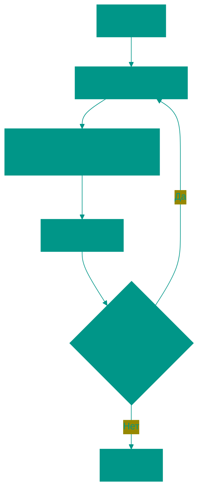
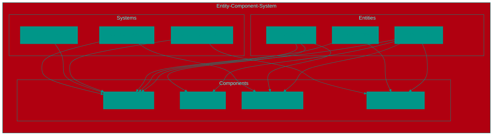
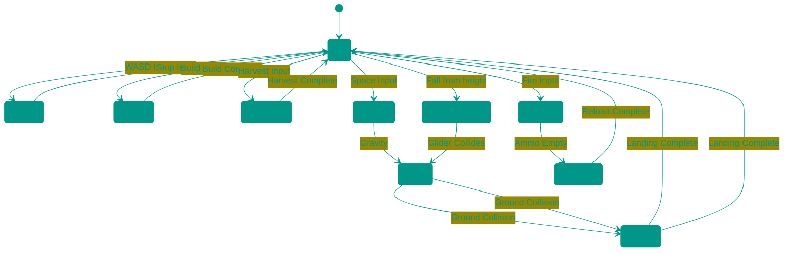

# 💻 Программирование игр

## 📑 Содержание
1. [Основы программирования игр](#основы-программирования-игр)
2. [Архитектура игрового кода](#архитектура-игрового-кода)
3. [Паттерны программирования в играх](#паттерны-программирования-в-играх)
4. [Языки программирования для игр](#языки-программирования-для-игр)
5. [Фреймворки и библиотеки](#фреймворки-и-библиотеки)
6. [Оптимизация игрового кода](#оптимизация-игрового-кода)

---

## 1. 🧠 Основы программирования игр

### 🔄 Основной игровой цикл (Game Loop)
Сердце каждой игры — это бесконечный цикл, который повторяется снова и снова:



### 🧩 Основные компоненты:
1. **Обработка ввода** — клавиатура, мышь, геймпад
2. **Обновление состояния** — движение, физика, логика
3. **Рендеринг** — отрисовка на экране
4. **Время** — синхронизация (FPS)

### 📏 Пример псевдокода:
```
while (game_is_running) {
    handle_input()
    update_game_state()
    render_graphics()
    sleep_or_wait_for_next_frame()
}
```

---

## 2. 🏗️ Архитектура игрового кода

### 🧱 Entity-Component-System (ECS)
Современный подход к организации игрового кода, где:
*   **Entity (Сущность)** — объект в игре (игрок, враг, пуля)
*   **Component (Компонент)** — данные (позиция, здоровье, спрайт)
*   **System (Система)** — логика (движение, столкновения, рендеринг)



### 🔄 Традиционный подход vs ECS:
*   **Традиционный:** Игрок, Враг, Пуля — как отдельные классы
*   **ECS:** Все — сущности с разными компонентами

---

## 3. 🧩 Паттерны программирования в играх

### 🎮 State Machine (Конечный автомат)
Используется для управления состоянием персонажа:

**Пример из Fortnite:**

В Fortnite конечный автомат активно используется для управления различными состояниями персонажа во время боя и передвижения:



**Примеры состояний персонажа в Fortnite:**
1. **Idle (Ожидание)** — игрок стоит на месте
2. **Walking/Running (Ходьба/Бег)** — передвижение по карте
3. **Building (Строительство)** — возведение стен, пола, лестниц
4. **Harvesting (Добыча ресурсов)** — рубка деревьев, камней, металла
5. **Jumping/Falling/Landing (Прыжок/Падение/Приземление)** — перемещение по вертикали
6. **Attacking (Атака)** — стрельба из оружия
7. **Reloading (Перезарядка)** — пополнение боеприпасов
8. **GliderDeployed (Парашют раскрыт)** — планирование после прыжка с высоты
9. **Eliminated (Устранён)** — состояние после поражения

Каждое состояние имеет свои правила поведения и переходы между состояниями, что позволяет точно контролировать действия персонажа в зависимости от текущей ситуации в игре.

### 🎯 Observer Pattern (Наблюдатель)
Позволяет объектам наблюдать за изменениями в других объектах:
*   Когда здоровье падает до 0 → вызвать событие "смерть"
*   Когда счет увеличивается → обновить UI

### 🧱 Object Pool (Пул объектов)
Предотвращает частое создание/удаление объектов (например, пуль):
*   Создаем пул объектов заранее
*   Берем из пула, когда нужно
*   Возвращаем в пул, когда не нужны

---

## 4. 💬 Языки программирования для игр

### 🎯 Наиболее популярные:

#### C++
*   **Преимущества:**
    *   Высокая производительность
    *   Полный контроль над памятью
    *   Используется в AAA-играх
*   **Недостатки:**
    *   Сложный синтаксис
    *   Ручное управление памятью
*   **Примеры:** Unreal Engine, CryEngine, Call of Duty

#### C#
*   **Преимущества:**
    *   Простота и читаемость
    *   Управляемая память (GC)
    *   Отличная интеграция с Unity
*   **Недостатки:**
    *   Меньше контроля над производительностью
    *   Зависимость от .NET
*   **Примеры:** Unity, Godot (частично)

#### C
*   **Преимущества:**
    *   Максимальная производительность
    *   Минимальный оверхед
    *   Используется в низкоуровневом коде
*   **Недостатки:**
    *   Нет ООП
    *   Ручное управление памятью
*   **Примеры:** Некоторые движки, встраиваемые системы

#### Python
*   **Преимущества:**
    *   Простота и быстрая разработка
    *   Отличные инструменты для прототипирования
    *   Богатая экосистема
*   **Недостатки:**
    *   Низкая производительность
    *   Не подходит для основного кода игр
*   **Примеры:** Инструменты разработчиков, скрипты, прототипы

#### JavaScript
*   **Преимущества:**
    *   Веб-игры
    *   Быстрая разработка
    *   Большое сообщество
*   **Недостатки:**
    *   Ограниченные возможности для сложных игр
    *   Зависимость от браузера
*   **Примеры:** HTML5 игры, Phaser, Three.js

#### Rust
*   **Преимущества:**
    *   Высокая производительность
    *   Безопасность памяти
    *   Современный синтаксис
*   **Недостатки:**
    *   Крутая кривая обучения
    *   Меньше готовых решений
*   **Примеры:** Новые инди-проекты, экспериментальные движки

---

## 5. 📚 Фреймворки и библиотеки

### 🎮 Популярные фреймворки:

#### Unity
*   **Язык:** C#
*   **Платформы:** Все основные
*   **Особенности:** Визуальный редактор, ECS, хорошая документация

#### Unreal Engine
*   **Язык:** C++, Blueprint
*   **Платформы:** PC, консоли, мобильные
*   **Особенности:** Визуальное программирование, фотореализм

#### Godot
*   **Язык:** GDScript, C#, C++, Visual Script
*   **Платформы:** Все основные
*   **Особенности:** Открытый исходный код, легковесность

#### SDL (Simple DirectMedia Layer)
*   **Язык:** C/C++
*   **Платформы:** Все основные
*   **Особенности:** Низкоуровневый доступ к графике и вводу

#### Allegro
*   **Язык:** C/C++
*   **Платформы:** Все основные
*   **Особенности:** Простота, хорош для обучения

#### MonoGame
*   **Язык:** C#
*   **Платформы:** Все основные
*   **Особенности:** Открытый исходный код, основан на XNA

#### Phaser
*   **Язык:** JavaScript/TypeScript
*   **Платформы:** Веб
*   **Особенности:** HTML5 игры, 2D и 3D

---

## 6. ⚡ Оптимизация игрового кода

### 📊 Профилирование:
*   **CPU Profiler** — определяет "горячие точки" в коде
*   **Memory Profiler** — отслеживает утечки памяти
*   **GPU Profiler** — анализирует графическую производительность

### 🚀 Оптимизационные техники:

#### Spatial Partitioning (Пространственное разделение)
*   **Quadtree/Octree** — эффективное определение столкновений
*   **Grid-based** — разделение мира на ячейки

#### Object Pooling (Пул объектов)
*   Предотвращает частое выделение/освобождение памяти
*   Особенно важно для часто создаваемых объектов (пули, эффекты)

#### Multithreading (Многопоточность)
*   **Игровая логика** в одном потоке
*   **Рендеринг** в другом потоке
*   **Загрузка ресурсов** в фоновых потоках

#### Caching (Кэширование)
*   Кэширование вычисленных значений
*   Избегание повторных дорогостоящих вычислений

### 🧠 Best Practices:
1. **Avoid premature optimization** — сначала сделай правильно, потом быстро
2. **Measure, don't guess** — используй профилировщики
3. **Cache expensive operations** — сохраняй результаты вычислений
4. **Minimize allocations** — избегай частого выделения памяти
5. **Batch similar operations** — группируй похожие задачи

---

## 7. 🚀 Заключение

Программирование игр требует понимания специфических паттернов и подходов, отличающихся от традиционной разработки программного обеспечения. Успешная игра должна быть не только функциональной, но и эффективной, отзывчивой и масштабируемой.

Следующие материалы расскажут о графике в играх, звуке, физике и других важных аспектах разработки.

<!-- QUIZ_START
[
    {
        "question": "Какой паттерн программирования используется для управления состоянием персонажа в игре?",
        "options": [
            "Observer Pattern",
            "State Machine",
            "Singleton Pattern",
            "Factory Pattern"
        ],
        "correctIndex": 1
    },
    {
        "question": "Какой язык программирования чаще всего используется в движке Unity?",
        "options": [
            "C++",
            "Java",
            "C#",
            "Python"
        ],
        "correctIndex": 2
    },
    {
        "question": "Что означает аббревиатура ECS в контексте архитектуры игр?",
        "options": [
            "Entity-Component-System",
            "Event-Controller-Service",
            "Engine-Core-Subsystem",
            "Element-Code-Structure"
        ],
        "correctIndex": 0
    }
]
QUIZ_END -->