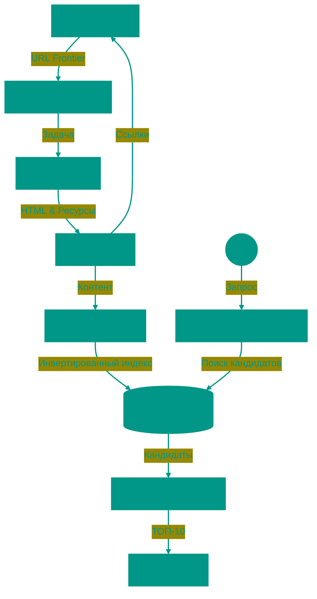

# 🔍 Поисковые системы: Архитектура и алгоритмы

Поисковая система — это сложнейший инженерный комплекс, задача которого — структурировать хаос интернета. Когда вы вводите запрос, система не начинает искать ответ в этот же момент. Она выдает вам результат из заранее подготовленного индекса, который формировался неделями. Внутри этого процесса лежат три фундаментальных этапа: Краулинг, Индексация и Ранжирование.

---


## 🏗️ Общая схема работы



---


## 1. 🕷️ Краулинг (Crawling)
Весь процесс начинается с обнаружения контента. Это задача программы-робота, называемой **краулером** (Web Crawler или Spider).


### Как это работает
Представьте интернет как бесконечную библиотеку без каталога, где книги (страницы) разбросаны по полу. Краулер — это библиотекарь, который берет одну книгу, читает её и выписывает все ссылки (сноски) на другие книги. Затем он бежит к этим новым книгам и повторяет процесс.


### Технические нюансы
1.  **Seed URLs**: Краулеры не могут начать «ниоткуда». Им нужен стартовый список надежных, высоконагруженных сайтов с большим количеством ссылок (Wikipedia, новостные агрегаторы), от которых они начинают свой путь в глубину.
2.  **Crawl Budget (Краулинговый бюджет)**: Поисковик не может сканировать ваш сайт бесконечно — это дорого (электричество, трафик) и может "положить" ваш сервер. Бюджет зависит от популярности сайта (PageRank) и скорости его ответа. Если сервер отвечает медленно, краулер уйдет быстрее.
3.  **URL Frontier и дубликаты**: Краулер должен уметь отличать `example.com/page?id=1` от `example.com/page?id=1&sort=asc`, если контент там одинаковый (канонизация), чтобы не тратить ресурсы на дубли.
4.  **Политики вежливости (Politeness)**: Роботы соблюдают директивы файла `robots.txt`, где администратор может закрыть от индексации технические разделы, админки или личные данные.

---


## 2. 🗂️ Индексация (Indexing)
Скачать страницу — это полдела. Теперь нужно сохранить информацию так, чтобы поиск по ней занимал миллисекунды.


### Прямой vs Инвертированный индекс
Обычная база данных хранит информацию как **Прямой индекс**: `Документ 1 -> [список слов]`. Это удобно для чтения книги, но ужасно для поиска. Если вы спросите «В каких книгах есть слово слон?», придется перечитать все книги заново.

Поисковики используют **Инвертированный индекс** (Inverted Index). Это аналог предметного указателя в конце учебника:
*   Слово "Слон" -> [Страница 5, Страница 12, Страница 89]
*   Слово "Жираф" -> [Страница 12, Страница 44]


### Процесс обработки
1.  **Токенизация**: Текст разбивается на слова.
2.  **Нормализация и Лемматизация**: Слова приводятся к базовой форме. "Бежал", "бегущий", "бег" превращаются в один токен `БЕЖАТЬ`.
3.  **Стоп-слова**: Предлоги и союзы (и, в, на, the, a) часто удаляются или получают пониженный вес, так как они есть везде.
4.  **Шардирование**: Индекс всего интернета не влезает ни в один суперкомпьютер. Он разбивается на части (шарды), которые хранятся на тысячах серверов. При поиске запрос распараллеливается на все шарды.

---


## 3. 🥇 Ранжирование (Ranking)
В ответ на запрос "купить ноутбук" поисковик находит миллионы страниц. Задача ранжирования — отсортировать их так, чтобы самая полезная оказалась первой.


### Сигналы ранжирования (Ranking Signals)
Это самая охраняемая тайна поисковиков, но основные принципы известны:

1.  **Текстовая релевантность (BM25)**: Классическая формула. Она учитывает, сколько раз слово встречается на странице, но штрафует, если страница слишком длинная (чтобы избежать спама ключевыми словами). Важно наличие слов в `<title>` и заголовках `H1`.
2.  **Ссылочный вес (PageRank)**: Алгоритм, сделавший Google лидером. Сайт считается авторитетным, если на него ссылаются другие авторитетные сайты. Это работает как научное цитирование или демократическое голосование. Ссылка = Голос.
3.  **Поведенческие факторы (User Signals)**:
    *   **CTR (Click-Through Rate)**: Кликают ли люди на ваш сайт в выдаче?
    *   **Dwell Time**: Как долго они там сидят? Если пользователь вернулся в поиск через 3 секунды (Pogo-sticking), значит, сайт не ответил на его вопрос.
4.  **Техническое качество**: Скорость загрузки (Core Web Vitals), адаптация под мобильные устройства, наличие HTTPS.


### Современные нейросети (AI)
Простой поиск по словам уже устарел. Современные алгоритмы (BERT, MUM) пытаются понять **смысл** (интент) запроса.
*   *Запрос*: "банк не работает что делать"
*   *Старый поиск*: Искал бы страницы со словами "банк" и "работа".
*   *Новый поиск*: Понимает, что речь идет о проблеме с приложением или лицензией ЦБ, и может выдать новости или телефон поддержки.

---


## 🏁 Путь запроса
Когда вы нажимаете Enter:
1.  Спелл-чекер исправляет опечатки ("кпить" -> "купить").
2.  Запрос отправляется на тысячи серверов с индексом.
3.  Каждый сервер возвращает лучших кандидатов.
4.  Сотни кандидатов проходят через "тяжелую" нейросеть для финальной сортировки.
5.  Вы видите результат. Весь процесс занимает менее **0.5 секунды**.

---


## 4. 🔤 Query Processing (Обработка запроса)

До того, как поиск начнётся, запрос нужно обработать и улучшить.


### Spell Correction (Исправление опечаток)
Используется **Levenshtein Distance** (минимальное количество операций для превращения одного слова в другое).
*   "банн" -> "банан" (1 удаление)
*   "гугл" -> "google" (3 замены)

Поисковик держит словарь из миллиардов слов и их частот (из краулинга). Если ваше слово не в словаре — ищется ближайшее похожее с высокой частотой.


### Query Expansion (Расширение запроса)
Пользователь вводит "купить ноутбук", но на сайтах может быть "ноутбуки", "лэптоп", "notebook".

**Решения**:
*   **Stemming**: Приведение к корню ("ноутбук" <- "ноутбуки", "ноутбукам")
*   **Синонимы**: "ноутбук" = "лэптоп" = "notebook"
*   **Word embeddings**: ML-модель понимает, что "ноутбук" близко к "компьютер", "MacBook"


### Autocomplete (Автодополнение)
Вы вводите "как сва", поисковик предлагает "как сварить борщ", "как свалять валенки".

**Алгоритм**: Prefix Tree (Trie). Каждый префикс хранит топ-10 популярных запросов.
**Обновление**: Trie перестраивается каждые несколько минут на основе реальных запросов пользователей.

---


## 5. 💻 Практика индексации


### Inverted Index на Python
Простой пример, как работает инвертированный индекс:

```python
from collections import defaultdict

documents = {
    1: "кот сидит на окне",
    2: "собака лает на кота",
    3: "кот и собака друзья"
}

# Построение inverted index
inverted_index = defaultdict(list)
for doc_id, text in documents.items():
    for word in text.split():
        inverted_index[word].append(doc_id)

# Поиск
query = "кот"
result = inverted_index[query]  # [1, 2, 3]
print(f"Слово '{query}' найдено в документах: {result}")
```


### TF-IDF (Term Frequency–Inverse Document Frequency)
Формула для взвешивания важности слова:
*   **TF**: Как часто слово встречается в документе
*   **IDF**: Насколько редко слово во всей коллекции

**Пример**: Слово "the" встречается везде -> низкий IDF -> не важно. Слово "нейросеть" встречается редко -> высокий IDF -> важно.

```
TF-IDF = (количество слова в документе / всего слов в документе) × log(всего документов / документов со словом)
```


### Elasticsearch Example
```json
PUT /products
{
  "mappings": {
    "properties": {
      "title": { "type": "text" },
      "price": { "type": "float" }
    }
  }
}

GET /products/_search
{
  "query": {
    "match": {
      "title": "ноутбук"
    }
  }
}
```

---


## 6. 🤖 Advanced Ranking


### Learning to Rank (LTR)
Вместо ручной настройки весов (PageRank × 0.3 + BM25 × 0.5), используется **машинное обучение**. 

**Процесс**:
1. Собирают тысячи сигналов (features): длина title, количество ссылок, CTR, Dwell Time
2. Обучают модель (Gradient Boosting, нейросеть) на исторических данных: какие страницы кликали для каких запросов
3. Модель предсказывает "релевантность" для новых запросов


### Neural Ranking (BERT Embeddings)
Традиционный поиск ищет совпадения слов. BERT понимает смысл.

**Пример**:
*   Запрос: "почему небо голубое"
*   Старый поиск: ищет страницы со словами "небо" + "голубое"
*   BERT: Понимает, что это вопрос про физику (рассеяние Рэлея), и выдаёт научные объяснения, даже если там нет слова "голубое"

**Embeddings**: Слова/фразы превращаются в векторы (массивы чисел). Похожие по смыслу слова имеют похожие векторы.


### Персонализация
Два человека ищут "ягуар". Один интересуется автомобилями, другой — животными, а я напитком. Поисковик смотрит на:
*   Search History (история поиска)
*   Location (где в Бразилии чаще ищут животное, в США — машину)
*   Device (на телефоне чаще ищут рестораны и магазины поблизости)

---


## 7. 🚫 Борьба со спамом


### Black Hat SEO
Недобросовестные методы "обмануть" поисковик:

**Link Farms (Ссылочные фермы)**:
Сотни сайтов-пустышек ссылаются друг на друга, чтобы накрутить PageRank.

**Keyword Stuffing (Спам ключевиками)**:
Страница с текстом: "купить дешево купить онлайн купить со скидкой купить сейчас купить быстро купить". Раньше работало, теперь — штраф.

**Cloaking (Подмена)**:
Краулеру показывается один контент (SEO-оптимизированный текст), пользователю — другой (реклама, порно).


### Google Penalties
Google периодически обновляет алгоритмы, чтобы "наказать" спамеров:

*   **Panda (2011)**: Понизил сайты с низкокачественным контентом (content farms)
*   **Penguin (2012)**: Наказал за покупку ссылок и link spam
*   **Fred (2017)**: Убрал сайты, где рекламы больше, чем контента

**Результат**: Сайты теряют 90% трафика за ночь.

---


## 8. 🌐 Распределённые системы


### MapReduce для индексации
Интернет — это миллиарды страниц. Как их проиндексировать?

**Map**: Каждый сервер обрабатывает свою часть страниц, извлекает слова и создаёт пары (слово, ID страницы).
**Reduce**: Все пары с одинаковым словом собираются вместе и сортируются.

**Пример**: Сервер 1 нашёл "кот" на странице 123. Сервер 2 нашёл "кот" на странице 456. Reduce объединяет: `кот -> [123, 456]`.


### Consistent Hashing для Sharding
Индекс разбивается на шарды (части). Как распределить слова по серверам?

**Проблема**: Если добавить новый сервер, придётся перераспределить половину данных.
**Решение**: Consistent Hashing. Добавление сервера затрагивает только ~1/N часть данных.


### Replication и Consistency
Каждый шард реплицируется на 3 сервера (master + 2 replicas). Если master падает — replica становится master.

**Trade-off**: Consistency vs Availability (CAP-теорема). Поисковики выбирают Availability: лучше показать чуть устаревший результат, чем не показать ничего.

---


## 9. 🎯 Векторный поиск


### Semantic Search (Семантический поиск)
Традиционный поиск: "купить iPhone" ≠ "приобрести смартфон Apple".
Векторный поиск: превращает запрос и документы в векторы (embeddings). Ищет ближайшие векторы.


### Word Embeddings
*   **Word2Vec** (2013): Слова, встречающиеся в похожих контекстах, получают похожие векторы. "король" - "мужчина" + "женщина" ≈ "королева"
*   **BERT** (2018): Учитывает контекст. Слово "банк" в "банк денег" и "берег реки" получает разные векторы


### ANN (Approximate Nearest Neighbors)
Точный поиск ближайших векторов среди миллиардов долог (минуты). Нужны приближённые алгоритмы:

*   **FAISS** (Facebook AI): Ускоряет поиск в 100-1000 раз с точностью 95%
*   **Annoy** (Spotify): Использует деревья для быстрого поиска

**Применение**: Google Search, YouTube рекомендации, Spotify плейлисты.

---


## 10. 🔧 Практический пример


### Построение мини-поисковика (Python)
```python
import math
from collections import Counter, defaultdict

docs = {
    1: "Python is a programming language",
    2: "Java is also a programming language",
    3: "Python is popular for data science"
}

# Инвертированный индекс
inverted_index = defaultdict(set)
for doc_id, text in docs.items():
    for word in text.lower().split():
        inverted_index[word].add(doc_id)

# IDF calculation
def idf(word):
    return math.log(len(docs) / len(inverted_index[word]))

# Поиск
query = "python programming"
query_words = query.lower().split()
scores = defaultdict(float)

for word in query_words:
    for doc_id in inverted_index.get(word, []):
        scores[doc_id] += idf(word)  # Упрощённо: TF=1

# Сортировка по релевантности
ranked = sorted(scores.items(), key=lambda x: x[1], reverse=True)
print("Результаты:", ranked)  # [(1, ~1.4), (2, ~0.7)]
```

**Вывод**: Документ 1 релевантнее (содержит оба слова "python" и "programming").

<!-- QUIZ_START 

[
    {
        "question": "Что такое Inverted Index (Инвертированный индекс) и почему он используется в поисковых системах?",
        "options": [
            "Это база данных с обратным порядком записей",
            "Это структура данных типа 'Слово -> [Список документов]', позволяющая быстро найти, где встречается слово",
            "Это алгоритм шифрования данных",
            "Это метод сортировки URL"
        ],
        "correctIndex": 1
    },
    {
        "question": "Какую задачу решает PageRank от Google?",
        "options": [
            "Ускоряет загрузку страниц",
            "Определяет авторитетность страницы на основе ссылок на неё с других авторитетных сайтов",
            "Сжимает изображения на сайте",
            "Проверяет код на ошибки"
        ],
        "correctIndex": 1
    },
    {
        "question": "Что такое 'Cold Start' в контексте поисковых двиов?",
        "options": [
            "Проблема с отоплением серверов",
            "Задержка при первом запросе из-за необходимости инициализации",
            "Сложность анализа запроса 'как сварить', когда неясен контекст",
            "Задержка при первом запросе из-за необходимости инициализации"
        ],
        "correctIndex": 3
    }
]

QUIZ_END -->


