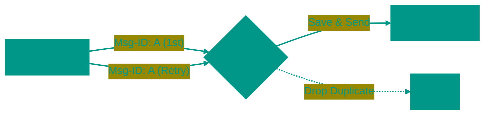

# ⚡ NATS

## 📑 Содержание
1. [Что это? (Скорость и Простота)](#1-что-это-скорость-и-простота)
2. [NATS Core (Fire and Forget)](#2-nats-core-fire-and-forget)
3. [NATS JetStream (Надежность)](#3-nats-jetstream-надежность)

---

## 1. 🏎️ Что это? (Скорость и Простота)

**NATS** — это брокер на стероидах, написанный на Go.
Он делится на две части:
1.  **Core NATS**: Очень быстрый Pub/Sub (как радио).
2.  **JetStream**: Слой надежности поверх Core (как Kafka).

---

## 2. 🔥 NATS Core (Fire and Forget)

*   **Гарантия**: At-Most-Once (Максимум один раз).
*   **Поведение**: Если вы не слушали радио в момент передачи, вы пропустили песню. Брокер не хранит историю.
*   **Использование**: Service Discovery, мгновенные команды, метрики.

---

## 3. ✈️ NATS JetStream (Надежность)

JetStream добавляет **Persistence** (сохранение на диск).

### 🛡️ Гарантии доставки
JetStream поддерживает все три уровня, включая **Exactly-Once**.

#### 1. At-Least-Once (Как минимум раз)
Консьюмер должен отправить `Ack`. Если не отправил за 30 секунд — NATS отправит сообщение снова.

#### 2. Exactly-Once (Ровно один раз)
В отличие от Kafka (где это сложно), в NATS это работает "из коробки" благодаря **Deduplication Window**.

**Как это работает?**
1.  Публишер шлет сообщение с уникальным заголовком `Nats-Msg-Id: uuid-123`.
2.  JetStream запоминает этот ID на (например) 2 минуты.
3.  Если Публишер (из-за сбоя сети) отправит то же сообщение снова — JetStream увидит дубль ID и скажет "Ок", но **не сохранит** дубль и не отправит его консьюмерам.

Это делает NATS JetStream очень привлекательным для финансовых транзакций, где дубли недопустимы.

<!-- QUIZ_START 

[
    {
        "question": "Чем NATS Core отличается от NATS JetStream?",
        "options": [
            "Core быстрее, но не хранит историю сообщений; JetStream добавляет персистентность",
            "Core работает только с Go",
            "JetStream не поддерживает Pub/Sub",
            "Нет никакой разницы"
        ],
        "correctIndex": 0
    },
    {
        "question": "Какую гарантию доставки предоставляет NATS Core?",
        "options": [
            "Exactly-Once",
            "At-Least-Once",
            "At-Most-Once (сообщение может быть потеряно)",
            "Гарантий нет вообще"
        ],
        "correctIndex": 2
    },
    {
        "question": "Как NATS JetStream реализует Exactly-Once доставку?",
        "options": [
            "Через сложные транзакции",
            "Используя Deduplication Window с уникальными Nats-Msg-Id",
            "Через репликацию на 3 сервера",
            "Это невозможно в NATS"
        ],
        "correctIndex": 1
    }
]

QUIZ_END -->