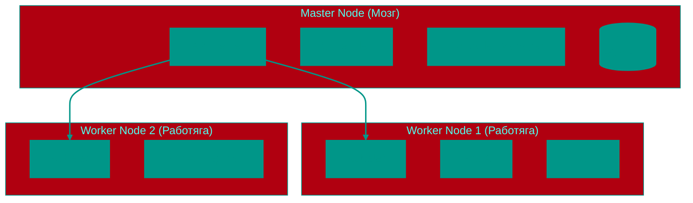

# ☸️ Kubernetes (K8s)

## 📑 Содержание
1. [Зачем нам K8s?](#зачем-нам-k8s)
2. [Архитектура (Master & Worker)](#архитектура-master--worker)
3. [Основные объекты (Pod, Deployment, Service)](#основные-объекты-pod-deployment-service)

---

## 1. 🤔 Зачем нам K8s?

Представьте, что у вас 100 контейнеров Docker.
*   Как следить, чтобы они все работали?
*   Что делать, если сервер сгорел?
*   Как добавить мощности в Черную Пятницу?

Вручную — невозможно. Нужен дирижер.
**Kubernetes** — это операционная система для кластера. Вы говорите: "Хочу 5 копий моего сайта", и K8s сам решает, на каких серверах их запустить, и перезапускает, если они падают.

---

## 2. 🏗️ Архитектура (Master & Worker)

K8s — это не один компьютер, а сеть компьютеров.

### 🧠 Master Node (Control Plane)
Начальник. Принимает решения.
*   **API Server**: Единственная точка входа. Все команды (`kubectl ...`) идут сюда.
*   **Scheduler**: Решает, на какую ноду (сервер) посадить новый Pod (в зависимости от свободной памяти и CPU).
*   **etcd**: База данных, где хранится всё состояние кластера.

### 👷 Worker Node
Работяга. Просто выполняет приказы.
*   **Kubelet**: Агент, который слушает Мастера и управляет контейнерами на этой машине.

---

## 3. 📦 Основные объекты

### 🥜 Pod (Под)
Минимальная единица в K8s.
*   В Docker минимальная единица — Контейнер.
*   В K8s — **Pod**.
*   В 99% случаев 1 Pod = 1 Контейнер.
*   Но иногда в одном стручке (Pod) может быть несколько горошин (контейнеров), которые живут вместе и делят сеть (localhost).

### 🚀 Deployment (Развертывание)
Вы не создаете Поды вручную (они смертны). Вы создаете Deployment.
*   **Deployment** говорит: "Мне нужно всегда иметь 3 копии Пода `frontend`".
*   Если одна нода сгорит, Deployment заметит, что подов стало 2, и создаст третий на выжившей ноде.

### 🛎️ Service (Сервис)
У Подов IP-адреса меняются при перезапуске. Как к ним обращаться?
*   **Service** — это стабильный адрес (и балансировщик нагрузки) для группы Подов.
*   Поды приходят и уходят, Сервис остается вечно.

---

## 💡 Итог
Docker — это про то, как **запаковать** приложение.
Kubernetes — это про то, как **запустить и управлять** тысячами таких приложений.

<!-- QUIZ_START 

[
    {
        "question": "Кто такой Kubernetes (K8s) в мире контейнеров?",
        "options": [
            "Язык программирования",
            "Дирижер (оркестратор), управляющий тысячами контейнеров",
            "База данных",
            "Тип операционной системы для ПК"
        ],
        "correctIndex": 1
    },
    {
        "question": "Что такое Pod в Kubernetes?",
        "options": [
            "Минимальная единица управления, содержащая один или несколько контейнеров",
            "Физический сервер в дата-центре",
            "Команда для запуска Docker",
            "Инструмент для мониторинга"
        ],
        "correctIndex": 0
    },
    {
        "question": "За что отвечает Master Node (Control Plane)?",
        "options": [
            "За выполнение кода приложения",
            "За принятие решений и управление состоянием кластера",
            "За хранение файлов пользователей",
            "За охлаждение серверов"
        ],
        "correctIndex": 1
    }
]

QUIZ_END -->