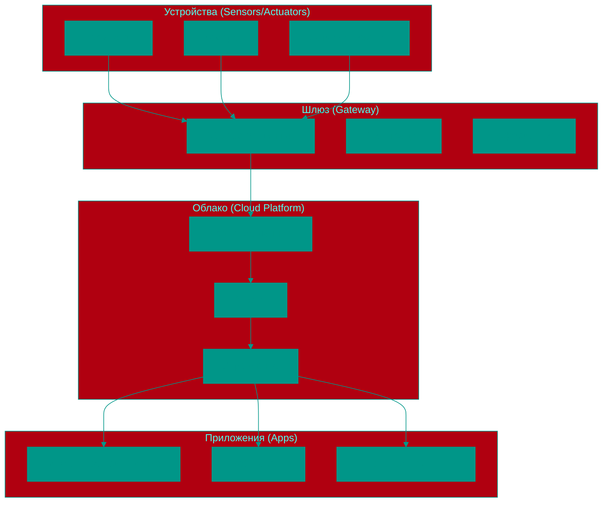
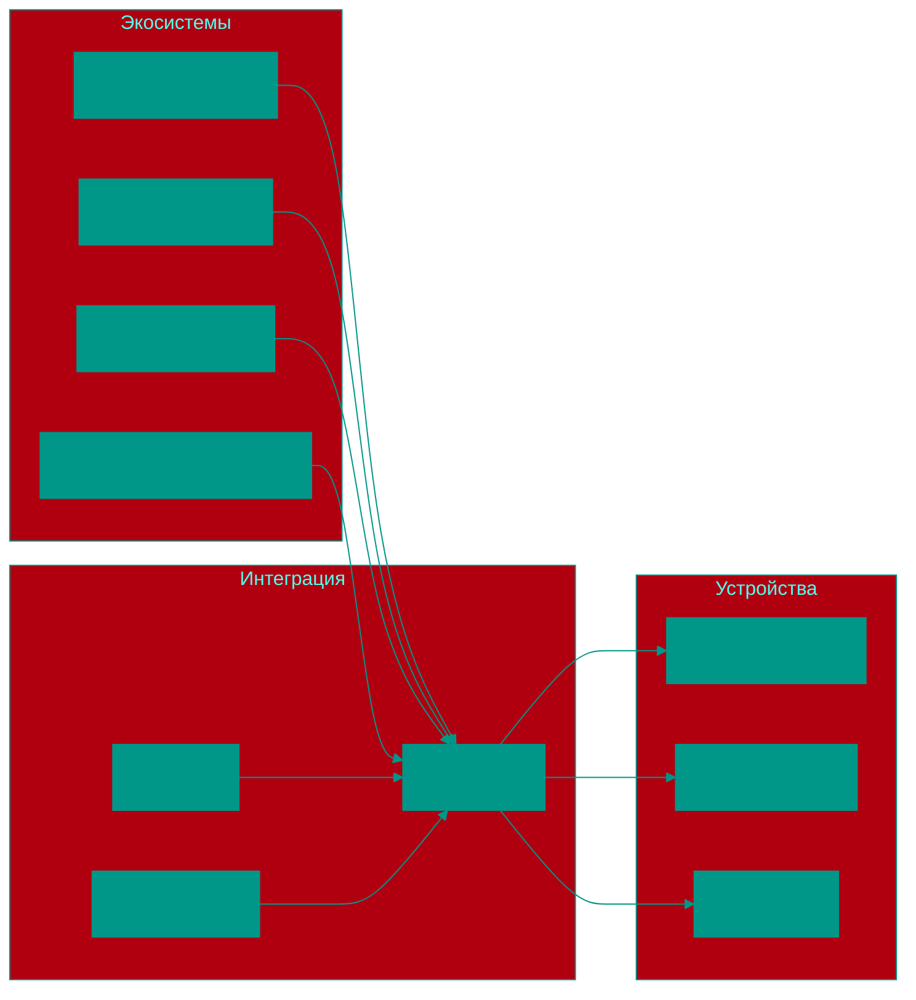

# 🏠 Умный Дом и Интернет Вещей (IoT)

## 📑 Содержание
1. [Что такое IoT?](#что-такое-iot)
2. [Архитектура IoT-систем](#архитектура-iot-систем)
3. [Протоколы связи в IoT](#протоколы-связи-в-iot)
4. [Устройства умного дома](#устройства-умного-дома)
5. [Платформы и экосистемы](#платформы-и-экосистемы)
6. [Безопасность IoT](#безопасность-iot)
7. [Преимущества и проблемы](#преимущества-и-проблемы)

---

## 1. 🤖 Что такое IoT?

**IoT (Internet of Things)** — это концепция, при которой **физические объекты** (вещи) оснащаются сенсорами, программным обеспечением и другими технологиями для подключения и обмена данными с другими устройствами и системами через интернет.

### 🔄 Аналогия
Представьте себе **дом, где каждая вещь умеет разговаривать**:
*   Чайник говорит: "Я вскипятил воду!"
*   Холодильник говорит: "Молоко закончилось, заказываю доставку"
*   Дверь говорит: "К вам пришёл гость"
*   Лампочка говорит: "Пора включаться, хозяин проснулся"

### 🧩 Основные компоненты IoT:
*   **Сенсоры** — собирают данные из окружающей среды
*   **Коннекторы** — обеспечивают связь с интернетом
*   **Процессоры** — обрабатывают данные
*   **Программное обеспечение** — управляет устройством

---

## 2. 🏗️ Архитектура IoT-систем

### 📊 Типичная архитектура:


### 🧱 Уровни архитектуры:
1.  **Уровень устройств** — физические сенсоры и исполнительные механизмы
2.  **Шлюз/Edge** — первичная обработка данных на месте
3.  **Облачный уровень** — хранение, анализ и управление
4.  **Уровень приложений** — интерфейсы для пользователей

---

## 3. 🌐 Протоколы связи в IoT

### 📶 Проводные протоколы:
*   **Ethernet** — надёжное проводное соединение
*   **Power Line Communication (PLC)** — передача данных по электросети

### 📡 Беспроводные протоколы:

#### 🏠 Для дома:
*   **Wi-Fi** — высокая скорость, большая пропускная способность
*   **Bluetooth / BLE** — низкое энергопотребление, короткий радиус действия
*   **Zigbee** — низкое энергопотребление, сетка (mesh), идеально для сенсоров
*   **Z-Wave** — специализированный протокол для умного дома, безопасный

#### 🏭 Для промышленности:
*   **LoRaWAN** — длинная дистанция, низкое энергопотребление
*   **NB-IoT** — узкополосный интернет вещей через мобильные сети
*   **Sigfox** — передача малых объёмов данных на большие расстояния

### 🔄 Сравнение протоколов:
| Протокол | Радиус | Энергопотр. | Скорость | Применение |
|----------|--------|-------------|----------|------------|
| Wi-Fi | 30-100м | Высокое | Высокая | Камеры, умные колонки |
| Zigbee | 10-100м | Низкое | Низкая | Датчики, выключатели |
| Z-Wave | 30-100м | Низкое | Низкая | Умный дом (совместимость) |
| BLE | 10-50м | Очень низкое | Средняя | Носимые устройства |

---

## 4. 🏡 Устройства умного дома

### 🌡️ Контроль климата:
*   **Умный термостат** — регулирует температуру по расписанию и предпочтениям
*   **Увлажнитель/очиститель воздуха** — контролирует качество воздуха
*   **Кондиционеры с Wi-Fi** — управление с телефона

### 📡 MQTT протокол:
*   **MQTT (Message Queuing Telemetry Transport)** — легковесный протокол передачи данных
*   **Преимущества:** низкая пропускная способность, надежность, поддержка "отправитель-получатель"
*   **Применение:** передача данных от датчиков, управление устройствами в умном доме
*   **Принцип работы:** клиенты публикуют и подписываются на сообщения в топиках через брокер

### 💡 Освещение:
*   **Умные лампочки** — цвет, яркость, расписание
*   **Умные выключатели** — дистанционное управление обычными лампами
*   **Управляемые розетки** — включение/выключение устройств

### 🔐 Безопасность:
*   **Умные камеры** — видеонаблюдение, детекция движения
*   **Дверные/оконные сенсоры** — оповещение о вторжении
*   **Умные замки** — открытие/закрытие с телефона
*   **Сигнализация** — комплексная защита

### 🍳 Кухня и бытовая техника:
*   **Умный холодильник** — список продуктов, рецепты
*   **Умная плита/духовка** — управление и таймеры
*   **Умная кофеварка** — приготовление по расписанию

### 🏠 Инфраструктура:
*   **Центральный хаб** — объединяет устройства разных производителей
*   **Голосовые помощники** — Alexa, Google Assistant, Siri
*   **Шлюзы** — обеспечивают связь между протоколами

---

## 5. 🧩 Платформы и экосистемы

### 🏪 Закрытые экосистемы:
*   **Apple HomeKit** — безопасность, интеграция с Apple
*   **Google Nest** — искусственный интеллект, голосовое управление
*   **Samsung SmartThings** — широкая совместимость, автоматизация

### 🌐 Открытые платформы:
*   **Home Assistant** — самодостаточная система, полный контроль
*   **OpenHAB** — гибкая настройка, поддержка множества протоколов
*   **Node-RED** — визуальное программирование автоматизации

### 🔄 Интеграция:


---

## 6. 🛡️ Безопасность IoT

### 🚨 Основные угрозы:
1.  **Слабые пароли** — устройства часто используют стандартные креды
2.  **Уязвимости в прошивке** — необновляемые системы
3.  **Незашифрованный трафик** — перехват данных
4.  **Недостаточная аутентификация** — доступ без проверки

### 🔒 Рекомендации по безопасности:
*   **Изменение стандартных паролей** на уникальные
*   **Регулярное обновление прошивки** до последней версии
*   **Использование VPN** для удалённого доступа
*   **Сегментация сети** — отдельная сеть для IoT-устройств
*   **Мониторинг трафика** — отслеживание подозрительной активности

### 🏠 Безопасная настройка:
```yaml
Сеть:
  - Отдельная сеть для IoT (IoT VLAN)
  - Отключение WPS (уязвимость)
  - Обновление прошивки роутера

Устройства:
  - Уникальные пароли
  - Отключение ненужных функций
  - Регулярные обновления

Платформы:
  - Двухфакторная аутентификация
  - Ограничение доступа
  - Аудит подключенных устройств
```

---

## 7. ⚖️ Преимущества и проблемы

### ✅ Преимущества:
1.  **Удобство** — управление всем с одного устройства
2.  **Энергоэффективность** — автоматическое управление потреблением
3.  **Безопасность** — видеонаблюдение и сигнализация
4.  **Автоматизация** — сценарии по расписанию и событиям
5.  **Мониторинг** — данные о состоянии дома в реальном времени

### ❌ Проблемы:
1.  **Сложность настройки** — требует технических знаний
2.  **Зависимость от интернета** — без интернета многие функции недоступны
3.  **Конфликты совместимости** — устройства разных брендов могут не работать вместе
4.  **Приватность** — сбор данных о привычках пользователя
5.  **Безопасность** — потенциальные точки входа для хакеров

---

## 8. 🚀 Будущее IoT и умного дома

*   **ИИ и машинное обучение** — устройства будут учиться на поведении пользователя
*   **Краевые вычисления** — обработка данных на устройстве, а не в облаке
*   **Единые стандарты** — лучшая совместимость между производителями
*   **Энергонезависимые датчики** — работа от сбора энергии из окружения
*   **Интеграция с умным городом** — взаимодействие с городской инфраструктурой

<!-- QUIZ_START
[
    {
        "question": "Что означает аббревиатура IoT?",
        "options": [
            "Internet of Technology",
            "Intelligent Objects Technology",
            "Internet of Things",
            "Integrated Online Tools"
        ],
        "correctIndex": 2
    },
    {
        "question": "Какой протокол лучше всего подходит для датчиков с низким энергопотреблением?",
        "options": [
            "Wi-Fi",
            "Bluetooth",
            "Zigbee",
            "Ethernet"
        ],
        "correctIndex": 2
    },
    {
        "question": "Что такое Home Assistant?",
        "options": [
            "Голосовой помощник от Amazon",
            "Платформа для управления умным домом",
            "Тип умного устройства",
            "Протокол связи"
        ],
        "correctIndex": 1
    }
]
QUIZ_END -->