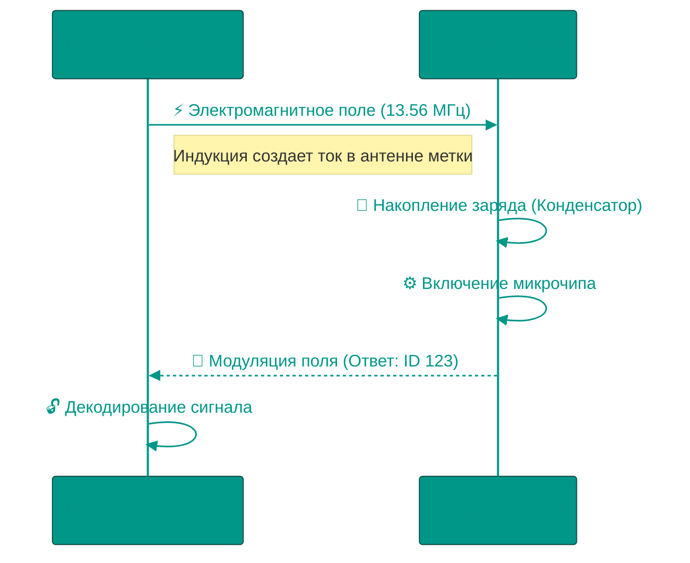

# 📡 RFID и NFC: Беспроводная идентификация

Технологии радиочастотной идентификации (RFID) позволяют объектам "общаться" с цифровым миром без прямой видимости и источников питания. От складской логистики до бесконтактной оплаты — всё это работает на одних физических принципах.

---

## 🏗️ Физика процесса

---

## 1. 📻 RFID (Radio Frequency Identification)
Система состоит из двух частей: **Считывателя** (Reader), который генерирует поле, и **Транспондера** (Tag/Метка), который хранит данные.

### Принципы передачи энергии
1.  **Индуктивная связь (Inductive Coupling)**: Работает на низких (LF) и высоких (HF) частотах. Считыватель создает магнитное поле, которое пронизывает катушку метки, возбуждая в ней ток (вспоминаем трансформатор). Работает на расстоянии до 1 метра.
2.  **Обратное рассеяние (Backscatter)**: Работает на ультравысоких частотах (UHF). Считыватель посылает радиоволну, а метка "отражает" часть этой волны обратно, модулируя её своими данными. Работает на 10-100 метров (платные дороги, склады).

### Стандарты и Частоты
*   **LF (125 кГц)**: Простейшие карты доступа в офис. Данные не шифруются, легко клонируются. Проходят через воду и металл.
*   **HF (13.56 МГц)**: Основа современных смарт-карт (MIFARE) и NFC. Поддерживает криптографию.
*   **UHF (860-960 МГц)**: EPC Gen2. Используется в ритейле (магазины одежды) для инвентаризации сотен товаров за секунды.

---

## 2. 📱 NFC (Near Field Communication)
NFC — это не просто "разновидность RFID", а надстройка над стандартом **ISO 14443**. Ключевое отличие: NFC-устройство может быть и считывателем, и меткой одновременно.

### Режимы работы
1.  **Reader/Writer**: Телефон считывает пассивную метку (например, на рекламном плакате), получая NDEF-сообщение (ссылку, текст).
2.  **Card Emulation**: Телефон притворяется банковской картой или проездным. Для терминала нет разницы между пластиком и смартфоном.
3.  **Peer-to-Peer**: Два активных устройства обмениваются данными. Используется для быстрого сопряжения Bluetooth-наушников или передачи контактов (Android Beam).

### Безопасность и Secure Element
В отличие от обычного копирования карт, оплата телефоном (Apple/Google Pay) защищена аппаратно.
*   **Tokenization**: Телефон не передает номер карты. Он передает одноразовый токен.
*   **Secure Element (SE)**: Это отдельный чип (или изолированная область процессора), где хранятся криптографические ключи. Даже если ОС взломана вирусом, он не может прочитать память SE, он может только попросить SE подписать транзакцию.

### Угрозы: Relay Attack
Поскольку NFC работает "вплотную", его сложно подслушать. Но можно удлинить. Злоумышленник 1 стоит рядом с вами в метро с антенной. Злоумышленник 2 стоит у терминала оплаты с эмулятором. Сигнал передается через интернет. Вы платите за чужой кофе.
*Защита*: Контроль времени отклика (Distance Bounding). Сигнал должен вернуться за наносекунды. Если задержка больше — значит, он прошел через интернет, и транзакция блокируется.

---

## 3. 🔓 Атаки на RFID и защита

### Клонирование карт доступа (LF 125 кГц)
Простейшие RFID-карты (домофоны, старые офисные пропуска) передают ID в открытом виде без шифрования.

**Инструменты атаки**:
*   **Proxmark3**: "Швейцарский нож" для RFID. Считывает и эмулирует карты. Стоимость ~$300.
*   **Flipper Zero**: Портативное устройство размером с игровую приставку. Может клонировать LF/HF карты. Популярность в TikTok привела к запрету продаж в Канаде (2024).

**Как работает клонирование**:
1. Поднести Proxmark к карте жертвы (в кармане, через сумку)
2. Считать UID (уникальный идентификатор)
3. Записать UID на пустую T5577 карту
4. Использовать клон для доступа

**Защита**: Переход на HF карты с криптографией (MIFARE DESFire, iClass SE).

### Skimming (скимминг карт)
NFC-платежные карты передают часть данных без PIN (для contactless до определенной суммы).

**Атака**: Злоумышленник с портативным NFC-ридером в рюкзаке проходит в людном месте (метро, очередь). Ридер считывает номер карты и срок действия через одежду/сумку.

**Ограничения атаки**: 
*   Можно считать номер, но не CVV2 (он не передается через NFC)
*   Для онлайн-покупки нужен CVV, который на обороте карты
*   Tokenization в современных картах делает скимминг бесполезным

**Защита**: RFID-blocking кошельки (Faraday Cage), или просто металлическая фольга.

---

## 4. 🎴 Семейство MIFARE: От уязвимого Classic до защищенного DESFire

### MIFARE Classic (1994)
Самая распространенная смарт-карта в мире (проездные, студенческие билеты, платежи в кампусах).

**Уязвимости**:
*   **Crypto-1 взломан (2008)**: Немецкие исследователи раскрыли алгоритм шифрования. Атака Darkside позволяет извлечь ключи за 20 секунд.
*   **Sector 0 не защищен**: UID можно изменить на китайских "magic cards" (UID Changeable).

**Реальный кейс**: В 2008 студенты Нидерландов взломали OV-Chipkaart (национальная транспортная карта). Смогли добавлять баланс произвольно. Транспортная компания подала иск, чтобы запретить публикацию исследования, но проиграла в суде.

### MIFARE DESFire EV3 (2020)
Современный стандарт для высокозащищенных систем.

**Криптография**:
*   AES-128 (вместо проприетарного Crypto-1)
*   Mutual Authentication (не только карта доказывает подлинность ридеру, но и ридер — карте)
*   Transaction MAC (каждая операция подписывается)

**Применение**: Платежи в транспорте (Берлин, Гонконг Octopus Card), корпоративный доступ.

**Цена защиты**: DESFire стоит $3-5 за штуку против $0.30 за Classic.

---

## 5. 📡 Протоколы NFC

### NDEF (NFC Data Exchange Format)
Универсальный формат для хранения данных в NFC-метках. Структура: **Record → Message**.

**Типы записей (RTD)**:
*   **URI**: Ссылка (https://example.com)
*   **Text**: Текст с указанием языка
*   **Smart Poster**: URL + заголовок + описание
*   **MIME**: Произвольные данные (vCard, JSON)

**Пример использования**: Рекламный плакат с NFC-меткой. Пользователь прикладывает телефон → открывается сайт + добавляется событие в календарь (через MIME с iCal).

### LLCP (Logical Link Control Protocol)
Протокол peer-to-peer обмена. Используется для:
*   **Android Beam** (устарел, заменен на Nearby Share)
*   **Быстрое сопряжение Bluetooth**: NFC передает MAC-адрес и ключ, Bluetooth устанавливает основное соединение

---

## 6. 🏭 Индустриальное применение

### Ритейл и инвентаризация
**Проблема**: Инвентаризация магазина одежды с 10,000 SKU раньше занимала неделю (сканировали штрихкоды вручную).

**Решение**: UHF RFID-метки на каждой вещи. Сотрудник проходит с ручным ридером → считывается 1000 товаров/секунду. Инвентаризация за 1 час.

**Кейс Decathlon**: Внедрили RFID в 2010. Ускорили инвентаризацию на 95%, снизили ошибки "нет в наличии" с 13% до 2%. ROI окупился за год.

**Проблема приватности**: В 2003 Benetton встроили RFID в одежду без уведомления. Активисты организовали бойкот, обеспокоенные слежкой после покупки. Теперь метки деактивируются при оплате.

### Логистика и склады
**Применение**: Amazon использует RFID для отслеживания миллионов посылок. Роботы на складе (Kiva Systems) находят нужную полку по RFID-меткам.

### Медицина
**Задача**: Отслеживание инструментов в операционной (каждый скальпель стоит $200, часто теряются).

**Решение**: UHF-метки вшиты в ручки инструментов. Портал при выходе из операционной сканирует лоток. Если чего-то не хватает — сигнал тревоги.

**Кейс**: Госпиталь в Сингапуре сократил потери инструментов на $100,000/год.

### Транспорт
*   **Oyster Card (Лондон)**: MIFARE Classic (постепенно мигрирует на DESFire)
*   **Suica/Pasmo (Токио)**: Sony FeliCa (проприетарный стандарт, более быстрый, чем NFC)
*   **Тройка (Москва)**: MIFARE Ultralight C + MIFARE DESFire

**Скорость транзакции**: На турникете метро транзакция должна завершиться за <300 мс, даже если пассажир идет быстро. MIFARE оптимизирован под это (collision avoidance позволяет обрабатывать несколько карт одновременно).

---

## 7. 🛡️ Практические меры защиты

### Для пользователей
*   **RFID-blocking кошельки**: Металлизированная ткань (экранирование)
*   **Отключение NFC**: Если не пользуетесь — отключите в настройках телефона
*   **Проверка транзакций**: Настраивать push-уведомления на любые операции по карте

### Для организаций
*   **Переход на DESFire/iClass SE**: Миграция с Classic займет годы, но критична для безопасности
*   **Whitelist систем**: Не допускать регистрацию произвольных UID (проверять криптографическую подпись чипа)
*   **Физическая защита ридеров**: Встраивать в стену/турникет, чтобы нельзя было подключить Proxmark для анализа трафика

<!-- QUIZ_START 

[
    {
        "question": "Как пассивная RFID-метка получает энергию для работы чипа?",
        "options": [
            "От встроенной батарейки",
            "Через солнечный свет",
            "Через электромагнитную индукцию от поля считывателя",
            "Через Wi-Fi"
        ],
        "correctIndex": 2
    },
    {
        "question": "Какой частотный диапазон используется для инвентаризации складов на расстоянии до 100 метров?",
        "options": [
            "LF (125 кГц)",
            "HF (13.56 МГц)",
            "UHF (860-960 МГц)",
            "Bluetooth"
        ],
        "correctIndex": 2
    },
    {
        "question": "В чем главное отличие NFC от обычного RFID?",
        "options": [
            "NFC работает только с металлом",
            "NFC-устройство может быть и считывателем, и меткой (режим P2P)",
            "NFC не требует антенны",
            "RFID всегда безопаснее"
        ],
        "correctIndex": 1
    }
]

QUIZ_END -->

