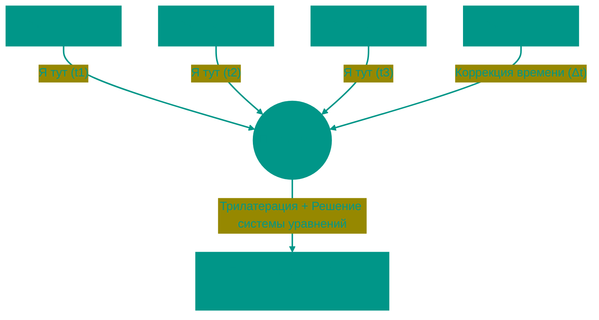

# 🛰️ GPS: Спутниковая навигация и Теория относительности

Global Positioning System (GPS) — это чудо инженерии, которое доказало правоту Эйнштейна на практике. Чтобы ваш телефон показал точку на карте с точностью до 5 метров, система должна учитывать эффекты, искажающие само время и пространство.

---


## 🏗️ Геометрия позиционирования



---


## 1. 📐 Трилатерация (Trilateration)
Многие думают, что спутник "видит" нас. На самом деле это ваш телефон "слышит" спутники. Это пассивная система: вы ничего не излучаете в космос.


### Принцип работы
Спутник непрерывно передает радиосигнал, в котором зашифровано: "Я спутник №5, сейчас ровно 12:00:00.000".
Телефон принимает сигнал в 12:00:00.067. Разница во времени (0.067 сек) умножается на скорость света, и мы получаем расстояние (псевдодальность).

*   **1 спутник**: Мы находимся где-то на **сфере** радиусом R1.
*   **2 спутника**: Пересечение двух сфер — это **окружность**. Мы где-то на этом кольце.
*   **3 спутника**: Пересечение окружности и третьей сферы дает **две точки**. Одна в космосе (отбрасываем), вторая на Земле (наша позиция).
*   **4 спутника**: Нужны для синхронизации времени.

---


## 2. ⏳ Время и Теория относительности
Для точности в 1 метр нам нужно измерять время с точностью до 3 наносекунд. Любая ошибка умножается на скорость света (300 000 км/с). Ошибка в 0.001 секунды даст промах в 300 км!


### Почему часы идут по-разному?
Спутники испытывают два релятивистских эффекта, предсказанных Эйнштейном:
1.  **Специальная теория относительности (СТО)**: Спутник летит со скоростью 14 000 км/ч. Для быстро движущегося объекта время замедляется. Результат: часы отстают на **7 мкс/день**.
2.  **Общая теория относительности (ОТО)**: Спутник находится на высоте 20 000 км, где гравитация слабее, чем на Земле. В слабом гравитационном поле время течет быстрее. Результат: часы спешат на **45 мкс/день**.

**Итог**: Часы спутника убегают вперед на `45 - 7 = 38` микросекунд в день. Если это не исправлять, навигация будет врать на **11 км** каждый день. Инженеры "замедляют" атомные часы перед запуском, чтобы на орбите они шли синхронно с земными.

---


## 3. 🎯 Точность и Ошибки (GDOP)
Даже с атомными часами (цезиевыми или рубидиевыми) есть погрешности.

*   **Ионосфера**: Слой заряженных частиц на высоте 60-1000 км замедляет радиосигнал. Это вносит самую большую ошибку (до 5-10 метров).
*   **Multipath (Многопутность)**: В городе сигнал отражается от зданий («эхо»). Приемник путает прямой сигнал с отраженным, думая, что спутник дальше, чем он есть.
*   **GDOP (Geometric Dilution of Precision)**: Геометрический фактор. Если все видимые спутники сгрудились в одной части неба, точность падает (высокий DOP). Если они разбросаны по горизонту — точность максимальная (низкий DOP).


### Как получить сантиметровую точность?
Обычный GPS дает 3-5 метров. Для геодезии и агротехники этого мало.
Используется **DGPS (Differential GPS)** и **RTK (Real Time Kinematic)**:
На земле стоит неподвижная Базовая Станция с известными координатами. Она видит те же спутники, вычисляет ошибку («GPS говорит я тут, но я знаю, что я там → ошибка 1.5 метра на север») и передает поправки на ваш приемник (Rover) через интернет или радиоканал. Это дает точность до **1-2 см**.

---


## 4. ⚡ A-GPS (Assisted GPS)
"Холодный старт" GPS (поиск спутников и скачивание альманаха) может занимать 12 минут.
Телефон жульничает: он скачивает актуальные данные об орбит ах через 4G/Wi-Fi с серверов Apple/Google. Это позволяет найти спутники за 2-3 секунды (Time to First Fix).

---


## 5. 🌍 Альтернативные GNSS (Global Navigation Satellite Systems)


### Сравнение систем

| Система | Страна | Спутников | Запуск | Точность (гражданская) |
|---------|--------|-----------|--------|------------------------|
| **GPS** | США | 31 | 1978 | 3-5 м |
| **ГЛОНАСС** | РФ | 24 | 1982 | 3-7 м |
| **Galileo** | ЕС | 30 | 2016 | 1 м |
| **BeiDou** | Китай | 35 | 2000 | 3-5 м |


### Особенности систем

**ГЛОНАСС**:
*   Использует FDMA (Frequency Division) вместо CDMA. Каждый спутник передает на отдельной частоте
*   Лучше работает в высоких широтах (полярные орбиты)
*   Двухчастотные сигналы в гражданском диапазоне (L1, L2) — защита от ионосферных помех

**Galileo**:
*   Самая точная система для гражданского использования
*   Коммерческий сигнал (E6) с шифрованием для платных услуг (дециметровая точность)
*   Search and Rescue: спутники принимают сигналы от аварийных маяков (406 МГц) и передают координаты спасателям

**BeiDou**:
*   Поддерживает SMS через спутник (120 символов)
*   Сочетает MEO (средние орбиты) + GEO (геостационарные, висят над Азией для усиленного покрытия Китая)


### Multi-GNSS
Современные чипы (Qualcomm, MediaTek) принимают сигналы всех 4 систем одновременно. Это дает:
*   Больше видимых спутников (до 20-30 вместо 8-12)
*   Лучший GDOP (геометрия)
*   Отказоустойчивость (если GPS глушат или ведут техобслуживание — можно использовать Galileo)

---


## 6. 🚫 GPS Spoofing и Jamming


### Jamming (Глушение)
**Принцип**: Передатчик излучает шум на частотах GPS (1575.42 МГц для L1). Приемник "тонет" в помехах.

**Применение**:
*   Военное: защита объектов от GPS-наводимых ракет
*   Криминальное: водители грузовиков глушат GPS-трекеры, чтобы угонять машины

**Кейс**: В 2013 водитель грузовика в аэропорту Ньюарка включал глушилку каждый день. Она случайно заглушала систему посадки самолетов (которая использует GPS для точного захода). ФБР вычислило его через радиопеленгацию.

**Защита**: Directional Antennas (антенны с узким лучом, смотрят только вверх, игнорируют наземные помехи).


### Spoofing (Подмена)
**Принцип**: Передатчик имитирует сигналы спутников GPS, но с подложными данными. Приемник думает, что находится в другом месте/времени.

**Кейс (2011)**: Иран захватил американский дрон RQ-170. По одной из версий, использовали spoofing: дрон думал, что летит над Афганистаном, а реально был над Ираном и спокойно сел, считая, что вернулся на базу.

**Гражданские атаки**:
*   **Pokemon GO** (2016): Игроки использовали spoofing-приложения, чтобы телефон показывал координаты в других странах (ловили редких покемонов, не выходя из дома)
*   **Морские суда**: В 2019 портовые власти заметили, что десятки судов в Черном море "телепортировались" в аэропорт на суше. Предположительно, российские системы РЭБ испытывали spoofing.

**Защита**:
*   Криптографическая подпись сигналов (Military GPS M-Code, Galileo OS-NMA)
*   Проверка согласованности: если координаты прыгают на 100 км за секунду — игнорировать

---


## 7. 📍 Indoor Positioning (Позиционирование внутри зданий)

GPS не работает в помещениях (сигнал ослабляется в 100+ раз, проходя через бетон). Альтернативы:


### Wi-Fi Triangulation
**Принцип**: Телефон видит несколько Wi-Fi роутеров, измеряет силу сигнала (RSSI), вычисляет расстояние до каждого и триангулирует позицию.

**База данных**: Google/Apple собрали базу координат миллионов роутеров (Wi-Fi BSSID → GPS координаты). Когда телефон видит знакомый BSSID, он сразу знает координаты без GPS.

**Точность**: 10-50 метров (зависит от плотности роутеров).


### Bluetooth Beacons (BLE)
**Принцип**: По зданию расставлены маячки (iBeacon, Eddystone). Они передают UUID и TX Power. Телефон вычисляет расстояние по RSSI.

**Применение**: 
*   Навигация в торговых центрах (приложение показывает, на каком этаже/магазине вы)
*   Музеи: аудиогид автоматически включается, когда вы подходите к экспонату

**Точность**: 1-5 метров.


### UWB (Ultra-Wideband)
**Принцип**: Похоже на GPS, но в миниатюре. Измерение времени прохождения радиоимпульса (Time of Flight) между телефоном и якорями (anchors).

** Применение**:
*   Apple AirTag (поиск потерянных вещей с точностью до сантиметров)
*   BMW: телефон в кармане — ключ от машины. UWB не дает "relay attack" (в отличие от Bluetooth)

**Точность**: 10-30 см.

---


## 8. 🧮 Фильтр Калмана для сглаживания траектории


### Проблема
GPS выдает координаты с шумом (из-за multipath, ионосферы). Если рисовать "сырые" точки на карте, траектория дергается: вы вроде идете по тротуару, но точки прыгают на дорогу и обратно.


### Решение: фильтр Калмана
Это алгоритм, который объединяет:
*   **Предсказание** (физическая модель): "Человек шел на север со скоростью 5 км/ч → через 1 сек он должен быть в 1.4 метрах севернее"
*   **Измерение** (данные GPS): "GPS говорит, что он на 2 метра восточнее"
*   **Коррекцию**: Фильтр "усредняет" предсказание и измерение с учетом их достоверности

**Результат**: Плавная траектория. Используется в:
*   Навигаторах (Яндекс.Карты, Google Maps)
*   Автопилотах (Tesla, Waymo)
*   Ракетах и дронах

**Простой пример (псевдокод)**:
```
prediction = last_position + velocity * dt
measurement = GPS_reading
kalman_gain = uncertainty_prediction / (uncertainty_prediction + GPS_noise)
new_position = prediction + kalman_gain * (measurement - prediction)
```

---


## 9. 🎯 Практические расчёты


### Пример: Вычисление расстояния до спутника

Спутник передает в сигнале: "Время передачи = 12:00:00.000"
Приемник принимает сигнал в: "Время приема = 12:00:00.067"

**Задержка**: 0.067 секунды
**Расстояние**: 0.067 с × 299,792,458 м/с = **20,086 км**


### Пример: Как 3 спутника дают 2 точки

Представьте 2D:
*   Спутник A на расстоянии 100 км → круг радиусом 100 км
*   Спутник B на расстоянии 120 км → круг радиусом 120 км
*   Пересечение кругов = 2 точки

Одна точка в космосе (отбрасываем), вторая на Земле (наша позиция).

В 3D (реальность) это сферы, и нужен 4-й спутник для синхронизации времени.

<!-- QUIZ_START 

[
    {
        "question": "Какое минимальное количество спутников нужно для точного определения координат (с учетом поправки времени)?",
        "options": [
            "1",
            "2",
            "3",
            "4"
        ],
        "correctIndex": 3
    },
    {
        "question": "Почему часы на спутниках GPS 'спешат' относительно земных атомных часов на 38 мкс/день?",
        "options": [
            "Из-за солнечной радиации",
            "Из-за эффектов теории относительности (слабая гравитация и высокая скорость)",
            "Потому что в космосе нет атмосферы",
            "Это программная ошибка"
        ],
        "correctIndex": 1
    },
    {
        "question": "Для чего используется технология A-GPS?",
        "options": [
            "Для зарядки телефона от спутника",
            "Для ускорения поиска спутников ('холодного старта') через интернет",
            "Для улучшения связи 4G",
            "Для работы в метро"
        ],
        "correctIndex": 1
    }
]

QUIZ_END -->

