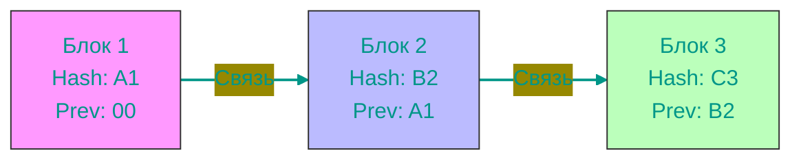

# ⛓️ Блокчейн и Криптовалюты: Полный Гид

> "Блокчейн — это машина доверия в мире, где доверия нет."

Разберем криптовалюты от "А" до "Я". От философии денег до криптографии, DeFi и решений по масштабируемости.

## 📑 Содержание
1. [Философия денег](#1-философия-денег-зачем-нам-крипта)
2. [Криптография: Основы безопасности](#2-криптография-основы-безопасности)
3. [Как работает Блокчейн? (Архитектура)](#3-как-работает-блокчейн-архитектура)
4. [Жизненный цикл транзакции](#4-жизненный-цикл-транзакции)
5. [Консенсус (PoW vs PoS)](#5-консенсус-как-сеть-дружит)
6. [Масштабируемость и Layer 2](#6-масштабируемость-и-layer-2)
7. [Коины vs Токены](#7-коины-vs-токены-в-чем-разница)
8. [Смарт-контракты и DeFi](#8-смарт-контракты-и-defi)
9. [Безопасность: Кошельки и Ключи](#9-безопасность-кошельки-и-ключи)
10. [Стейблкоины](#10-стейблкоины)
11. [Глоссарий Криптомана](#11-глоссарий-криптомана)

---

## 1. 💸 Философия денег: Зачем нам крипта?

Чтобы понять биткоин, нужно понять, что такое деньги.

- **Бартер**: Я даю тебе курицу, ты мне — сапоги. Неудобно (проблема двойного совпадения желаний).
- **Золото**: Редкое, не портится, сложно подделать. Но тяжело носить и делить.
- **Фиат (Бумажные деньги)**: Обеспечены государством. Проблема: государство может напечатать их сколько угодно (инфляция), заморозить ваши счета или запретить переводы.
- **Криптовалюта**: Цифровое золото.
    - **Ограниченная эмиссия**: Биткоина будет только 21 миллион. Точка.
    - **Цензуроустойчивость**: Никто не может запретить вам отправить деньги.
    - **Децентрализация**: Нет банка, который скажет "Ваш платеж подозрителен".

---

## 2. 🔐 Криптография: Основы безопасности

Блокчейн держится на **асимметричном шифровании**. Вместо одного пароля у вас есть пара ключей.

### Публичный и Приватный ключ
Представьте почтовый ящик со стеклянной дверцей.

1.  **Публичный ключ (Адрес кошелька)**: Это прорезь в ящике. Вы даете этот адрес всем: "Кидайте деньги сюда!". Любой может положить туда письмо (деньги).
2.  **Приватный ключ (Пароль)**: Это ключ от дверцы ящика. Он есть **только у вас**. Только вы можете открыть ящик и забрать (потратить) деньги.

> [!CAUTION]
> **Никогда никому не давайте свой приватный ключ!** Если у кого-то есть ваш ключ, это ЕГО деньги.

### Цифровая подпись
Когда вы отправляете биткоин, вы "подписываете" транзакцию своим приватным ключом. Сеть проверяет подпись с помощью вашего публичного ключа и понимает: "Да, это владелец кошелька отправил деньги", но сам приватный ключ сеть не видит.

---

## 3. ⚙️ Как работает Блокчейн? (Архитектура)

**Блокчейн** — это распределенная база данных (DLT - Distributed Ledger Technology).

### Структура
1.  **Блок**: Контейнер для транзакций. Как страница в тетради.
2.  **Цепочка (Chain)**: Каждый блок "пришит" к предыдущему намертво.
3.  **Хеширование (SHA-256)**: Уникальный цифровой отпечаток данных.
    - `Hello` -> `185f8db...`
    - `hello` -> `2cf24db...` (изменили регистр — хеш изменился полностью!).

В каждом блоке есть хеш **предыдущего** блока. Если хакер изменит запись в блоке №10 (чтобы стереть транзакцию), хеш блока №10 изменится. Блок №11 увидит, что хеш не совпадает, и цепочка разорвется. Вся сеть отвергнет этот подлог.

---

## 4. 🔄 Жизненный цикл транзакции

Что происходит, когда вы жмете "Отправить"?

1.  **Создание**: Вы вводите адрес получателя и сумму. Ваш кошелек подписывает транзакцию приватным ключом.
2.  **Mempool (Мемпул)**: Транзакция летит в "зал ожидания" (Memory Pool). Там сидят тысячи других транзакций.
3.  **Выбор**: Майнеры (или валидаторы) заглядывают в мемпул. Они выбирают транзакции с **самой высокой комиссией** (как таксисты выбирают жирные заказы).
4.  **Блок**: Майнер собирает транзакции в блок и добавляет его в блокчейн.
5.  **Подтверждение**: Блок разослан по всей сети. Когда после вашего блока появляются следующие блоки (подтверждения), транзакция считается необратимой.

---

## 5. 🤝 Консенсус: Как сеть дружит

Как миллионы компьютеров договариваются о единой правде без начальника?

### ⛏️ Proof of Work (PoW) — "Доказательство работы" (Bitcoin)
Чтобы добавить блок, компьютер должен решить сложную математическую задачу (подобрать хеш). Это требует огромной энергии.
- **Логика**: "Ты потратил кучу электричества, значит, тебе невыгодно врать, иначе твоя работа пропадет зря".
- **Минус**: Медленно и дорого (энергия).

### 🥩 Proof of Stake (PoS) — "Доказательство доли" (Ethereum, Solana)
Вместо майнеров — валидаторы. Чтобы стать валидатором, нужно "заморозить" (застейкать) свои монеты.
- **Логика**: "Ты положил свои $100,000 в залог. Если попробуешь обмануть сеть, мы сожжем твои деньги (Slashing)".
- **Плюс**: Быстро, экологично.

---

## 6. 🚀 Масштабируемость и Layer 2

**Трилемма блокчейна**: Можно выбрать только 2 из 3: Децентрализация, Безопасность, Скорость (Масштабируемость). Bitcoin и Ethereum выбрали первые два, поэтому они медленные (7-15 транзакций в секунду). Visa делает 24,000.

Как ускорить?
1.  **Layer 1 (L1)**: Сам блокчейн (Bitcoin, Ethereum). Это фундамент. Он должен быть надежным, пусть и медленным.
2.  **Layer 2 (L2)**: Надстройка над блокчейном.
    - **Rollups (Arbitrum, Optimism)**: "Сжимают" тысячи транзакций в одну "архивную" транзакцию и отправляют её в Ethereum. Это в 100 раз дешевле и быстрее.
    - **Lightning Network (для Bitcoin)**: Канал оплаты между двумя людьми. Вы можете гонять деньги туда-сюда миллион раз, а в блокчейн запишется только итоговый баланс.

> **Аналогия**: L1 — это Центральный Банк (медленные крупные переводы). L2 — это Visa/Mastercard (мгновенные платежи за кофе).

---

## 7. 🪙 Коины vs Токены: В чем разница?

- **Coin (Монета)**: Нативная валюта блокчейна. Нужна для оплаты транзакций в этой сети.
    - BTC (в сети Bitcoin), ETH (в сети Ethereum).
- **Token (Токен)**: Актив, созданный *поверх* существующего блокчейна. Не имеет своей сети.
    - USDT (токен ERC-20 в сети Ethereum), UNI (токен биржи Uniswap).

---

## 8. 📜 Смарт-контракты и DeFi

**Смарт-контракт** — это код, который выполняется автоматически. "Если X, то Y".

### DeFi (Decentralized Finance)
Банковские услуги без банков.
1.  **DEX (Deсentralized Exchange)**: Биржа без директора (Uniswap). Вместо книги ордеров (как на фондовой бирже) используется **AMM (Automated Market Maker)** и **Пулы Ликвидности**.
    - **Пул ликвидности**: Бочка с деньгами. Пользователи (Ликвид-провайдеры) кладут туда пару токенов (например, ETH и USDT). Трейдер меняет ETH на USDT из этой бочки, платя комиссию провайдерам.
2.  **Лендинг (Lending)**: Aave, Compound. Вы кладете ETH в залог и берете стейблкоины в кредит. Если цена ETH упадет — ваш залог продадут (ликвидация).

---

## 9. 🔐 Безопасность: Кошельки и Ключи

- **Seed-фраза**: 12-24 слова. Это "мастер-ключ" от всех ваших денег. **Потеряли = Конец**. Восстановить невозможно.
- **Горячий кошелек (Hot)**: Приложение на телефоне/браузере (MetaMask). Удобно, но есть риск взлома через интернет.
- **Холодный кошелек (Cold)**: Флешка (Ledger, Trezor). Ключи никогда не покидают устройство. Чтобы подписать транзакцию, нужно физически нажать кнопку.

---

## 10. 💵 Стейблкоины

Крипта, привязанная к курсу доллара (1 к 1).
- **Централизованные (USDT, USDC)**: Компания хранит доллары в банке. Они могут заблокировать ваш адрес по запросу полиции.
- **Децентрализованные (DAI)**: Обеспечены другой криптой. Управляются смарт-контрактом. Заблокировать нельзя.

---

## 11. 📖 Глоссарий Криптомана

- **HODL** (Hold On for Dear Life): Держать крипту и не продавать, даже если рынок падает.
- **FOMO** (Fear Of Missing Out): Страх упущенной выгоды. "Все купили, и я куплю на хаях!" (Обычно ведет к потере денег).
- **FUD** (Fear, Uncertainty, Doubt): Распространение негативных слухов, чтобы обвалить цену.
- **Whale (Кит)**: Игрок с огромным капиталом, способный двигать рынок.
- **Bull Market (Быки)**: Рынок растет 📈.
- **Bear Market (Медведи)**: Рынок падает 📉.
- **Gas (Газ)**: Комиссия за транзакцию в сети Ethereum.
- **Rekt**: Потерять все деньги на глупой сделке (от слова "Wrecked").
- **ATH** (All Time High): Исторический максимум цены.

> **Итог**: Криптовалюта — это не просто спекуляция. Это новая финансовая система, где вы сами несете ответственность за свои активы. Учите матчасть, прежде чем инвестировать!

<!-- QUIZ_START 

[
    {
        "question": "В чем главное различие между публичным и приватным ключом?",
        "options": [
            "Публичный ключ — это пароль, приватный — адрес",
            "Публичный ключ — это адрес кошелька, приватный — ключ доступа к деньгам",
            "Оба ключа нужны только для входа на биржу",
            "Приватный ключ можно давать друзьям"
        ],
        "correctIndex": 1
    },
    {
        "question": "Зачем в каждом блоке хранится хеш предыдущего блока?",
        "options": [
            "Чтобы блоки были красивыми",
            "Для связи блоков в неразрывную цепочку: изменение данных в одном блоке сделает всю цепь невалидной",
            "Для сжатия данных",
            "Для ускорения интернета"
        ],
        "correctIndex": 1
    },
    {
        "question": "Что такое Mempool (Мемпул)?",
        "options": [
            "База данных всех пользователей",
            "Место для хранения майнингового оборудования",
            "'Зал ожидания' для транзакций перед включением в блок",
            "Тип криптовалютного кошелька"
        ],
        "correctIndex": 2
    }
]

QUIZ_END -->

