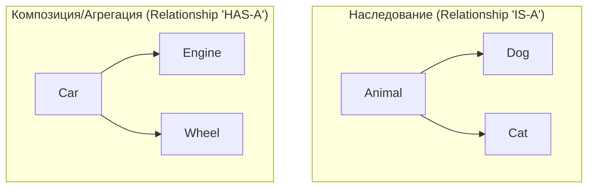

# 🧱 Основы ООП (Объектно-Ориентированное Программирование)

## 📑 Содержание
1. [Что такое ООП?](#что-такое-ооп)
2. [Основные принципы ("Большая четверка")](#основные-принципы-большая-четверка)
3. [Отношения между объектами](#отношения-между-объектами)

---

## 1. 🤔 Что такое ООП?

**Объектно-ориентированное программирование** — это подход к написанию кода, где программа строится из "объектов".

> [!TIP]
> **Объект** — это как предмет в реальном мире (например, Машина или Пользователь), который объединяет в себе:
> *   **Данные** (свойства): цвет, имя, возраст.
> *   **Поведение** (методы): ехать, сменить имя, поздороваться.

Класс — это "чертеж" или "шаблон", а объект — это конкретная вещь, сделанная по этому чертежу.

---

## 2. 🎡 Основные принципы ("Большая четверка")

### 🛡️ Инкапсуляция (Encapsulation)
Это упаковка данных и методов для работы с ними в одну "коробку" (класс) и ограничение прямого доступа к ним извне.

*   **Зачем**: Чтобы никто случайно не изменил важные данные "под капотом". Скрыть детали реализации.
*   **Аналогия**: У кофемашины есть кнопки снаружи (интерфейс), но вы не видите, как внутри мелется зерно и греется вода (скрытая реализация).

### 🔍 Абстракция (Abstraction)
Выделение только важных характеристик объекта, отбрасывая детали.

*   **Зачем**: Чтобы сосредоточиться на том, *что* делает объект, а не *как* он это делает.
*   **Пример**: Когда вы ведете машину, вам важно, что руль поворачивает колеса, а не то, как именно работает гидроусилитель.

### 🧬 Наследование (Inheritance)
Позволяет создать новый класс на основе уже существующего, перенимая его "умения".

*   **Зачем**: Чтобы не писать один и тот же код много раз.
*   **Пример**: Класс `Bird` (Птица) умеет летать. Класс `Eagle` (Орел) наследует это умение от `Bird`.

### 🎭 Полиморфизм (Polymorphism)
Способность программы работать с разными объектами через один и тот же интерфейс, не зная их конкретного типа.

*   **Зачем**: Позволяет писать универсальный код.
*   **Пример**: У вас есть список животных. Вы вызываете у каждого метод `MakeSound()`. Собака гавкнет, кошка мяукнет, а код один и тот же.

---

## 3. 🤝 Отношения между объектами

В ООП объекты могут дружить и взаимодействовать по-разному. Главный спор обычно идет между наследованием и композицией.

### 🏗️ Наследование vs Композиция

#### 📎 Агрегация (Связь "Целое-Часть", но свободная)
Объекты могут существовать друг без друга.
*   **Пример**: Ступица и Колесо. Если снять колеса с машины, колеса все еще существуют.

#### 💎 Композиция (Строгая связь "Целое-Часть")
Части не могут существовать без целого.
*   **Пример**: Комната в доме. Если разрушить дом, комната тоже перестанет существовать.

### 🔄 Делегирование (Delegation)
Это когда объект передает выполнение задачи другому объекту.

> [!IMPORTANT]
> **Принцип**: Не делай сам то, что может сделать эксперт.
> Вместо того чтобы класс `Printer` сам разбирался, как форматировать текст, он делегирует это классу `Formatter`.

---

## 💡 Итог
ООП помогает нам моделировать сложный мир в виде понятных и независимых кусочков, которые легко менять и развивать.