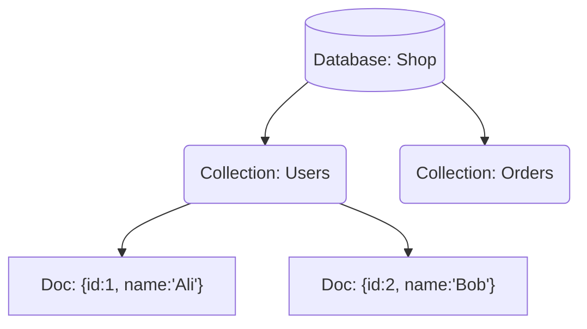
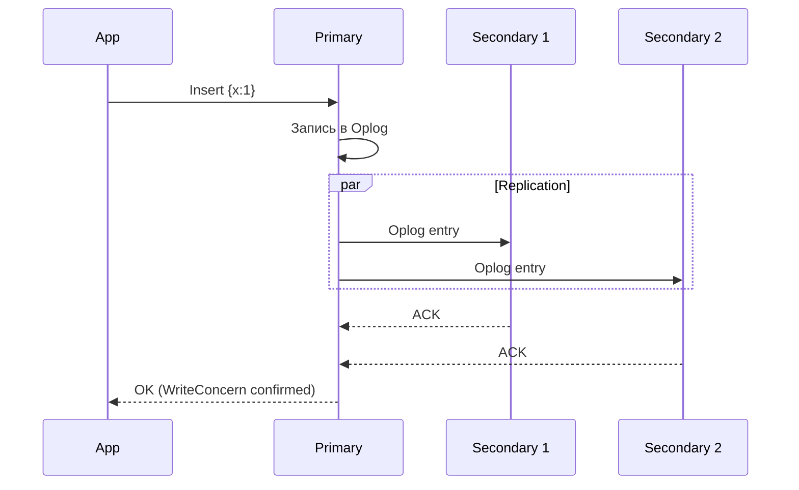
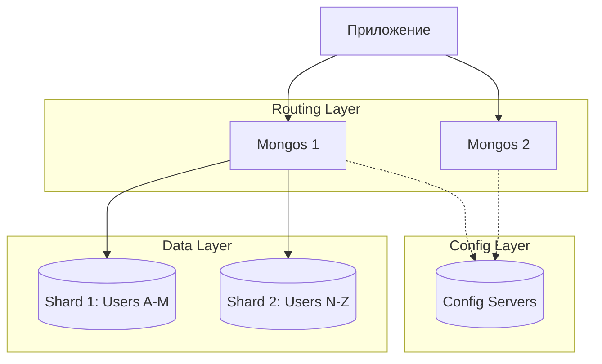

# 🍃 1. MongoDB: Документо-ориентированная база

## 📑 Содержание
1. [Основные концепции](#1-основные-концепции)
2. [Структура данных (BSON)](#2-структура-данных-bson)
3. [Архитектура: Replica Set](#3-архитектура-replica-set)
4. [Масштабирование: Sharding](#4-масштабирование-sharding)
5. [SQL vs MongoDB (Cheat Sheet)](#5-sql-vs-mongodb)

---

## 1. 🧱 Основные концепции

Если вы пришли из мира SQL, то вот словарь для перевода понятий:

| SQL (RDBMS) | MongoDB | Описание |
| :--- | :--- | :--- |
| **Database** | **Database** | База данных (группа таблиц/коллекций). |
| **Table** | **Collection** | Коллекция. Группа документов. Схема не фиксирована! |
| **Row** | **Document** | Документ. JSON-подобный объект с данными. |
| **Column** | **Field** | Поле в документе. |
| **Index** | **Index** | Индекс (B-Tree). Работает так же. |
| **JOIN** | **$lookup** | Аналог JOIN (но дорогой и редкий). Лучше вкладывать документы. |

### Иерархия


---

## 2. 📄 Структура данных (BSON)

MongoDB хранит данные не в чистом JSON, а в **BSON** (Binary JSON).
Это позволяет хранить типы, которых нет в JSON: `Date`, `ObjectId`, `NumberLong` (int64), бинарные данные.

**Пример документа:**
```json
{
  "_id": ObjectId("507f1f77bcf86cd799439011"), // Уникальный PK (генерируется авто)
  "username": "coder123",
  "active": true,
  "balance": 100.50,
  "roles": ["admin", "editor"], // Массивы — это норма!
  "profile": {                  // Вложенные объекты (Embedded)
    "age": 25,
    "city": "Moscow"
  },
  "created_at": ISODate("2023-10-01T10:00:00Z")
}
```

> [!TIP]
> **Data Modeling**:
> В SQL мы бы создали отдельную таблицу `Roles` и `Profiles`.
> В MongoDB данные, которые "живут вместе", храним вместе (в одном документе). Это убирает необходимость в JOIN-ах и делает чтение очень быстрым (одним запросом забираем весь профиль).

---

## 3. 🛡️ Архитектура: Replica Set

Для отказоустойчивости (High Availability) используется **Replica Set**.
Это кластер минимум из 3-х узлов.

### Как это работает?
1.  **Primary**: Единственный узел, который принимает **Запись** (Write) и Чтение.
2.  **Secondary**: Реплицирует данные с Primary. Может принимать Чтение (Optionally).
3.  **Выборы (Election)**: Если Primary падает, Secondaries голосуют и выбирают нового Primary.



**Если Primary умирает:**
1.  S1 и S2 замечают, что P не отвечает (Heartbeat lost).
2.  Они проводят выборы.
3.  S1 становится новым Primary.
4.  App переподключается к новому Primary автоматически.

---

## 4. 🌐 Масштабирование: Sharding

Когда данных становится слишком много (терабайты), Replica Set не справляется (диск не резиновый). Включается **Шардирование**.

Мы "размазываем" (Partition) коллекцию по разным Replica Set-ам (Шардам).

### Компоненты кластера
1.  **mongos (Router)**: Легкий процесс. Приложение общается *только* с ним. Он знает, где какие данные лежат, и пересылает запрос нужному шарду.
2.  **Config Servers**: Хранят метаданные (карта: "диапазон ключей A-K лежит на Shard 1").
3.  **Shards**: Сами хранилища данных (обычно это целые Replica Sets).



> [!IMPORTANT]
> **Shard Key**: Самое важное — правильно выбрать ключ шардирования.
> - Если выбрать неудачно (например, поле `monotonic_date` для логов), то все новые записи будут лететь в **один** последний шард (Hotspot), и распараллеливания не будет.

---

## 5. 🆚 SQL vs MongoDB

Шпаргалка по основным операциям.

| Задача | SQL | MongoDB |
| :--- | :--- | :--- |
| **Создать запись** | `INSERT INTO users (name, age) VALUES ('Ali', 20)` | `db.users.insertOne({name: 'Ali', age: 20})` |
| **Найти всех** | `SELECT * FROM users` | `db.users.find()` |
| **По условию** | `SELECT * FROM users WHERE age > 18` | `db.users.find({age: {$gt: 18}})` |
| **Обновить** | `UPDATE users SET age = 21 WHERE name = 'Ali'` | `db.users.updateOne({name: 'Ali'}, {$set: {age: 21}})` |
| **Удалить** | `DELETE FROM users WHERE age < 10` | `db.users.deleteMany({age: {$lt: 10}})` |
