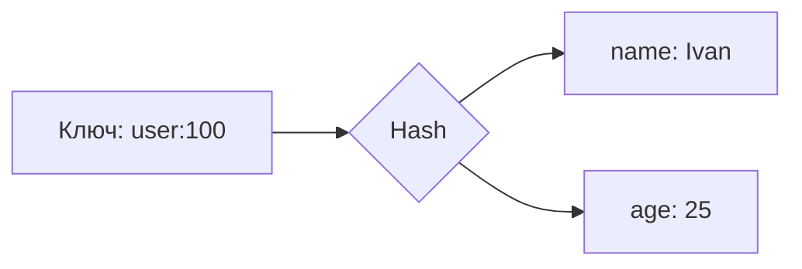

# 🍒 Redis (REmote DIctionary Server)

## 📑 Содержание
1. [Что это? (Швейцарский нож)](#что-это-швейцарский-нож)
2. [Типы данных (Самое важное)](#типы-данных)
3. [Однопоточность (Single Threaded)](#однопоточность)
4. [Сохранение на диск (RDB vs AOF)](#сохранение-на-диск-rdb-vs-aof)

---

## 1. 🤔 Что это? (Швейцарский нож)

**Redis** — это супер-быстрое In-Memory хранилище **ключ-значение**.
Оно настолько быстрое (миллионы операций в секунду), что часто используется как **Кэш**.

Но это не просто "тупой" кэш (как Memcached). Redis — это **структуры данных**, доступные по сети.

---

## 2. 🧱 Типы данных

В Redis значения — это не просто строки, это полноценные структуры.

### 🧵 String (Строка)
Самое простое. Может быть текстом, числом или даже картинкой (до 512 Мб).
*   `SET key "value"`
*   `INCR counter` (Атомарный инкремент!)

### 📝 List (Список)
Связный список (Linked List). Быстро добавлять в начало/конец.
*   Используется для: Очередей (Job Queue), Лент новостей.
*   `LPUSH`, `RPOP`.

### 🎒 Set (Множество)
Уникальные строки. Порядок не важен.
*   Используется для: "Список уникальных IP посетителей", "Друзья", "Теги".
*   `SADD`, `SISMEMBER`.

### 🔢 Sorted Set (ZSet - Упорядоченное множество)
Тот же Set, но у каждого элемента есть **Score** (число).
*   Используется для: **Таблиц лидеров** (Leaderboards), Очередей с приоритетом.
*   `ZADD player 1000`.

### 🗺️ Hash (Хеш)
Словарь внутри словаря. Идеально для хранения объектов.
*   `HSET user:100 name "Ivan" age 25`.

---

## 3. ⚡ Однопоточность

Redis (классический) работает в **один поток**.
*   **Плюс**: Нет гонок данных (Race Conditions), операции атомарны. `INCR` безопасен без локов.
*   **Минус**: Если запустить одну тяжелую команду (например, `KEYS *` на миллион ключей), весь сервер встанет колом и не будет отвечать никому.

> [!WARNING]
> Никогда не используйте команду `KEYS *` в продакшене! Она блокирует Redis. Используйте `SCAN`.

---

## 4. 💾 Сохранение на диск (RDB vs AOF)

Redis живет в памяти. Если выдернуть шнур — данные пропадут. Чтобы этого не случилось, есть два механизма:

### 📸 RDB (Snapshots)
Делает "фотографию" всей памяти раз в N минут.
*   **Плюсы**: Компактный файл, быстро грузится.
*   **Минусы**: Можно потерять данные за последние 5 минут (между снимками).

### 📝 AOF (Append Only File)
Пишет каждую команду (`SET`, `INCR`) в лог файл. При рестарте просто "проигрывает" лог заново.
*   **Плюсы**: Надежность (fsync каждую секунду).
*   **Минусы**: Файл большой, рестарт медленнее.

> [!TIP]
> **Best Practice**: Включать и RDB, и AOF. RDB для бэкапов, AOF для надежности.

---

## 💡 Итог
*   Нужен кэш? **Redis**.
*   Нужна очередь? **Redis** (List/Streams).
*   Нужен лидерборд? **Redis** (Sorted Set).
*   Нужно Pub/Sub? **Redis**.
Это универсальный клей для микросервисов.