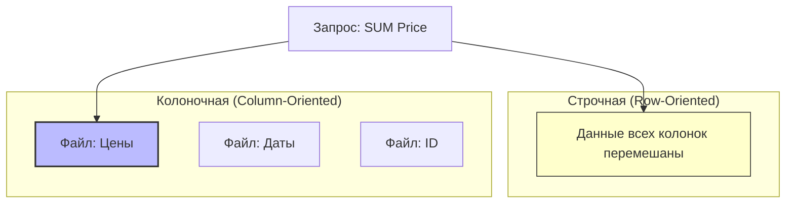

# 📊 ClickHouse

## 📑 Содержание
1. [Что это? (OLAP vs OLTP)](#что-это-olap-vs-oltp)
2. [Строки vs Колонки](#строки-vs-колонки)
3. [MergeTree (Сердце Кликхауса)](#mergetree-сердце-кликхауса)

---

## 1. 🤔 Что это? (OLAP vs OLTP)

**ClickHouse** — это колоночная СУБД для **OLAP** (Online Analytical Processing).

### OLTP (Postgres, MySQL)
*   **Задача**: Быстро вставить заказ, обновить баланс. Работа с **одной** строкой.
*   **Запрос**: `SELECT * FROM users WHERE id = 1`

### OLAP (ClickHouse)
*   **Задача**: Аналитика. "Сколько денег мы заработали за год по всем регионам?". Работа с **миллиардами** строк, но только с парой колонок.
*   **Запрос**: `SELECT sum(price) FROM orders WHERE date > '2023-01-01'`

> [!NOTE]
> ClickHouse невероятно быстр. Запрос, который в Postgres выполняется 10 минут, в ClickHouse пролетит за 0.1 секунду.

---

## 2. 🏛️ Строки vs Колонки

Представьте таблицу: `| Date | ID | Price |`

### Строчная СУБД (MySQL)
Хранит данные построчно:
`[2023-01-01, 1, 100], [2023-01-01, 2, 200], ...`
Чтобы посчитать сумму `Price`, диску придется прочитать **ВСЮ** строку (вместе с ненужными Date и ID).

### Колоночная СУБД (ClickHouse)
Хранит каждую колонку в отдельном файле:
*   Файл Date: `[2023-01-01, 2023-01-01, ...]`
*   Файл ID: `[1, 2, ...]`
*   Файл Price: `[100, 200, ...]`

Чтобы посчитать сумму `Price`, ClickHouse читает **только файл Price**.
*   **Экономия I/O**: Читаем в 100 раз меньше данных.
*   **Сжатие**: Колонку с одинаковыми типами данных (числа) сжимать гораздо эффективнее.

---

## 3. 🌲 MergeTree (Сердце Кликхауса)

Самый популярный движок таблиц — **MergeTree**.
Он похож на LSM-Tree (Log-Structured Merge Tree).

1.  **Вставка**: Данные пишутся пачками (Parts). Каждая пачка отсортирована по первичному ключу.
2.  **Фон**: ClickHouse в фоне берет эти пачки и "сливает" (Merge) их в более крупные куски, одновременно сортируя.

> [!WARNING]
> Кликхаус **плохо переносит** частые вставки по одной строчке (`INSERT INTO ... VALUES (1)`).
> Пишите батчами (пачками) по 1000-10,000 строк! Иначе сервер захлебнется в слияниях (Merges).

---

## 💡 Итог
Если вам нужно строить графики, дашборды, считать метрики на терабайтах логов — **ClickHouse** ваш лучший друг. Не пытайтесь использовать его как обычную базу для бэкенда.