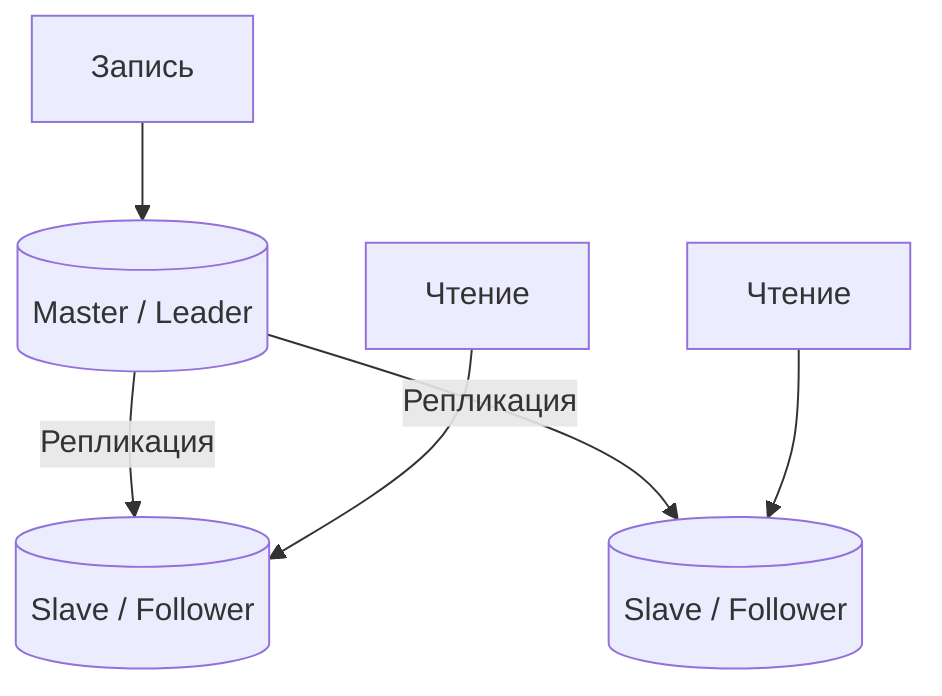
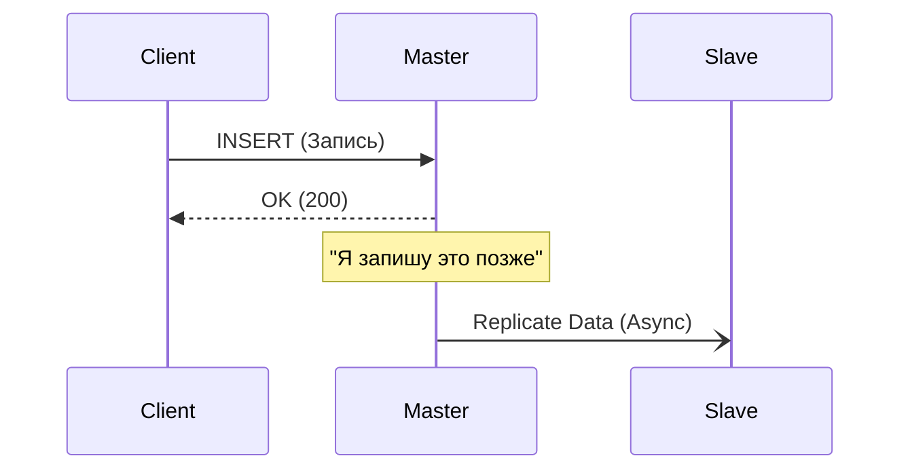
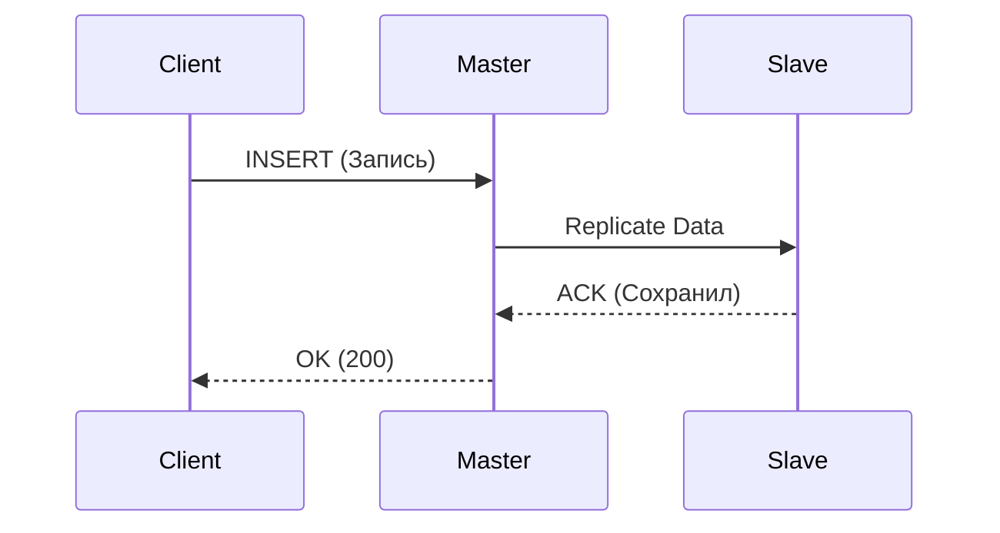

# 👯 2. Репликация и CAP-теорема

## 📑 Содержание
1. [Репликация (Replication)](#репликация-replication)
2. [Sync vs Async](#sync-vs-async)
3. [CAP-теорема](#cap-теорема)
4. [Trade-off: Что выбрать?](#trade-off-что-выбрать)

---

## 1. Репликация (Replication)

**Репликация** — это копирование данных с одного сервера на другой (или несколько других) для:
1.  **Отказоустойчивости** (упал один — работает другой).
2.  **Масштабируемости чтения** (один пишет, пятеро читают).

### Master-Slave (Leader-Follower)
Самая популярная схема (используется в Postgres, MySQL, Redis).

-   **Все записи** идут только в **Master**.
-   **Чтение** можно распределять по **Slaves**.

---

## 2. Sync vs Async

Как данные попадают с Мастера на Слейв?

### Асинхронная (Async) — *Быстро, но рискованно*
1.  Клиент пишет в Master.
2.  Master говорит "ОК".
3.  Master *потом* (в фоне) отправляет данные на Slave.

*Плюс*: Быстро (Master не ждет Slave).
*Минус*: Если Master сгорит до отправки данных, **данные потеряются**. Slave будет отставать.

### Синхронная (Sync) — *Надежно, но медленно*
1.  Клиент пишет в Master.
2.  Master отправляет данные на Slave.
3.  Slave подтверждает: "Сохранил".
4.  Master говорит Клиенту: "ОК".

*Плюс*: Гарантия, что данные есть минимум на двух серверах. Zero data loss.
*Минус*: Медленно (ждем самого медленного). Если Slave упал — Master не может принять запись (встает колом).

---

## 3. 🛡️ CAP-теорема

Теорема Эрика Брюера гласит: в распределенной системе невозможно получить все три свойства одновременно. **Выбирайте любые два**.

*   **C (Consistency)** — Согласованность. Во всех узлах в один момент времени одинаковые данные. (Если я записал X=5, то любой, кто читает, увидит 5 или ошибку).
*   **A (Availability)** — Доступность. Каждый запрос получает ответ (успех или неудачу), но без гарантии, что данные самые свежие. Система "жива" всегда.
*   **P (Partition Tolerance)** — Устойчивость к разделению. Система продолжает работать, даже если связь между серверами (сеть) порвалась.

> [!WARNING]
> В реальности **P (Partition Tolerance)** обязателен для распределенных систем (сеть может лагать всегда). Поэтому мы выбираем между **CP** (Consistency) и **AP** (Availability).

---

## 4. ⚖️ Trade-off: Что выбрать?

Представьте ситуацию: **Интернет перерезали**, Master и Slave не видят друг друга (Split-Brain).
Клиент приходит к Slave (который не знает, что там на Master'е происходит).

**Ситуация: Разрыв сети (Partition)**

### Выбор CP (Consistency over Availability)
"Я (Slave) не вижу Мастера и не могу гарантировать, что мои данные актуальны. Поэтому я **откажусь отвечать**."
*   **Ответ**: `HTTP 500 Error` / Timeout.
*   **Пример**: Банковские транзакции. Лучше не показать баланс, чем показать неверный и дать снять деньги дважды.

### Выбор AP (Availability over Consistency)
"Я (Slave) не вижу Мастера, возможно данные устарели, но **лучше я отдам старое, чем ничего**."
*   **Ответ**: `HTTP 200 OK` (Данные могут быть 5-минутной давности).
*   **Пример**: Лента соцсети, лайки, комментарии. Если вы не увидите свежий лайк 5 секунд — никто не умрет, зато сайт работает.
