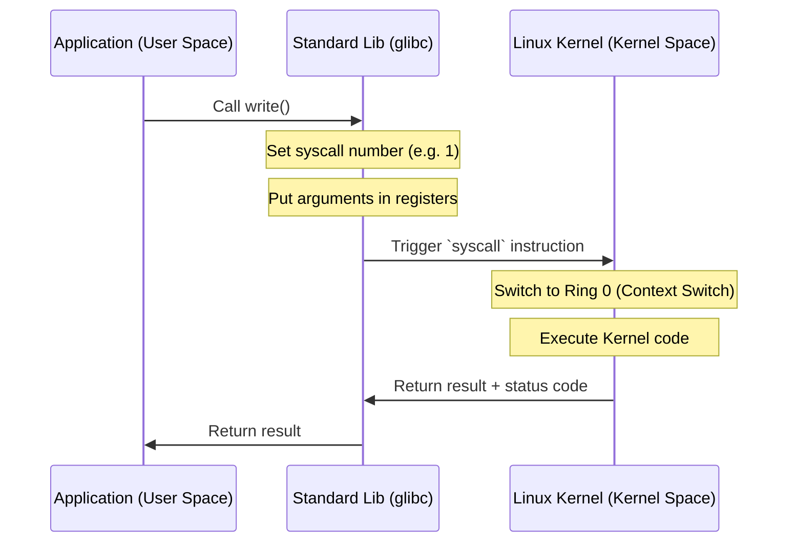

# 📞 System Calls (Системные вызовы)

Системные вызовы (syscalls) — это программный интерфейс между приложением и ядром Linux. Это единственный легальный способ для программы попросить ядро выполнить привилегированную операцию.

## 📑 Содержание
1. [User Space vs Kernel Space](#1-user-space-vs-kernel-space)
2. [Как работает syscall (Механика)](#2-как-работает-syscall-механика)
3. [Основные категории вызовов](#3-основные-категории-вызовов)
4. [Expert: Оптимизации (vDSO & vsyscall)](#4-expert-оптимизации-vdso--vsyscall)
5. [Стоимость системного вызова](#5-стоимость-системного-вызова)
6. [Инструменты диагностики](#6-инструменты-диагностики)

---

## 1. 🛡️ User Space vs Kernel Space

Процессоры поддерживают разные уровни привилегий (**Protection Rings**):
- **Ring 3 (User Mode)**: Обычные программы. Ограниченный доступ к памяти и железу.
- **Ring 0 (Kernel Mode)**: Ядро. Полный доступ ко всем ресурсам.

Системный вызов — это "переключатель", который переводит CPU из Ring 3 в Ring 0.

---

## 2. ⚙️ Как работает syscall (Механика)

Когда программа вызывает функцию (например, `write`), происходит следующее:

1.  **Подготовка**: Номер вызова и аргументы кладутся в регистры процессора.
2.  **Ловушка (Trap)**: Выполняется специальная инструкция (современная `syscall` или старая `int 0x80`).
3.  **Переключение контекста**: Ядро сохраняет состояние приложения и начинает выполнять свой код.
4.  **Результат**: После выполнения ядро возвращает CPU в User Mode, а результат попадает обратно в программу.

---

## 3. 📂 Основные категории вызовов

| Категория | Примеры |
| :--- | :--- |
| **Управление файлами** | `open`, `read`, `write`, `close`, `stat` |
| **Управление процессами** | `fork`, `execve`, `wait`, `exit`, `getpid` |
| **Сеть** | `socket`, `bind`, `connect`, `send`, `recv` |
| **Память** | `mmap`, `brk`, `munmap` |
| **Сигналы / Таймеры** | `kill`, `sigaction`, `nanosleep` |

---

## 4. 🚀 Expert: Оптимизации (vDSO & vsyscall)

Переключение в Kernel Mode стоит дорого (сотни наносекунд). Для очень часто используемых вызовов, которые не требуют высоких привилегий (например, узнать время), в Linux придумали оптимизации:

### vDSO (virtual Dynamic Shared Object)
Это небольшой кусок памяти ядра, который "пробрасывается" в каждое приложение. Он содержит код для некоторых syscalls (например, `gettimeofday`), который выполняется прямо в **User Space** без переключения контекста.
- **Плюс**: Почти нулевая задержка.
- **Минус**: Работает только для чтения безопасных данных ядра.

### vsyscall
Устаревший предшественник vDSO. Имел фиксированный адрес в памяти, что было небезопасно (уязвимости к атакам). Сейчас заменен на vDSO.

---

## 5. 💰 Стоимость системного вызова

Системные вызовы — это "дорого". Почему?
1.  **Смена контекста**: Нужно очищать кеши CPU, менять таблицы страниц (TLB).
2.  **Проверки**: Ядро должно тщательно проверить все аргументы (чтобы программа не смогла "сломать" систему).
3.  **Security Mitigation**: Флаги безопасности (как от Spectre/Meltdown) делают переключения еще медленнее.

> [!TIP]
> В высоконагруженных системах (High Load) стараются минимизировать кол-во syscalls, используя буферизацию (например, писать в файл не по 1 байту, а пачками по 4Кб) или современные механизмы вроде **io_uring**.

---

## 6. 🛠️ Инструменты диагностики

- **strace**: Король отладки. Показывает все системные вызовы программы в реальном времени.
    - `strace ls`: Посмотреть, что делает команда `ls`.
    - `strace -c ./my_app`: Посчитать время и количество каждого syscall.
- **perf**: Инструмент для профилирования производительности (поможет найти, где syscalls тормозят систему).
- **man 2 [syscall]**: Официальная документация (например, `man 2 open`).
