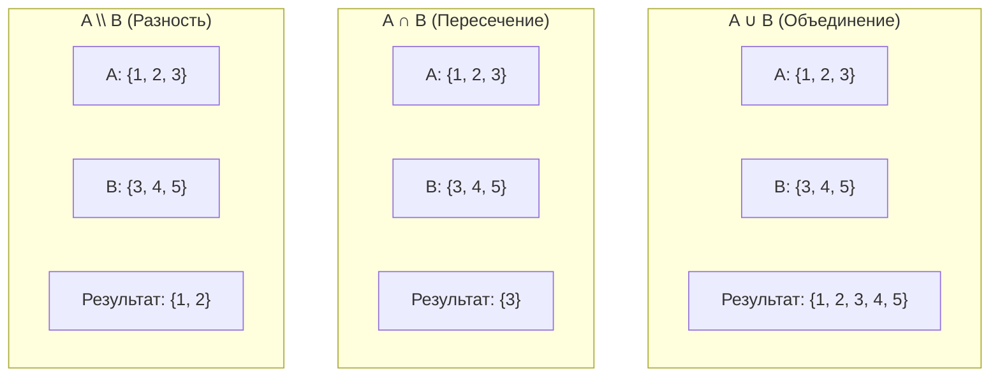

# 🧠 Logic and Set Theory (Логика и Теория множеств)

## 📑 Содержание
1. [Булева логика](#1-булева-логика)
2. [Таблицы истинности](#2-таблицы-истинности)
3. [Теория множеств (Set Theory)](#3-теория-множеств-set-theory)
4. [Законы де Моргана](#4-законы-де-моргана)
5. [Реализация на Go](#5-реализация-на-go)

---

## 1. 🚦 Булева логика

Переменные могут принимать только два значения: `True` (1) или `False` (0).

Основные операции:
*   **NOT (НЕ, `!`)**: Меняет на противоположное
*   **AND (И, `&&`)**: Истинно, только если **ОБА** истинны
*   **OR (ИЛИ, `||`)**: Истинно, если **ХОТЯ БЫ ОДИН** истинен
*   **XOR (Исключающее ИЛИ, `^`)**: Истинно, если они **РАЗНЫЕ**

### Примеры на Go

```go
func logicExamples() {
    a, b := true, false
    
    // NOT
    fmt.Println(!a)      // false
    fmt.Println(!b)      // true
    
    // AND
    fmt.Println(a && a)  // true
    fmt.Println(a && b)  // false
    fmt.Println(b && b)  // false
    
    // OR
    fmt.Println(a || a)  // true
    fmt.Println(a || b)  // true
    fmt.Println(b || b)  // false
    
    // XOR (в Go используется ^ для чисел, для bool делаем так:)
    fmt.Println(a != b)  // true (разные)
    fmt.Println(a != a)  // false (одинаковые)
}
```

### Применение: условия

```go
func canVote(age int, isCitizen bool) bool {
    // Можно голосовать, если возраст >= 18 И гражданин
    return age >= 18 && isCitizen
}

func canEnter(hasTicket bool, isVIP bool) bool {
    // Можно войти, если есть билет ИЛИ VIP статус
    return hasTicket || isVIP
}

func accessAllowed(isAdmin bool, isOwner bool, hasPermission bool) bool {
    // Доступ разрешен, если (админ ИЛИ владелец) И есть разрешение
    return (isAdmin || isOwner) && hasPermission
}
```

---

## 2. 📊 Таблицы истинности

| A | B | NOT A | A AND B | A OR B | A XOR B |
|:---:|:---:|:---:|:---:|:---:|:---:|
| 0 | 0 | 1 | 0 | 0 | 0 |
| 0 | 1 | 1 | 0 | 1 | 1 |
| 1 | 0 | 0 | 0 | 1 | 1 |
| 1 | 1 | 0 | 1 | 1 | 0 |

### Битовые операции в Go

```go
func bitwiseExamples() {
    a, b := 5, 3  // 5 = 0101, 3 = 0011 в двоичной системе
    
    // AND (&): оба бита 1
    fmt.Printf("%d & %d = %d (0101 & 0011 = 0001)\n", a, b, a&b) // 1
    
    // OR (|): хотя бы один бит 1
    fmt.Printf("%d | %d = %d (0101 | 0011 = 0111)\n", a, b, a|b) // 7
    
    // XOR (^): биты разные
    fmt.Printf("%d ^ %d = %d (0101 ^ 0011 = 0110)\n", a, b, a^b) // 6
    
    // NOT (^): инверсия битов (в Go используется ^x)
    fmt.Printf("^%d = %d\n", a, ^a) // -6 (инверсия всех битов)
    
    // Сдвиги
    fmt.Printf("%d << 1 = %d (умножение на 2)\n", a, a<<1)  // 10
    fmt.Printf("%d >> 1 = %d (деление на 2)\n", a, a>>1)    // 2
}
```

### Применение: флаги и права доступа

```go
const (
    ReadPermission  = 1 << 0 // 0001 = 1
    WritePermission = 1 << 1 // 0010 = 2
    ExecPermission  = 1 << 2 // 0100 = 4
    AdminPermission = 1 << 3 // 1000 = 8
)

func hasPermission(userPerms, requiredPerm int) bool {
    return (userPerms & requiredPerm) == requiredPerm
}

func addPermission(userPerms, newPerm int) int {
    return userPerms | newPerm
}

func removePermission(userPerms, perm int) int {
    return userPerms &^ perm // AND NOT
}

func main() {
    // Пользователь имеет права READ и WRITE
    user := ReadPermission | WritePermission // 0011 = 3
    
    fmt.Println(hasPermission(user, ReadPermission))   // true
    fmt.Println(hasPermission(user, WritePermission))  // true
    fmt.Println(hasPermission(user, ExecPermission))   // false
    
    // Добавляем EXEC
    user = addPermission(user, ExecPermission) // 0111 = 7
    fmt.Println(hasPermission(user, ExecPermission))   // true
    
    // Убираем WRITE
    user = removePermission(user, WritePermission) // 0101 = 5
    fmt.Println(hasPermission(user, WritePermission))  // false
}
```

---

## 3. 📦 Теория множеств (Set Theory)

**Множество** — это коллекция уникальных элементов (без дубликатов).

### Основные операции

*   **Объединение (Union, $\cup$)**: Все из A **ИЛИ** B
*   **Пересечение (Intersection, $\cap$)**: Только то, что есть и в A, **И** в B
*   **Разность (Difference, $A \setminus B$)**: Есть в A, но **НЕТ** в B
*   **Симметрическая разность**: $(A \setminus B) \cup (B \setminus A)$



---

## 4. ⚖️ Законы де Моргана

Очень важные законы для упрощения логических выражений:

1.  **!(A && B) == !A || !B**  
    "НЕ (A И B)" = "НЕ A ИЛИ НЕ B"

2.  **!(A || B) == !A && !B**  
    "НЕ (A ИЛИ B)" = "НЕ A И НЕ B"

### Пример на Go

```go
func deMorganExample() {
    a, b := true, false
    
    // Закон 1: !(A && B) == !A || !B
    left1 := !(a && b)
    right1 := !a || !b
    fmt.Println(left1 == right1) // true
    
    // Закон 2: !(A || B) == !A && !B
    left2 := !(a || b)
    right2 := !a && !b
    fmt.Println(left2 == right2) // true
}
```

### Применение: упрощение условий

```go
// ❌ ПЛОХО: сложно читать
if !(age >= 18 && hasDrivingLicense) {
    fmt.Println("Нельзя водить")
}

// ✅ ХОРОШО: применили закон де Моргана
if age < 18 || !hasDrivingLicense {
    fmt.Println("Нельзя водить")
}
```

---

## 5. 💻 Реализация на Go

### Set (Множество) через map

В Go нет встроенного типа Set, но можно использовать `map[T]bool`:

```go
type Set map[int]bool

func NewSet(values ...int) Set {
    s := make(Set)
    for _, v := range values {
        s[v] = true
    }
    return s
}

func (s Set) Add(value int) {
    s[value] = true
}

func (s Set) Remove(value int) {
    delete(s, value)
}

func (s Set) Contains(value int) bool {
    return s[value]
}

func (s Set) Size() int {
    return len(s)
}

// Объединение (Union)
func (s Set) Union(other Set) Set {
    result := NewSet()
    for k := range s {
        result.Add(k)
    }
    for k := range other {
        result.Add(k)
    }
    return result
}

// Пересечение (Intersection)
func (s Set) Intersection(other Set) Set {
    result := NewSet()
    for k := range s {
        if other.Contains(k) {
            result.Add(k)
        }
    }
    return result
}

// Разность (Difference)
func (s Set) Difference(other Set) Set {
    result := NewSet()
    for k := range s {
        if !other.Contains(k) {
            result.Add(k)
        }
    }
    return result
}

func main() {
    a := NewSet(1, 2, 3, 4)
    b := NewSet(3, 4, 5, 6)
    
    fmt.Println("A:", a)                    // {1:true, 2:true, 3:true, 4:true}
    fmt.Println("B:", b)                    // {3:true, 4:true, 5:true, 6:true}
    
    union := a.Union(b)
    fmt.Println("A ∪ B:", union)            // {1, 2, 3, 4, 5, 6}
    
    intersection := a.Intersection(b)
    fmt.Println("A ∩ B:", intersection)     // {3, 4}
    
    difference := a.Difference(b)
    fmt.Println("A \\ B:", difference)      // {1, 2}
}
```

### Проверка подмножества

```go
func (s Set) IsSubsetOf(other Set) bool {
    for k := range s {
        if !other.Contains(k) {
            return false
        }
    }
    return true
}

func main() {
    a := NewSet(1, 2)
    b := NewSet(1, 2, 3, 4)
    
    fmt.Println(a.IsSubsetOf(b)) // true: A ⊆ B
    fmt.Println(b.IsSubsetOf(a)) // false
}
```

---

## 💡 Применение в реальных задачах

### 1. Фильтрация данных

```go
func filterActiveUsers(allUsers, bannedUsers Set) Set {
    // Активные пользователи = Все - Забаненные
    return allUsers.Difference(bannedUsers)
}
```

### 2. Поиск общих элементов

```go
func findCommonInterests(user1Interests, user2Interests Set) Set {
    // Общие интересы = пересечение
    return user1Interests.Intersection(user2Interests)
}
```

### 3. Проверка уникальности

```go
func hasDuplicates(arr []int) bool {
    seen := NewSet()
    for _, num := range arr {
        if seen.Contains(num) {
            return true // Дубликат найден
        }
        seen.Add(num)
    }
    return false
}
```

---

## 💡 Итог

| Концепция | Операция | Go код |
|:---|:---|:---|
| **Логика** | AND, OR, NOT, XOR | `&&`, `||`, `!`, `!=` |
| **Битовые** | &, |, ^, << >> | Флаги, маски |
| **Множества** | Union, Intersection | `map[T]bool` |
| **Законы** | Де Морган | Упрощение условий |

> [!TIP]
> Используйте `map[T]struct{}` вместо `map[T]bool` для экономии памяти (struct{} занимает 0 байт)!
