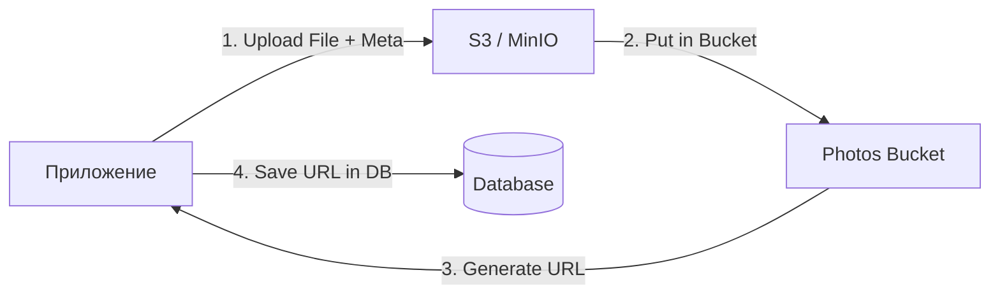

# 📦 Object Storage: S3 и MinIO

## 📑 Содержание
1. [Что такое Object Storage?](#что-такое-object-storage)
2. [S3 (Simple Storage Service)](#s3-стандарт-индустрии)
3. [MinIO: Облако у вас дома](#minio)
4. [Сравнение: File Storage vs Object Storage](#сравнение)

---

## ❓ Что такое Object Storage?

**Объектное хранилище (Object Storage)** — это способ хранения данных, где каждый файл рассматривается как "объект". В отличие от обычной файловой системы с папками и подпапками, здесь все объекты лежат в "плоском" пространстве, которое называется **Bucket** (Корзина). 🧺

Вместо пути к файлу (`/home/user/photo.jpg`) вы используете уникальный ключ (ID), чтобы получить объект.

---

## ☁️ S3 (Simple Storage Service)

**AWS S3** — это сервис от Amazon, который задал стандарт того, как должно работать объектное хранилище. Почти все современные хранилища поддерживают **S3-совместимый API**.

### Преимущества:
- **Масштабируемость**: Вы можете хранить петабайты данных.
- **Доступность**: Данные дублируются между разными дата-центрами (99.999999999% надежности).
- **Цена**: Это гораздо дешевле, чем хранить файлы прямо на сервере или в БД. 💰

---

## 🐳 MinIO: Облако у вас на сервере

**MinIO** — это открытая и высокопроизводительная замена S3, которую вы можете запустить сами (например, через Docker). 

- **Зачем?**: Если вы не хотите зависеть от Amazon или вам нужно хранилище внутри закрытой сети компании. 🔒
- **Полная совместимость**: Приложение, написанное для работы с AWS S3, поймет и MinIO без переделки кода.

---

## 📊 File Storage vs Object Storage

| Характеристика | File Storage (HDD/SSD) | Object Storage (S3/MinIO) |
| :--- | :--- | :--- |
| **Структура** | Иерархическая (папки) | Плоская (Buckets) |
| **Масштабируемость** | Ограничена размером диска | Почти бесконечна ♾️ |
| **Метаданные** | Только базовые (дата, размер) | Любые (теги, автор, описание) |
| **Скорость чтения** | Очень высокая (ms) | Высокая (но выше задержка сети) |
| **Обновление** | Можно менять куски файла | Только перезапись всего объекта |

---

## 🏗️ Схема работы

---

> [!TIP]
> **Золотое правило бэкенда**: Никогда не храните пользовательские файлы (картинки, документы) прямо на диске сервера приложения или в базе данных. Используйте объектное хранилище. Это позволит вам легко масштабировать количество серверов. 🛡️🚀
