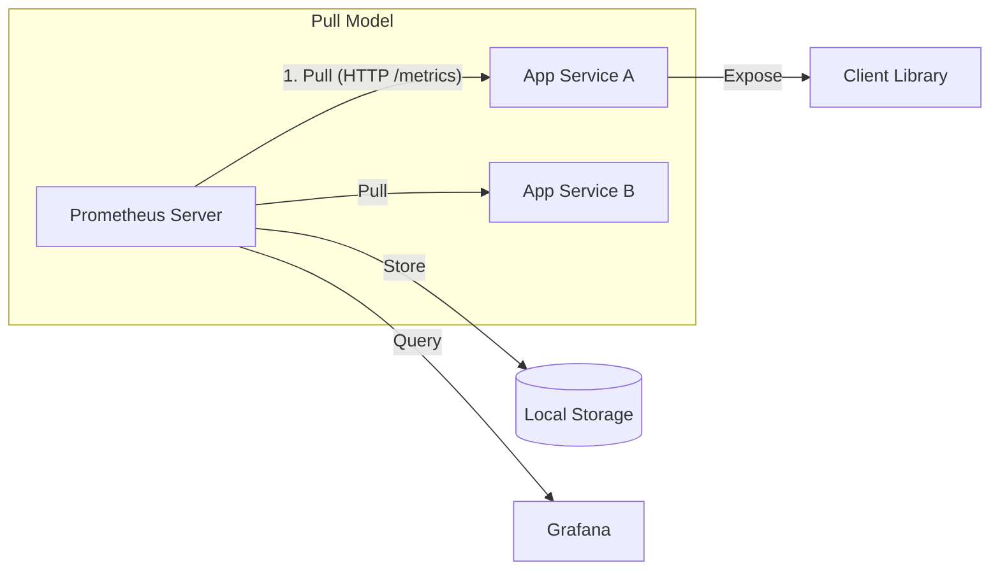

# 📉 Наблюдаемость (Observability) и Prometheus

## 📑 Содержание
1. [Три столпа Наблюдаемости](#три-столпа-наблюдаемости)
2. [Prometheus: Что это?](#prometheus-что-это)
3. [Как работает Prometheus (Pull vs Push)](#архитектура-и-принцип-работы)
4. [Основные типы метрик](#типы-метрик)
5. [Основы PromQL](#основы-promql)

---

## 🏛️ Три столпа Наблюдаемости

**Наблюдаемость (Observability)** — это мера того, насколько хорошо вы можете понять внутреннее состояние вашей системы, просто глядя на её внешние данные. 

Существует "золотая тройка" данных для этого:
1.  **Метрики (Metrics)** — Числа. Сколько запросов в секунду? Сколько памяти занято? (Prometheus).
2.  **Логи (Logs)** — Текст. Что именно произошло в конкретный момент? (ELK).
3.  **Трассировки (Traces)** — Путь. Через какие сервисы прошел запрос пользователя? (Jaeger).

---

## 📊 Prometheus: Что это?

**Prometheus** — это стандарт де-факто для мониторинга современных систем. 🛠️

- **Time Series Database (TSDB)**: Он хранит данные как временные ряды (значение + время).
- **Многомерные данные**: Метрики идентифицируются по имени и набору меток (labels), например: `http_requests_total{method="post", code="200"}`.

---

## ⚙️ Архитектура и принцип работы

Самое важное отличие Prometheus — он использует **Pull-модель**.



- **Prometheus** сам обращается к вашим сервисам раз в несколько секунд и забирает (скрейпит) данные.
- **Pushgateway**: Используется только для короткоживущих задач (скриптов), которые не могут ждать, пока их "опросят".

---

## 🔢 Типы метрик

В Prometheus есть 4 основных типа данных:
1.  **Counter (Счетчик)**: Только растет (или сбрасывается в 0). Пример: количество запросов, ошибок. 📈
2.  **Gauge (Датчик)**: Может и расти, и падать. Пример: температура, загрузка CPU, количество активных пользователей. 🌡️
3.  **Histogram (Гистограмма)**: Считает количество событий в определенных диапазонах (бакетах). Полезно для измерения задержек (latency).
4.  **Summary (Сводка)**: Похоже на гистограмму, но считает квантили на стороне клиента.

---

## 🔍 Основы PromQL

**PromQL** — это язык запросов Prometheus. 
Пример: *"Дай мне средний темп роста запросов за последние 5 минут"*
```promql
rate(http_requests_total[5m])
```

---

> [!TIP]
> **Главный совет**: Не мониторьте всё подряд. Используйте **"Four Golden Signals"**: 
> - **Latency** (Задержка)
> - **Traffic** (Трафик)
> - **Errors** (Ошибки)
> - **Saturation** (Насыщенность/Ресурсы) 🛡️
