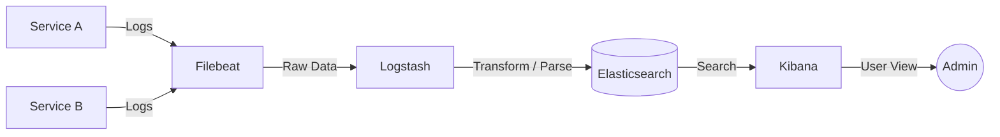

# 📝 Логирование и ELK Stack

## 📑 Содержание
1. [Почему централизованные логи — это важно?](#почему-логирование-это-важно)
2. [Состав ELK Stack (E, L, K)](#состав-elk-stack)
3. [Beats — маленькие помощники](#beats)
4. [Схема работы (Data Pipeline)](#схема-работы)
5. [Разница между логами и метриками](#логи-vs-метрики)

---

## ❓ Почему централизованные логи — это важно?

В мире микросервисов у вас могут быть сотни контейнеров. Если что-то сломалось, вы не можете заходить на каждый сервер через `ssh` и читать файлы логов. 

**Централизованное логирование** собирает все текстовые сообщения из всех сервисов в одно место, где по ним можно быстро искать. 🔎

---

## 🧱 Состав ELK Stack

**ELK** — это аббревиатура из трех инструментов от компании Elastic:

1.  **Elasticsearch (E)**: Поисковый движок и база данных. Он хранит логи и позволяет мгновенно искать по тексту (как Google, но для ваших логов).
2.  **Logstash (L)**: "Мясорубка" для данных. Он принимает логи, фильтрует их, парсит (например, превращает строку текста в структурированный JSON) и отправляет в Elasticsearch.
3.  **Kibana (K)**: Визуальный интерфейс. В нем вы пишете поисковые запросы, смотрите логи и строите красивые графики.

---

## 🐝 Beats

Часто к ELK добавляют **Beats**. Это легкие агенты, которые устанавливаются прямо на серверы с приложением:
- **Filebeat**: Читает файлы логов с диска и пересылает их. 📄
- **Metricbeat**: Собирает системные метрики (CPU, RAM).
- **Packetbeat**: Анализирует сетевой трафик.

---

## 🗺️ Схема работы

---

## ⚖️ Логи vs Метрики

> [!IMPORTANT]
> - **Метрики** (Prometheus): Дешевые, быстрые, хранятся долго, идеально для **мониторинга** ("Что-то сломалось!").
> - **Логи** (ELK): Дорогие (занимают много места), медленнее, идеально для **отладки** ("Почему именно это сломалось?").

---

## 💡 Полезные советы

> [!TIP]
> 1.  **Используйте структурированные логи**: Пишите логи в формате **JSON**. Это избавит вас от сложной настройки Logstash для парсинга текста.
> 2.  **Уровни логирования**: Всегда разделяйте логи на `DEBUG`, `INFO`, `WARN` и `ERROR`. В Kibana вы легко сможете отфильтровать только ошибки. 🔴
> 3.  **Не логируйте секреты**: Следите, чтобы в логи не попадали пароли, токены или персональные данные пользователей. 🔐
