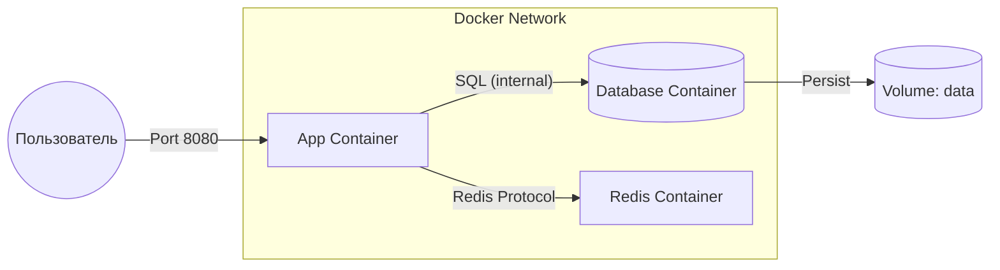

# 🐙 Docker Compose: Многоконтейнерные приложения

## 📑 Содержание
1. [Что это такое?](#что-такое-docker-compose)
2. [Основные концепции](#основные-концепции)
3. [Структура docker-compose.yml](#структура-файла-docker-composeyml)
4. [Основные команды](#основные-команды)
5. [Визуализация взаимодействия](#визуализация-взаимодействия)

---

## ❓ Что такое Docker Compose?

**Docker Compose** — это инструмент для определения и запуска многоконтейнерных Docker-приложений. 🛠️

Если обычный Docker управляет отдельными контейнерами, то Compose позволяет описать **целую инфраструктуру** (приложение, базу данных, кэш, очереди) в одном файле и запустить всё одной командой.

---

## 🧩 Основные концепции

1.  **Services (Сервисы)**: Контейнеры, из которых состоит ваше приложение (например, `web`, `db`). Вы описываете, какой образ использовать, какие порты открыть и т.д.
2.  **Networks (Сети)**: Изолированные туннели, через которые сервисы общаются друг с другом. По умолчанию Compose создает общую сеть для всех сервисов в файле. 🌐
3.  **Volumes (Волюмы/Тома)**: Способ сохранения данных вне контейнера. Позволяет данным из БД не исчезать после перезапуска контейнера. 💾

---

## 📝 Структура файла docker-compose.yml

Это "рецепт" вашей инфраструктуры на языке YAML:

```yaml
version: '3.8' # Версия формата

services:
  app: # Имя сервиса
    build: . # Собирать из текущей папки
    ports:
      - "8080:8080"
    depends_on:
      - db # Запустить после БД
    environment:
      - DB_URL=postgres://db:5432/mydb

  db:
    image: postgres:15-alpine # Готовый образ
    volumes:
      - postgres_data:/var/lib/postgresql/data
    environment:
      - POSTGRES_PASSWORD=secret

volumes:
  postgres_data: # Объявление тома
```

---

## 🚀 Основные команды

| Команда | Что делает? |
|:---|:---|
| `docker-compose up` | Собирает, создает и запускает все контейнеры. |
| `docker-compose up -d` | Запуск в фоновом режиме (detached). |
| `docker-compose down` | Останавливает и **удаляет** контейнеры и сети. |
| `docker-compose ps` | Показывает статус запущенных сервисов. |
| `docker-compose logs -f` | Просмотр логов всех контейнеров в реальном времени. |

---

## 📊 Визуализация взаимодействия



---

## 🌟 Зачем это нужно?

> [!TIP]
> **Преимущества:**
> - **Простота**: Вместо десяти длинных команд `docker run` вы пишете одну `docker-compose up`.
> - **Изоляция**: У каждого проекта своя сеть и свои версии БД.
> - **Воспроизводимость**: Ваше окружение на компьютере будет идентично окружению коллеги.

---

> [!IMPORTANT]
> Docker Compose предназначен прежде всего для **разработки и тестирования**. Для продакшена в больших масштабах обычно используют Kubernetes. 🏗️
