# Алгоритмы и Структуры Данных

## Содержание
1. [Структуры Данных](#структуры-данных)
   - [Массив (Array)](#1-массив-array)
   - [Связный список (Linked List)](#2-связный-список-linked-list)
   - [Стек (Stack)](#3-стек-stack)
   - [Очередь (Queue)](#4-очередь-queue)
   - [Хэш-таблица (Hash Map)](#5-хэш-таблица-hash-map)
   - [Двоичное дерево (Binary Tree)](#6-двоичное-дерево-binary-tree)
   - [Двоичное дерево поиска (BST)](#7-двоичное-дерево-поиска-binary-search-tree-bst)
   - [Сбалансированные деревья](#8-сбалансированные-деревья-avl-или-красно-черное)
   - [Куча (Heap)](#9-куча-heap)
   - [Три (Trie)](#10-три-trie)
   - [Граф (Graph)](#11-граф-graph)
2. [Алгоритмы](#алгоритмы)
   - [Поиск](#1-поиск)
   - [Сортировка](#2-сортировка)

---

# Структуры Данных

Структуры данных — это способы организации и хранения данных, которые позволяют эффективно выполнять операции доступа и модификации.

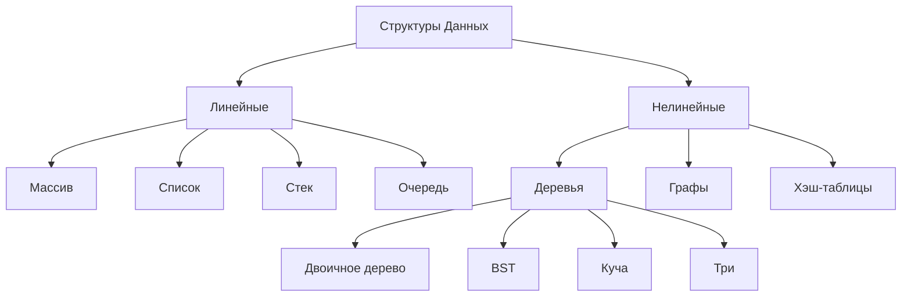

---

## 1. Массив (Array)

**Описание**: Массив — это фиксированная или динамическая (в Go — срез) последовательность элементов одного типа, хранящихся в непрерывной области памяти. Доступ к элементам осуществляется по индексу.

### Основные операции

- Доступ (чтение/запись по индексу)
- Вставка (в конец или в середину, для динамических массивов)
- Удаление (из конца или середины)
- Поиск (линейный, если массив не отсортирован)

### Сложность

| Операция | Временная сложность (O) | Пространственная сложность (O) |
|:---|:---:|:---:|
| Доступ (по индексу) | O(1) | O(1) |
| Вставка (в конец) | O(1) амортизированная | O(1) |
| Вставка (в середину) | O(n) | O(1) |
| Удаление (из конца) | O(1) | O(1) |
| Удаление (из середины) | O(n) | O(1) |
| Поиск (неотсортированный) | O(n) | O(1) |
| Хранение | — | O(n) |

> [!NOTE]
> **Доступ O(1)**: Индекс напрямую указывает на ячейку памяти. **Вставка/удаление O(n)**: В середине массива требует сдвига элементов.

> [!TIP]
> В Go массивы имеют фиксированную длину, но обычно используют срезы (`[]T`), которые динамически расширяются.

### Пример на Go

```go
package main

import "fmt"

func main() {
    // Создание среза (динамического массива)
    arr := []int{1, 2, 3, 4}
    
    // Доступ O(1)
    fmt.Println(arr[2]) // Вывод: 3
    
    // Вставка в конец O(1) амортизированная
    arr = append(arr, 5)
    fmt.Println(arr) // [1 2 3 4 5]
    
    // Вставка в середину O(n)
    index := 2
    arr = append(arr[:index], append([]int{10}, arr[index:]...)...)
    fmt.Println(arr) // [1 2 10 3 4 5]
}
```

### Когда использовать

✅ Нужен быстрый доступ по индексу  
✅ Размер данных заранее известен или редко меняется  
❌ Не подходит для частых вставок/удалений в середине

---

## 2. Связный список (Linked List)

**Описание**: Список из узлов, где каждый узел содержит данные и ссылку на следующий (односвязный) или на следующий и предыдущий (двусвязный). В Go нет встроенной реализации, но легко создать.

### Визуализация

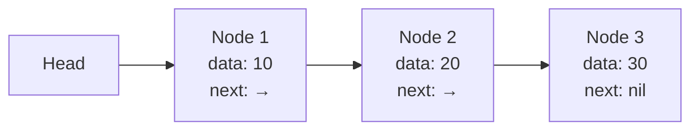

### Сложность

| Операция | Временная сложность (O) | Пространственная сложность (O) |
|:---|:---:|:---:|
| Доступ (по индексу) | O(n) | O(1) |
| Вставка (в начало) | O(1) | O(1) |
| Вставка (в конец) | O(n)* | O(1) |
| Вставка (в середину) | O(n) | O(1) |
| Удаление (из начала) | O(1) | O(1) |
| Удаление (из конца) | O(n)* | O(1) |
| Удаление (из середины) | O(n) | O(1) |
| Поиск | O(n) | O(1) |
| Хранение | — | O(n) |

> [!NOTE]
> *Для двусвязного списка вставка/удаление в конец — O(1), если хранится указатель на хвост.

### Пример на Go

```go
package main

import "fmt"

type Node struct {
    value int
    next  *Node
}

type LinkedList struct {
    head *Node
}

func (l *LinkedList) InsertFront(value int) {
    newNode := &Node{value: value}
    newNode.next = l.head
    l.head = newNode
}

func (l *LinkedList) Print() {
    for curr := l.head; curr != nil; curr = curr.next {
        fmt.Printf("%d -> ", curr.value)
    }
    fmt.Println("nil")
}

func main() {
    list := LinkedList{}
    list.InsertFront(3)
    list.InsertFront(2)
    list.InsertFront(1)
    list.Print() // 1 -> 2 -> 3 -> nil
}
```

### Когда использовать

✅ Частые вставки/удаления в начало  
✅ Не нужен прямой доступ по индексу  
✅ Двусвязный — если нужны операции с конца

---

## 3. Стек (Stack)

**Описание**: Структура данных по принципу LIFO (Last In, First Out). Элементы добавляются (push) и удаляются (pop) с одного конца.

### Визуализация

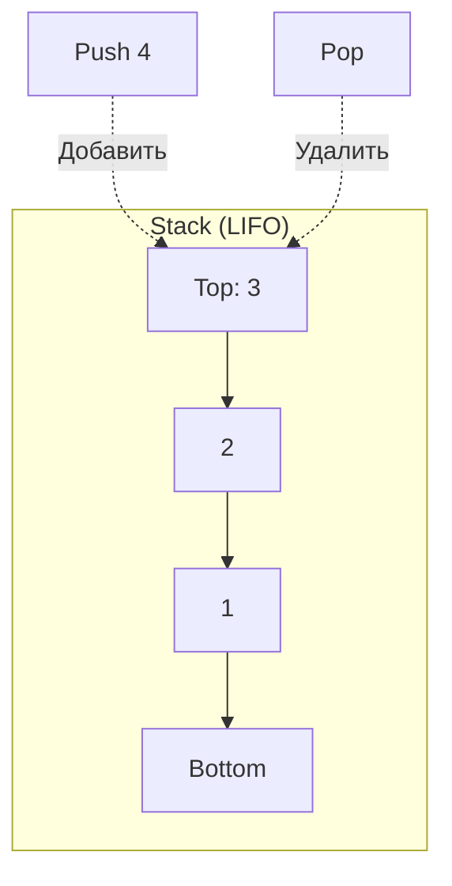

### Сложность

| Операция | Временная сложность (O) | Пространственная сложность (O) |
|:---|:---:|:---:|
| Push | O(1) | O(1) |
| Pop | O(1) | O(1) |
| Peek | O(1) | O(1) |
| Проверка пустоты | O(1) | O(1) |
| Хранение | — | O(n) |

> [!TIP]
> Все операции O(1), так как работают только с вершиной. Реализуется на основе массива или связного списка.

### Пример на Go

```go
package main

import "fmt"

type Stack struct {
    items []int
}

func (s *Stack) Push(value int) {
    s.items = append(s.items, value)
}

func (s *Stack) Pop() (int, bool) {
    if len(s.items) == 0 {
        return 0, false
    }
    value := s.items[len(s.items)-1]
    s.items = s.items[:len(s.items)-1]
    return value, true
}

func main() {
    stack := Stack{}
    stack.Push(1)
    stack.Push(2)
    if val, ok := stack.Pop(); ok {
        fmt.Println(val) // 2
    }
}
```

### Когда использовать

✅ Для задач с обратным порядком обработки (undo, парсинг выражений)  
✅ Простая и эффективная структура

---

## 4. Очередь (Queue)

**Описание**: Структура данных по принципу FIFO (First In, First Out). Элементы добавляются в конец (enqueue), удаляются из начала (dequeue).

### Визуализация

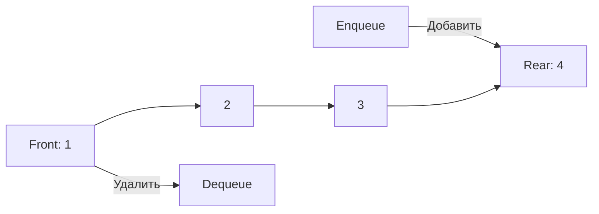

### Сложность

| Операция | Временная сложность (O) | Пространственная сложность (O) |
|:---|:---:|:---:|
| Enqueue | O(1) | O(1) |
| Dequeue | O(1) | O(1) |
| Peek | O(1) | O(1) |
| Проверка пустоты | O(1) | O(1) |
| Хранение | — | O(n) |

### Пример на Go

```go
package main

import "fmt"

type Queue struct {
    items []int
}

func (q *Queue) Enqueue(value int) {
    q.items = append(q.items, value)
}

func (q *Queue) Dequeue() (int, bool) {
    if len(q.items) == 0 {
        return 0, false
    }
    value := q.items[0]
    q.items = q.items[1:]
    return value, true
}

func main() {
    queue := Queue{}
    queue.Enqueue(1)
    queue.Enqueue(2)
    if val, ok := queue.Dequeue(); ok {
        fmt.Println(val) // 1
    }
}
```

### Когда использовать

✅ Для задач с порядком обработки (обработка задач, BFS)  
✅ Кольцевой буфер эффективен для фиксированного размера

---

## 5. Хэш-таблица (Hash Map)

**Описание**: Ассоциативный массив, где данные хранятся в виде пар ключ-значение. Ключи хэшируются для быстрого доступа.

### Визуализация

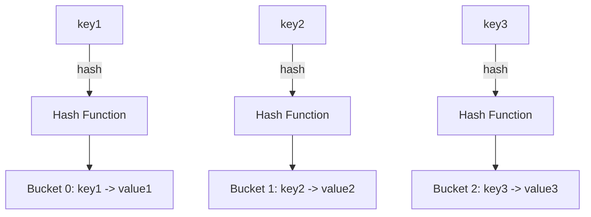

### Сложность

| Операция | Временная сложность (O) | Пространственная сложность (O) |
|:---|:---:|:---:|
| Вставка | O(1) средняя, O(n) худшая | O(1) |
| Поиск | O(1) средняя, O(n) худшая | O(1) |
| Удаление | O(1) средняя, O(n) худшая | O(1) |
| Проверка ключа | O(1) средняя, O(n) худшая | O(1) |
| Хранение | — | O(n) |

> [!IMPORTANT]
> **O(1) средняя**: Хорошая хэш-функция минимизирует коллизии. **O(n) худшая**: При многих коллизиях (например, все ключи в одном бакете).

### Пример на Go

```go
package main

import "fmt"

func main() {
    hashMap := make(map[string]int)
    
    // Вставка
    hashMap["key1"] = 1
    hashMap["key2"] = 2
    
    // Поиск
    if val, exists := hashMap["key1"]; exists {
        fmt.Println(val) // 1
    }
    
    // Удаление
    delete(hashMap, "key2")
    fmt.Println(hashMap) // map[key1:1]
}
```

### Когда использовать

✅ Быстрый доступ по ключу  
✅ Подходит для словарей, кэшей, подсчёта частот  
❌ Избегать плохих хэш-функций

---

## 6. Двоичное дерево (Binary Tree)

**Описание**: Дерево, где каждый узел имеет до двух потомков (левый и правый).

### Визуализация

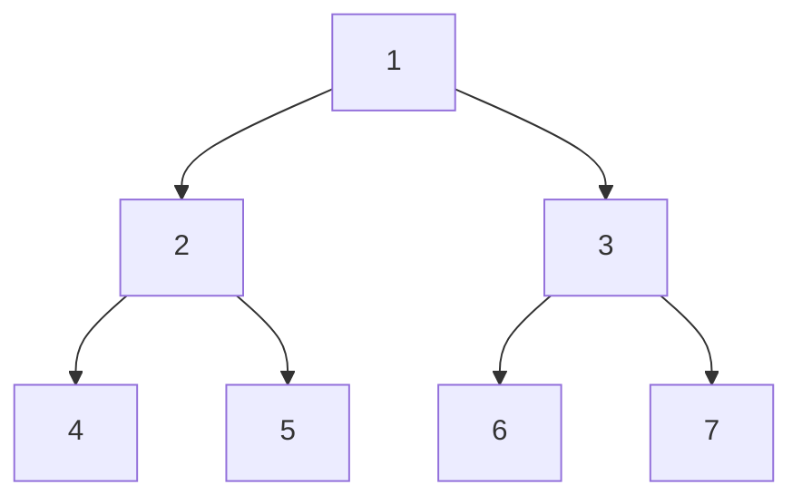

### Сложность

| Операция | Временная сложность (O) | Пространственная сложность (O) |
|:---|:---:|:---:|
| Вставка | O(h) | O(h) (рекурсия) |
| Поиск | O(h) | O(h) (рекурсия) |
| Удаление | O(h) | O(h) (рекурсия) |
| Обход | O(n) | O(h) (рекурсия) |
| Хранение | — | O(n) |

> [!NOTE]
> **h** — высота дерева. Для несбалансированного дерева h = O(n) (худший случай), для сбалансированного — O(log n).

### Пример на Go

```go
package main

import "fmt"

type TreeNode struct {
    value int
    left  *TreeNode
    right *TreeNode
}

func inOrder(node *TreeNode) {
    if node == nil {
        return
    }
    inOrder(node.left)
    fmt.Printf("%d ", node.value)
    inOrder(node.right)
}

func main() {
    root := &TreeNode{value: 1}
    root.left = &TreeNode{value: 2}
    root.right = &TreeNode{value: 3}
    inOrder(root) // 2 1 3
}
```

---

## 7. Двоичное дерево поиска (Binary Search Tree, BST)

**Описание**: Двоичное дерево, где для каждого узла левое поддерево содержит меньшие значения, правое — большие.

### Визуализация

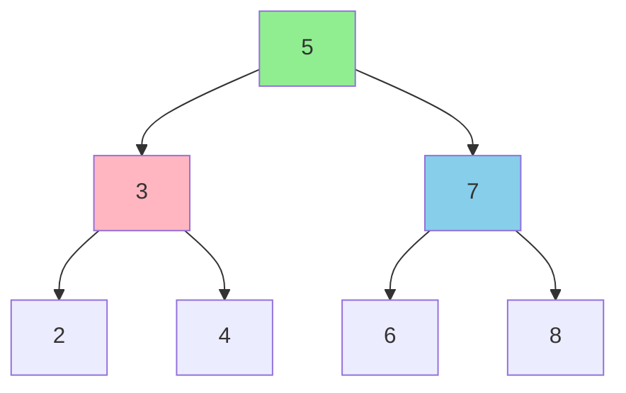

### Сложность

| Операция | Временная сложность (O) | Пространственная сложность (O) |
|:---|:---:|:---:|
| Вставка | O(h) средняя O(log n), худшая O(n) | O(h) |
| Поиск | O(h) средняя O(log n), худшая O(n) | O(h) |
| Удаление | O(h) средняя O(log n), худшая O(n) | O(h) |
| Обход | O(n) | O(h) |
| Хранение | — | O(n) |

> [!WARNING]
> **h** — высота. В сбалансированном случае O(log n), в вырожденном (линейный список) — O(n).

### Пример на Go

```go
package main

import "fmt"

type BSTNode struct {
    value int
    left  *BSTNode
    right *BSTNode
}

type BST struct {
    root *BSTNode
}

func (bst *BST) Insert(value int) {
    bst.root = insertNode(bst.root, value)
}

func insertNode(node *BSTNode, value int) *BSTNode {
    if node == nil {
        return &BSTNode{value: value}
    }
    if value < node.value {
        node.left = insertNode(node.left, value)
    } else {
        node.right = insertNode(node.right, value)
    }
    return node
}

func (bst *BST) Search(value int) bool {
    return searchNode(bst.root, value)
}

func searchNode(node *BSTNode, value int) bool {
    if node == nil {
        return false
    }
    if node.value == value {
        return true
    }
    if value < node.value {
        return searchNode(node.left, value)
    }
    return searchNode(node.right, value)
}

func main() {
    bst := BST{}
    bst.Insert(5)
    bst.Insert(3)
    bst.Insert(7)
    fmt.Println(bst.Search(3)) // true
    fmt.Println(bst.Search(4)) // false
}
```

---

## 8. Сбалансированные деревья (AVL или Красно-черное)

**Описание**: Двоичные деревья поиска с автоматической балансировкой. AVL — строгое условие (разница высот поддеревьев ≤ 1), красно-черное — более гибкое.

### Визуализация балансировки

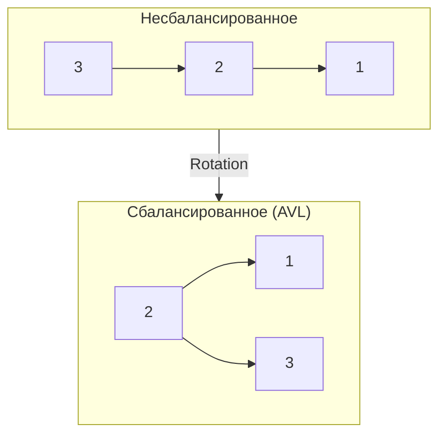

### Сложность

| Операция | Временная сложность (O) | Пространственная сложность (O) |
|:---|:---:|:---:|
| Вставка | O(log n) | O(log n) (рекурсия) |
| Поиск | O(log n) | O(log n) (рекурсия) |
| Удаление | O(log n) | O(log n) (рекурсия) |
| Хранение | — | O(n) |

> [!IMPORTANT]
> Гарантируют O(log n) за счёт поворотов (AVL) или перекрашивания/поворотов (красно-черное). AVL быстрее для поиска, красно-черное — для вставки/удаления.

---

## 9. Куча (Heap)

**Описание**: Двоичное дерево, где значение каждого узла больше (max-heap) или меньше (min-heap) значений его детей. Хранится в массиве.

### Визуализация Min-Heap

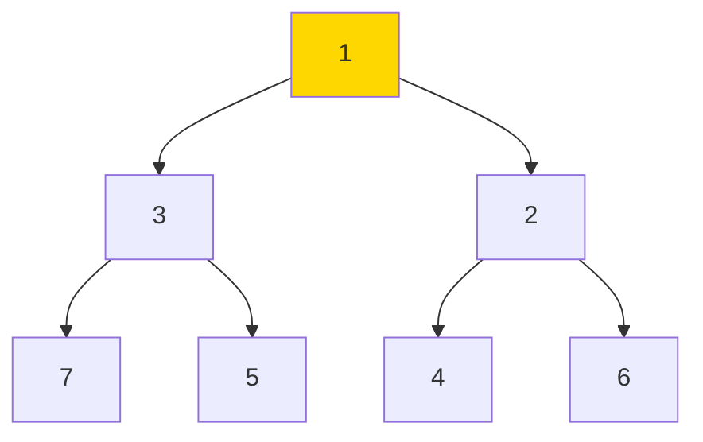

### Сложность

| Операция | Временная сложность (O) | Пространственная сложность (O) |
|:---|:---:|:---:|
| Вставка | O(log n) | O(1) |
| Извлечение | O(log n) | O(1) |
| Просмотр вершины | O(1) | O(1) |
| Построение кучи | O(n) | O(1) |
| Хранение | — | O(n) |

### Пример на Go

```go
package main

import (
    "container/heap"
    "fmt"
)

type IntHeap []int

func (h IntHeap) Len() int           { return len(h) }
func (h IntHeap) Less(i, j int) bool { return h[i] < h[j] }
func (h IntHeap) Swap(i, j int)      { h[i], h[j] = h[j], h[i] }
func (h *IntHeap) Push(x interface{}) {
    *h = append(*h, x.(int))
}
func (h *IntHeap) Pop() interface{} {
    old := *h
    n := len(old)
    x := old[n-1]
    *h = old[0 : n-1]
    return x
}

func main() {
    h := &IntHeap{2, 1, 5}
    heap.Init(h)
    heap.Push(h, 3)
    fmt.Println(heap.Pop(h)) // 1
}
```

### Когда использовать

✅ Приоритетные очереди  
✅ Алгоритмы вроде Dijkstra или сортировки кучей

---

## 10. Три (Trie)

**Описание**: Дерево для хранения строк, где каждый узел представляет символ. Используется для автодополнения, словарей.

### Визуализация

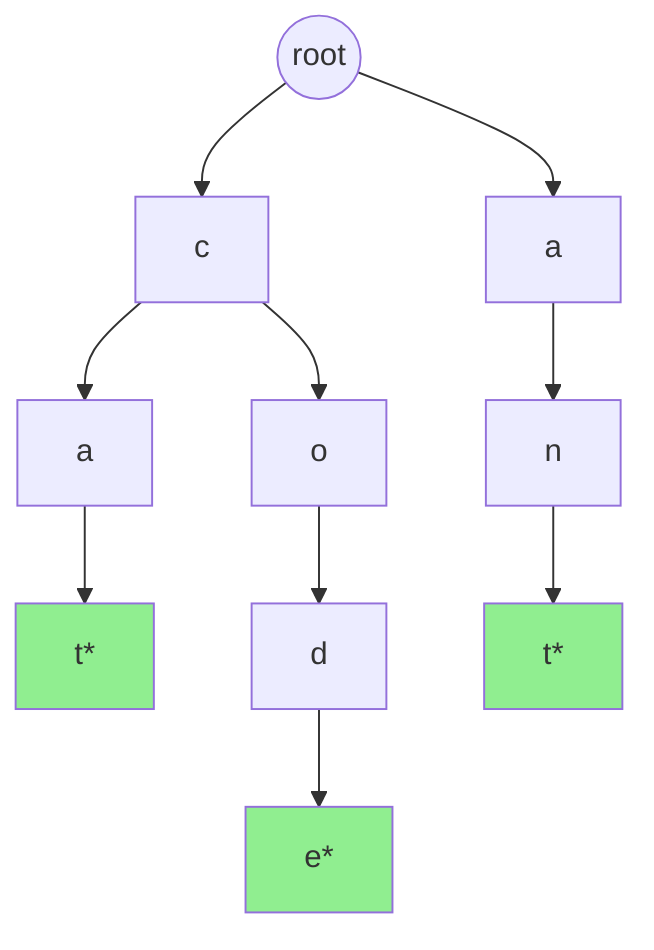

### Сложность

| Операция | Временная сложность (O) | Пространственная сложность (O) |
|:---|:---:|:---:|
| Вставка | O(m) | O(m) |
| Поиск (слово) | O(m) | O(1) |
| Поиск (префикс) | O(m) | O(1) |
| Удаление | O(m) | O(1) |
| Хранение | — | O(ALPHABET_SIZE × N × M) |

> [!NOTE]
> **m** — длина строки. Память зависит от размера алфавита и числа строк.

### Пример на Go

```go
package main

import "fmt"

type TrieNode struct {
    children map[rune]*TrieNode
    isEnd    bool
}

type Trie struct {
    root *TrieNode
}

func NewTrie() *Trie {
    return &Trie{root: &TrieNode{children: make(map[rune]*TrieNode)}}
}

func (t *Trie) Insert(word string) {
    node := t.root
    for _, char := range word {
        if _, exists := node.children[char]; !exists {
            node.children[char] = &TrieNode{children: make(map[rune]*TrieNode)}
        }
        node = node.children[char]
    }
    node.isEnd = true
}

func (t *Trie) Search(word string) bool {
    node := t.root
    for _, char := range word {
        if _, exists := node.children[char]; !exists {
            return false
        }
        node = node.children[char]
    }
    return node.isEnd
}

func main() {
    trie := NewTrie()
    trie.Insert("hello")
    fmt.Println(trie.Search("hello")) // true
    fmt.Println(trie.Search("hell"))  // false
}
```

---

## 11. Граф (Graph)

**Описание**: Набор вершин, соединённых рёбрами. Может быть направленным/ненаправленным, взвешенным/невзвешенным. Хранится как список смежности или матрица смежности.

### Визуализация

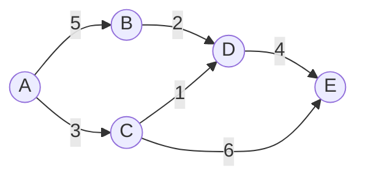

### Сложность

| Операция | Список смежности (O) | Матрица смежности (O) | Пространственная сложность |
|:---|:---:|:---:|:---:|
| Добавление вершины | O(1) | O(V²) | O(V) / O(V²) |
| Добавление ребра | O(1) | O(1) | O(1) |
| Проверка ребра | O(V) | O(1) | O(1) |
| Перечисление соседей | O(degree) | O(V) | O(1) |
| Хранение | — | — | O(V + E) / O(V²) |

> [!TIP]
> **V** — число вершин, **E** — число рёбер. Список смежности экономит память для разреженных графов. Матрица удобна для плотных графов.

### Пример на Go

```go
package main

import "fmt"

type Graph struct {
    adjList map[int][]int
}

func NewGraph() *Graph {
    return &Graph{adjList: make(map[int][]int)}
}

func (g *Graph) AddEdge(u, v int) {
    g.adjList[u] = append(g.adjList[u], v)
    g.adjList[v] = append(g.adjList[v], u) // Ненаправленный граф
}

func main() {
    g := NewGraph()
    g.AddEdge(0, 1)
    g.AddEdge(1, 2)
    fmt.Println(g.adjList) // map[0:[1] 1:[0 2] 2:[1]]
}
```

---

# Алгоритмы

Алгоритмы — это последовательности шагов для решения конкретных задач.

```mermaid
graph TD
    Algo[Алгоритмы] --> Search[Поиск]
    Algo --> Sort[Сортировка]
    
    Search --> Linear[Линейный]
    Search --> Binary[Бинарный]
    
    Sort --> Simple[Простые O&#40;n²&#41;]
    Sort --> Advanced[Продвинутые O&#40;n log n&#41;]
    
    Simple --> Bubble[Пузырьковая]
    Simple --> Selection[Выбором]
    Simple --> Insertion[Вставками]
    
    Advanced --> Quick[Быстрая]
    Advanced --> Merge[Слиянием]
```

---

## 1. Поиск

### Линейный поиск

**Описание**: Проверяет каждый элемент массива, пока не найдёт искомый.

**Сложность**:

| Метрика | Сложность (O) |
|:---|:---:|
| Временная (средняя/худшая) | O(n) |
| Пространственная | O(1) |

**Пример на Go**:

```go
package main

import "fmt"

func linearSearch(arr []int, target int) int {
    for i, val := range arr {
        if val == target {
            return i
        }
    }
    return -1
}

func main() {
    arr := []int{4, 2, 7, 1, 9}
    fmt.Println(linearSearch(arr, 7)) // 2
}
```

**Когда использовать**: Неотсортированные данные, маленькие массивы.

---

### Бинарный поиск

**Описание**: Работает на отсортированном массиве, деля его пополам на каждом шаге.

**Визуализация**:

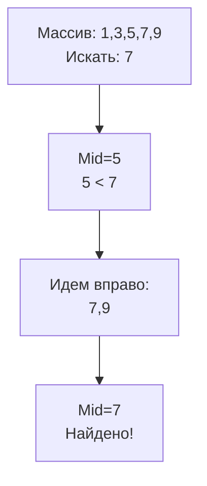

**Сложность**:

| Метрика | Сложность (O) |
|:---|:---:|
| Временная (средняя/худшая) | O(log n) |
| Пространственная | O(1) итеративный, O(log n) рекурсивный |

**Пример на Go**:

```go
package main

import "fmt"

func binarySearch(arr []int, target int) int {
    left, right := 0, len(arr)-1
    for left <= right {
        mid := (left + right) / 2
        if arr[mid] == target {
            return mid
        }
        if arr[mid] < target {
            left = mid + 1
        } else {
            right = mid - 1
        }
    }
    return -1
}

func main() {
    arr := []int{1, 3, 5, 7, 9}
    fmt.Println(binarySearch(arr, 5)) // 2
}
```

**Когда использовать**: Отсортированные данные, быстрый поиск в больших массивах.

---

## 2. Сортировка

### Сравнение алгоритмов сортировки

| Алгоритм | Лучшая | Средняя | Худшая | Память | Стабильная |
|:---|:---:|:---:|:---:|:---:|:---:|
| Пузырьковая | O(n) | O(n²) | O(n²) | O(1) | ✅ |
| Выбором | O(n²) | O(n²) | O(n²) | O(1) | ❌ |
| Вставками | O(n) | O(n²) | O(n²) | O(1) | ✅ |
| Быстрая | O(n log n) | O(n log n) | O(n²) | O(log n) | ❌ |
| Слиянием | O(n log n) | O(n log n) | O(n log n) | O(n) | ✅ |

---

### Пузырьковая сортировка (Bubble Sort)

**Описание**: Сравнивает соседние элементы и меняет их местами, если порядок неверный.

**Визуализация**:

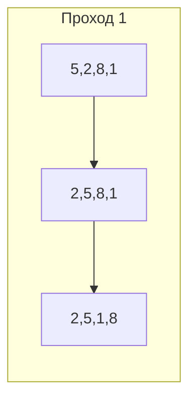

**Пример на Go**:

```go
package main

import "fmt"

func bubbleSort(arr []int) {
    n := len(arr)
    for i := 0; i < n-1; i++ {
        for j := 0; j < n-i-1; j++ {
            if arr[j] > arr[j+1] {
                arr[j], arr[j+1] = arr[j+1], arr[j]
            }
        }
    }
}

func main() {
    arr := []int{5, 2, 8, 1, 9}
    bubbleSort(arr)
    fmt.Println(arr) // [1 2 5 8 9]
}
```

---

### Сортировка выбором (Selection Sort)

**Описание**: Находит минимум в неотсортированной части и ставит его в начало.

**Пример на Go**:

```go
package main

import "fmt"

func selectionSort(arr []int) {
    n := len(arr)
    for i := 0; i < n-1; i++ {
        minIdx := i
        for j := i + 1; j < n; j++ {
            if arr[j] < arr[minIdx] {
                minIdx = j
            }
        }
        arr[i], arr[minIdx] = arr[minIdx], arr[i]
    }
}

func main() {
    arr := []int{5, 2, 8, 1, 9}
    selectionSort(arr)
    fmt.Println(arr) // [1 2 5 8 9]
}
```

---

### Сортировка вставками (Insertion Sort)

**Описание**: Постепенно строит отсортированную часть, вставляя элементы в правильное место.

**Пример на Go**:

```go
package main

import "fmt"

func insertionSort(arr []int) {
    for i := 1; i < len(arr); i++ {
        key := arr[i]
        j := i - 1
        for j >= 0 && arr[j] > key {
            arr[j+1] = arr[j]
            j--
        }
        arr[j+1] = key
    }
}

func main() {
    arr := []int{5, 2, 8, 1, 9}
    insertionSort(arr)
    fmt.Println(arr) // [1 2 5 8 9]
}
```

---

### Быстрая сортировка (Quick Sort)

**Описание**: Выбирает опорный элемент, разбивает массив на меньшие и большие элементы, рекурсивно сортирует.

**Визуализация**:

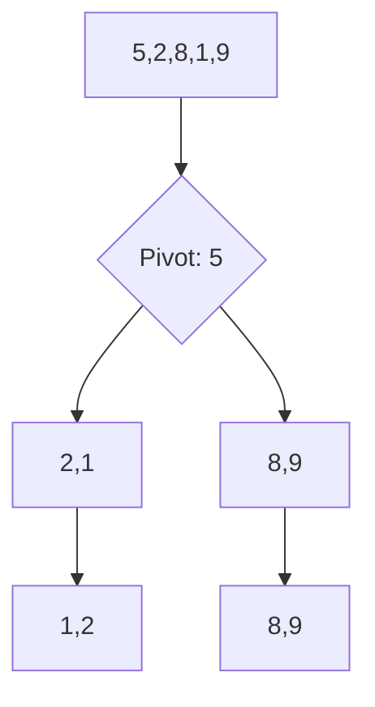

**Пример на Go**:

```go
package main

import "fmt"

func quickSort(arr []int, low, high int) {
    if low < high {
        pi := partition(arr, low, high)
        quickSort(arr, low, pi-1)
        quickSort(arr, pi+1, high)
    }
}

func partition(arr []int, low, high int) int {
    pivot := arr[high]
    i := low - 1
    for j := low; j < high; j++ {
        if arr[j] <= pivot {
            i++
            arr[i], arr[j] = arr[j], arr[i]
        }
    }
    arr[i+1], arr[high] = arr[high], arr[i+1]
    return i + 1
}

func main() {
    arr := []int{5, 2, 8, 1, 9}
    quickSort(arr, 0, len(arr)-1)
    fmt.Println(arr) // [1 2 5 8 9]
}
```

**Когда использовать**: Общего назначения, хорошая средняя производительность.

---

### Сортировка слиянием (Merge Sort)

**Описание**: Делит массив пополам, сортирует каждую половину, затем сливает.

**Визуализация**:

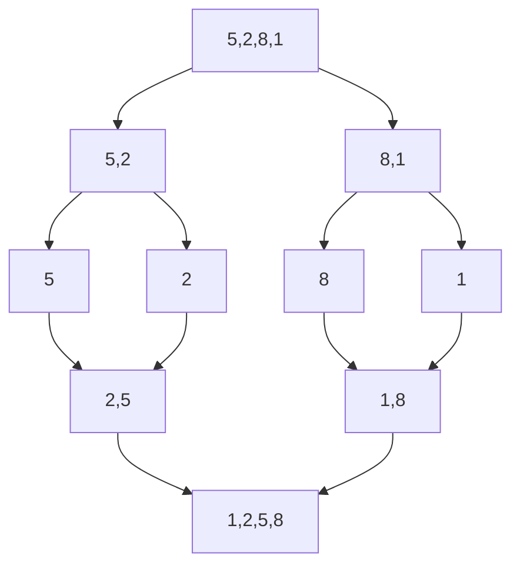

**Пример на Go**:

```go
package main

import "fmt"

func mergeSort(arr []int) []int {
    if len(arr) <= 1 {
        return arr
    }
    mid := len(arr) / 2
    left := mergeSort(arr[:mid])
    right := mergeSort(arr[mid:])
    return merge(left, right)
}

func merge(left, right []int) []int {
    result := make([]int, 0, len(left)+len(right))
    i, j := 0, 0
    for i < len(left) && j < len(right) {
        if left[i] <= right[j] {
            result = append(result, left[i])
            i++
        } else {
            result = append(result, right[j])
            j++
        }
    }
    result = append(result, left[i:]...)
    result = append(result, right[j:]...)
    return result
}

func main() {
    arr := []int{5, 2, 8, 1, 9}
    sorted := mergeSort(arr)
    fmt.Println(sorted) // [1 2 5 8 9]
}
```

**Когда использовать**: Гарантированная производительность, внешняя сортировка (для больших данных).

---

## Заключение

> [!IMPORTANT]
> Выбор структуры данных и алгоритма зависит от конкретной задачи. Учитывайте временную и пространственную сложность, частоту операций и размер данных.

**Ключевые моменты**:
- **Массивы** — быстрый доступ, медленные вставки/удаления
- **Списки** — быстрые вставки, медленный доступ
- **Хэш-таблицы** — O(1) для большинства операций
- **Деревья** — логарифмическая сложность при балансировке
- **Графы** — для моделирования связей и сетей
