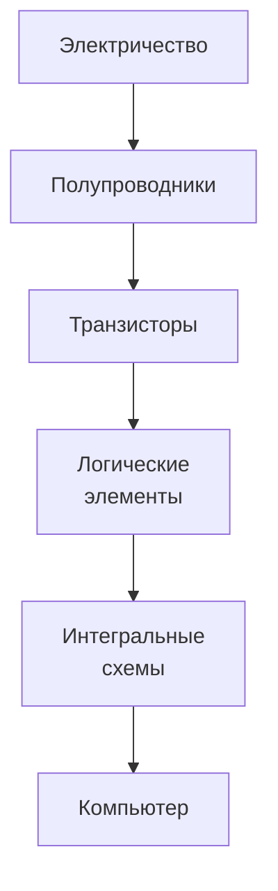
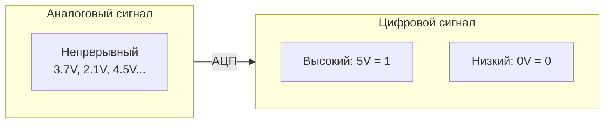
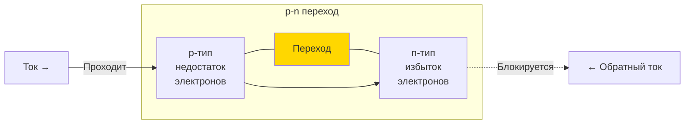
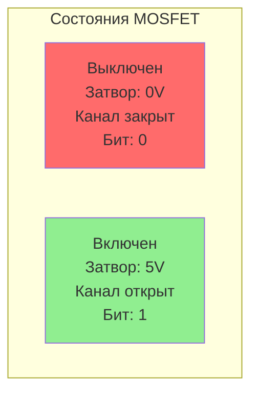
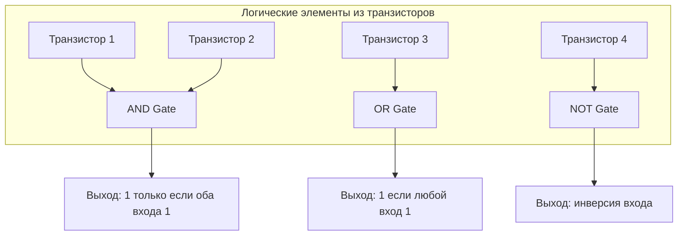
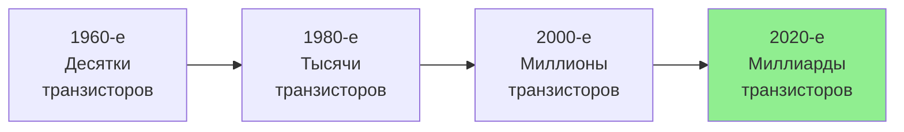
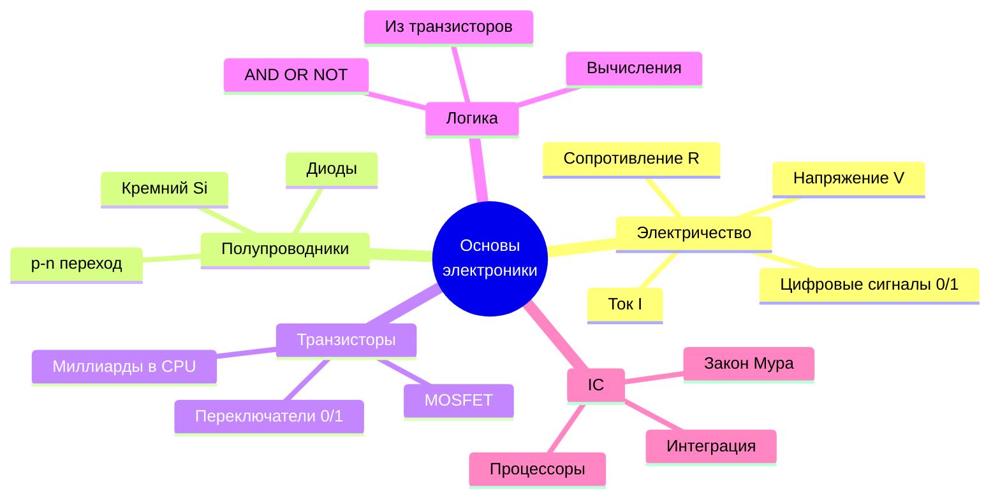

# Основы электроники и физические принципы

## Содержание
1. [Электричество и сигналы](#1-электричество-и-сигналы)
2. [Полупроводники](#2-полупроводники)
3. [Транзисторы](#3-транзисторы)
4. [Логические элементы](#4-логические-элементы)
5. [Интегральные схемы](#5-интегральные-схемы)

---

Электроника лежит в основе работы компьютеров. Компьютеры используют электрические сигналы для обработки и передачи данных. Этот раздел объясняет, как электричество, полупроводники и транзисторы создают фундамент для цифровых систем.

---

## 1. Электричество и сигналы

Электричество — это движение электронов через проводник. В компьютерах оно используется для передачи сигналов.

### Основные понятия

- **Напряжение (V)**: Разность потенциалов, \"давление\", которое заставляет электроны двигаться (измеряется в вольтах)
- **Ток (I)**: Поток электронов (измеряется в амперах)
- **Сопротивление (R)**: Препятствие движению тока (измеряется в омах)

> [!NOTE]
> **Закон Ома**: V = I × R. Этот фундаментальный закон описывает связь между напряжением, током и сопротивлением.

### Цифровые сигналы

- Компьютеры используют **двоичные сигналы**: высокий уровень напряжения (обычно 5V или 3.3V) обозначает **1**, низкий (0V) — **0**
- **Аналоговые сигналы** (непрерывные) в компьютерах преобразуются в цифровые через **АЦП** (аналого-цифровой преобразователь)

> [!TIP]
> **Пример**: В USB напряжение 5V используется для питания устройств, а данные передаются через изменения напряжения (сигналы).

---

## 2. Полупроводники

Полупроводники — материалы, которые могут проводить ток, но не так хорошо, как металлы. Они ключевые для электроники.

### Свойства

- Основной материал — **кремний** (Si), иногда германий (Ge)
- Проводимость регулируется добавлением примесей (**легирование**):
  - **n-тип**: Добавление атомов с лишними электронами (например, фосфор)
  - **p-тип**: Добавление атомов с недостатком электронов (например, бор)

### p-n переход

Соединение n-типа и p-типа создаёт **диод** — устройство, пропускающее ток только в одном направлении.

> [!NOTE]
> **Применение**: Диоды в блоке питания компьютера преобразуют переменный ток (AC) в постоянный (DC).

---

## 3. Транзисторы

**Транзистор** — ключевой элемент компьютера, выполняющий функции переключателя или усилителя.

### Типы транзисторов

- **BJT** (биполярный): Управляется током
- **MOSFET** (полевой): Управляется напряжением, используется в большинстве современных процессоров

### Как работает MOSFET

- Имеет три вывода: **исток** (source), **сток** (drain), **затвор** (gate)
- Напряжение на затворе открывает или закрывает канал для тока между истоком и стоком
- В цифровых схемах транзистор либо \"включён\" (**1**), либо \"выключен\" (**0**)

### Роль в компьютерах

- Транзисторы формируют **логические элементы** (например, AND, OR, NOT)
- В одном процессоре (например, Intel Core) — миллиарды транзисторов

> [!IMPORTANT]
> В процессоре транзисторы переключаются **миллиарды раз в секунду**, выполняя вычисления. Это основа всех современных компьютеров.

---

## 4. Логические элементы

Логические элементы — это комбинации транзисторов, выполняющие базовые логические операции.

### Основные элементы

| Элемент | Описание | Правда, если... |
|:---|:---|:---|
| **AND** | Логическое И | Все входы 1 |
| **OR** | Логическое ИЛИ | Хотя бы один вход 1 |
| **NOT** | Логическое НЕ | Инвертирует вход (0 → 1, 1 → 0) |
| **NAND** | НЕ-И | Не все входы 1 |
| **NOR** | НЕ-ИЛИ | Все входы 0 |
| **XOR** | Исключающее ИЛИ | Только один вход 1 |

> [!TIP]
> **Пример**: Элемент XOR используется в сумматорах для сложения двоичных чисел.

---

## 5. Интегральные схемы

**Интегральная схема (IC)** — множество транзисторов и других компонентов на одном кристалле кремния.

### Типы

- **Аналоговые**: Усилители, фильтры
- **Цифровые**: Процессоры, память
- **Смешанные**: Например, АЦП

### Эволюция (Закон Мура)

> [!NOTE]
> **Закон Мура**: Количество транзисторов на чипе удваивается примерно каждые 2 года. Хотя сейчас этот закон замедляется, он определял развитие компьютеров десятилетиями.

### Примеры

- **Микропроцессор**: Содержит ALU, регистры, управляющие блоки
- **Память**: DRAM, SRAM, Flash

> [!IMPORTANT]
> Процессор Intel Core i9 — это интегральная схема с ~10 млрд транзисторов на кристалле размером с ноготь!

---

## Ключевые выводы

- Электричество передаёт сигналы, которые компьютеры интерпретируют как **0** и **1**
- Полупроводники (кремний) и p-n переходы — основа диодов и транзисторов
- Транзисторы — переключатели, из которых строятся логические элементы
- Логические элементы формируют интегральные схемы, такие как процессоры
- Всё это — физическая основа для работы компьютера
