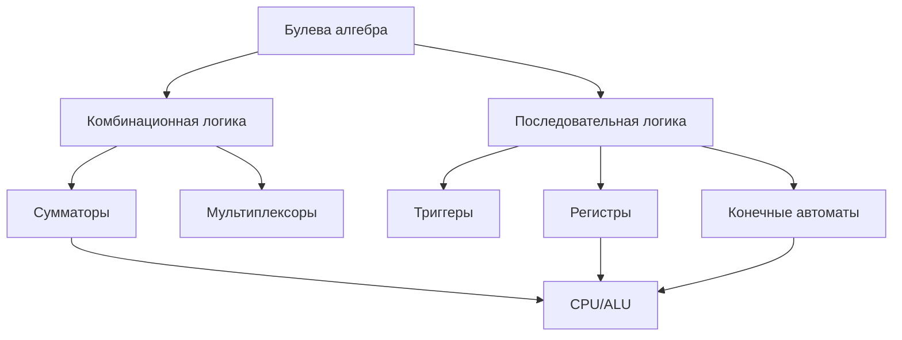
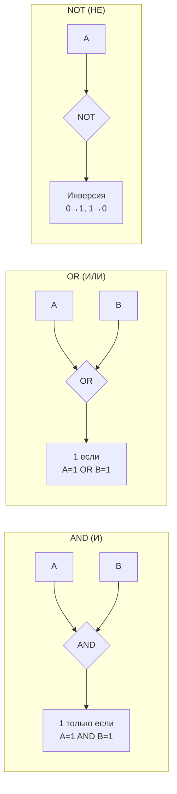
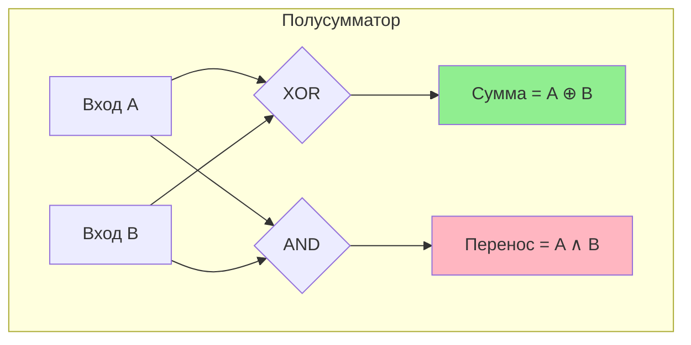
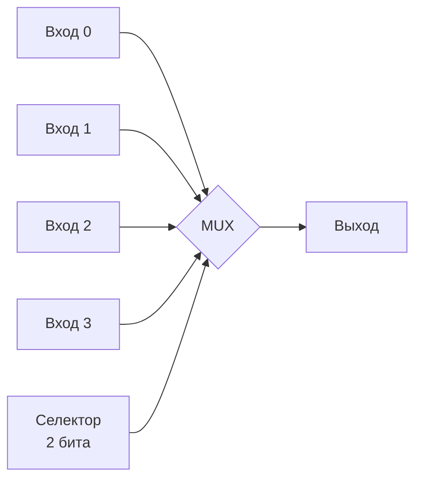
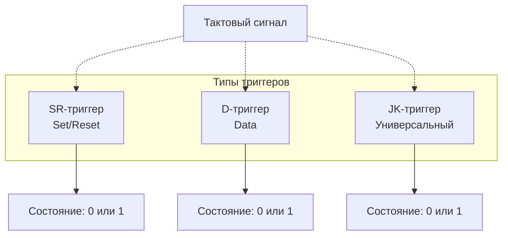
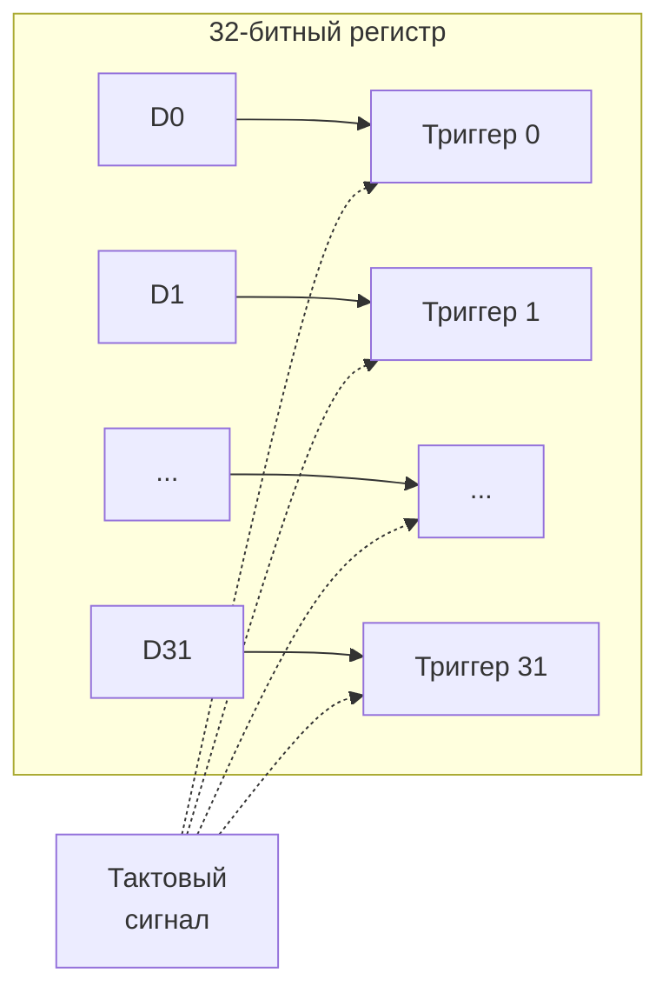
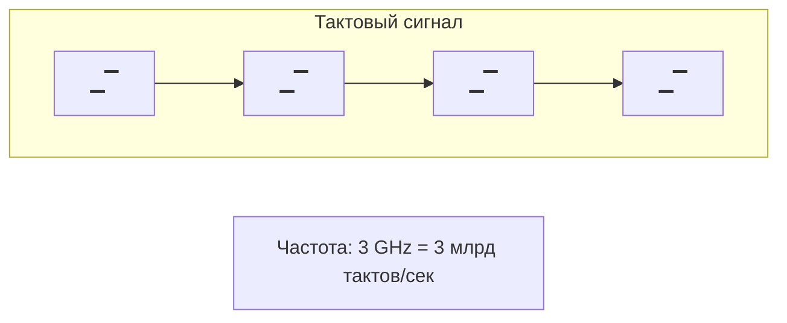
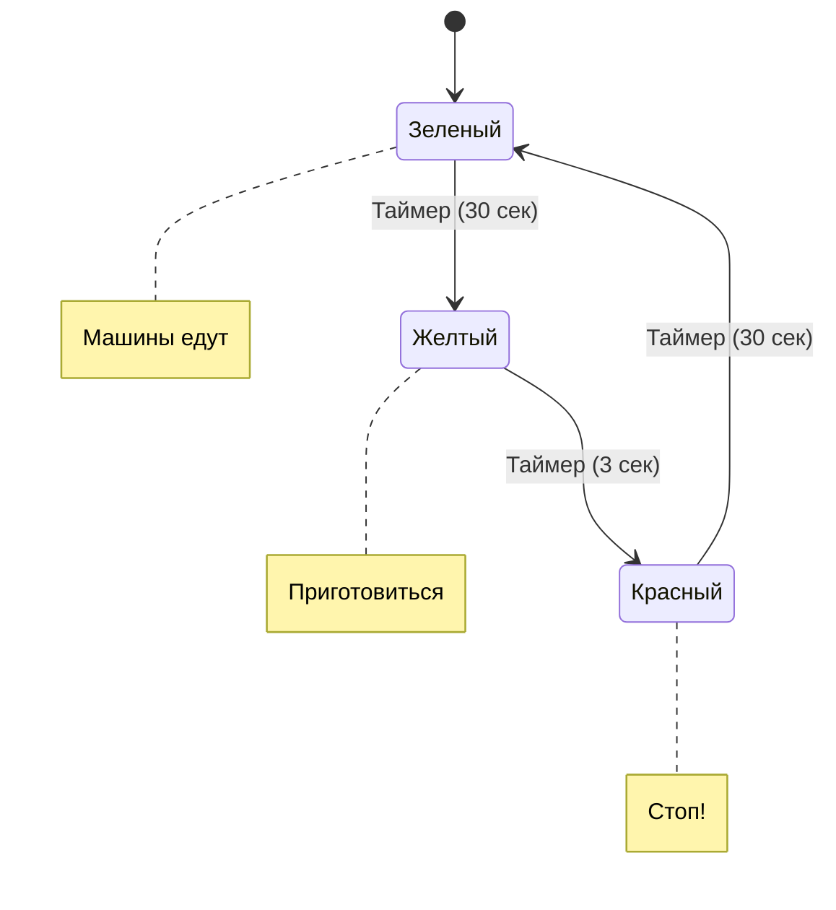
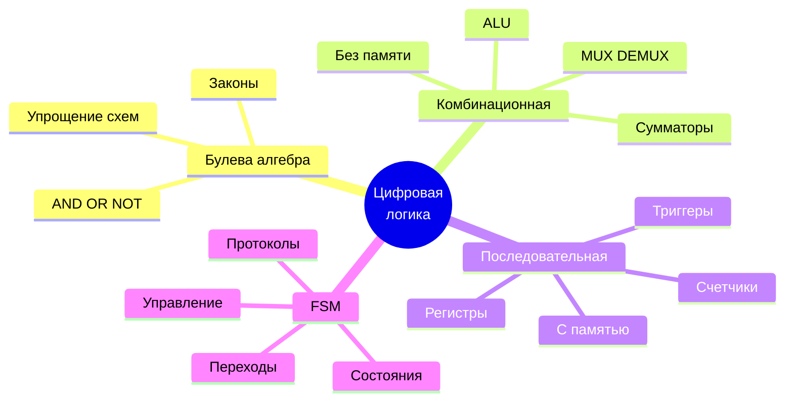

# Цифровая логика и булева алгебра

## Содержание
1. [Булева алгебра](#1-булева-алгебра)
2. [Комбинационная логика](#2-комбинационная-логика)
3. [Последовательная логика](#3-последовательная-логика)
4. [Конечные автоматы](#4-конечные-автоматы)

---

Цифровая логика — это основа работы компьютер ов, которая позволяет обрабатывать двоичные сигналы (**0** и **1**) с помощью логических операций. Булева алгебра предоставляет математическую основу для проектирования и анализа цифровых схем.

---

## 1. Булева алгебра

Булева алгебра — это раздел математики, который работает с логическими значениями (**TRUE/1** и **FALSE/0**) и операциями над ними.

### Основные операции

| Операция | Обозначение | Описание | Результат 1, если... |
|:---|:---:|:---|:---|
| **AND (И)** | A ∧ B | Логическое И | Оба A и B равны 1 |
| **OR (ИЛИ)** | A ∨ B | Логическое ИЛИ | Хотя бы один из A или B равен 1 |
| **NOT (НЕ)** | ¬A | Инверсия | A = 0 |
| **NAND (НЕ-И)** | ¬(A ∧ B) | Инверсия AND | Не все входы 1 |
| **NOR (НЕ-ИЛИ)** | ¬(A ∨ B) | Инверсия OR | Все входы 0 |
| **XOR (Искл. ИЛИ)** | A ⊕ B | Исключающее ИЛИ | Только один вход равен 1 |

### Законы булевой алгебры

| Закон | Пример |
|:---|:---|
| **Коммутативность** | A ∧ B = B ∧ A, A ∨ B = B ∨ A |
| **Ассоциативность** | (A ∧ B) ∧ C = A ∧ (B ∧ C) |
| **Дистрибутивность** | A ∧ (B ∨ C) = (A ∧ B) ∨ (A ∧ C) |
| **Закон Де Моргана** | ¬(A ∧ B) = ¬A ∨ ¬B, ¬(A ∨ B) = ¬A ∧ ¬B |
| **Идемпотентность** | A ∧ A = A, A ∨ A = A |

> [!TIP]
> **Применение**: Упрощение логических выражений для оптимизации схем и проектирования цифровых устройств (например, процессоров).

> [!NOTE]
> **Пример упрощения**: Упростим выражение A ∧ (A ∨ B).
> 
> По дистрибутивности: A ∧ (A ∨ B) = (A ∧ A) ∨ (A ∧ B) = A ∨ (A ∧ B)
> 
> Затем: A ∨ (A ∧ B) = A (поглощение)

---

## 2. Комбинационная логика

Комбинационная логика — это схемы, где выход зависит **только от текущих входов**, без учёта предыдущих состояний.

### Основные элементы

#### Сумматор

Складывает двоичные числа.

- **Полусумматор**: Складывает два бита, выдаёт сумму и перенос
- **Полный сумматор**: Учитывает входной перенос

**Таблица истинности полусумматора**:

| A | B | Сумма (A ⊕ B) | Перенос (A ∧ B) |
|:---:|:---:|:---:|:---:|
| 0 | 0 | 0 | 0 |
| 0 | 1 | 1 | 0 |
| 1 | 0 | 1 | 0 |
| 1 | 1 | 0 | 1 |

#### Мультиплексор (MUX)

Выбирает один из нескольких входов по управляющему сигналу.

#### Демультиплексор (DEMUX)

Направляет входной сигнал на один из выходов.

#### Декодер / Энкодер

- **Декодер**: Преобразует двоичный код в сигнал на одном из выходов (например, `00` → выход 0, `01` → выход 1)
- **Энкодер**: Обратный декодеру, преобразует сигнал в двоичный код

> [!IMPORTANT]
> В процессоре сумматоры используются в **ALU** (арифметико-логическом устройстве) для выполнения операций сложения, вычитания и других арифметических операций.

---

## 3. Последовательная логика

Последовательная логика — это схемы, где выход зависит от **текущих входов И предыдущих состояний** (памяти).

### Основные элементы

#### Триггеры

Хранят **1 бит** информации.

**Типы триггеров**:

- **SR-триггер**: Устанавливает (S) или сбрасывает (R) значение
- **D-триггер**: Хранит входное значение при сигнале синхронизации (тактовый сигнал)
- **JK-триггер**: Универсальный, может менять состояние по сложным условиям

#### Регистр

Группа триггеров для хранения нескольких битов (например, 32-битный регистр).

#### Счётчик

Последовательно увеличивает значение (например, от `000` до `111` в двоичной системе).

### Тактовый сигнал

- Синхронизирует работу схем
- Частота тактового сигнала определяет, как часто обновляются состояния

> [!NOTE]
> Регистры в процессоре хранят промежуточные результаты вычислений, например, значение переменной или адрес в памяти.

---

## 4. Конечные автоматы

**Конечный автомат** (Finite State Machine, FSM) — модель, описывающая поведение системы с ограниченным числом состояний.

### Компоненты

- **Состояния**: Например, \"включено\", \"выключено\"
- **Переходы**: Условия, при которых система меняет состояние (например, \"нажата кнопка\")
- **Входы**: Сигналы, влияющие на переходы
- **Выходы**: Результаты, зависящие от состояния или входов

### Визуализация: Светофор

### Типы

| Тип | Описание | Выход зависит от |
|:---|:---|:---|
| **Автомат Мура** | Выход зависит только от текущего состояния | Только состояние |
| **Автомат Мили** | Выход зависит от состояния и входов | Состояние + входы |

### Применение

- Управление процессами в процессорах
- Протоколы связи (например, USB, TCP/IP)
- Игровая логика
- Управление устройствами

> [!TIP]
> **Пример**: Процессор использует конечные автоматы для управления **конвейером инструкций** (Fetch → Decode → Execute → Write Back).

---

## Ключевые выводы

- **Булева алгебра** — математическая основа для работы с логическими операциями
- **Комбинационная логика** создаёт схемы, зависящие только от входов (сумматоры, мультиплексоры)
- **Последовательная логика** добавляет память через триггеры и регистры, синхронизируемые тактовым сигналом
- **Конечные автоматы** моделируют поведение систем с состояниями (процессоры, протоколы, устройства)
- Эти концепции — основа для проектирования процессоров и других цифровых систем
