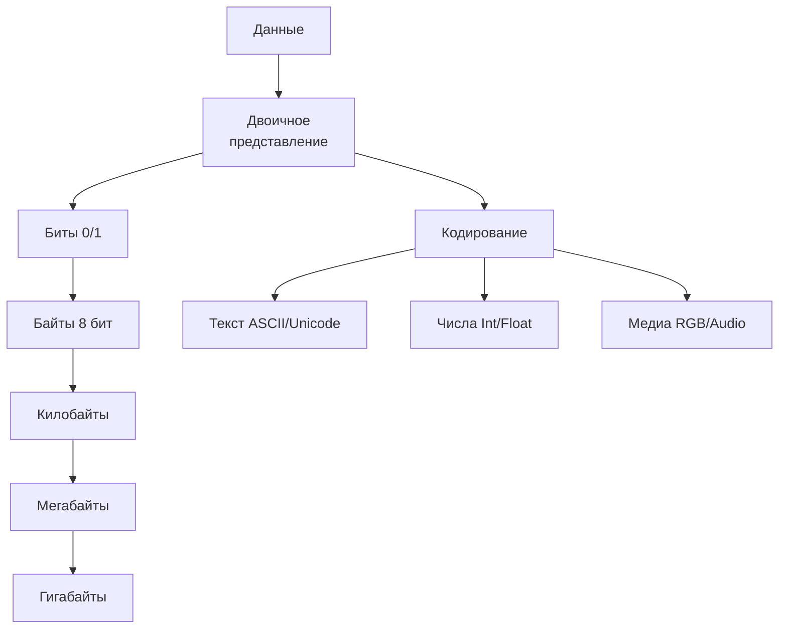
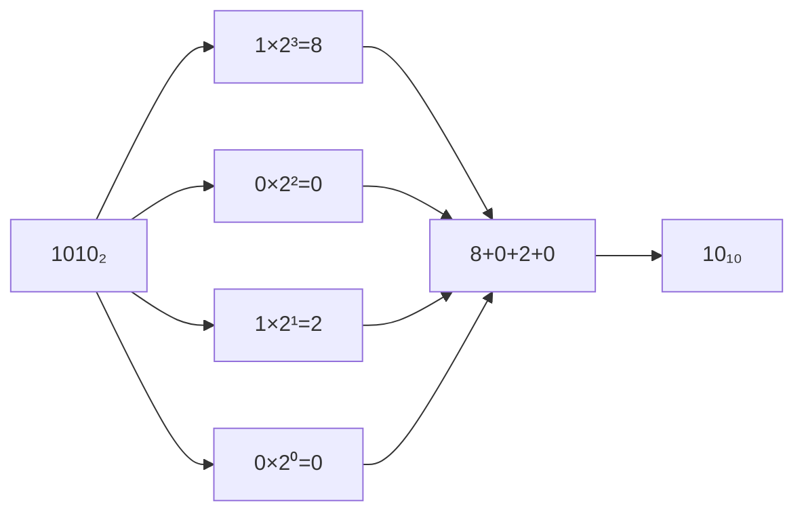
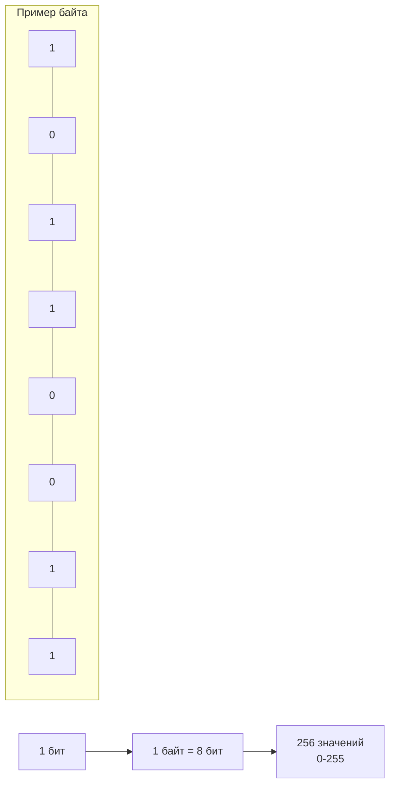
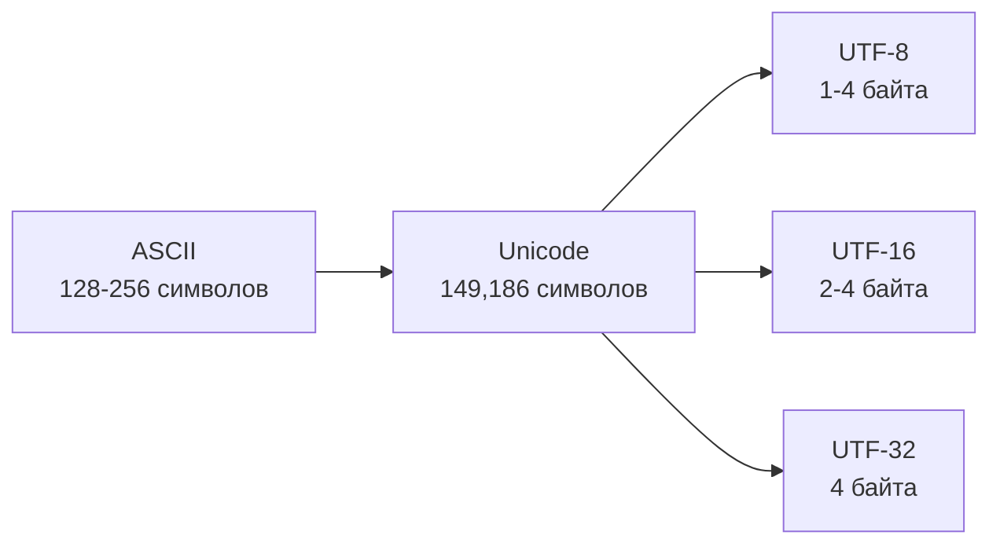
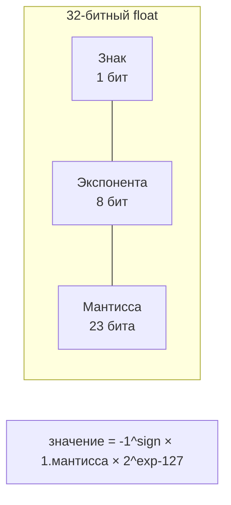
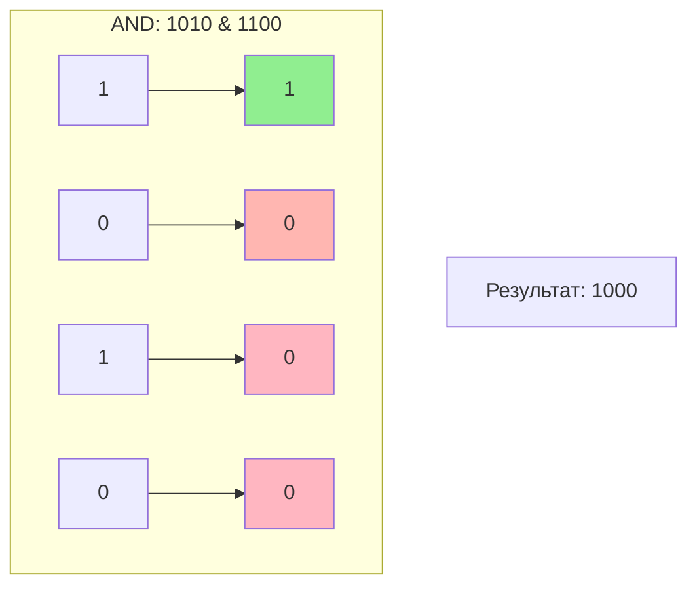
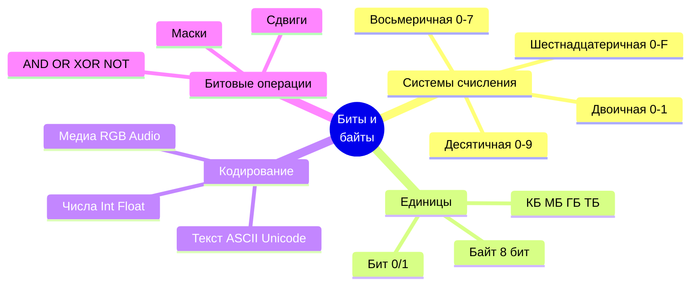

# Биты, байты и системы счисления

## Содержание
1. [Системы счисления](#1-системы-счисления)
2. [Биты и байты](#2-биты-и-байты)
3. [Кодирование данных](#3-кодирование-данных)
4. [Логические операции с битами](#4-логические-операции-с-битами)

---

Компьютеры работают с данными, представленными в виде **битов** (двоичных цифр) и **байтов**. Этот раздел объясняет, как данные кодируются, хранятся и обрабатываются с использованием различных систем счисления.



---

##  1. Системы счисления

Система счисления — это способ представления чисел с помощью символов (цифр) и их позиций.

### Основные системы

| Система | Основание | Цифры | Пример | Десятичное |
|:---|:---:|:---|:---:|:---:|
| **Двоичная** | 2 | 0, 1 | 1010 | 10 |
| **Восьмеричная** | 8 | 0-7 | 12 | 10 |
| **Десятичная** | 10 | 0-9 | 10 | 10 |
| **Шестнадцатеричная** | 16 | 0-9, A-F | A | 10 |

### Преобразование между системами

#### Из двоичной в десятичную

```
1010₂ = 1×2³ + 0×2² + 1×2¹ + 0×2⁰
     = 8 + 0 + 2 + 0
     = 10₁₀
```



#### Из десятичной в двоичную

Делим на 2, записываем остатки в обратном порядке:

```
10 ÷ 2 = 5 остаток 0
 5 ÷ 2 = 2 остаток 1
 2 ÷ 2 = 1 остаток 0
 1 ÷ 2 = 0 остаток 1

Читаем снизу вверх: 1010₂
```

#### Двоичная ↔ Шестнадцатеричная

Группируем по 4 бита:

```
1010 1110₂ = AE₁₆
└─┬─┘ └─┬─┘
  A     E
```

> [!TIP]
> **Пример**: Число 42 в разных системах:
> - Десятичная: `42`
> - Двоичная: `101010`
> - Шестнадцатеричная: `2A`

---

## 2. Биты и байты

Биты и байты — основные единицы информации в компьютере.

### Бит

- **Минимальная единица информации**: 0 или 1
- Соответствует электрическому сигналу (например, 0V = 0, 5V = 1)

### Байт

- **8 битов**. Пример: `10110011`
- Может представлять **256 уникальных значений** (2⁸, от `00000000` до `11111111`)



### Большие единицы

| Единица | Размер | В байтах | Пример |
|:---|:---|:---:|:---|
| **Килобайт (КБ)** | 1024 байта | 2¹⁰ | Текстовый документ |
| **Мегабайт (МБ)** | 1024 КБ | 2²⁰ | MP3 песня (~3-5 МБ) |
| **Гигабайт (ГБ)** | 1024 МБ | 2³⁰ | HD видео (~1-4 ГБ) |
| **Терабайт (ТБ)** | 1024 ГБ | 2⁴⁰ | Жёсткий диск |
| **Петабайт (ПБ)** | 1024 ТБ | 2⁵⁰ | Дата-центр |

> [!NOTE]
> Символ `A` в ASCII занимает **1 байт** (`01000001` = 65 в десятичной системе).

---

## 3. Кодирование данных

Данные в компьютере кодируются в двоичной форме для представления текста, чисел и других типов информации.

### Кодирование текста

#### ASCII

- **7 или 8 бит** на символ
- Поддерживает 128 (7-бит) или 256 (8-бит) символов

**Примеры**:
| Символ | Десятичное | Двоичное | Шестнадцатеричное |
|:---:|:---:|:---:|:---:|
| A | 65 | 01000001 | 41 |
| a | 97 | 01100001 | 61 |
| 0 | 48 | 00110000 | 30 |
| пробел | 32 | 00100000 | 20 |

#### Unicode

- **Расширенный стандарт** для поддержки всех языков мира
- UTF-8, UTF-16, UTF-32 (различные способы кодирования)
- Пример: `U+0410` для русской буквы `А`



### Кодирование чисел

#### Целые числа

**Беззнаковые**:
```
1010₂ = 10₁₀
```

**Знаковые (дополнение до двух)**:
- Первый бит — знак (0 = положительное, 1 = отрицательное)
- Для получения отрицательного числа: инвертируем биты и добавляем 1

```
Пример (4 бита):
 2₁₀ = 0010₂
-2₁₀ = 1110₂ (инвертируем: 1101, добавляем 1: 1110)
```

#### Числа с плавающей точкой (IEEE 754)



> [!IMPORTANT]
> Числа с плавающей точкой имеют ограниченную точность! `0.1 + 0.2` может не равняться  точно `0.3` в двоичном представлении.

### Другие типы данных

**Изображения**:
- Пиксели кодируются как комбинации RGB
- Пример: 24 бита на пиксель (8 бит красный + 8 зеленый + 8 синий)

**Звук**:
- Амплитуда оцифровывается
- Пример: 16 бит на выборку, 44100 Гц (CD качество)

> [!TIP]
> Слово `Hi` в ASCII:
> - `H` = `01001000` (72₁₀)
> - `i` = `01101001` (105₁₀)

---

## 4. Логические операции с битами

Битовые операции манипулируют отдельными битами чисел, используются в программировании и аппаратном обеспечении.

### Основные операции

| Операция | Описание | Пример | Результат |
|:---|:---|:---:|:---:|
| **AND** (`&`) | 1, если оба бита 1 | `1010 & 1100` | `1000` |
| **OR** (`\|`) | 1, если хотя бы один бит 1 | `1010 \| 1100` | `1110` |
| **XOR** (`^`) | 1, если биты разные | `1010 ^ 1100` | `0110` |
| **NOT** (`~`) | Инверсия бита | `~1010` | `0101` |
| **Сдвиг влево** (`<<`) | Биты сдвигаются влево | `1010 << 1` | `0100` |
| **Сдвиг вправо** (`>>`) | Биты сдвигаются вправо | `1010 >> 1` | `0101` |

### Визуализация операций



### Применение

#### Маски

Выделение нужных битов:
```
value & 00001111  // Оставляет младшие 4 бита
```

#### Оптимизация

Сдвиги вместо умножения/деления на 2:
```
x << 1   // Умножение на 2
x >> 1   // Деление на 2
```

#### Шифрование

XOR для простого шифрования:
```
encrypted = data ^ key
decrypted = encrypted ^ key  // XOR обратим!
```

#### Проверка чётности

```
n & 1  // Если 0, то число чётное
```

> [!TIP]
> **Практический пример**: Для проверки, установлен ли 5-й бит числа `n`:
> ```
> if (n & (1 << 5)) {
>     // 5-й бит установлен
> }
> ```

---

## Ключевые выводы



- **Системы счисления** (двоичная, шестнадцатеричная) — основа представления данных в компьютере
- **Биты** (0/1) и **байты** (8 битов) — минимальные единицы информации
- Данные кодируются в двоичной форме: текст (ASCII, Unicode), числа (целые, с плавающей точкой), изображения, звук
- **Битовые операции** (AND, OR, XOR, сдвиги) используются для манипуляций с данными на низком уровне
- Понимание битов и байтов необходимо для работы с памятью, процессорами и оптимизации программ
