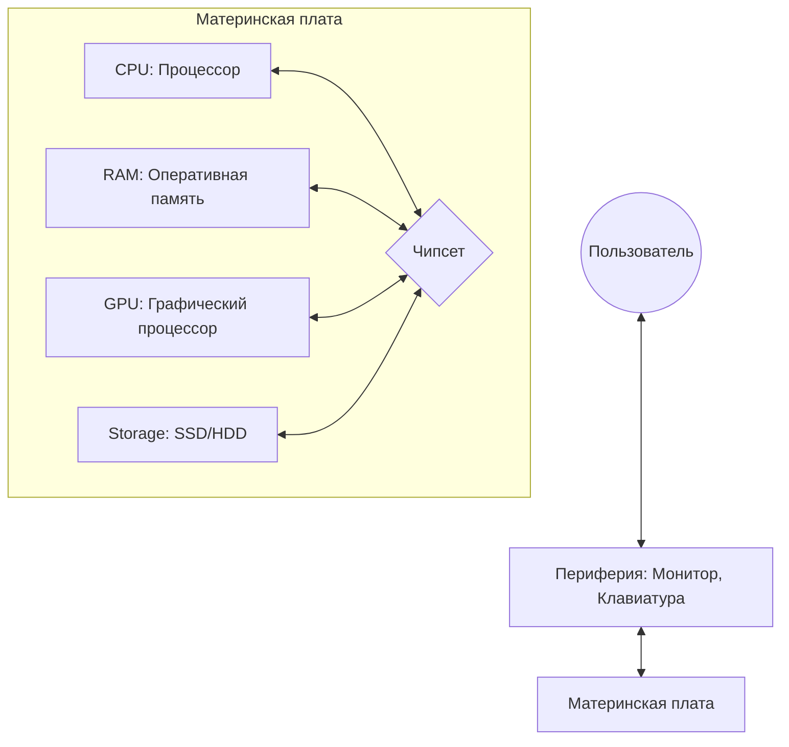
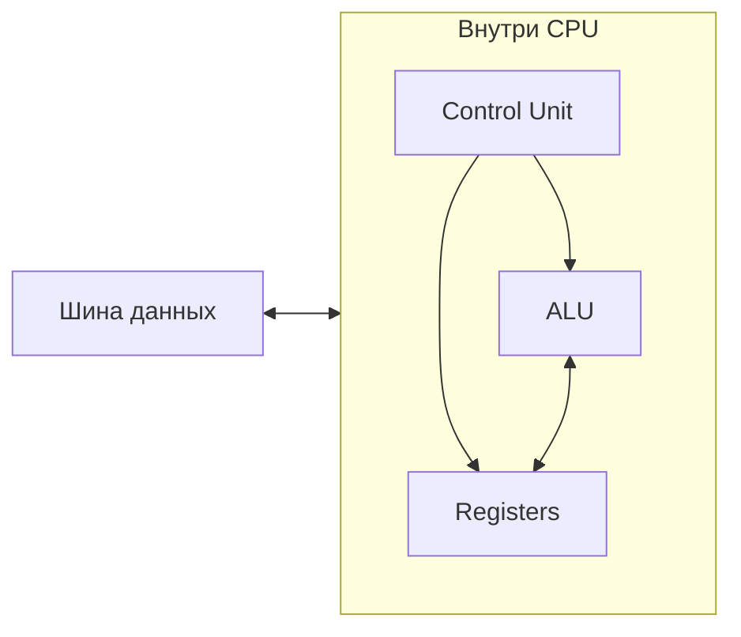
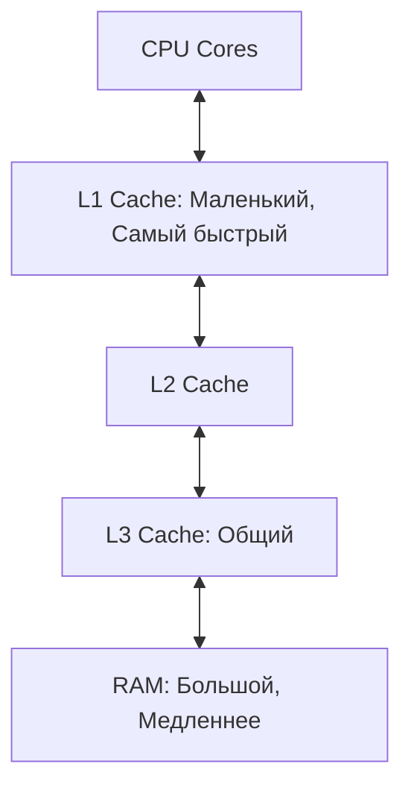
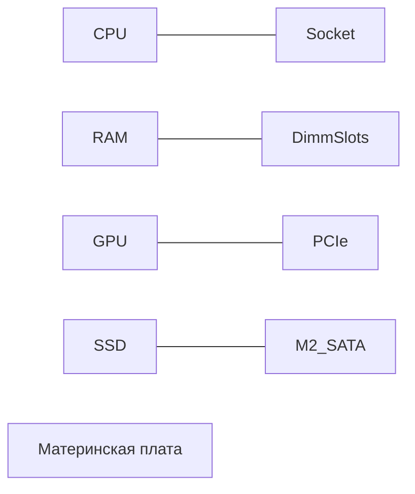
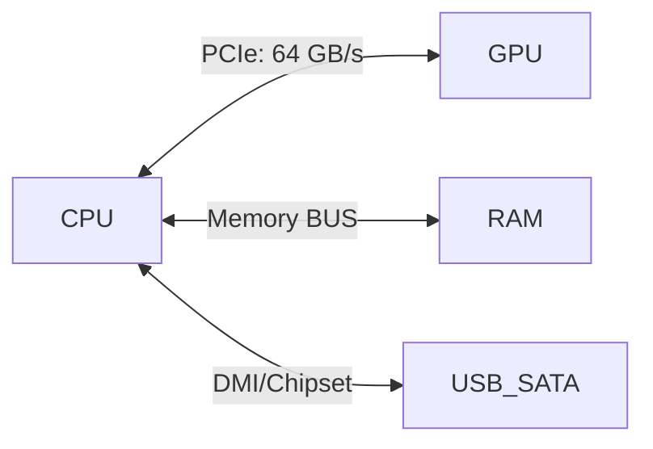

# Аппаратное обеспечение компьютера

## Содержание
1. [Компоненты компьютера](#1-компоненты-компьютера)
   - [Центральный процессор (CPU)](#11-центральный-процессор-cpu)
   - [Память](#12-память)
   - [Хранилища данных](#13-хранилища-данных)
   - [Материнская плата](#14-материнская-плата)
   - [Периферийные устройства](#15-периферийные-устройства)
2. [Шины и интерфейсы](#2-шины-и-интерфейсы)
3. [Энергопотребление и охлаждение](#3-энергопотребление-и-охлаждение)

---

Аппаратное обеспечение (**hardware**) — физические компоненты компьютера, которые выполняют вычисления, хранение и передачу данных.

---

## 1. Компоненты компьютера

### 1.1. Центральный процессор (CPU)

**CPU** — "мозг" компьютера, выполняющий инструкции программ.

#### Основные блоки:
- **ALU (арифметико-логическое устройство)**: Выполняет математические и логические операции.
- **Регистры**: Сверхбыстрая память внутри процессора для текущих данных.
- **Управляющий блок (Control Unit)**: Дирижер, который говорит, когда и какую инструкцию выполнять.

> [!IMPORTANT]
> **Ядра vs Потоки**: Современные процессоры имеют несколько ядер. Одно ядро — это почти полноценный отдельный процессор. Hyper-threading позволяет одному ядру выполнять два потока данных одновременно.

### 1.2. Память

Память хранит данные и инструкции. Она организована иерархически.

- **RAM (Оперативная память)**:
  - Энергозависимая (стирается при выключении).
  - Хранит запущенные программы и их данные.
- **Кэш-память (L1, L2, L3)**:
  - Находится прямо в процессоре.
  - В сотни раз быстрее RAM, но имеет очень маленький объем.
- **ROM / BIOS**:
  - Хранит код для первой загрузки системы.

### 1.3. Хранилища данных (Storage)

Для долгосрочного хранения информации.

| Тип | Скорость | Принцип работы | Долговечность |
|:---|:---|:---:|:---|
| **HDD** | Медленно | Магнитные диски | Средняя (боится ударов) |
| **SSD** | Быстро | Флэш-память | Высокая |
| **NVMe** | Очень быстро | Прямое подключение к PCIe | Высокая |

> [!TIP]
> Всегда устанавливайте операционную систему на **SSD/NVMe**. Это самый простой способ ускорить компьютер в несколько раз.

### 1.4. Материнская плата

Основа, соединяющая все детали воедино.

### 1.5. Периферийные устройства

- **Ввод**: Клавиатура, мышь, микрофон.
- **Вывод**: Монитор, принтер, аудиосистема.
- **GPU (Графический процессор)**: Специализированный монстр для рендеринга графики и вычислений ИИ.

---

## 2. Шины и интерфейсы

Шины — это "автомагистрали" данных.

- **PCIe**: Самая быстрая шина (для видеокарт и NVMe SSD).
- **SATA**: Постепенно устаревающий стандарт для обычных дисков.
- **USB**: Стандарт для всей внешней периферии.

---

## 3. Энергопотребление и охлаждение

Вся работа транзисторов превращается в тепло.

> [!CAUTION]
> **Перегрев = Троттлинг**: Если процессор нагревается до предела (обычно 90-100°C), он принудительно снижает частоту, чтобы не сгореть. Это приводит к тормозам.

### Виды охлаждения:
1. **Воздушное**: Радиатор + вентилятор (дешево и надежно).
2. **Жидкостное (СЖО)**: Вода отводит тепло эффективнее, но система дороже и сложнее.
3. **Пассивное**: Без вентиляторов (только для слабых чипов, в ноутбуках или планшетах).

---

## Ключевые выводы

- **CPU** — мозг, **RAM** — оперативная память, **SSD** — склад.
- **Кэш** в процессоре критически важен для производительности.
- **Материнская плата** координирует всех через **чипсет**.
- **Охлаждение** необходимо, иначе система будет "тормозить" из-за перегрева.
